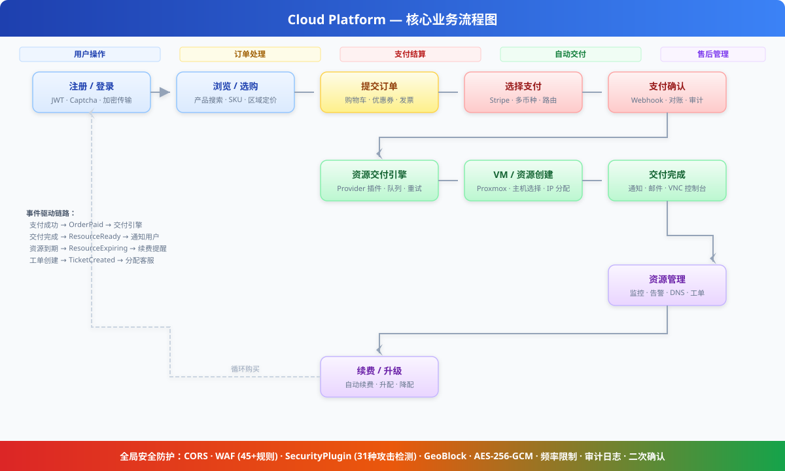
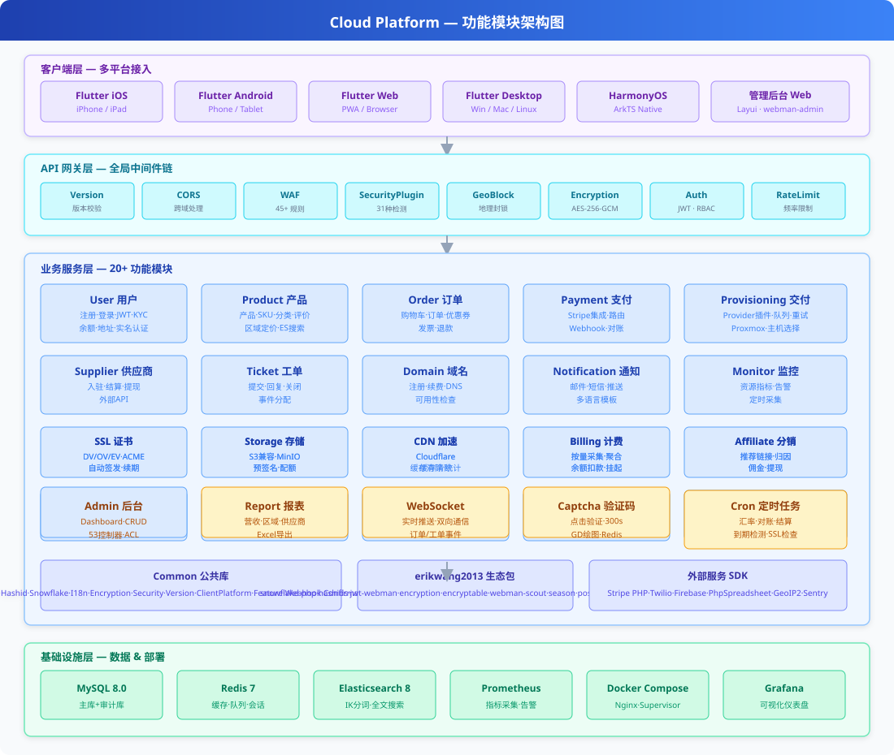
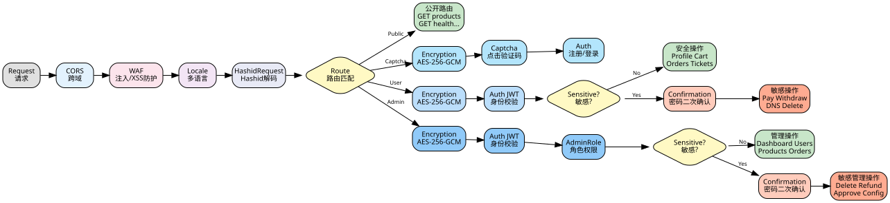

# Cloud Platform — 全球云资源交易平台

> [English Documentation](README_EN.md)

面向全球用户的云资源交易平台，支持服务器（VM）、IP 地址、云磁盘、域名、SSL 证书、对象存储（S3）、CDN 加速等产品的在线购买与自动交付。自营物理机通过 Proxmox VE 虚拟化交付，同时支持第三方供应商入驻售卖。提供按量计费、推荐分销、GraphQL API 及 Prometheus/Grafana 可观测性。提供按量计费、推荐分销、GraphQL API 及 Prometheus/Grafana 可观测性。

## 技术栈

| 层级 | 技术 |
|------|------|
| 后端框架 | PHP 8.2 + [webman](https://github.com/walkor/webman) (workerman) |
| 管理后台 | [webman-admin](https://www.workerman.net/plugin/1) (Layui) |
| ORM | Illuminate/Eloquent 10.x |
| 认证 | JWT HS256 ([erikwang2013/jwt-webman](https://github.com/erikwang2013/jwt-webman)) |
| 分布式主键 | Snowflake 雪花 ID ([erikwang2013/snowflake-php](https://github.com/erikwang2013/snowflake-php)) |
| ID 混淆 | Hashids ([erikwang2013/hashids](https://github.com/erikwang2013/hashids)) |
| 传输加密 | AES-256-GCM ([erikwang2013/encryption](https://github.com/erikwang2013/encryption)) |
| 字段加密 | AES-128-ECB ([erikwang2013/encryptable](https://github.com/erikwang2013/encryptable)) |
| 全文搜索 | Elasticsearch ([erikwang2013/webman-scout](https://github.com/erikwang2013/webman-scout)) |
| 国家旗帜 | Unicode Flag Emoji ([erikwang2013/season](https://github.com/erikwang2013/season)) |
| 点击验证码 | Click CAPTCHA ([erikwang2013/poster-php](https://github.com/erikwang2013/poster-php)) |
| 安全防护 | 31 种攻击检测 ([erikwang2013/security-php](https://github.com/erikwang2013/security-php)) |
| 表格导出 | PhpSpreadsheet ^2.0 |
| 支付 SDK | Stripe PHP ^15.0 |
| 短信 SDK | Twilio PHP ^8.0 |
| 推送 SDK | Firebase PHP ^7.0 |
| 队列 | webman redis-queue |
| 数据库 | MySQL 8.0（主库 + 审计库双连接） |
| 搜索引擎 | Elasticsearch 8.x |
| 虚拟化 | Proxmox VE REST API |
| 客户端 | Flutter (iOS/Android/Web/Linux/macOS/Windows) + HarmonyOS ArkTS |
| GraphQL | webonyx/graphql-php ^15.0 |
| 对象存储 | AWS S3 SDK PHP ^3.300 |
| 可观测性 | Prometheus + Grafana（预置仪表盘） |
| 多语言 | i18n 7 语言（中/英/日/韩/德/法/西） |
| 部署 | Docker Compose 一键启动 |

## 系统架构


## 核心业务流程

从用户注册到资源交付的完整端到端业务流程，包括选购、下单、支付、自动交付、售后管理和续费循环。



## 功能模块总览

系统按四层架构组织：客户端层（6 平台接入）、API 网关层（14 项中间件）、业务服务层（20+ 功能模块）、基础设施层（8 个核心组件）。



## 资源生命周期

资源从创建到终止共经历 6 个状态，由 8 个生命周期事件驱动，支持自动交付、挂起恢复、到期提醒和销毁清理。


## 文档导航

| 文档 | 说明 |
|------|------|
| [架构设计文档](docs/architecture.md) | 系统架构、组件关系、中间件管线、安全分层、数据架构、部署拓扑 |
| [功能设计文档](docs/features.md) | 12 模块详细功能设计，含流程图、数据模型、交互说明 |
| [API 接口文档](docs/api-reference.md) | 190+ 端点完整参考，按模块分组，含请求/响应示例、错误码 |
| [API 在线文档 (service)](http://localhost:8787/apidoc) | hg/apidoc 自动生成，按功能分组，支持在线调试 |
| [API 在线文档 (admin)](http://localhost:8788/apidoc) | hg/apidoc 自动生成，60+ 控制器 15 组功能分组 |
| [管理后台设计](docs/admin-design.md) | Admin 面板架构、包集成、ACL 权限、测试套件 |
| [供应商 API 文档](docs/supplier-api.md) | 供应商 API 参考（内部 + 外部），SDK 示例 |
| [部署清单](docs/deployment.md) | 服务器配置、环境变量、Nginx、HTTPS、定时任务 |
| [审查报告](docs/review-report-2026-08-04.md) | 生态扩展审查报告，含统计数据、问题跟踪、扩展建议 |
| [版本对比](docs/editions.md) | 简化版/标准版/完整版功能、设计、架构对比 |

## 目录结构

```
cloud-php/
├── .claude/                    # Claude Code 配置（settings / skills）
├── .github/workflows/          # CI/CD 流水线（语法检查 + 双端 PHPUnit）
├── admin/                      # 管理后台（独立 webman 实例）
│   ├── app/                    # 插件源码 (PSR-4: app\)
│   │   ├── bootstrap/          # 进程启动引导（Snowflake / Encryptable / Encryption）
│   │   ├── command/            # 控制台命令（Migrate / Rollback / Status）
│   │   ├── common/             # 工具类（Auth / Tree / Layui / Util / ExcelExport / Migration）
│   │   ├── controller/         # 53 个控制器（Base / Crud 基类 + 各业务 CRUD）
│   │   ├── exception/          # 异常处理
│   │   ├── middleware/          # 访问控制中间件（WafMiddleware + AccessControl）
│   │   ├── model/              # 45 个 Eloquent 模型（Base 基类含 Snowflake PK + Encryptable）
│   │   ├── view/               # 视图模板（Layui 后台面板）
│   │   └── functions.php       # 全局辅助函数（hashids / encrypt / decrypt）
│   ├── api/                    # 对外接口 (PSR-4: plugin\admin\api)
│   │   ├── Auth.php            # 鉴权接口
│   │   ├── Menu.php            # 菜单接口
│   │   ├── Install.php         # 安装接口
│   │   └── Middleware.php      # 中间件接口
│   ├── config/                 # 应用配置
│   │   ├── plugin/erikwang2013/ # 6 个 erikwang2013 包配置
│   │   │   ├── snowflake-php/  # 雪花 ID 生成
│   │   │   ├── hashids/        # ID 混淆
│   │   │   ├── encryptable/    # 字段级加密
│   │   │   ├── encryption/     # 传输加密
│   │   │   ├── webman-scout/   # Elasticsearch 同步
│   │   │   └── season/         # 国家旗帜
│   │   ├── route.php           # 路由定义
│   │   ├── middleware.php       # 中间件配置
│   │   ├── database.php        # 数据库连接
│   │   └── ...                 # 18 个配置文件
│   ├── database/migrations/    # 数据库迁移文件
│   ├── tests/                  # 单元测试（PHPUnit 11, 67 tests）
│   │   ├── HashidsTest.php     # hashids 编解码（21 tests）
│   │   ├── BaseJsonTest.php    # Base::json() ID 编码（13 tests）
│   │   ├── CrudHashidsTest.php # Crud 输入解码（14 tests）
│   │   ├── TreeTest.php        # 树形结构（19 tests）
│   │   └── Support/            # 测试辅助类
│   ├── public/                 # 文档根目录（静态资源）
│   ├── vendor/                 # Composer 依赖
│   ├── .env.example            # 环境变量模板
│   ├── composer.json           # 依赖声明
│   ├── generate.php            # 代码生成器
│   ├── phpunit.xml             # PHPUnit 配置
│   └── start.php               # 启动入口
├── service/                    # 后端服务（独立 webman 实例）
│   ├── app/                    # 业务模块 (PSR-4: App\)，每个模块含 Controller / Model / Service 等分层
│   │   ├── Admin/Controller/   # 管理后台 API（15 个控制器：Dashboard / User / Product / Order / Payment / Supplier / Coupon / Invoice / Domain / Webhook 等）
│   │   ├── Captcha/Controller/ # 点击验证码
│   │   ├── Command/            # 控制台命令（Migrate / Rollback / Status / DbBackup）
│   │   ├── Controller/         # 公共控制器（Health / Status / Help / Upload）
│   │   ├── Cron/               # 定时任务（ExchangeRateSync / PaymentReconcile / SupplierSettlement / ExpirationCheck / SslCertificateCheck）
│   │   ├── Domain/             # 域名注册 / DNS 管理（Controller / Model / Service）
│   │   ├── Model/              # 公共模型（HelpArticle / Role / Permission）
│   │   ├── Monitor/            # 资源监控 / 告警（Controller / Cron / Model / Service）
│   │   ├── Notification/       # 消息通知（Controller / Model / Queue / Service）
│   │   ├── Order/              # 购物车 / 订单 / 优惠券 / 发票（Controller / Model / Service）
│   │   ├── Payment/            # 支付路由 / Stripe 通道（Controller / Event / Model / Service）
│   │   ├── Product/            # 产品 / SKU / 区域定价 / 评价（Controller / Model / Service）
│   │   ├── Provisioning/       # 资源交付引擎（Controller / Event / Listener / Model / Provider / Queue / Service）
│   │   ├── Report/             # 营收 / 供应商 / 区域报表（Controller / Service）
│   │   ├── Supplier/           # 供应商入驻 / 结算 / 提现 + 外部 API（Controller / Model / Service）
│   │   ├── Ticket/             # 工单系统（Controller / Event / Listener / Model / Service）
│   │   ├── User/               # 用户 / 认证 / KYC / 余额 / 地址（Controller / Model / Service）
│   │   └── WebSocket/          # WebSocket 服务器 + 事件监听器
│   ├── common/                 # 公共库 (PSR-4: Common\)
│   │   ├── Auth/Middleware/     # AuthMiddleware / AdminRoleMiddleware / RbacMiddleware / RoleMiddleware / SupplierApiKeyMiddleware
│   │   ├── Captcha/            # 点击验证码服务
│   │   ├── Confirmation/       # 二次确认中间件（密码复核）
│   │   ├── Encryption/Middleware/ # AES-256-GCM 传输加密中间件
│   │   ├── Hashid/Middleware/   # Hashids 请求自动解码中间件 + 编解码服务
│   │   ├── Helper/             # Response 格式化（自动 hashid 编码）
│   │   ├── Http/               # HTTP 客户端工具（ApiRequest）
│   │   ├── I18n/Middleware/     # 多语言中间件（Locale）
│   │   ├── Security/           # CORS / WAF / 频率限制 / 地域封锁 / 维护模式 / 审计日志
│   │   ├── Snowflake/          # 雪花 ID 生成服务 / Eloquent HasSnowflakeId Trait
│   │   ├── Version/Middleware/  # API 版本中间件（X-Api-Version 头校验）
│   │   ├── ClientPlatform/Middleware/  # 客户端平台中间件（X-Client-Platform 头识别）
│   │   ├── Feature/            # Feature Flags 功能开关服务
│   │   └── Webhook/            # Webhook 事件分发器
│   ├── config/                 # 17 个配置文件（route / middleware / database / redis / cron / auth / security / i18n / ...）
│   │   └── plugin/             # 插件配置
│   │       ├── erikwang2013/   # encryptable / hashids / jwt / poster / season / webman-scout
│   │       └── webman/         # event / redis-queue
│   ├── database/migrations/    # 数据库迁移文件（12 个迁移）
│   ├── i18n/                   # 多语言资源（en-US / zh-CN）
│   ├── support/                # Bootstrap 引导（Eloquent / Redis / Event / 加密 / 雪花ID / Hashids / Scout / MigrationRunner）
│   ├── tests/                  # 单元测试（PHPUnit 10, 295 tests）
│   │   ├── Admin/              # ImportExport
│   │   ├── Captcha/            # CaptchaService
│   │   ├── Common/             # Response / Hashid / Snowflake / Validator / LogSanitizer / Totp / ApiRequest
│   │   ├── Confirmation/       # ConfirmationMiddleware
│   │   ├── Notification/       # NotificationDispatcher
│   │   ├── Order/              # Coupon / Invoice
│   │   ├── Payment/            # StripeChannel / PaymentRouter
│   │   ├── Provisioning/       # ProviderFactory / RetryLogic
│   │   ├── Security/           # RateLimit / Maintenance / UploadSecurity
│   │   ├── User/               # AddressController
│   │   ├── Version/            # VersionMiddleware
│   │   ├── Webhook/            # WebhookDispatcher
│   │   ├── Support/            # RequestMock
│   │   ├── bootstrap.php       # 测试引导
│   │   └── TestCase.php        # 测试基类
│   ├── runtime/                # 运行时文件（日志 / 缓存）
│   ├── vendor/                 # Composer 依赖
│   ├── .env.example            # 环境变量模板
│   ├── .env                    # 本地环境变量（gitignore）
│   ├── composer.json           # 依赖声明
│   ├── phpunit.xml             # PHPUnit 配置
│   └── start.php               # 启动入口
├── apps/
│   ├── flutter/                # Flutter 客户端（iOS / macOS / Windows / Linux / Web）
│   │   ├── lib/                # Dart 源码（core / features）
│   │   ├── ios/                # iOS 工程
│   │   ├── macos/              # macOS 工程
│   │   ├── windows/            # Windows 工程
│   │   ├── linux/              # Linux 工程
│   │   ├── web/                # Web 工程
│   │   ├── test/               # Flutter 测试
│   │   ├── pubspec.yaml        # 依赖声明
│   │   └── analysis_options.yaml # Dart 静态分析配置
│   └── harmonyos/              # HarmonyOS 客户端骨架
│       └── entry/src/          # ArkTS 源码
├── docker/                     # Docker 部署
│   ├── Dockerfile              # PHP 8.2 镜像
│   ├── docker-compose.yml      # 服务编排
│   ├── nginx.conf              # Nginx 配置
│   └── supervisor.conf         # Supervisor 进程守护
├── docs/                       # 文档
│   ├── admin-design.md         # 管理后台设计文档
│   ├── supplier-api.md         # 供应商 API 文档
│   ├── deployment.md           # 部署清单
│   ├── api-test.sh             # API 冒烟测试脚本
│   ├── database.sql            # 数据库 DDL
│   ├── alipay.png / weixinpay.png  # 打赏二维码
│   ├── diagrams/               # 10 个 SVG 架构图（系统架构 / 安全管道 / ER 图 / 业务流程等）
│   └── superpowers/            # 设计规格与实施计划
│       ├── specs/              # 系统设计规格文档
│       └── plans/              # Phase 0~3 分阶段实施计划
├── tests/k6/                    # k6 负载测试脚本（冒烟/产品/并发）
├── install.php                 # 一键安装向导入口
├── install/                    # 安装向导页面
│   └── index.php               # 向导 Web 应用
├── install.sql                 # 统一数据库 DDL（46 张表）
├── .gitignore
├── README.md                   # 项目说明（中文）
└── README_EN.md                # 项目说明（英文）
```

## 快速开始

### 环境要求

- PHP 8.2+ (ext-json, ext-pdo, ext-pdo_mysql, ext-redis, ext-openssl)
- MySQL 8.0
- Redis 7

### 一键安装（推荐）

项目提供了 Web 安装向导，可在浏览器中完成全部配置：

```bash
# 1. 安装依赖
cd service && composer install && cd ../admin && composer install && cd ..

# 2. 启动安装向导
php install.php
# 打开浏览器访问 http://localhost:8888

# 3. 按向导提示完成：
#    - 环境检查
#    - 数据库配置（主机、端口、库名、用户名、密码）
#    - 后台管理员账号设置（用户名、密码、邮箱）
#    - 一键执行安装（建表 + 写入配置）
```

安装完成后，向导会自动：
- 创建全部 46 张数据库表（wa_* 管理表 + erik_* 业务表）
- 创建超级管理员角色和账号
- 生成 `service/.env` 和 `admin/.env` 配置文件（含自动生成的 JWT/加密密钥）

### 手动安装

```bash
cd service

# 1. 安装依赖
composer install

# 2. 配置环境变量
cp .env.example .env
# 编辑 .env 填写数据库密码、JWT 密钥、加密密钥等
# ENCRYPTION_MASTER_KEY 生成：openssl rand -base64 32
# ENCRYPTION_KEY 生成：echo -n "$(openssl rand -base64 16)" | base64 -w0
# JWT_SECRET_KEY 生成：openssl rand -base64 32

# 3. 创建数据库并导入
mysql -u root -p -e "CREATE DATABASE cloud_platform CHARACTER SET utf8mb4 COLLATE utf8mb4_unicode_ci;"
mysql -u root -p cloud_platform < ../install.sql

# 4. 启动服务（开发模式）
php start.php start
# 访问 http://localhost:8787
```

### Docker 部署

```bash
# 从项目根目录
cp service/.env.example .env
# 编辑 .env 填写各项密钥

docker compose -f docker/docker-compose.yml up -d
# API: http://localhost
```

### 管理后台

```bash
cd admin

# 1. 安装依赖
composer install

# 2. 配置环境变量
cp .env.example .env
# 如果使用一键安装向导，此文件已自动生成

# 3. 启动服务（开发模式）
php start.php start
# 访问 http://localhost:8787/app/admin
```

### 守护进程模式

```bash
php start.php start -d          # 启动
php start.php status            # 查看状态
php start.php restart           # 重启
php start.php stop              # 停止
```

## API 概览

### 公开接口
| 方法 | 路径 | 说明 |
|------|------|------|
| GET | `/health` | 健康检查 |
| POST | `/api/auth/register` | 用户注册（请求体需 AES-256-GCM 加密） |
| POST | `/api/auth/login` | 用户登录（请求体需 AES-256-GCM 加密） |
| POST | `/api/auth/refresh` | 刷新 Token（请求体需 AES-256-GCM 加密） |
| POST | `/api/captcha/create` | 生成点击验证码（登录/注册前获取） |
| GET | `/api/products` | 产品列表（支持分类/区域/关键词筛选） |
| GET | `/api/products/{id}` | 产品详情（id 为 hashid 字符串） |
| GET | `/api/regions` | 可用区域 |
| GET | `/api/domain/check/{domain}/{tld}` | 域名可用性查询 |
| GET | `/api/domain/tlds` | 可注册后缀列表 |
| POST | `/api/payments/webhook/stripe` | Stripe 回调（签名校验，无需加密） |

### 认证接口（需 Bearer Token）
| 方法 | 路径 | 说明 |
|------|------|------|
| GET | `/api/user/profile` | 个人信息 |
| PUT | `/api/user/profile` | 更新信息 |
| POST | `/api/user/kyc` | 提交实名认证 |
| GET | `/api/user/balance` | 账户余额 |
| GET/POST | `/api/cart` | 购物车 |
| POST/GET | `/api/orders` | 订单 |
| GET | `/api/orders/{id}/payment-methods` | 可用支付方式 |
| POST | `/api/orders/{id}/pay` | 发起支付 |
| GET/POST | `/api/resources` | 我的资源 |
| GET | `/api/resources/{id}/status` | 资源状态 |
| GET | `/api/resources/{id}/console` | VNC 控制台链接 |
| GET/POST | `/api/tickets` | 工单 |
| POST | `/api/tickets/{id}/reply` | 工单回复 |
| GET/POST | `/api/dns/{domain}` | DNS 管理 |
| POST | `/api/supplier/apply` | 供应商申请 |
| GET | `/api/supplier/settlements` | 供应商结算记录 |
| POST | `/api/supplier/withdraw` | 供应商提现 |

> **说明：** 所有 API 请求需携带 `X-Api-Version: v1` 请求头（缺失默认 `v1`，由 `VersionMiddleware` 校验）。认证接口和管理员接口的请求/响应均经过 `EncryptionMiddleware` 处理。客户端设置 `X-Encrypted: 1` 请求头，请求体格式为 `{"payload": "<base64(AES-256-GCM)>"}`，响应体同样加密后包裹于 `payload` 字段。所有整数 ID 在 API 响应中自动转为 12 位 Hashid 字符串，请求中的 Hashid 字符串由 `HashidRequestMiddleware` 自动解码回整数 ID。

### 管理员接口
| 方法 | 路径 | 说明 |
|------|------|------|
| GET | `/admin/api/dashboard` | 运营仪表盘 |
| GET/PUT | `/admin/api/users` | 用户管理 |
| GET/POST | `/admin/api/kyc` | KYC 审核 |
| GET/POST/PUT/DELETE | `/admin/api/products` | 产品管理 |
| POST | `/admin/api/products/{productId}/skus` | 创建 SKU |
| POST | `/admin/api/skus/{skuId}/region-price` | 设置区域价格 |
| GET/POST | `/admin/api/orders` | 订单管理（含退款） |
| GET | `/admin/api/orders/export` | 订单导出 (.xlsx) |
| GET | `/admin/api/users/export` | 用户导出 (.xlsx) |
| GET | `/admin/api/suppliers/export` | 供应商导出 (.xlsx) |
| GET/PUT | `/admin/api/payments/*` | 支付通道 / 交易 / 对账 |
| GET/POST | `/admin/api/provisioning/*` | 交付任务 / 主机管理 |
| GET/POST | `/admin/api/suppliers/*` | 供应商审批 / 结算 / 提现 |
| GET/POST | `/admin/api/tickets` | 工单分配 / 关闭 |
| GET | `/admin/api/reports/*` | 营收 / 区域 / 供应商报表 |
| GET | `/admin/api/monitor/*` | 监控面板 / 资源指标 |
| GET | `/admin/api/audit-logs` | 审计日志 |
| PUT | `/admin/api/system/config` | 系统配置 |

## 管理后台架构

### 技术集成

管理后台是一个独立的 webman 实例，集成了 7 个 erikwang2013 包：

| 包 | 用途 | 实现方式 |
|---|------|---------|
| snowflake-php | 64 位分布式主键 | `Base::boot()` creating 事件自动生成 |
| hashids | API ID 混淆 | `Base::json()` 响应编码，`Crud::selectInput/updateInput/deleteInput` 请求解码 |
| encryptable | 数据库字段加密 | Eloquent `Encryptable` cast，Admin（password/email/mobile）、User（6 字段）透明加解密 |
| encryption | API 传输加密 | 预留 `encrypt_data()`/`decrypt_data()` 辅助函数 |
| webman-scout | ES 全文搜索 | User 模型 `Searchable` trait，自动同步索引 |
| season | 国家旗帜 emoji | `country_season_flag()` 全局辅助函数 |
| poster-php | 点击验证码 | `CaptchaPlugin` Bootstrap，`captcha_create()`/`captcha_verify()` 全局函数 |

### 安全分层

```
请求 → Hashids 解码 (Crud::selectInput/updateInput/deleteInput)
  → ACL 鉴权 (api/Auth.php, 控制器 noNeedLogin/noNeedAuth)
  → 业务处理 (CRUD / 模型事件)
  → Encryptable 字段加密 (Eloquent casts set)
  → 数据库写入
响应 ← Hashids 编码 (Base::json → hashids_encode_ids)

登录/注册：Captcha 验证 → Auth → 业务处理
```

### 数据流

- **写入路径**: 请求 ID (hashid) → 解码为 int → CRUD 操作 → Snowflake 生成新 ID → Encryptable 加密敏感字段 → DB
- **读取路径**: DB → Encryptable 解密 → Hashids 编码 ID → JSON 响应

### 测试覆盖

```
phpunit.xml (PHPUnit 11)
├── HashidsTest        (21 tests) encode/decode/encode_ids
├── BaseJsonTest       (13 tests) Base::json/success/fail 编码
├── CrudHashidsTest    (14 tests) Crud 输入解码 (select/update/delete)
└── TreeTest           (19 tests) 树形结构 / 子孙 / 祖先 / 孤儿节点
```

## 设计思路

### 1. 模块化单体

模块按业务领域垂直切分（User / Product / Order / Payment / Provisioning / Ticket / Notification 等），每个模块内部遵循 MVC 分层：

- **Controller** — HTTP 层，参数校验、调用 Service、返回 Response
- **Service** — 业务逻辑，无 HTTP 依赖，可被 Controller 和 Queue Worker 复用
- **Model** — Eloquent 数据模型，定义关系和查询作用域

模块间通过**事件**和**接口**解耦，不直接调用对方的 Service。比如支付完成 → `OrderPaid` 事件 → `ProvisioningService` 自动开通资源，Ticket 创建 → `TicketCreated` 事件 → 自动分配客服。

### 2. 事件驱动交付

```
用户下单 → 支付成功 → OrderPaid 事件
  → ProvisioningService.handleOrderPaid()
    → 为每个 OrderItem 创建 ProvisionTask (status=pending)
    → Redis Queue 消费者 ProvisionWorker
      → ProviderFactory.create(task) 解析 Provider
      → ProxmoxProvider.create()
        → HostSelector 选最空闲物理机
        → ProxmoxApi 创建 VM / 挂载磁盘 / 分配 IP
        → 创建 Resource / Disk 记录
      → 更新 Order 状态为 completed
```

交付失败自动重试，退避策略：1min → 5min → 15min → 1h → 6h → 24h，超过 6 次标记失败并触发告警。

### 3. Provider 插件架构

资源交付通过 `ProviderInterface` 抽象，不同基础设施实现同一接口：

```
ProviderInterface
  ├── ProxmoxProvider    (自营 Proxmox VE)
  ├── AliyunProvider     (未来：阿里云)
  ├── AwsProvider        (未来：AWS EC2)
  └── DomainProvider     (未来：域名注册商)
```

`ProviderFactory` 按 `productType:provider` 键注册工厂函数，运行时根据 ProvisionTask 动态解析。

### 4. 多支付路由

`PaymentRouter` 根据订单金额 / 币种 / 区域动态返回可用支付通道，前端切换通道即可拉起支付。支付通道通过 `PaymentChannel` 表配置（费率、最小/最大金额、可见区域），无需改代码即可上下线。

### 5. 安全架构

全局中间件链：`Version → CORS → SecurityHeaders → ClientPlatform → GeoBlock → WAF → SecurityPlugin → Locale → HashidRequest → Maintenance → [路由: Encryption → Captcha → Auth → Confirmation]`



- **CORS** — 跨域请求头处理（白名单模式，支持 *.example.com 通配符）
- **SecurityHeaders** — 安全响应头（HSTS / X-Frame-Options / X-Content-Type-Options / Referrer-Policy / Permissions-Policy）
- **GeoBlock** — 地理封禁（根据 GEO_BLOCKED_COUNTRIES 阻止指定国家访问，基于 GeoIP2）
- **WAF** — 8 类 45+ 规则（SQL注入/XSS/命令注入/文件包含/头注入/SSRF/NoSQL注入/开放重定向）+ 请求大小限制 + Content-Type 校验
- **Security Plugin** — 31 种攻击检测（XSS/SQL注入/命令注入/SSRF/反序列化/JWT攻击/Host头攻击/请求走私/GraphQL注入/敏感数据泄露等），IP 白名单 + IP 黑名单自动封禁
- **Locale** — 解析 Accept-Language，设置多语言
- **HashidRequest** — 自动解码请求中的 hashid 字符串为真实整数 ID
- **Version** — 校验 `X-Api-Version` 请求头，缺失默认 `v1`，不支持的版本返回 `400`
- **ClientPlatform** — 校验 `X-Client-Platform` 请求头，识别客户端操作系统平台（iPadOS/macOS/Windows/Linux/iOS/Android/HarmonyOS/Web）
- **Encryption** — AES-256-GCM 传输加密（认证接口和管理后台），防中间人窃听和篡改
- **Captcha** — 点击验证码，登录/注册前验证（GD 绘图 + Redis 存储，一次性密钥，300s 有效期，3 次尝试限制）
- **Auth** — JWT HS256 认证，Access Token 15 分钟，Refresh Token 30 天，Redis 黑名单
- **Confirmation** — 敏感操作（支付/删除/退款/审批等）需重新输入密码复核，5次失败锁定15分钟
- **频率限制** — 默认 60次/分，登录 5次/分，注册 3次/分，支付 10次/分
- **审计日志** — 所有敏感操作写入独立审计库

### 6. 数据安全

**分层加密策略：**

| 层级 | 技术 | 说明 |
|------|------|------|
| 传输层 | AES-256-GCM | API 请求/响应体加密，GCM 认证加密防篡改 |
| 字段层 | AES-128-ECB | 模型敏感字段自动加解密，ECB 确定性加密支持数据库查询 |
| 主键层 | Hashids | 对外 ID 混淆为 12 位字符串，隐藏真实数据规模 |

**敏感字段加密：** 7 个模型的 14 个字段使用 `Encryptable::class` 自动加解密 —— `User(email, phone, password_hash)`, `UserKyc(id_number, real_name)`, `UserAddress(phone, address)`, `Supplier(contact_name, phone, email)`, `HostMachine(api_token)`, `PaymentChannel(api_key, webhook_secret)`, `RefreshToken(token_hash, device_fingerprint)`。

**密钥管理：** 传输加密和字段加密使用不同的独立密钥（`ENCRYPTION_MASTER_KEY` vs `ENCRYPTION_KEY`），支持旧密钥列表（`ENCRYPTION_PREVIOUS_KEYS`）实现零停机密钥轮换。

### 7. 分布式 ID 生成

采用 Twitter Snowflake 算法生成 64 位全局唯一 ID：`timestamp(41b) | datacenter(5b) | worker(5b) | sequence(12b)`。所有 38 个 Eloquent 模型在 `creating` 事件中自动生成雪花 ID，无数据库自增依赖，天然支持分库分表。

### 8. 多语言（i18n）

**全局中间件自动解析：**
- `LocaleMiddleware` 读取 `Accept-Language` 请求头，自动设置当前语言
- 支持语言回退：不支持的语言 → `fallback_locale` (en-US)

**静态文本翻译：**
- `I18n::trans('auth.login_success')` → `登录成功` / `Login successful`
- 翻译文件：`i18n/{locale}/messages.php`，120 词条覆盖全部 15 个模块
- 支持参数替换：`I18n::trans('validation.required', ['field' => '邮箱'])`

**JSON 多语言字段：**
- 产品名称 / 描述存储为 `{"zh-CN":"云服务器","en-US":"Cloud Server"}`
- `I18n::translateField($json)` 自动按当前语言取值
- 通知模板同样支持多语言，按用户偏好语言推送

### 9. 全文搜索

产品、用户、订单、工单 4 个模型通过 `Erikwang2013\WebmanScout\Searchable` Trait 自动同步到 Elasticsearch，支持：

- **多语言分词** — IK Analyzer（ik_max_word / ik_smart）
- **中文全文搜索** — 产品名称、描述、工单标题
- **精确筛选** — 按状态、分类、价格区间、时间范围过滤
- **批量同步** — `php webman scout:import "App\Product\Model\Product"`
- **搜索示例** — `Product::search('VPS服务器')->where('status', 'published')->get()`

### 10. 国家旗帜

通过 `erikwang2013/season` 提供全域国家旗帜 emoji 支持：

- `country_season_flag('CN')` → 🇨🇳，`country_season_flag('JP')` → 🇯🇵
- 自动识别南北半球，返回对应季节（中英文）
- 支持 30+ 语言的本地化季节名称
- 前端区域选择、用户国籍展示等场景可直接调用

## 待办事项

- [x] 数据库 DDL（`install.sql`，46 张表，wa_* 管理表 + erik_* 业务表，BigInt 非自增主键）
- [x] 雪花 ID 生成（`erikwang2013/snowflake-php`）
- [x] JWT 认证（`erikwang2013/jwt-webman`，HS256 + Redis 黑名单）
- [x] API ID 混淆（`erikwang2013/hashids`，请求自动解码 + 响应自动编码）
- [x] 传输加密（`erikwang2013/encryption`，AES-256-GCM 中间件）
- [x] 字段级加密（`erikwang2013/encryptable`，敏感字段自动加解密）
- [x] 全文搜索（`erikwang2013/webman-scout`，Elasticsearch + IK 分词）
- [x] 国家旗帜（`erikwang2013/season`，Unicode flag emoji）
- [x] 管理后台（`admin/`，webman-admin + 7 包集成，67 单元测试）
- [x] 代码审查（2 个关键修复 + 4 个重要修复已应用）
- [x] Excel 导出（PhpSpreadsheet ^2.0，管理后台 Crud/Table + 服务端管理 API）
- [x] 仪表板可视化（ECharts 图表 + 动画统计卡片 + 系统信息面板）
- [x] PDF 导出（html2canvas + jsPDF，仪表板截图导出）
- [x] 数据库迁移脚本（`install.sql` 统一 DDL，`php webman migrate` 命令化）
- [x] Stripe 真实集成（stripe-php SDK，PaymentIntent + Webhook 签名校验）
- [x] Twilio 短信真实集成（twilio/sdk，含发送失败处理）
- [x] FCM 推送真实集成（kreait/firebase-php，含无效 token 清理）
- [x] 点击验证码（erikwang2013/poster-php，登录/注册敏感操作验证）
- [x] 二次确认（ConfirmationMiddleware，敏感操作密码复核，5次失败锁定15分钟）
- [x] 服务端单元测试（295 tests, 455 assertions）
- [x] 客户端平台识别（ClientPlatformMiddleware，X-Client-Platform 头支持 8 种平台）
- [x] WAF 安全增强（8 类 45+ 规则: SQL注入/XSS/命令注入/文件包含/头注入/SSRF/NoSQL注入/开放重定向 + 请求大小限制 + Content-Type 校验）
- [x] Security Plugin（erikwang2013/security-php，31 种攻击检测 + IP 黑名单自动封禁 + 日志轮转）
- [x] Admin 面板 WAF 中间件
- [x] MySQL 读写分离（Eloquent read/write 连接 + sticky）
- [x] Redis 多级缓存层（CacheService：产品/区域/汇率/TLD/用户，TTL + 主动失效 + 预热）
- [x] Nginx 响应压缩 + 连接优化（gzip/proxy_buffering/keep-alive/limit_req+limit_conn）
- [x] 数据库索引建议（13 个推荐复合/覆盖索引）
- [x] Sentry 异常监控（SentryBootstrap + before_send 脱敏回调）
- [x] Feature Flags 功能开关（Redis 动态覆盖 + 管理后台 API）
- [x] 供应商外部 API（API Key 认证 + 订单/资源/结算/提现端点）
- [x] WebSocket 实时推送（Workerman 原生 WebSocket + 订单/工单事件监听）
- [x] k6 负载测试脚本（冒烟/产品/并发压测）
- [x] CI/CD 流水线（GitHub Actions，语法检查 + 双端 PHPUnit + Composer 校验）
- [x] 一键安装向导（Web UI，环境检查 + 数据库配置 + 管理员创建 + 自动生成 .env）

## 开源不易，欢迎支持

| 微信 | 支付宝 |
|:---:|:---:|
|  |  |

---

## License

简化版 — MIT License | 标准版/完整版 — Proprietary
