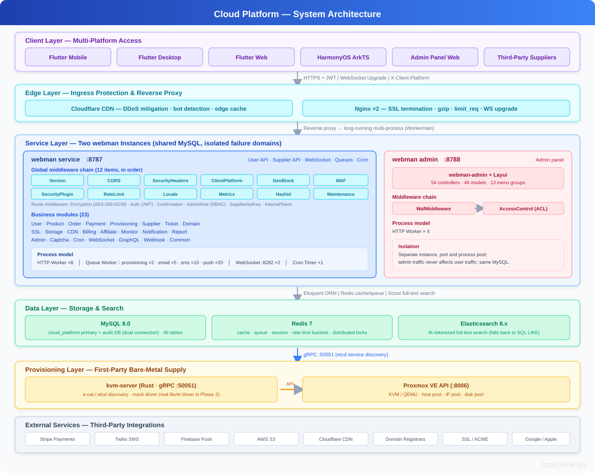
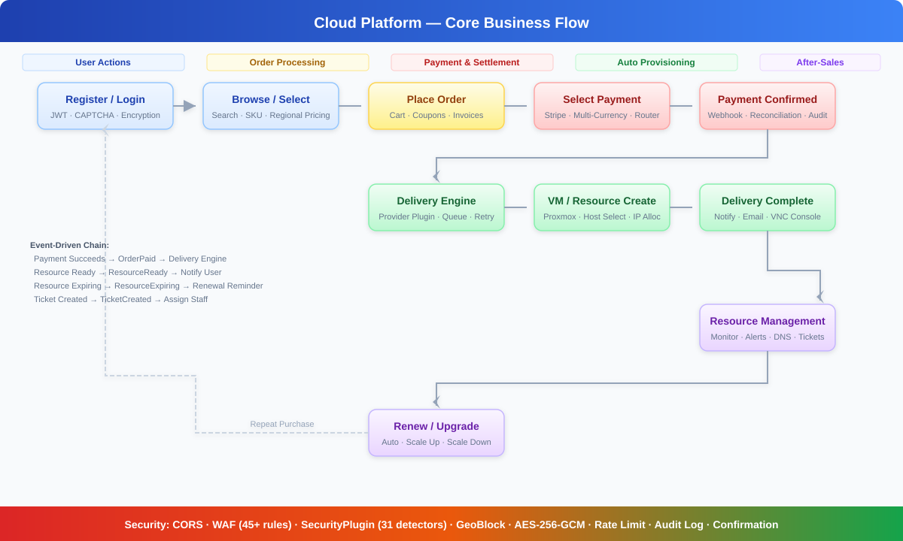
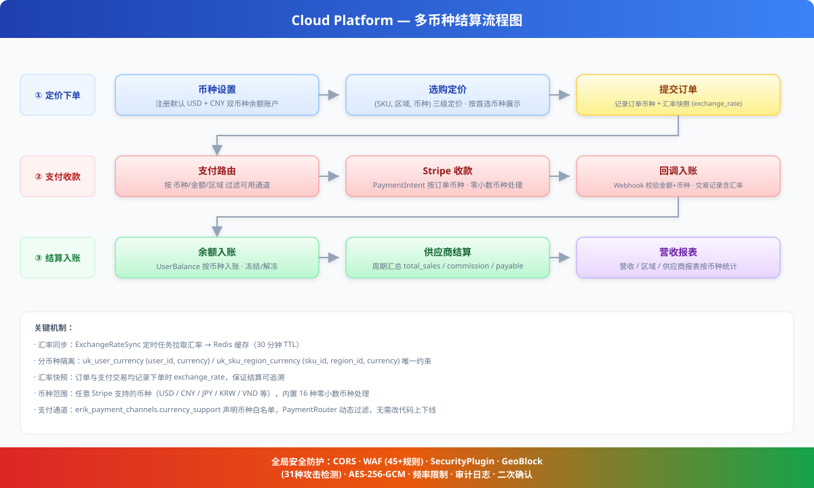
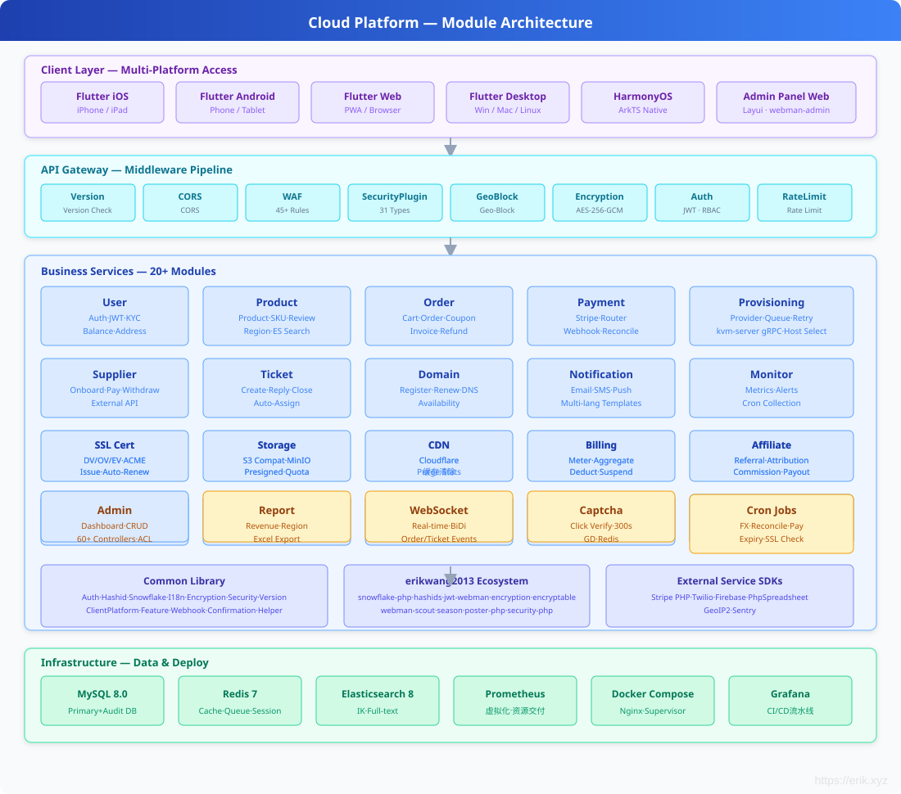
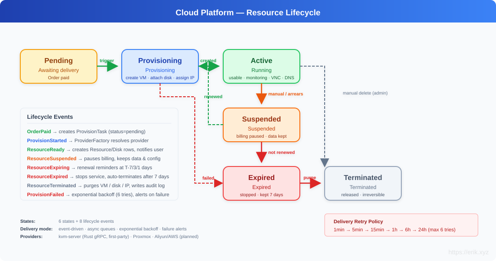
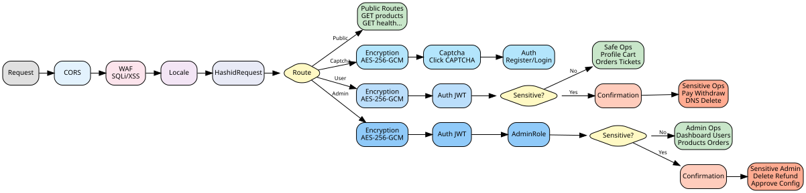

# CloudPlatform — Global Cloud Resource Marketplace

A cloud resource trading platform serving global users. Supports purchasing servers (VM), IP addresses, cloud disks, and domains with automatic provisioning. Self-operated bare-metal servers are virtualized via Proxmox VE, while third-party suppliers can onboard and sell through the marketplace.

## Tech Stack

| Layer | Technology |
|-------|------------|
| Backend | PHP 8.2 + [webman](https://github.com/walkor/webman) (workerman) |
| Admin Panel | [webman-admin](https://www.workerman.net/plugin/1) (Layui) |
| ORM | Illuminate/Eloquent 10.x |
| Auth | JWT HS256 ([erikwang2013/jwt-webman](https://github.com/erikwang2013/jwt-webman)) |
| Distributed PK | Snowflake ID ([erikwang2013/snowflake-php](https://github.com/erikwang2013/snowflake-php)) |
| ID Obfuscation | Hashids ([erikwang2013/hashids](https://github.com/erikwang2013/hashids)) |
| Transport Encryption | AES-256-GCM ([erikwang2013/encryption](https://github.com/erikwang2013/encryption)) |
| Field Encryption | AES-128-ECB ([erikwang2013/encryptable](https://github.com/erikwang2013/encryptable)) |
| Full-Text Search | Elasticsearch ([erikwang2013/webman-scout](https://github.com/erikwang2013/webman-scout)) |
| Country Flags | Unicode Flag Emoji ([erikwang2013/season](https://github.com/erikwang2013/season)) |
| Click CAPTCHA | ([erikwang2013/poster-php](https://github.com/erikwang2013/poster-php)) |
| Security Protection | 31 attack detectors ([erikwang2013/security-php](https://github.com/erikwang2013/security-php)) |
| Spreadsheet Export | PhpSpreadsheet ^2.0 |
| Payment SDK | Stripe PHP ^15.0 |
| SMS SDK | Twilio PHP ^8.0 |
| Push SDK | Firebase PHP ^7.0 |
| Queue | webman redis-queue |
| Database | MySQL 8.0 (main + audit dual connection) |
| Search Engine | Elasticsearch 8.x |
| Virtualization | Proxmox VE (Rust kvm-server gRPC channel, e-cat/etcd registry) |
| Clients | Flutter (iOS/Android/Web/Linux/macOS/Windows) + HarmonyOS ArkTS |
| Deployment | Docker Compose |

## System Architecture



## Core Business Flow

Complete end-to-end business flow from user registration through resource delivery, covering product selection, ordering, payment, auto-provisioning, after-sales management, and renewal cycles.



## Multi-Currency Settlement

The platform natively supports multi-currency pricing, payment, and settlement — covering the full chain from user currency preference, regional pricing, exchange-rate snapshots to payment collection, balance crediting, and supplier settlement.



**1. Multi-Currency Balance Accounts**

`user_balances` keeps per-currency ledgers keyed by `(user_id, currency)` (unique index `uk_user_currency`). Registration creates USD + CNY balance accounts by default; balance and frozen balance are managed independently per currency, extensible to any Stripe-supported currency.

**2. Multi-Currency Regional Pricing**

`product_regions` supports multiple currency prices for the same SKU in the same region (unique index `uk_sku_region_currency`). Prices are displayed in the user's preferred currency, and `OrderService` resolves the exact price by `(sku_id, region_id, currency)` at checkout.

**3. Exchange Rate System**

The `ExchangeRateSync` cron job pulls rates from exchangerate-api into Redis (30-minute TTL cache). Every order records an `exchange_rate` snapshot at creation time, keeping settlement auditable.

**4. Multi-Currency Payment**

`payment_channels.currency_support` declares the supported-currency whitelist per channel; `PaymentRouter` filters available channels dynamically by currency / amount range / visible regions. Stripe PaymentIntents charge in the order currency directly, with built-in handling for 16 zero-decimal currencies (JPY / KRW / VND, etc.). Webhook callbacks verify amount and currency consistency.

**5. Settlement & Reporting**

Payment transactions (`payment_transactions`), supplier settlements (`supplier_settlements`), and revenue reports all retain currency and exchange-rate fields and aggregate per currency.

## Module Overview

The system is organized into four layers: Client Layer (6 platform access points), API Gateway Layer (8 middleware components), Business Service Layer (15 core modules), and Infrastructure Layer (8 core components).



## Resource Lifecycle

Resources progress through 6 states driven by 8 lifecycle events, supporting automatic delivery, suspension/recovery, expiry reminders, and resource cleanup.



## Documentation

| Document | Description |
|----------|-------------|
| [Architecture Design](docs/architecture.md) | System architecture, component relationships, middleware pipeline, security layers, data architecture, deployment topology |
| [Feature Design](docs/features.md) | 12 modules detailed feature design with flow diagrams, data models, interaction descriptions |
| [API Reference](docs/api-reference.md) | 190+ endpoints complete reference, grouped by module, with request/response examples, error codes |
| [API Docs Live (service)](http://localhost:8787/apidoc) | Auto-generated by hg/apidoc, grouped by function, online debugging |
| [API Docs Live (admin)](http://localhost:8788/apidoc) | hg/apidoc auto-generated, 51 controllers in 13 function groups |
| [Admin Panel Design](docs/admin-design.md) | Admin panel architecture, package integration, ACL, test suite |
| [Supplier API Docs](docs/supplier-api.md) | Supplier API reference (internal + external), SDK examples |
| [Deployment Checklist](docs/deployment.md) | Server setup, environment config, Nginx, HTTPS, cron jobs |

## Directory Structure

```
cloud-php/
├── .claude/                    # Claude Code config (settings / skills)
├── .github/workflows/          # CI/CD pipeline (syntax check + dual PHPUnit)
├── admin/                      # Admin panel (standalone webman instance)
│   ├── app/                    # Plugin source (PSR-4: app\)
│   │   ├── bootstrap/          # Process bootstraps (Snowflake / Encryptable / Encryption)
│   │   ├── command/            # Console commands (Migrate / Rollback / Status)
│   │   ├── common/             # Utilities (Auth / Tree / Layui / Util / ExcelExport / Migration)
│   │   ├── controller/         # 53 controllers (Base / Crud base + per-entity CRUD)
│   │   ├── exception/          # Exception handling
│   │   ├── middleware/          # Access control middleware (WafMiddleware + AccessControl)
│   │   ├── model/              # 45 Eloquent models (Base with Snowflake PK + Encryptable)
│   │   ├── view/               # View templates (Layui panel)
│   │   └── functions.php       # Global helpers (hashids / encrypt / decrypt)
│   ├── api/                    # Public interfaces (PSR-4: plugin\admin\api)
│   │   ├── Auth.php            # Auth interface
│   │   ├── Menu.php            # Menu interface
│   │   ├── Install.php         # Installation interface
│   │   └── Middleware.php      # Middleware interface
│   ├── config/                 # Application config
│   │   ├── plugin/erikwang2013/ # 6 erikwang2013 package configs
│   │   │   ├── snowflake-php/  # Snowflake ID generation
│   │   │   ├── hashids/        # ID obfuscation
│   │   │   ├── encryptable/    # Field-level encryption
│   │   │   ├── encryption/     # Transport encryption
│   │   │   ├── webman-scout/   # Elasticsearch sync
│   │   │   └── season/         # Country flags
│   │   ├── route.php           # Route definitions
│   │   ├── middleware.php       # Middleware config
│   │   ├── database.php        # Database connections
│   │   └── ...                 # 18 config files total
│   ├── database/migrations/    # Database migration files
│   ├── tests/                  # Unit tests (PHPUnit 11, 67 tests)
│   │   ├── HashidsTest.php     # hashids encode/decode (21 tests)
│   │   ├── BaseJsonTest.php    # Base::json() ID encoding (13 tests)
│   │   ├── CrudHashidsTest.php # Crud input decoding (14 tests)
│   │   ├── TreeTest.php        # Tree structure (19 tests)
│   │   └── Support/            # Test helpers
│   ├── public/                 # Document root (static assets)
│   ├── vendor/                 # Composer dependencies
│   ├── .env.example            # Environment template
│   ├── composer.json           # Dependency manifest
│   ├── generate.php            # Code generator
│   ├── phpunit.xml             # PHPUnit config
│   ├── start.php               # Entry point
│   └── install.sql             # Initial DDL
├── service/                    # Backend service (standalone webman instance)
│   ├── app/                    # Business modules (PSR-4: App\), each with Controller/Model/Service layers
│   │   ├── Admin/Controller/   # Admin API (15 controllers: Dashboard / User / Product / Order / Payment / Supplier / Coupon / Invoice / Domain / Webhook etc.)
│   │   ├── Captcha/Controller/ # Click CAPTCHA
│   │   ├── Command/            # Console commands (Migrate / Rollback / Status / DbBackup)
│   │   ├── Controller/         # Public controllers (Health / Status / Help / Upload)
│   │   ├── Cron/               # Scheduled tasks (CronRunner scheduler + ExchangeRateSync / PaymentReconcile / SupplierSettlement / ExpirationCheck / SslCertificateCheck)
│   │   ├── Domain/             # Domain registration / DNS (Controller / Model / Service)
│   │   ├── Model/              # Shared models (HelpArticle / Role / Permission)
│   │   ├── Monitor/            # Resource monitoring / alerts (Controller / Cron / Model / Service)
│   │   ├── Notification/       # Notifications (Controller / Model / Queue / Service)
│   │   ├── Order/              # Cart / orders / coupons / invoices (Controller / Model / Service)
│   │   ├── Payment/            # Payment routing / Stripe (Controller / Event / Model / Service)
│   │   ├── Product/            # Products / SKUs / pricing / reviews (Controller / Model / Service)
│   │   ├── Provisioning/       # Resource delivery engine (Controller / Event / Listener / Model / Provider / Queue / Service)
│   │   ├── Report/             # Revenue / supplier / regional reports (Controller / Service)
│   │   ├── Supplier/           # Supplier onboarding / settlement / withdrawal + external API (Controller / Model / Service)
│   │   ├── Ticket/             # Support tickets (Controller / Event / Listener / Model / Service)
│   │   ├── User/               # Users / auth / KYC / balances / addresses (Controller / Model / Service)
│   │   └── WebSocket/          # WebSocket server + event listeners
│   ├── common/                 # Shared libraries (PSR-4: Common\)
│   │   ├── Auth/Middleware/     # AuthMiddleware / AdminRoleMiddleware / RbacMiddleware / RoleMiddleware / SupplierApiKeyMiddleware
│   │   ├── Captcha/            # Click CAPTCHA service
│   │   ├── Confirmation/       # Password confirmation middleware
│   │   ├── Encryption/Middleware/ # AES-256-GCM transport encryption middleware
│   │   ├── Hashid/Middleware/   # Hashids request decode middleware + encode-decode service
│   │   ├── Helper/             # Response formatting (auto hashid encoding)
│   │   ├── Http/               # HTTP client utility (ApiRequest)
│   │   ├── I18n/Middleware/     # Locale middleware
│   │   ├── Security/           # CORS / WAF / rate limiting / geo-blocking / maintenance / audit logging
│   │   ├── Snowflake/          # Snowflake ID service / Eloquent HasSnowflakeId trait
│   │   ├── Version/Middleware/  # API version middleware (X-Api-Version header validation)
│   │   ├── ClientPlatform/Middleware/  # Client platform middleware (X-Client-Platform header identification)
│   │   ├── Feature/            # Feature Flags service
│   │   └── Webhook/            # Webhook event dispatcher
│   ├── config/                 # 17 config files (route / middleware / database / redis / cron / auth / security / i18n / ...)
│   │   └── plugin/             # Plugin configs
│   │       ├── erikwang2013/   # encryptable / hashids / jwt / poster / season / webman-scout
│   │       └── webman/         # event / redis-queue
│   ├── database/migrations/    # Database migration files (30 migrations)
│   ├── i18n/                   # Internationalization resources (en-US / zh-CN)
│   ├── support/                # Bootstrap (Eloquent / Redis / Event / encryption / snowflake / hashids / scout / MigrationRunner)
│   ├── tests/                  # Unit tests (PHPUnit 10, 316 tests)
│   │   ├── Admin/              # ImportExport
│   │   ├── Captcha/            # CaptchaService
│   │   ├── Common/             # Response / Hashid / Snowflake / Validator / LogSanitizer / Totp / ApiRequest
│   │   ├── Confirmation/       # ConfirmationMiddleware
│   │   ├── Notification/       # NotificationDispatcher
│   │   ├── Order/              # Coupon / Invoice
│   │   ├── Payment/            # StripeChannel / PaymentRouter
│   │   ├── Provisioning/       # ProviderFactory / RetryLogic
│   │   ├── Security/           # RateLimit / Maintenance / UploadSecurity
│   │   ├── User/               # AddressController
│   │   ├── Version/            # VersionMiddleware
│   │   ├── Webhook/            # WebhookDispatcher
│   │   ├── Support/            # RequestMock
│   │   ├── bootstrap.php       # Test bootstrap
│   │   └── TestCase.php        # Base test case
│   ├── runtime/                # Runtime files (logs / cache)
│   ├── vendor/                 # Composer dependencies
│   ├── .env.example            # Environment template
│   ├── .env                    # Local environment (gitignored)
│   ├── composer.json           # Dependency manifest
│   ├── phpunit.xml             # PHPUnit config
│   └── start.php               # Entry point
├── apps/
│   ├── flutter/                # Flutter client (iOS / macOS / Windows / Linux / Web)
│   │   ├── lib/                # Dart source (core / features)
│   │   ├── ios/                # iOS project
│   │   ├── macos/              # macOS project
│   │   ├── windows/            # Windows project
│   │   ├── linux/              # Linux project
│   │   ├── web/                # Web project
│   │   ├── test/               # Flutter tests
│   │   ├── pubspec.yaml        # Dependency manifest
│   │   └── analysis_options.yaml # Dart static analysis config
│   └── harmonyos/              # HarmonyOS client skeleton
│       └── entry/src/          # ArkTS source
├── docker/                     # Docker deployment
│   ├── Dockerfile              # PHP 8.2 image
│   ├── docker-compose.yml      # Service orchestration
│   ├── nginx.conf              # Nginx config
│   └── supervisor.conf         # Supervisor process manager
├── docs/                       # Documentation
│   ├── admin-design.md         # Admin panel design doc
│   ├── supplier-api.md         # Supplier API reference
│   ├── deployment.md           # Deployment checklist
│   ├── api-test.sh             # API smoke test script
│   ├── database.sql            # Database DDL
│   ├── alipay.png / weixinpay.png  # Sponsor QR codes
│   ├── diagrams/               # 10 SVG architecture diagrams (system / security / ER / business flows)
│   └── superpowers/            # Design specs & implementation plans
│       ├── specs/              # System design specification
│       └── plans/              # Phase 0~3 implementation plans
├── tests/k6/                    # k6 load test scripts (smoke / products / concurrent)
├── install.php                 # One-click install wizard entry
├── install/                    # Install wizard pages
│   └── index.php               # Wizard web application
├── install.sql                 # Unified database DDL (46 tables)
├── .gitignore
├── README.md                   # Project overview (Chinese)
└── README_EN.md                # Project overview (English)
```

## Quick Start

### Prerequisites

- PHP 8.2+ (ext-json, ext-pdo, ext-pdo_mysql, ext-redis, ext-openssl)
- MySQL 8.0
- Redis 7

### One-Click Install (Recommended)

Use the web-based installation wizard to configure everything in your browser:

```bash
# 1. Install dependencies
cd service && composer install && cd ../admin && composer install && cd ..

# 2. Start the installation wizard
php install.php
# Open http://localhost:8888 in your browser

# 3. Follow the wizard steps:
#    - Environment check
#    - Database configuration (host, port, database name, username, password)
#    - Admin account setup (username, password, email)
#    - One-click install (create tables + write config)
```

The wizard automatically:
- Creates all 46 database tables (wa_* admin + unprefixed business)
- Creates the super admin role and account
- Generates `service/.env` and `admin/.env` with auto-generated JWT/encryption keys

### Manual Install

```bash
cd service

# 1. Install dependencies
composer install

# 2. Configure environment
cp .env.example .env
# Edit .env with database password, JWT key, encryption keys, etc.
# ENCRYPTION_MASTER_KEY: openssl rand -base64 32
# ENCRYPTION_KEY:       echo -n "$(openssl rand -base64 16)" | base64 -w0
# JWT_SECRET_KEY:       openssl rand -base64 32

# 3. Create database and import
mysql -u root -p -e "CREATE DATABASE cloud_platform CHARACTER SET utf8mb4 COLLATE utf8mb4_unicode_ci;"
mysql -u root -p cloud_platform < ../install.sql

# 4. Start (dev mode)
php start.php start
# Visit http://localhost:8787
```

### Docker Deployment

```bash
# From project root
cp service/.env.example .env
# Edit .env with required keys

docker compose -f docker/docker-compose.yml up -d
# API available at http://localhost
```

### Admin Panel

```bash
cd admin

# 1. Install dependencies
composer install

# 2. Configure environment
cp .env.example .env
# If using the one-click wizard, this file is already generated

# 3. Start (dev mode)
php start.php start
# Visit http://localhost:8787/app/admin
```

### Daemon Mode

```bash
php start.php start -d          # Start as daemon
php start.php status            # Check status
php start.php restart           # Restart
php start.php stop              # Stop
```

## API Overview

### Public Endpoints
| Method | Path | Description |
|--------|------|-------------|
| GET | `/health` | Health check |
| POST | `/api/auth/register` | Register (body AES-256-GCM encrypted) |
| POST | `/api/auth/login` | Login (body AES-256-GCM encrypted) |
| POST | `/api/auth/refresh` | Refresh token (body AES-256-GCM encrypted) |
| POST | `/api/captcha/create` | Generate click CAPTCHA (required before login/register) |
| GET | `/api/products` | Product listing (filterable by category/region/keyword) |
| GET | `/api/products/{id}` | Product detail (id is a hashid string) |
| GET | `/api/regions` | Available regions |
| GET | `/api/domain/check/{domain}/{tld}` | Domain availability check |
| GET | `/api/domain/tlds` | Available TLDs |
| POST | `/api/payments/webhook/stripe` | Stripe webhook (signature verified, no encryption) |

### Authenticated Endpoints (Bearer Token)
| Method | Path | Description |
|--------|------|-------------|
| GET | `/api/user/profile` | Get profile |
| PUT | `/api/user/profile` | Update profile |
| POST | `/api/user/kyc` | Submit KYC |
| GET | `/api/user/balance` | Account balance |
| GET/POST | `/api/cart` | Shopping cart |
| POST/GET | `/api/orders` | Orders |
| GET | `/api/orders/{id}/payment-methods` | Available payment methods |
| POST | `/api/orders/{id}/pay` | Initiate payment |
| GET/POST | `/api/resources` | My resources |
| GET | `/api/resources/{id}/status` | Resource status |
| GET | `/api/resources/{id}/console` | VNC console URL |
| GET/POST | `/api/tickets` | Support tickets |
| POST | `/api/tickets/{id}/reply` | Reply to ticket |
| GET/POST | `/api/dns/{domain}` | DNS management |
| POST | `/api/supplier/apply` | Apply as supplier |
| GET | `/api/supplier/settlements` | Settlement history |
| POST | `/api/supplier/withdraw` | Request withdrawal |

> **Note:** All API requests must include the `X-Api-Version: v1` header (defaults to `v1` if omitted, validated by `VersionMiddleware`). Authenticated and admin endpoints are processed by `EncryptionMiddleware`. Clients set `X-Encrypted: 1` header and wrap body as `{"payload": "<base64(AES-256-GCM)>"}`. Responses are likewise encrypted and wrapped in a `payload` field. Integer IDs in API responses are automatically converted to 12-character Hashid strings; Hashid strings in requests are decoded back to integer IDs by `HashidRequestMiddleware`.

### Admin Endpoints
| Method | Path | Description |
|--------|------|-------------|
| GET | `/admin/api/dashboard` | Operations dashboard |
| GET/PUT | `/admin/api/users` | User management |
| GET/POST | `/admin/api/kyc` | KYC review |
| GET/POST/PUT/DELETE | `/admin/api/products` | Product management |
| POST | `/admin/api/products/{productId}/skus` | Create SKU |
| POST | `/admin/api/skus/{skuId}/region-price` | Set regional price |
| GET/POST | `/admin/api/orders` | Order management (incl. refunds) |
| GET | `/admin/api/orders/export` | Export orders (.xlsx) |
| GET | `/admin/api/users/export` | Export users (.xlsx) |
| GET | `/admin/api/suppliers/export` | Export suppliers (.xlsx) |
| GET/PUT | `/admin/api/payments/*` | Channels / transactions / reconciliation |
| GET/POST | `/admin/api/provisioning/*` | Provisioning tasks / host management |
| GET/POST | `/admin/api/suppliers/*` | Supplier approval / settlement / withdrawal |
| GET/POST | `/admin/api/tickets` | Ticket assignment / closure |
| GET | `/admin/api/reports/*` | Revenue / regional / supplier reports |
| GET | `/admin/api/monitor/*` | Monitoring dashboard / resource metrics |
| GET | `/admin/api/audit-logs` | Audit logs |
| PUT | `/admin/api/system/config` | System config update |

## Admin Panel Architecture

### Technology Integration

The admin panel is a standalone webman instance integrating 7 erikwang2013 packages:

| Package | Purpose | Implementation |
|---------|---------|---------------|
| snowflake-php | 64-bit distributed PKs | `Base::boot()` creating event auto-generates IDs |
| hashids | API ID obfuscation | `Base::json()` encodes on response, `Crud::selectInput/updateInput/deleteInput` decode on request |
| encryptable | DB field encryption | Eloquent `Encryptable` cast on Admin (password/email/mobile) and User (6 fields), transparent encrypt/decrypt |
| encryption | API transport encryption | Reserved `encrypt_data()`/`decrypt_data()` helpers |
| webman-scout | ES full-text search | User model `Searchable` trait, auto index sync |
| season | Country flag emoji | `country_season_flag()` global helper |
| poster-php | Click CAPTCHA | `CaptchaPlugin` bootstrap, `captcha_create()`/`captcha_verify()` global helpers |

### Security Layers

```
Request → Hashids decode (Crud::selectInput/updateInput/deleteInput)
  → ACL auth (api/Auth.php, per-controller noNeedLogin/noNeedAuth)
  → Business logic (CRUD / model events)
  → Encryptable field encryption (Eloquent casts set)
  → Database write
Response ← Hashids encode (Base::json → hashids_encode_ids)

Login/Register: Captcha verify → Auth → Business logic
```

### Data Flow

- **Write path**: Request ID (hashid) → decode to int → CRUD op → Snowflake generates new ID → Encryptable encrypts sensitive fields → DB
- **Read path**: DB → Encryptable decrypts → Hashids encodes IDs → JSON response

### Test Coverage

```
phpunit.xml (PHPUnit 11)
├── HashidsTest        (21 tests) encode/decode/encode_ids
├── BaseJsonTest       (13 tests) Base::json/success/fail encoding
├── CrudHashidsTest    (14 tests) Crud input decoding (select/update/delete)
└── TreeTest           (19 tests) tree construction / descendants / ancestors / orphans
```

## Design Philosophy

### 1. Modular Monolith

Modules are vertically sliced by business domain (User / Product / Order / Payment / Provisioning / Ticket / Notification). Each module follows MVC layering:

- **Controller** — HTTP layer: validates input, calls Service, returns Response
- **Service** — Business logic: no HTTP dependency, reusable by Controllers and Queue Workers
- **Model** — Eloquent models: defines relationships and query scopes

Modules communicate through **events** and **interfaces**, avoiding direct Service calls across modules. Example: payment confirmed → `OrderPaid` event → `ProvisioningService` automatically provisions resources. Ticket created → `TicketCreated` event → auto-assigns support staff.

### 2. Event-Driven Provisioning

```
User places order → Payment succeeds → OrderPaid event
  → ProvisioningService.handleOrderPaid()
    → Creates ProvisionTask per OrderItem (status=pending)
    → Redis Queue consumer: ProvisionWorker
      → ProviderFactory.create(task) resolves the provider
      → ProxmoxProvider.create()
        → HostSelector picks least-loaded physical host
        → ProxmoxApi creates VM / attaches disk / allocates IP
          (Rust kvm-server gRPC provisioning service landed: e-cat/etcd registry
           discovery, PHP-side KvmClient wired; mock driver, real libvirt = Phase 2)
        → Creates Resource / Disk records
      → Updates Order status to completed
```

Failed deliveries retry with exponential backoff: 1min → 5min → 15min → 1h → 6h → 24h. After 6 retries, the task is marked failed and an alert is triggered.

### 3. Provider Plugin Architecture

Resource delivery is abstracted through `ProviderInterface`. Different infrastructure providers implement the same interface:

```
ProviderInterface
  ├── ProxmoxProvider    (self-operated Proxmox VE)
  ├── AliyunProvider     (future: Alibaba Cloud)
  ├── AwsProvider        (future: AWS EC2)
  └── DomainProvider     (future: domain registrars)
```

`ProviderFactory` registers factory functions keyed by `productType:provider`. The runtime resolves providers dynamically from ProvisionTask data.

### 4. Multi-Payment Routing

`PaymentRouter` dynamically returns available payment channels based on order amount / currency / region. Frontend switches channels to initiate payment. Channels are configured in the `PaymentChannel` table (fee rate, min/max amount, visible regions) — channels can be toggled without code changes.

### 5. Security Architecture

Global middleware pipeline: `Version → CORS → SecurityHeaders → ClientPlatform → GeoBlock → WAF → SecurityPlugin → Locale → HashidRequest → Maintenance → [Route: Encryption → Captcha → Auth → Confirmation]`



- **CORS** — Cross-origin request headers (whitelist mode, supports *.example.com wildcard)
- **SecurityHeaders** — Security response headers (HSTS / X-Frame-Options / X-Content-Type-Options / Referrer-Policy / Permissions-Policy)
- **GeoBlock** — Geographic blocking (blocks access from GEO_BLOCKED_COUNTRIES, GeoIP2-based)
- **WAF** — 8 categories 45+ rules (SQLi/XSS/command injection/file inclusion/header injection/SSRF/NoSQL injection/open redirect) + request size limits + Content-Type validation
- **Security Plugin** — 31 attack detectors (XSS/SQLi/CMDi/SSRF/deserialization/JWT attack/host header/request smuggling/GraphQL injection/data leak etc.), IP whitelist + IP blacklist auto-ban
- **Locale** — Parses Accept-Language, sets locale
- **HashidRequest** — Auto-decodes hashid strings in requests to real integer IDs
- **Version** — Validates `X-Api-Version` header, defaults to `v1` if missing, returns `400` for unsupported versions
- **ClientPlatform** — Validates `X-Client-Platform` header, identifies client OS platform (iPadOS/macOS/Windows/Linux/iOS/Android/HarmonyOS/Web)
- **Encryption** — AES-256-GCM transport encryption (auth + admin routes), prevents MITM eavesdropping and tampering
- **Captcha** — Click CAPTCHA verified before login/register (GD rendering + Redis storage, one-time keys, 300s TTL, 3 attempts)
- **Auth** — JWT HS256, Access Token 15 min, Refresh Token 30 days, Redis blacklist
- **Confirmation** — Sensitive ops (pay/delete/refund/approve) require password re-entry; 5 failures locks for 15 min
- **Rate Limiting** — Default 60/min, login 5/min, register 3/min, payment 10/min
- **Audit Logging** — All sensitive operations written to a separate audit database

### 6. Data Security

**Layered encryption strategy:**

| Layer | Technology | Description |
|-------|-----------|-------------|
| Transport | AES-256-GCM | API request/response body encryption, GCM provides authenticated encryption |
| Field | AES-128-ECB | Auto encrypt/decrypt sensitive model attributes, ECB is deterministic (queryable) |
| Primary Key | Hashids | External IDs obfuscated to 12-char strings, hides true data scale |

**Encrypted fields:** 14 fields across 7 models use `Encryptable::class` auto-casting — `User(email, phone, password_hash)`, `UserKyc(id_number, real_name)`, `UserAddress(phone, address)`, `Supplier(contact_name, phone, email)`, `HostMachine(api_token)`, `PaymentChannel(api_key, webhook_secret)`, `RefreshToken(token_hash, device_fingerprint)`.

**Key management:** Transport and field encryption use independent keys (`ENCRYPTION_MASTER_KEY` vs `ENCRYPTION_KEY`). Previous key list (`ENCRYPTION_PREVIOUS_KEYS`) enables zero-downtime key rotation.

### 7. Distributed ID Generation

Twitter Snowflake algorithm generates 64-bit globally unique IDs: `timestamp(41b) | datacenter(5b) | worker(5b) | sequence(12b)`. All 38 Eloquent models auto-generate Snowflake IDs on the `creating` event. No database auto-increment dependency — natively supports sharding.

### 8. Internationalization

- Product names / descriptions stored as JSON `{"en": "...", "zh": "..."}`. API returns content matching the `Accept-Language` header.
- Notification templates support multiple languages and dispatch in the user's preferred language.
- Flutter client sends locale via an Interceptor.

### 9. Full-Text Search

Product, User, Order, and Ticket models are automatically synced to Elasticsearch via the `Erikwang2013\WebmanScout\Searchable` trait:

- **Multilingual tokenization** — IK Analyzer (ik_max_word / ik_smart)
- **Chinese full-text search** — product names, descriptions, ticket titles
- **Precision filtering** — by status, category, price range, time range
- **Batch sync** — `php webman scout:import "App\Product\Model\Product"`
- **Search example** — `Product::search('VPS')->where('status', 'published')->get()`

### 10. Country Flags

Unicode flag emoji support via `erikwang2013/season`:

- `country_season_flag('CN')` → 🇨🇳, `country_season_flag('JP')` → 🇯🇵
- Auto-detects hemisphere and returns current season (EN/ZH)
- Localized season names in 30+ languages
- Ready for use in region selectors, user nationality displays, etc.

## Roadmap

- [x] Database DDL (`install.sql`, 46 tables, wa_* admin + unprefixed business, BigInt non-auto-increment PKs)
- [x] Snowflake ID generation (`erikwang2013/snowflake-php`)
- [x] JWT authentication (`erikwang2013/jwt-webman`, HS256 + Redis blacklist)
- [x] API ID obfuscation (`erikwang2013/hashids`, auto decode requests + auto encode responses)
- [x] Transport encryption (`erikwang2013/encryption`, AES-256-GCM middleware)
- [x] Field-level encryption (`erikwang2013/encryptable`, auto encrypt/decrypt sensitive fields)
- [x] Full-text search (`erikwang2013/webman-scout`, Elasticsearch + IK Analyzer)
- [x] Country flags (`erikwang2013/season`, Unicode flag emoji)
- [x] Admin panel (`admin/`, webman-admin + 7 package integrations, 67 unit tests)
- [x] Code review (2 critical + 4 important fixes applied)
- [x] Excel export (PhpSpreadsheet ^2.0, admin Crud/Table + service admin API)
- [x] Dashboard visualization (ECharts charts + animated stat cards + system info panel)
- [x] PDF export (html2canvas + jsPDF, dashboard screenshot export)
- [x] Database migration scripting (`install.sql` ready, `php webman migrate` command)
- [x] Stripe production integration (stripe-php SDK, PaymentIntent + webhook signature verification)
- [x] Twilio SMS production integration (twilio/sdk, with send failure handling)
- [x] FCM push notification production integration (kreait/firebase-php, with invalid token cleanup)
- [x] Click CAPTCHA (erikwang2013/poster-php, login/register verification)
- [x] Password confirmation (ConfirmationMiddleware, sensitive ops password re-entry, 5 fails → 15 min lock)
- [x] Service-layer unit tests (316 tests, 502 assertions)
- [x] Client platform identification (ClientPlatformMiddleware, X-Client-Platform header, 8 platforms)
- [x] WAF security enhancement (8 categories 45+ rules: SQLi/XSS/CMDi/file inclusion/header injection/SSRF/NoSQL injection/open redirect + size limits + Content-Type validation)
- [x] Security Plugin (erikwang2013/security-php, 31 attack detectors + IP blacklist auto-ban + log rotation)
- [x] Admin panel WAF middleware
- [x] MySQL read/write splitting (Eloquent read/write connections + sticky)
- [x] Redis multi-level caching (CacheService: products/regions/exchange rates/TLD/user, TTL + invalidation + warm-up)
- [x] Nginx response compression + connection optimization (gzip/proxy_buffering/keep-alive/limit_req+limit_conn)
- [x] Database index recommendations (13 suggested composite/covering indexes)
- [x] Sentry error monitoring (SentryBootstrap + before_send sanitization)
- [x] Feature Flags (Redis dynamic override + admin API)
- [x] Supplier external API (API Key auth + orders/resources/settlements/withdrawals endpoints)
- [x] WebSocket real-time push (Workerman native WebSocket + order/ticket event listeners)
- [x] k6 load test scripts (smoke/products/concurrent)
- [x] CI/CD pipeline (GitHub Actions, syntax check + dual PHPUnit + Composer validate)
- [x] One-click install wizard (Web UI, env check + DB config + admin creation + auto .env generation)

## 开源不易，欢迎支持

| 微信 | 支付宝 |
|:---:|:---:|
|  |  |

---

## License

Proprietary — All rights reserved.
