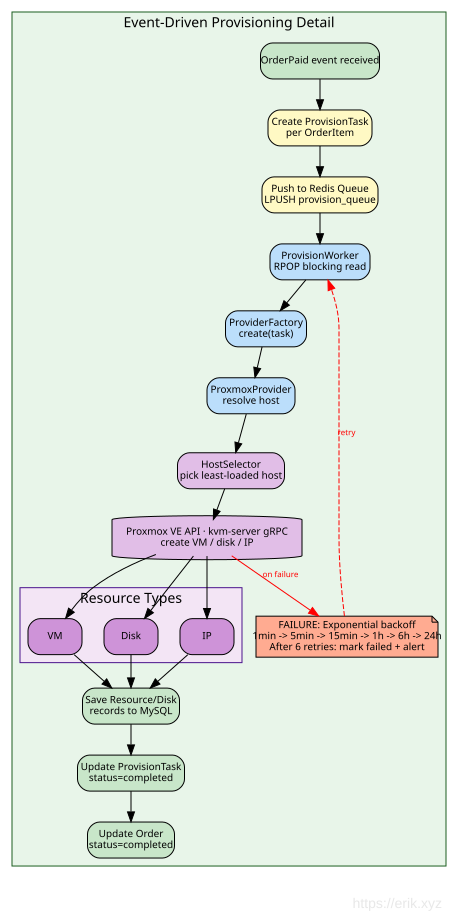

# অ্যাডমিন প্যানেল ডিজাইন ডকুমেন্ট

## সারসংক্ষেপ

`admin/` একটি স্বাধীন webman v2.1 ইনস্ট্যান্স, যা Layui-ভিত্তিক ম্যানেজমেন্ট ড্যাশবোর্ড প্রদান করে। এটি `service/` ব্যাকএন্ড থেকে স্বাধীনভাবে চলে; শুধুমাত্র MySQL ডেটাবেস এবং ৭টি erikwang2013 প্যাকেজ শেয়ার করে।

## আর্কিটেকচার

```
┌─────────────────────────────────────────────────┐
│                  Admin Panel                     │
│  ┌──────────┐  ┌──────────┐  ┌───────────────┐ │
│  │ Controller│  │  Model   │  │   Bootstrap   │ │
│  │ (Layui)  │  │(Eloquent)│  │(worker start) │ │
│  └────┬─────┘  └────┬─────┘  └───────┬───────┘ │
│       │             │               │          │
│  ┌────┴─────────────┴───────────────┴─────────┐ │
│  │         7 erikwang2013 Packages             │ │
│  │  Snowflake │ Hashids │ Encryptable          │ │
│  │  Encryption│ Scout   │ Season │ Poster     │ │
│  └────────────────────┬───────────────────────┘ │
└───────────────────────┼─────────────────────────┘
                        │
              ┌─────────┴─────────┐
              │   MySQL 8.0       │
              │   Elasticsearch   │
              └───────────────────┘
```

### মডিউল ডিপেন্ডেন্সি ম্যাপ


## ডিরেক্টরি লেআউট

```
admin/
├── app/
│   ├── bootstrap/       # Per-process startup
│   │   ├── SnowflakeBootstrap.php
│   │   ├── EncryptableBootstrap.php
│   │   └── EncryptionBootstrap.php
│   ├── controller/       # 54 controller files (Base/Crud + per-entity CRUD)
│   │   ├── Base.php     # json() with hashids_encode_ids
│   │   ├── Crud.php     # Select/Insert/Update/Delete/Export with hashids decode
│   │   ├── DashboardController.php  # Dashboard data API (user stats + trends)
│   │   ├── AccountController.php    # Login/logout/profile/password
│   │   ├── AdminController.php      # Admin CRUD + roles
│   │   ├── RoleController.php       # Role CRUD + rule tree
│   │   └── ...
│   ├── model/            # 44 Eloquent models（36 个映射 service 无前缀业务表 + alerts（install.sql 定义）+ 7 个 wa_* 管理表）
│   │   ├── Base.php     # Snowflake PK + Encryptable support
│   │   ├── Admin.php    # Encryptable: password, email, mobile
│   │   ├── User.php     # Encryptable: 6 fields + Searchable trait
│   │   └── ...
│   ├── common/           # Auth, Tree, Layui, Util, ExcelExport
│   ├── middleware/        # WafMiddleware + AccessControl
│   ├── exception/        # Handler
│   └── functions.php     # hashids_encode/decode, encrypt_data/decrypt_data
├── api/                  # Public API (plugin\admin\api)
│   └── Auth.php          # canAccess() ACL
├── config/
│   ├── plugin/erikwang2013/  # 7 plugin configs
│   ├── hashids.php       # Hashids connections (main + alternative)
│   └── encryption.php    # Encryption config (master key, cipher)
├── tests/                # PHPUnit 11 test suite (286 tests, 962 assertions)
│   ├── HashidsTest.php   # 21 tests
│   ├── BaseJsonTest.php  # 13 tests
│   ├── CrudHashidsTest.php # 14 tests
│   ├── TreeTest.php      # 19 tests
│   ├── AccessControlMiddlewareTest.php # 7 tests（401/403/放行）
│   ├── AdminControllersTest.php        # 48 控制器反射回归
│   ├── UtilTest.php      # 17 tests
│   ├── DictTest.php      # 5 tests
│   ├── ExcelExportTest.php # 4 tests
│   ├── LayuiTest.php     # 5 tests
│   └── support/          # RequestMock, TestableCrud
├── install.sql           # DDL (bigint unsigned PKs, no auto-increment)
└── phpunit.xml
```

## প্যাকেজ ইন্টিগ্রেশন বিবরণ

### 1. Snowflake (ডিস্ট্রিবিউটেড প্রাইমারি কি)

**কনফিগ**: `config/plugin/erikwang2013/snowflake-php/app.php`
**বুটস্ট্র্যাপ**: `app/bootstrap/SnowflakeBootstrap.php`

```php
// Model Base::boot() — creating event
static::creating(function (Model $model) {
    if (empty($model->getKey())) {
        $snowflake = Container::instance()->get(Snowflake::class);
        $model->setAttribute($model->getKeyName(), $snowflake->id());
    }
});
```

- 64-বিট ID: `timestamp(41b) | datacenter(5b) | worker(5b) | sequence(12b)`
- Epoch: 2024-01-01 (সর্বোচ্চ আয়ুষ্কাল ~৬৯ বছর)
- Base মডেলে `$incrementing = false`, `$keyType = 'int'`
- সব PK এবং FK কলাম: `bigint unsigned NOT NULL`

### 2. Hashids (ID অবফাসকেশন)

**কনফিগ**: `config/hashids.php` + `config/plugin/erikwang2013/hashids/app.php`

**এনকোড পাথ** (রেসপন্স):
- `Base::json()` পুনরাবৃত্তভাবে `hashids_encode_ids($data)` কল করে
- `id`, `*_id`, `*_ids` নামের পজিটিভ ইন্টিজার ফিল্ড → hashid স্ট্রিং
- `Crud::formatNormal()`-ও এনকোডিং প্রয়োগ করে (কোড রিভিউতে ঠিক করা হয়েছে)

**ডিকোড পাথ** (রিকোয়েস্ট):
- `Crud::selectInput()`: WHERE ক্লজের `id`/`*_id` hashid স্ট্রিং ডিকোড করে
- `Crud::updateInput()`: `$request->post()` থেকে প্রাইমারি কি ডিকোড করে
- `Crud::deleteInput()`: `$request->post()` থেকে PK-র অ্যারে ডিকোড করে
- `AdminController::update()`: `updateInput()`-এর রিটার্ন ভ্যালু সরাসরি ব্যবহার করে (ডিডুপ করা)
- `RoleController::select()`/`rules()`: `$request->get('id')` ডিকোড করে

**হেল্পার ফাংশন** (`app/functions.php`-এ):
- `hashids_encode(int $id): string`
- `hashids_decode(string $hash): int` — ব্যর্থ হলে 0 রিটার্ন করে
- `hashids_encode_ids(array $data): array` — পুনরাবৃত্ত, `is_numeric()` স্ট্রিং হ্যান্ডল করে

### 3. Encryptable (ডেটাবেস ফিল্ড এনক্রিপশন)

**কনফিগ**: `config/plugin/erikwang2013/encryptable/app.php`
**বুটস্ট্র্যাপ**: `app/bootstrap/EncryptableBootstrap.php`

Eloquent `CastsAttributes` ইন্টারফেস ব্যবহার করে:
- `get()`: DB থেকে পড়ার সময় AES ডিক্রিপ্ট করে
- `set()`: DB-তে লেখার সময় AES এনক্রিপ্ট করে

**এনক্রিপ্টেড ফিল্ড**:
| মডেল | ফিল্ড |
|-------|--------|
| Admin | password, email, mobile |
| User | password, email, mobile, token, last_ip, join_ip |

**গুরুত্বপূর্ণ নিয়ম**: সবসময় মডেল ইনস্ট্যান্সের `save()` ব্যবহার করুন, কখনো Query Builder-এর `update()` নয়। `Admin::where(...)->update(...)` ব্যবহার করলে Eloquent কাস্ট বাইপাস হয়ে র-ভ্যালু সংরক্ষিত হয়। কোড রিভিউয়ের সময় `AccountController`-এ এটি ঠিক করা হয়েছে।

**পাসওয়ার্ড লেয়ারিং**: পাসওয়ার্ড প্রথমে bcrypt-হ্যাশ করা হয় (`insertInput`/`updateInput`-এ), তারপর হ্যাশটি `save()`-এ Encryptable কাস্ট দিয়ে AES-এনক্রিপ্ট হয়। পড়ার সময়: AES ডিক্রিপ্ট → bcrypt হ্যাশ → `password_verify()`।

### 4. Encryption (API ট্রান্সপোর্ট)

**কনফিগ**: `config/encryption.php`
**বুটস্ট্র্যাপ**: `app/bootstrap/EncryptionBootstrap.php`

API-লেভেলের রিকোয়েস্ট/রেসপন্স এনক্রিপশনের জন্য সংরক্ষিত (AES-256-GCM)। যা প্রদান করে:
- `encrypt_data(string $plaintext): string`
- `decrypt_data(string $ciphertext): string`

`ENCRYPTION_MASTER_KEY` কনফিগার না থাকলে স্পষ্ট মেসেজসহ `RuntimeException` থ্রো করে।

### 5. Webman-Scout (Elasticsearch)

**কনফিগ**: `config/plugin/erikwang2013/webman-scout/app.php` + `command.php`

User মডেল `Searchable` trait ব্যবহার করে:
```php
class User extends Base
{
    use Searchable;

    public function toSearchableArray(): array
    {
        return [
            'id' => $this->id,
            'username' => $this->username,
            'nickname' => $this->nickname,
            'email' => $this->email,
            'mobile' => $this->mobile,
        ];
    }
}
```

### 6. Season (দেশের পতাকা)

**কনফিগ**: `config/plugin/erikwang2013/season/app.php`

গ্লোবাল হেল্পার: `country_season_flag(string $code): string`
- `country_season_flag('CN')` → 🇨🇳
- `country_season_flag('US')` → 🇺🇸

এছাড়াও `CountrySeason` ক্লাসের মাধ্যমে স্থানীয়কৃত ঋতুর নাম প্রদান করে।

### 7. Poster-PHP (ক্লিক CAPTCHA)

**কনফিগ**: `config/poster.php` + `config/plugin/erikwang2013/poster/app.php`
**বুটস্ট্র্যাপ**: `config/plugin/erikwang2013/poster/bootstrap.php` → `CaptchaPlugin`

লগইন ও রেজিস্ট্রেশনের জন্য ক্লিক-ভিত্তিক CAPTCHA ভেরিফিকেশন প্রদান করে:

```
Client                         Server
──────                         ──────
POST /api/captcha/create
  Header: X-Api-Version: v1
  → CaptchaService::create()
    → captcha_create('click')
      → ClickCaptcha::generate()
        → GD renders image with n randomly-placed Chinese words
        → Stores targets + key in Redis/File storage
      ← {key, image (base64), target_count, expires_in}

POST /api/auth/login
  Header: X-Api-Version: v1
  (with captcha_key + captcha_points)
  → AuthController::verifyCaptcha()
    → CaptchaService::verify(key, [[x1,y1], [x2,y2], ...])
      → captcha_verify(key, 'click', points)
        → CaptchaManager checks Euclidean distance ≤ 18px tolerance
      ← true/false
```

**নিরাপত্তা ফিচার**:
- ওয়ান-টাইম কি: সফল ভেরিফিকেশনের পর মুছে ফেলা হয়
- ব্রুট-ফোর্স সুরক্ষা: প্রতি কি সর্বোচ্চ ৩ বার ব্যর্থ প্রচেষ্টা, তারপর মুছে ফেলা
- ৩০০ সেকেন্ড TTL (`CAPTCHA_TTL` দিয়ে কনফিগারযোগ্য)
- ক্লিক টলারেন্স: ১৮px ব্যাসার্ধ (কনফিগারযোগ্য)
- কঠিনতার লেভেল: easy (২ টার্গেট), medium (৩), hard (৪)
- স্টোরেজ: স্বয়ংক্রিয় Redis → ফাইল ফলব্যাক, `CAPTCHA_STORAGE` দিয়ে কনফিগারযোগ্য

**র্যাপার**: `Common\Captcha\CaptchaService` `config/poster.php` থেকে কাস্টম কনফিগ লোড করে, `create()` (নিরাপত্তার জন্য রেসপন্স থেকে টার্গেট বাদ দেয়) এবং `verify()` মেথড প্রদান করে। `AuthController::register()` ও `AuthController::login()` ব্যবহার করে।

### 8. ConfirmationMiddleware (পাসওয়ার্ড পুনরায় ভেরিফিকেশন)

**কনফিগ**: `config/route.php`-এ রুট গ্রুপ মিডলওয়্যার

ধ্বংসাত্মক ও সংবেদনশীল অপারেশন সুরক্ষিত করে — ব্যবহারকারীকে আবার পাসওয়ার্ড দিতে হয়। ১২টি সংবেদনশীল রুট এন্ডপয়েন্টে মিডলওয়্যার হিসেবে প্রয়োগ করা হয়েছে:

```
Client                              Server
──────                              ──────
POST /api/orders/{id}/pay
  Header: X-Api-Version: v1
  (with confirm_password field)
    → ConfirmationMiddleware::process()
      → Checks userId present (401 if missing)
      → Checks Redis lock key (429 if locked out)
      → Validates password non-empty (422 if missing)
      → User::find() + Hash::check() verifies bcrypt
      → On failure:
        → Redis INCR confirm_failed:{userId} counter
        → If count ≥ 5, SETEX confirm_lock:{userId} for 900s
        → AuditLogger::record('confirm_failed', ...)
        → Returns 403
      → On success:
        → DEL confirm_failed:{userId} counter
        → AuditLogger::record('confirm_success', ...)
        → Calls $next($request)
```

**সংবেদনশীল ইউজার এন্ডপয়েন্ট** (Auth + Confirmation):
| মেথড | পাথ | অপারেশন |
|--------|------|-----------|
| POST | `/api/orders/{id}/pay` | পেমেন্ট শুরু |
| POST | `/api/supplier/withdraw` | উত্তোলন রিকোয়েস্ট |
| DELETE | `/api/dns/{domain}/records/{id}` | DNS রেকর্ড মুছে ফেলা |

**সংবেদনশীল অ্যাডমিন এন্ডপয়েন্ট** (Auth + AdminRole + Confirmation):
| মেথড | পাথ | অপারেশন |
|--------|------|-----------|
| DELETE | `/admin/api/products/{id}` | পণ্য মুছে ফেলা |
| POST | `/admin/api/orders/{id}/refund` | অর্ডার রিফান্ড |
| POST | `/admin/api/provisioning/resources/{id}/destroy` | রিসোর্স ধ্বংস |
| POST | `/admin/api/kyc/{id}/approve` | KYC অনুমোদন |
| POST | `/admin/api/kyc/{id}/reject` | KYC প্রত্যাখ্যান |
| POST | `/admin/api/suppliers/{id}/approve` | সরবরাহকারী অনুমোদন |
| POST | `/admin/api/suppliers/{id}/settle` | সেটেলমেন্ট তৈরি |
| POST | `/admin/api/suppliers/withdraws/{id}/approve` | উত্তোলন অনুমোদন |
| PUT | `/admin/api/system/config` | সিস্টেম কনফিগ আপডেট |

API ভার্সন `X-Api-Version` হেডারে বহন করা হয় (ডিফল্ট: `v1`), URL পাথে নয়।

**নিরাপত্তা ফিচার**:
- `Hash::check()` দিয়ে bcrypt পাসওয়ার্ড ভেরিফিকেশন
- রেট লিমিটিং: ৫ বার ব্যর্থ প্রচেষ্টায় ১৫-মিনিট লক (900s TTL)
- Redis কি দিয়ে প্রতি-ইউজার লক (`confirm_lock:{userId}`, `confirm_failed:{userId}`)
- সফলতায় ফেইল কাউন্টার রিসেট
- সব প্রচেষ্টা অডিট ডেটাবেসে লগ হয় (সফল, ব্যর্থ, লকড)
- `verifyPassword()` একটি প্রোটেক্টেড মেথড, তাই অ্যানোনিমাস সাবক্লাস ওভাররাইড দিয়ে টেস্টযোগ্য

**টেস্টেবিলিটি**: `ConfirmationMiddlewareTest` (১১ টেস্ট) একটি অ্যানোনিমাস সাবক্লাস ব্যবহার করে যা `verifyPassword()` ওভাররাইড করে নির্দিষ্ট বুলিয়ান রিটার্ন করে — এতে Eloquent/DB ডিপেন্ডেন্সি এড়ানো যায়। টেস্ট কভার করে: 401 আনঅথেনটিকেটেড, 422 অনুপস্থিত/খালি পাসওয়ার্ড, 403 ভুল পাসওয়ার্ড, সফল পাস-থ্রু, রেট লিমিট কি ফরম্যাট, লক কি ফরম্যাট এবং সর্বোচ্চ ব্যর্থতার থ্রেশহোল্ড বাউন্ডারি (৪→লক নেই, ৫→লক, ৬→লক)।

## ACL সিস্টেম

### কন্ট্রোলার-লেভেল

```php
protected $noNeedLogin = ['login', 'logout', 'captcha'];  // Skip login
protected $noNeedAuth = ['select'];                         // Skip auth
```

`api/Auth::canAccess()` `ReflectionClass` দিয়ে চেক করে।

**AccessControlMiddleware রেসপন্স** (`middleware/AccessControl.php`):
- লগইন না থাকলে (`noNeedLogin`-এর বাইরে) → **HTTP 401**, বডিতে লগইন পেজে রিডাইরেক্ট স্ক্রিপ্ট
- লগইন থাকলেও পারমিশন অপর্যাপ্ত → **HTTP 403** এরর পেজ (স্ট্যাটাস 403, আর 500 নয়)
- অ্যালাউ-লিস্টে থাকলে (লগইন পেজ/ক্যাপচা ইত্যাদি) → স্বাভাবিক পাস

### রোল-ভিত্তিক

- Roles-এর `rules` আছে (কমা-সেপারেটেড রুল ID বা সুপার অ্যাডমিনের জন্য `*`)
- রুল `wa_rules`-এ `{Controller}@{action}` কি হিসেবে সংরক্ষিত
- `api/Auth::canAccess()` রোলের রুলের বিরুদ্ধে `$controller@$action` কি রেজলভ করে
- সুপার অ্যাডমিন (`rules = '*'`) সব চেক বাইপাস করে

### ডেটা সীমা

```php
protected $dataLimit = null;     // No limit
protected $dataLimit = 'auth';   // Admin sees own + descendants' data
protected $dataLimit = 'personal'; // Admin sees only own data
protected $dataLimitField = 'admin_id';
```

## কোড রিভিউ ফলাফল (ঠিক করা হয়েছে)

প্রাথমিক কমিটের রিভিউয়ের সময় নিচের সমস্যাগুলো পাওয়া যায় ও ঠিক করা হয়:

### ক্রিটিকাল
1. **AccountController Encryptable বাইপাস করছিল**: `password()` ও `update()`-এ `Admin::where()->update()` ব্যবহার হচ্ছিল, যা Eloquent কাস্ট বাইপাস করে এনক্রিপ্টেড কলামে র-ভ্যালু সংরক্ষণ করত। `Admin::find()->save()` ব্যবহার করে ঠিক করা হয়েছে।
2. **Crud::formatNormal() ID এনকোড করছিল না**: গ্লোবাল `json()` কল করা হচ্ছিল, `hashids_encode_ids()` প্রয়োগ করা হচ্ছিল না। ঠিক করা হয়েছে।

### গুরুত্বপূর্ণ
3. **hashids_encode_ids-এ স্ট্রিক্ট `is_int`**: PDO থেকে আসা বড় bigint ভ্যালু PHP স্ট্রিং হিসেবে আসে। `is_numeric()` + পূর্ণসংখ্যা চেকে পরিবর্তন করা হয়েছে।
4. **AdminController-এ ডুপ্লিকেট ID ডিকোড**: `update()` একই PK দুইবার ডিকোড করছিল। ডিডুপ করা হয়েছে, `insert()`-এ লুপ ভেরিয়েবল শ্যাডোয়িং ঠিক করা হয়েছে।
5. **AccountController::update()-এ ডেড পাসওয়ার্ড কোড**: পাসওয়ার্ড ফিল্ড অ্যালো-লিস্টে ছিল না। মুছে ফেলা হয়েছে।
6. **হার্ডকোডেড MySQL ড্রাইভার**: `config('database.default')`-এ পরিবর্তন করা হয়েছে।

## Excel এক্সপোর্ট

### আর্কিটেকচার

Excel এক্সপোর্ট PhpSpreadsheet ^2.0 ব্যবহার করে সার্ভার-সাইডে .xlsx ফাইল তৈরি করে। অ্যাডমিন প্যানেলে দুটি আলাদা এক্সপোর্ট পাথ আছে কারণ দুটি ভিন্ন CRUD প্রক্রিয়া আছে:

```
Export request (with current table filters)
  ├── Crud-based controllers (User, Admin, Role, etc.)
  │     → Crud::export()
  │       → selectInput() reuses query parsing (hashids decode, WHERE, ORDER)
  │       → doSelect() builds Eloquent query
  │       → 10,000 row cap
  │       → hashids_encode_ids() applied to result data
  │       → ExcelExport::export() generates .xlsx
  │
  └── TableController (generic tables like wa_dict, wa_rules)
        → TableController::export()
          → Builds query from table schema + request params
          → hashids_encode_ids() applied
          → ExcelExport::export() generates .xlsx
```

### ExcelExport ইউটিলিটি (`app/common/ExcelExport.php`)

PhpSpreadsheet-এর চারপাশে ফ্লুয়েন্ট র্যাপার:

- `setColumns(array $columns)` — কলামের ক্রম নির্ধারণ
- `setLabels(array $labels)` — মানব-পঠনযোগ্য কলাম হেডার সেট
- `addRow(array $row)` / `addRows(array $rows)` — ডেটা পপুলেট
- `save(string $title): string` — `runtime/exports/`-এ .xlsx লেখে, ফাইল পাথ রিটার্ন করে
- স্ট্যাটিক হেল্পার: `ExcelExport::export($title, $columns, $data, $labels)` — ওয়ান-শট এক্সপোর্ট
- `Worksheet::getColumnDimension()` দিয়ে স্বয়ংক্রিয় কলাম সাইজিং

### Crud::export()

```php
public function export(Request $request): Response
{
    [$where, $format, $limit, $field, $order] = $this->selectInput($request);
    $query = $this->doSelect($where, $field, $order);
    $maxRows = 10000;
    $total = min($query->count(), $maxRows);
    $items = $query->limit($maxRows)->get();
    if (method_exists($this, 'afterQuery')) {
        $items = call_user_func([$this, 'afterQuery'], $items);
    }
    $data = array_map(fn($item) => ...toArray(), $items->toArray());
    $data = hashids_encode_ids($data);
    // Derive column labels from table schema comments
    $path = ExcelExport::export($table, $columns, $data, $labels);
    return response()->download($path, $table . '_' . date('YmdHis') . '.xlsx');
}
```

সব Crud-ভিত্তিক কন্ট্রোলার (Admin, User, Role ইত্যাদি) স্বয়ংক্রিয়ভাবে `export()` ইনহেরিট করে।

### ফ্রন্টএন্ড ওয়্যারিং

- Layui-র বিল্ট-ইন `"exports"` টুলবার আইটেম (ক্লায়েন্ট-সাইড CSV) একটি কাস্টম `{title: "导出", layEvent: "export"}` বাটন দিয়ে প্রতিস্থাপিত
- `export` ইভেন্ট হ্যান্ডলার `window.exportExcel()` কল করে, যা বর্তমান টেবিল ফিল্টার প্যারামিটার সংগ্রহ করে ডাউনলোড URL খোলে
- `Layui::buildTable()` সব CRUD পেজের জন্য কাস্টম এক্সপোর্ট বাটনসহ টুলবার তৈরি করে

### সার্ভিস অ্যাডমিন API এক্সপোর্ট

সার্ভিস ব্যাকএন্ডেও (`service/`) নিজস্ব `Common\ExcelExport` র্যাপার দিয়ে Excel এক্সপোর্ট আছে:

| এন্ডপয়েন্ট | কন্ট্রোলার | এক্সপোর্ট করা ডেটা |
|----------|-----------|---------------|
| `GET /admin/api/orders/export` | OrderController | id, order_no, user_id, type, status, total, currency, created_at, paid_at |
| `GET /admin/api/users/export` | UserController | id, email, phone, role, status, created_at, last_login_at |
| `GET /admin/api/suppliers/export` | SupplierController | id, user_id, status, contact_name, contact_email, contact_phone, created_at |

সব API এন্ডপয়েন্টে `X-Api-Version` হেডার প্রয়োজন (ডিফল্ট: `v1`)।

কনফ্লিক্ট এড়াতে এক্সপোর্ট রুটগুলো `/{id}` প্যারামিটার রুটের **আগে** বসানো হয়।

## সার্ভিস অ্যাডমিন API — এক্সটেন্ডেড ফিচার

### অ্যাডমিন API এন্ডপয়েন্ট (সার্ভিস লেয়ার)

সব অ্যাডমিন REST এন্ডপয়েন্টের প্রিফিক্স `/admin/api` এবং `AdminRoleMiddleware` প্রয়োজন।

| গ্রুপ | এন্ডপয়েন্ট | কন্ট্রোলার |
|-------|-----------|------------|
| ড্যাশবোর্ড | `GET /dashboard`, `/kyc`, `POST /kyc/{id}/approve`, `/reject` | `Admin\DashboardController` |
| ইউজার | `GET /users`, `/users/export`, `/users/{id}`, `PUT /users/{id}/status` | `Admin\UserController` |
| প্রোডাক্ট | `POST /products`, `PUT /products/{id}`, `DELETE /products/{id}`, `POST /products/{id}/skus`, `PUT /skus/{id}`, `POST /skus/{id}/region-price` | `Admin\ProductController` |
| প্রোডাক্ট ইমপোর্ট/এক্সপোর্ট | `GET /products/export` (CSV), `POST /products/import` (CSV upsert) | `Admin\ImportExportController` |
| অর্ডার | `GET /orders`, `/orders/export`, `/orders/{id}`, `POST /orders/{id}/refund` | `Admin\OrderController` |
| ইনভয়েস | `GET /invoices`, `POST /invoices/{orderId}/generate` | `Admin\InvoiceController` |
| পেমেন্ট | `GET /payments/channels`, `PUT /payments/channels/{id}`, `GET /payments/transactions`, `/reconcile` | `Admin\PaymentController` |
| প্রভিশনিং | `GET /provisioning/tasks`, `POST /tasks/{id}/retry`, `POST /resources/{id}/upgrade`, `/destroy`, `GET /hosts` | `Provisioning\TaskController` |
| Provider API | `GET /providers`, `POST /providers`, `PUT /providers/{id}`, `DELETE /providers/{id}` | `Admin\ProviderApiController` |
| সরবরাহকারী | `GET /suppliers`, `/suppliers/export`, `POST /suppliers/{id}/approve`, `/settle`, `/withdraws/{id}/approve` | `Admin\SupplierController` |
| সরবরাহকারী API Key | `GET /suppliers/{id}/api-keys`, `POST /suppliers/{id}/api-keys`, `DELETE /suppliers/api-keys/{id}` | `Admin\SupplierController` |
| টিকিট | `GET /tickets`, `POST /tickets/{id}/assign`, `/close` | `Ticket\TicketController` |
| কুপন | `GET /coupons`, `POST /coupons`, `DELETE /coupons/{id}` | `Admin\CouponController` |
| Webhook | `GET /webhooks`, `POST /webhooks`, `DELETE /webhooks`, `POST /webhooks/test` | `Admin\WebhookController` |
| ডোমেইন | `GET /domains/tlds`, `POST /domains/tlds`, `PUT /domains/tlds/{id}`, `DELETE /domains/tlds/{id}`, `GET /domains/zones`, `/transfers`, `POST /transfers/{id}/approve` | `Admin\DomainController` |
| নোটিফিকেশন | `GET /notifications/templates`, `PUT /notifications/templates/{id}`, `GET /notifications/log` | `Admin\NotificationController` |
| হেল্প আর্টিকেল | `GET /help`, `POST /help`, `PUT /help/{id}`, `DELETE /help/{id}` | `Admin\HelpController` |
| রিপোর্ট | `GET /reports/revenue`, `/supplier`, `/region` | `Report\ReportController` |
| মনিটরিং | `GET /monitor/dashboard`, `/resources/{id}` | `Monitor\MonitorController` |
| অডিট | `GET /audit-logs` | `Admin\SystemController` |
| সিস্টেম কনফিগ | `PUT /system/config` | `Admin\SystemController` |

### ড্যাশবোর্ড ডেটা (সার্ভিস লেয়ার)

`Admin\DashboardController::index()` বাস্তব অপারেশনাল মেট্রিক্স প্রদান করে:

```php
[
    'today_stats' => [todayOrders, todayRevenue, newUsers, activeResources],
    'revenue_trend_30d' => [...],   // Daily revenue for last 30 days
    'region_distribution' => [...],  // Active resources grouped by region
    'pending_orders' => ...,         // Orders awaiting payment
    'pending_kyc' => ...,            // KYC submissions awaiting review
    'open_tickets' => ...,           // Open or in-progress tickets
]
```

### অ্যাডমিন প্যানেল ড্যাশবোর্ড ভিউ (`app/view/index/dashboard.html`)

- **৮টি অ্যানিমেটেড স্ট্যাট কার্ড**: আজ/সপ্তাহ/মাস/মোট ইউজার + আজকের অর্ডার + আজকের রাজস্ব + পেন্ডিং অর্ডার + অ্যাক্টিভ রিসোর্স — প্রতিটিতে Layui `count` মডিউল দিয়ে কাউন্ট-আপ অ্যানিমেশন
- **৩টি ECharts চার্ট**:
  1. ৭ দিনের ইউজার রেজিস্ট্রেশন ট্রেন্ড — এরিয়া লাইন চার্ট
  2. ৩০ দিনের ইউজার রেজিস্ট্রেশন ট্রেন্ড — বার চার্ট
  3. ইউজার সারসংক্ষেপ — ডোনাট/পাই চার্ট (আজ / সপ্তাহ / মাস)
- **সিস্টেম ইনফো টেবিল**: PHP/Workerman/Webman/Admin/MySQL/OS ভার্সন দিয়ে ডাইনামিকভাবে পপুলেট হয়
- **টুলবার**: PDF এক্সপোর্ট ও রিফ্রেশ বাটন
- সব ডেটা `/app/admin/dashboard/data` থেকে AJAX দিয়ে আনা হয়

### রুট

```
Route::any('/app/admin/dashboard/data', [DashboardController::class, 'index']);
```

এক্সপ্লিসিট রেজিস্টার্ড রুট ছাড়াও, `admin/config/route.php` `app/controller/`-এর প্রতিটি কন্ট্রোলারের প্রতিটি পাবলিক মেথডের জন্য স্বয়ংক্রিয়ভাবে `/app/admin/{snake_case_controller}/{action}` রুট নিবন্ধন করে (যেমন `/app/admin/order_item/index`); URL ও মেনুতে ব্যবহৃত snake_case কন্ট্রোলার নামের সাথে মিলে যায়। `/app/admin` ও `/app/admin/index` হলো অ্যাডমিন হোম/লগইন পেজ এন্ট্রি (লগইন না থাকলে লগইন ভিউ রেন্ডার হয়); অমিলযুক্ত রিকোয়েস্টে ইউনিফর্মলি 404 রিটার্ন হয়।

## PDF এক্সপোর্ট

ড্যাশবোর্ড পেজে ক্লায়েন্ট-সাইড PDF জেনারেশন:

- **html2canvas 1.4.1** (CDN) ব্যবহার করে ড্যাশবোর্ড DOM ক্যানভাস হিসেবে ক্যাপচার করে
- **jsPDF 2.5.1** (CDN) ব্যবহার করে ডাউনলোডযোগ্য A4 PDF তৈরি করে
- স্ট্যাট কার্ড ও ECharts চার্ট (ক্যানভাস এলিমেন্ট হিসেবে রেন্ডার হওয়া) ক্যাপচার করে
- PDF-এ টাইটেল, টাইমস্ট্যাম্প ও ব্র্যান্ডিং অন্তর্ভুক্ত
- ড্যাশবোর্ড টুলবারের "Export PDF" বাটন দিয়ে ট্রিগার হয়

```
Dashboard DOM → html2canvas screenshot → jsPDF document → browser download
```

### বাস্তবায়ন

```javascript
// In dashboard.html
html2canvas(document.querySelector('.layui-body'), {scale: 2}).then(canvas => {
    const pdf = new jsPDF('p', 'mm', 'a4');
    const imgData = canvas.toDataURL('image/png');
    pdf.addImage(imgData, 'PNG', 10, 10, 190, 0);
    pdf.save('dashboard_' + new Date().toISOString().slice(0, 10) + '.pdf');
});
```

## টেস্ট স্যুট

```
PHPUnit 11.5 | 67 tests | 124 assertions
```

### HashidsTest (২১ টেস্ট)
- encode/decode রাউন্ডট্রিপ (0 থেকে PHP_INT_MAX)
- ডিটারমিনিস্টিক এনকোডিং
- অবৈধ/খালি স্ট্রিং হ্যান্ডলিং
- `hashids_encode_ids` ফিল্ড প্যাটার্ন (`id`, `*_id`, `*_ids`)
- শূন্য/নেতিবাচক স্কিপ, নিউমেরিক স্ট্রিং সাপোর্ট
- নেস্টেড অ্যারে রিকার্সন, নন-আইডি ফিল্ড প্রিজারভেশন

### BaseJsonTest (১৩ টেস্ট)
- `json()`/`success()`/`fail()` hashids এনকোডিং প্রয়োগ করে
- নেস্টেড অবজেক্ট এনকোডিং
- Snowflake-সাইজ ID হ্যান্ডলিং
- নন-আইডি ফিল্ড প্রিজারভেশন
- শূন্য হ্যান্ডলিং
- রেসপন্স স্ট্রাকচার ভেরিফিকেশন

### CrudHashidsTest (১৪ টেস্ট)
- `selectInput`: `id`/`*_id` WHERE ফিল্ডে hashid ডিকোড
- `selectInput`: নিউমেরিক স্ট্রিং/র-ইন্ট পাস-থ্রু
- `updateInput`: hashid PK ডিকোড
- `updateInput`: নিউমেরিক স্ট্রিং PK int-এ কাস্ট
- `deleteInput`: ব্যাচ ID ডিকোড, মিশ্র টাইপ
- `deleteInput`: খালি অ্যারে, একক ID হ্যান্ডলিং
BENGALI_EOF

## ডেটাবেস মাইগ্রেশন সিস্টেম

### আর্কিটেকচার

`service/` ও `admin/` উভয় ইনস্ট্যান্সেরই `illuminate/database` Schema Builder-এর উপর নির্মিত স্বাধীন মাইগ্রেশন সিস্টেম আছে। প্রতিটি ইনস্ট্যান্স `config/command.php` দিয়ে Symfony Console কমান্ড নিবন্ধন করে, যা webman-এর কনসোল রানার খুঁজে পায়।

```
php webman migrate          # Run pending migrations
php webman migrate:rollback # Rollback last batch
php webman migrate:status   # Show migration status
```

### MigrationRunner (`service/support/MigrationRunner.php`, `admin/app/common/MigrationRunner.php`)

দুই ইনস্ট্যান্সে শেয়ার করা কোর ইঞ্জিন:

- **`ensureTable()`** — প্রথম রানে `migrations` ট্র্যাকিং টেবিল তৈরি করে (id, migration name, batch number)
- **`migrate()`** — `database/migrations/` থেকে মাইগ্রেশন ফাইল স্ক্যান করে, পেন্ডিং `up()` মেথড চালায়, ব্যাচ রেকর্ড করে
- **`rollback()`** — প্রতিটি মাইগ্রেশনের `down()` বিপরীত ক্রমে কল করে শেষ ব্যাচ রিভার্ট করে
- **`status()`** — ব্যাচ নম্বরসহ সব মাইগ্রেশন তালিকাভুক্ত করে
- **`resolve()`** — ফাইল থেকে মাইগ্রেশন ক্লাস ইনস্ট্যান্টিয়েট করে

### মাইগ্রেশন বেস ক্লাস (`service/support/Migration.php`, `admin/app/common/Migration.php`)

```php
abstract class Migration
{
    abstract public function up(): void;
    abstract public function down(): void;
}
```

প্রতিটি মাইগ্রেশন ফাইল `Migration` এক্সটেন্ড করা ক্লাস রিটার্ন করে, টাইমস্ট্যাম্প-প্রিফিক্সড ফাইলনেমসহ (যেমন `2024_01_01_000001_create_initial_schema.php`)।

### সার্ভিস মাইগ্রেশন

**ডিরেক্টরি**: `service/database/migrations/` — ৩৮টি মাইগ্রেশন ফাইল (টেবিলের নামে erik_ প্রিফিক্স নেই, admin মডেল সরাসরি ম্যাপ করে)

| মাইগ্রেশন | টেবিল |
|-----------|--------|
| `0001_create_users_tables` | users, user_profiles, user_kyc, user_balance, user_balance_log, user_addresses, refresh_tokens |
| `0002_create_product_tables` | product_categories, regions, products, product_skus, product_regions, product_images, product_attributes, product_reviews |
| `0003_create_order_tables` | carts, orders, order_items, order_timeline, order_invoices, refunds |
| `0004_create_payment_tables` | payment_channels, payment_transactions, payment_reconcile |
| `0005_create_provisioning_tables` | resources, resource_servers, resource_ips, resource_disks, resource_domains, provision_tasks, provider_apis |
| `0006_create_host_tables` | host_machines, ip_pools, ip_allocations, disks, disk_resizes |
| `0007_create_supplier_tables` | suppliers, supplier_products, supplier_settlements, supplier_withdraws |
| `0008_create_domain_tables` | domain_tlds, domain_transfers, dns_zones, dns_records |
| `0009_create_ticket_notification_tables` | tickets, ticket_messages, notifications, notification_templates |
| `0010_create_audit_table` | audit_logs |
| `0011_create_kvm_service_tables` | network_services, firewall_services, switch_services |
| `2024_01_01_000001_create_initial_schema` | `Capsule::unprepared()` দিয়ে `docs/database.sql` চালায়, `down()`-এ সব ড্রপ করে |
| `2025_05_16_000002_add_fcm_token_to_users` | users-এ `fcm_token`, `fcm_platform` কলাম + ইনডেক্স যোগ করে |
| `2026_08_26_000003_widen_encrypted_columns` | users.phone / user_addresses.phone / suppliers.contact_phone VARCHAR(20)→VARCHAR(255) (Encryptable সাইফারটেক্সট দৈর্ঘ্য) |

### অ্যাডমিন মাইগ্রেশন

**ডিরেক্টরি**: `admin/database/migrations/` — ১টি মাইগ্রেশন ফাইল

| মাইগ্রেশন | বিবরণ |
|-----------|-------------|
| `2024_01_01_000001_create_admin_schema` | `Capsule::unprepared()` দিয়ে `admin/install.sql` চালায় — সিড ডেটাসহ wa_* টেবিল তৈরি করে |

### কনসোল কমান্ড নিবন্ধন

**`service/config/command.php`**:
```php
return [
    \App\Command\MigrateCommand::class,
    \App\Command\MigrateRollbackCommand::class,
    \App\Command\MigrateStatusCommand::class,
];
```

**`admin/config/command.php`** — `app\command` নেমস্পেসে একই প্যাটার্ন।

## Stripe প্রোডাকশন ইন্টিগ্রেশন

### আর্কিটেকচার

ফেক `random_bytes()` পেমেন্ট ID প্রতিস্থাপন করে `stripe/stripe-php` ^15.0 দিয়ে আসল Stripe API ইন্টিগ্রেশন করা হয়েছে।

**ফাইল**: `service/app/payment/service/channels/StripeChannel.php`

```
Client-side                    Server-side                    Stripe API
───────────                    ───────────                    ──────────
Select Stripe at checkout
  → POST /orders/{id}/pay
    → StripeChannel::createPaymentIntent()
      → StripeClient->paymentIntents->create(amount, currency)
        ← {id, client_secret}
      → Save pi_xxx as transaction_no
      ← Return client_secret
  → Stripe.js confirmCardPayment(client_secret)
    ← Payment confirmed by Stripe
      → POST /payments/webhook/stripe
        → StripeChannel::handleWebhook()
          → Webhook::constructEvent(payload, signature, secret)
          → Verify idempotency (skip non-pending transactions)
          → Update order status, create transaction record
```

### PaymentIntent তৈরি

```php
public function createPaymentIntent(Order $order): array
{
    $intent = $this->stripe()->paymentIntents->create([
        'amount'   => (int) round($order->total * 100),  // cents
        'currency' => strtolower($order->currency),
        'metadata' => ['order_id' => $order->id, 'order_no' => $order->order_no],
    ]);
    return [
        'transaction_no' => $intent->id,          // pi_xxxxxxxxxxxxx
        'client_secret'  => $intent->client_secret, // pi_xxx_secret_yyy
    ];
}
```

- `$this->stripe()` env থেকে `STRIPE_SECRET_KEY` দিয়ে `\Stripe\StripeClient` লেজি-ইনিশিয়ালাইজ করে
- env ভেরিয়েবল না থাকলে `$this->channel->api_key_encrypted`-এ ফলব্যাক (Encryptable দিয়ে ডিক্রিপ্ট)
- অ্যামাউন্ট সেন্টে রূপান্তর: `(int) round($order->total * 100)`

### Webhook সিগনেচার ভেরিফিকেশন

```php
public function handleWebhook(string $payload, string $signature): void
{
    $event = \Stripe\Webhook::constructEvent(
        $payload, $signature, $this->channel->webhook_secret_encrypted
    );
    // Idempotency: skip if transaction already processed
    $existing = Transaction::where('transaction_no', $event->id)->first();
    if ($existing && $existing->status !== 'pending') return;
    
    match ($event->type) {
        'payment_intent.succeeded' => $this->confirmPayment($event),
        'payment_intent.payment_failed' => $this->failPayment($event),
        default => null,
    };
}
```

- Stripe সিগনেচার হেডার ভেরিফাই করতে `Webhook::constructEvent()` ব্যবহার করে
- **আইডেমপোটেন্সি গার্ড**: `transaction_no` দিয়ে ডুপ্লিকেট webhook ডেলিভারি চেক করে
- সফল ও ব্যর্থ উভয় ইভেন্ট টাইপ সাপোর্ট করে

## Twilio SMS ইন্টিগ্রেশন

### আর্কিটেকচার

`error_log()` স্টাব প্রতিস্থাপন করে `twilio/sdk` ^8.0 দিয়ে আসল SMS ডেলিভারি করা হয়েছে।

**ফাইল**: `service/app/notification/queue/SmsSender.php`

### মেসেজ প্রেরণ

```php
public function consume(): void
{
    $client = new \Twilio\Rest\Client(
        getenv('TWILIO_ACCOUNT_SID'),
        getenv('TWILIO_AUTH_TOKEN')
    );
    $message = $client->messages->create(
        $this->notification->recipient_phone,
        ['from' => getenv('TWILIO_PHONE_NUMBER'), 'body' => $this->notification->body]
    );
    $this->notification->provider_message_id = $message->sid;
}
```

### এরর হ্যান্ডলিং

- `Twilio\Exceptions\RestException` ক্যাচ করে — Twilio এরর কোড ও মেসেজ ধারণ করে
- `send_status = 'failed'` সহ ব্যর্থ Notification রেকর্ড তৈরি করে
- ডেলিভারি ট্র্যাকিংয়ের জন্য `provider_message_id` (Twilio SID) রেকর্ড করে
- Twilio ক্রেডেনশিয়াল সেট না থাকলে `error_log()`-এ ফলব্যাক (ডেভ মোড)

### কনফিগারেশন

Env ভেরিয়েবল: `TWILIO_ACCOUNT_SID`, `TWILIO_AUTH_TOKEN`, `TWILIO_PHONE_NUMBER`

## FCM পুশ ইন্টিগ্রেশন

### আর্কিটেকচার

`error_log()` স্টাব প্রতিস্থাপন করে `kreait/firebase-php` ^7.0 দিয়ে আসল পুশ ডেলিভারি করা হয়েছে।

**ফাইল**: `service/app/notification/queue/PushSender.php`

### ডিভাইস টোকেন স্টোরেজ

মাইগ্রেশন দিয়ে `users` টেবিলে যোগ করা হয়েছে:
- `fcm_token VARCHAR(512) DEFAULT NULL` — ডিভাইস রেজিস্ট্রেশন টোকেন
- `fcm_platform VARCHAR(16) DEFAULT NULL` — `ios` / `android` / `web`
- `INDEX idx_fcm_token (fcm_token)` — টোকেন দিয়ে লুকআপ

User মডেল: `$fillable`-এ `fcm_token` ও `fcm_platform` যোগ করা হয়েছে।

### পুশ প্রেরণ

```php
public function consume(): void
{
    $factory = new \Kreait\Firebase\Factory();
    if ($credentialsPath = getenv('FIREBASE_CREDENTIALS_PATH')) {
        $factory = $factory->withServiceAccount($credentialsPath);
    }
    $messaging = $factory->createMessaging();
    
    $message = \Kreait\Firebase\Messaging\CloudMessage::withTarget(
        'token', $this->user->fcm_token
    )->withNotification([
        'title' => $this->notification->title,
        'body'  => $this->notification->body,
    ]);
    
    $result = $messaging->send($message);
}
```

### টোকেন ক্লিনআপ

- `Kreait\Firebase\Exception\Messaging\InvalidToken` ক্যাচ করে — ইউজারের `fcm_token` নাল করে
- `Kreait\Firebase\Exception\Messaging\NotFound` ক্যাচ করে — নিবন্ধহীন টোকেন সরিয়ে দেয়
- Firebase ক্রেডেনশিয়াল সেট না থাকলে `error_log()`-এ ফলব্যাক (ডেভ মোড)

### কনফিগারেশন

Env ভেরিয়েবল: `FIREBASE_CREDENTIALS_PATH` (সার্ভিস অ্যাকাউন্ট JSON), `FCM_SERVER_KEY` (লিগ্যাসি)

## বিজনেস ফ্লো ডায়াগ্রাম

### অর্ডার → পেমেন্ট → প্রভিশনিং (কোর বিজনেস ফ্লো)


### ইভেন্ট-ড্রিভেন প্রভিশনিং বিবরণ



### নোটিফিকেশন ডিসপ্যাচ


### সরবরাহকারী লাইফসাইকেল


### টিকিট লাইফসাইকেল


## সার্ভিস-লেয়ার টেস্ট স্যুট

### সারসংক্ষেপ

```
PHPUnit 10.5 | 295 tests | 455 assertions
```

**ডিরেক্টরি**: `service/tests/` — ৭টি মডিউলে ১২টি টেস্ট ফাইল

**কনফিগ**: `service/phpunit.xml` — একক `unit` টেস্টস্যুট, `app/` ও `common/` সোর্স কভার করে

### টেস্ট বুটস্ট্র্যাপ

`service/tests/bootstrap.php` Composer অটোলোড লোড করে এবং টেস্টের অধীনে থাকা কোডের প্রয়োজনীয় দুটি গ্লোবাল হেল্পার সংজ্ঞায়িত করে:

- `request_id()` — ইউনিক রিকোয়েস্ট ID স্ট্রিং রিটার্ন করে
- `now()` — বর্তমান `DateTime` অবজেক্ট রিটার্ন করে

গুরুত্বপূর্ণ শিক্ষা: টেস্ট কনটেক্সটে `Webman\Config` লোড করা যায় না, কারণ `loadFromDir()` `route.php` ট্রিগার করে, যা null-এ `Route::addRoute()` কল করে। টেস্টগুলো সম্পূর্ণরূপে Config বাইপাস করে — `HashidServiceTest` সরাসরি `new Hashids()` ব্যবহার করে, `ResponseTest` লোকাল হেল্পার মেথড ব্যবহার করে।

### টেস্ট ফাইল

| ফাইল | টেস্ট | কভারেজ |
|------|-------|----------|
| `Captcha/CaptchaServiceTest.php` | 9 | create স্ট্রাকচার, কঠিনতার লেভেল, verify পাস/ফেল, ওয়ান-টাইম ব্যবহার, ইউনিক কি |
| `Confirmation/ConfirmationMiddlewareTest.php` | 11 | auth প্রয়োজন, অনুপস্থিত পাসওয়ার্ড, ভুল পাসওয়ার্ড, সফল পাস-থ্রু, রেট লিমিট কি ফরম্যাট, লক কি ফরম্যাট, সর্বোচ্চ ব্যর্থতা থ্রেশহোল্ড |
| `Common/HashidServiceTest.php` | 17 | encode/decode রাউন্ডট্রিপ, ডিটারমিনিজম, সল্ট আইসোলেশন, পুনরাবৃত্ত ID ওয়াক |
| `Common/ResponseTest.php` | 16 | success/error/প্যাজিনেটেড স্ট্রাকচার, request_id কনসিস্টেন্সি, HTTP এরর কোড |
| `Common/SnowflakeTest.php` | 6 | টাইমস্ট্যাম্প অর্ডারিং, ইউনিকনেস, bigint রেঞ্জ, init প্যাটার্ন |
| `Common/ValidatorTest.php` | 22 | required(), email(), minLength() ভ্যালিডেশন রুল |
| `Common/LogSanitizerTest.php` | 34 | PII রিডাকশন, নেস্টেড অ্যারে, কেস-ইনসেনসিটিভ ম্যাচিং, ২০ ধরনের সংবেদনশীল ফিল্ড |
| `Payment/StripeChannelTest.php` | 19 | চ্যানেল কনফিগ, অ্যামাউন্ট গণনা, webhook সিগনেচার, আইডেমপোটেন্সি |
| `Payment/PaymentRouterTest.php` | 10 | চ্যানেল ফিল্টারিং, অ্যামাউন্ট কনস্ট্রেইন্ট, কারেন্সি/রিজিয়ন সাপোর্ট, ফি গণনা |
| `Notification/NotificationDispatcherTest.php` | 8 | টেমপ্লেট রেন্ডারিং, চ্যানেল রাউটিং, ইনঅ্যাক্টিভ ইউজার স্কিপ |
| `Provisioning/ProviderFactoryTest.php` | 12 | register, create, createFromResource, এরর কেস |
| `Provisioning/RetryLogicTest.php` | 12 | এক্সপোনেনশিয়াল ব্যাকঅফ, সর্বোচ্চ রিট্রাই, স্ট্যাটাস ট্রানজিশন, হোস্ট নির্বাচন |
| `ClientPlatform/ClientPlatformMiddlewareTest.php` | 13 | বৈধ প্ল্যাটফর্ম, অনুপস্থিত/ডিফল্ট হেডার, অসমর্থিত প্ল্যাটফর্ম, কেস-ইনসেনসিটিভ, নন-API স্কিপ, অ্যাডমিন রুট, ডাউনস্ট্রিম অ্যাক্সেস |
| `Security/WafMiddlewareTest.php` | 37 | SQLi (4), XSS (6), CMDi (4), ফাইল ইনক্লুশন (3), হেডার ইনজেকশন/CRLF (2), SSRF (5), NoSQL ইনজেকশন (4), ওপেন রিডাইরেক্ট (2), সেফ পাস-থ্রু (5), URL স্ক্যানিং, UA স্ক্যানিং |
| `Version/VersionMiddlewareTest.php` | 6 | বৈধ ভার্সন, অনুপস্থিত ভার্সনে ডিফল্ট, অসমর্থিত ভার্সনে 400, নন-API স্কিপ, অ্যাডমিন API ভ্যালিডেশন, এরর রেসপন্স হেডার |

### টেস্ট ইনফ্রাস্ট্রাকচার

- `tests/TestCase.php` — PHPUnit TestCase এক্সটেন্ড করা বেস ক্লাস
- `tests/Support/RequestMock.php` — কনস্ট্রাক্টর-ইনজেক্টেড প্যারামিটারসহ মক রিকোয়েস্ট

## CI/CD পাইপলাইন

### আর্কিটেকচার

GitHub Actions ওয়ার্কফ্লো `.github/workflows/ci.yml`-এ।

**ট্রিগার**: `main`-এ push, `main`-এ pull request

### জব

| জব | স্ট্র্যাটেজি | বিবরণ |
|-----|----------|-------------|
| `syntax` | PHP 8.2 | admin/ ও service/-এর সব `.php` ফাইলে `php -l` লিন্ট |
| `admin-tests` | PHP 8.2, 8.3 | `composer install -d admin` → `admin/vendor/bin/phpunit` |
| `service-tests` | PHP 8.2, 8.3 | `composer install -d service` → `service/vendor/bin/phpunit` |
| `composer-validate` | PHP 8.2 | দুটি composer.json ফাইলে `composer validate --strict` |

### PHP ভার্সন ম্যাট্রিক্স

দুটি টেস্ট জবই `shivammathur/setup-php@v2` দিয়ে PHP 8.2 ও 8.3-তে চলে।

### বর্তমান স্ট্যাটাস

সব ৪টি জব পাস: মোট 243 টেস্ট (67 admin + 176 service), 400 অ্যাসারশন, দুই PHP ভার্সনেই সবুজ।

## ডেটাবেস এন্টিটি রিলেশনশিপ


## মূল ডিজাইন সিদ্ধান্ত

1. **স্বাধীন ইনস্ট্যান্স**: admin/ service/-এর মধ্যে প্লাগইন হিসেবে নয়, নিজস্ব webman ইনস্ট্যান্স হিসেবে চলে। এটি অ্যাডমিন ট্রাফিক ও ব্যর্থতাকে কাস্টমার-ফেসিং API থেকে আলাদা রাখে।

2. **Encryptable + পাসওয়ার্ড হ্যাশিং**: পাসওয়ার্ড প্রথমে bcrypt-হ্যাশ হয়, তারপর AES-এনক্রিপ্ট। Encryptable কাস্ট Eloquent লেভেলে (হ্যাশিংয়ের উপরে) কাজ করে, তাই লেয়ারিং হলো: `input → bcrypt hash → model attribute set → Encryptable::set() encrypts → DB`। পড়ার সময়: `DB → Encryptable::get() decrypts → bcrypt hash → password_verify()`।

3. **কন্ট্রোলার বাউন্ডারিতে Hashids**: এনকোড/ডিকোড HTTP বাউন্ডারিতে (কন্ট্রোলার) ঘটে, মডেল বা ORM লেভেলে নয়। এতে মডেলগুলো ডেটাবেস-অ্যাগনস্টিক থাকে এবং hashids একটি বিশুদ্ধ প্রেজেন্টেশন কনসার্ন হয়।

4. **কনটেইনার-ভিত্তিক সার্ভিস রেজল্যুশন**: সার্ভিসগুলো (Snowflake, HashidsManager, EncryptionManager) ওয়ার্কার স্টার্টে Bootstrap ক্লাস দিয়ে সিঙ্গেলটন হিসেবে নিবন্ধিত। `\support\Container::instance()` দিয়ে কনটেইনার রেজল্যুশন লেজি ইনস্ট্যান্টিয়েশন ব্যবহার করে — সার্ভিসগুলো শুধুমাত্র প্রথম অ্যাক্সেসে তৈরি হয়।

## এক্সটেন্ডেড ফিচার (2026-05-20)

### সার্ভিস অ্যাডমিন API — নতুন এন্ডপয়েন্ট

| গ্রুপ | এন্ডপয়েন্ট | কন্ট্রোলার |
|-------|-----------|------------|
| ইনভয়েস | `GET /admin/api/invoices`, `POST .../invoices/{orderId}/generate` | `Admin\InvoiceController` |
| Provider API | `GET/POST /admin/api/providers`, `PUT/DELETE .../providers/{id}` | `Admin\ProviderApiController` |
| সরবরাহকারী API Key | `GET/POST /admin/api/suppliers/{id}/api-keys`, `DELETE .../api-keys/{id}` | `Admin\SupplierController` |
| কুপন | `GET/POST /admin/api/coupons`, `DELETE .../coupons/{id}` | `Admin\CouponController` |
| Webhook | `GET/POST/DELETE /admin/api/webhooks`, `POST .../webhooks/test` | `Admin\WebhookController` |
| প্রোডাক্ট ইমপোর্ট/এক্সপোর্ট | `GET /admin/api/products/export`, `POST .../products/import` | `Admin\ImportExportController` |
| ডোমেইন ম্যানেজমেন্ট | `GET/POST/PUT/DELETE /admin/api/domains/tlds`, `GET .../zones`, `GET .../transfers`, `POST .../transfers/{id}/approve` | `Admin\DomainController` |
| নোটিফিকেশন টেমপ্লেট | `GET /admin/api/notifications/templates`, `PUT .../templates/{id}`, `GET .../log` | `Admin\NotificationController` |
| হেল্প আর্টিকেল | `GET/POST /admin/api/help`, `PUT/DELETE .../help/{id}` | `Admin\HelpController` |

### নতুন মিডলওয়্যার

| মিডলওয়্যার | উদ্দেশ্য |
|------------|---------|
| `VersionMiddleware` | X-Api-Version হেডার থেকে API ভার্সন পড়ে ও যাচাই করে |
| `RateLimitMiddleware` | Redis টোকেন বাকেট রেট লিমিট (ডিফল্ট 60 req/min, লগইন 5 req/min) |
| `GeoBlockMiddleware` | MaxMind GeoIP2 আঞ্চলিক ব্লকিং |
| `MaintenanceMiddleware` | মেইনটেন্যান্স মোড (এনভায়রনমেন্ট ভেরিয়েবল সুইচ + IP হোয়াইটলিস্ট) |
| `ClientPlatformMiddleware` | ক্লায়েন্ট প্ল্যাটফর্ম শনাক্তকরণ (X-Client-Platform হেডার), ৮টি প্ল্যাটফর্ম সাপোর্ট |
| `SupplierApiKeyMiddleware` | সরবরাহকারী এক্সটার্নাল API অথেনটিকেশন (sk_xxx Key SHA256 সিগনেচার ভেরিফিকেশন) |
| `WafMiddleware` (admin) | Admin প্যানেল WAF মিডলওয়্যার, ৮ ক্যাটাগরি ৪৫+ রুল + রিকোয়েস্ট সাইজ লিমিট + Content-Type যাচাই |

### শিডিউলড টাস্ক

| শিডিউল | টাস্ক | উদ্দেশ্য |
|----------|------|---------|
| `13 */4 * * *` | ExchangeRateSync | এক্সচেঞ্জ রেট আপডেট |
| `37 2 * * *` | PaymentReconcile | দৈনিক পেমেন্ট রিকনসাইলেশন |
| `17 4 * * 1` | SupplierSettlement | সাপ্তাহিক সরবরাহকারী সেটেলমেন্ট |
| `23 6 * * *` | ExpirationCheck | রিসোর্স/ডোমেইন মেয়াদ চেক + নোটিফিকেশন |
| `43 7 * * *` | SslCertificateCheck | SSL সার্টিফিকেট মেয়াদ চেক + নোটিফিকেশন |
| `*/5 * * * *` | CollectMetrics | রিসোর্স মেট্রিক্স কালেকশন |
| `*/30 * * * *` | CheckExpirations | রিসোর্স মেয়াদ চেক |

### CLI কমান্ড

| কমান্ড | উদ্দেশ্য |
|---------|---------|
| `php webman migrate` | পেন্ডিং মাইগ্রেশন চালায় |
| `php webman migrate:rollback` | শেষ ব্যাচ রোলব্যাক করে |
| `php webman migrate:status` | মাইগ্রেশন স্ট্যাটাস দেখায় |
| `php webman db:backup` | ডেটাবেস SQL ফাইলে ব্যাকআপ করে (ঐচ্ছিক --s3 আপলোড) |

### ডেটাবেস মাইগ্রেশন যোগ হয়েছে (2026-05-20)

| মাইগ্রেশন | টেবিল/কলাম |
|-----------|---------------|
| 000003 | users + totp_secret, totp_enabled |
| 000004 | coupons, user_coupons |
| 000005 | help_articles, supplier_api_keys |
| 000006 | roles, permissions, role_permission + seed ডেটা |
| 000007 | users + email_verified_at, email_verify_token |
| 000008 | users + last_login_ip, last_login_at |

## ডকুমেন্টেশন ইনডেক্স

### মূল ডকুমেন্ট

| ডকুমেন্ট | পাথ | বিবরণ |
|----------|------|-------------|
| আর্কিটেকচার ডিজাইন ডকুমেন্ট | `docs/architecture.md` | সিস্টেম আর্কিটেকচার, কম্পোনেন্ট রিলেশন, মিডলওয়্যার পাইপলাইন, নিরাপত্তা লেয়ারিং, ডেটা আর্কিটেকচার, ডিপ্লয়মেন্ট টপোলজি |
| ফিচার ডিজাইন ডকুমেন্ট | `docs/features.md` | ২১টি মডিউলের বিস্তারিত ফিচার ডিজাইন, ফ্লোচার্ট, ডেটা মডেল, ইন্টারঅ্যাকশন ব্যাখ্যাসহ |
| API ইন্টারফেস ডকুমেন্ট | `docs/api-reference.md` | 200+ এন্ডপয়েন্টের সম্পূর্ণ রেফারেন্স, মডিউল অনুযায়ী গ্রুপ, রিকোয়েস্ট/রেসপন্স উদাহরণ, এরর কোডসহ |
| API অনলাইন ডকুমেন্ট (service) | `http://localhost:8787/apidoc` | hg/apidoc স্বয়ংক্রিয় জেনারেশন, ফিচার অনুযায়ী গ্রুপ, অনলাইন ডিবাগিং সাপোর্ট |
| API অনলাইন ডকুমেন্ট (admin) | `http://localhost:8788/apidoc` | hg/apidoc স্বয়ংক্রিয় জেনারেশন, ৫৪টি কন্ট্রোলার ১৩টি ফিচার গ্রুপ |
| সিস্টেম ডিজাইন স্পেসিফিকেশন | `docs/superpowers/specs/2026-05-14-cloud-resource-platform-design.md` | সম্পূর্ণ আর্কিটেকচার, ডেটা মডেল, API ডিজাইন, নিরাপত্তা নীতি |
| অ্যাডমিন প্যানেল ডিজাইন | `docs/admin-design.md` | Admin প্যানেল আর্কিটেকচার, প্যাকেজ ইন্টিগ্রেশন, ACL পারমিশন, টেস্ট স্যুট |
| সরবরাহকারী API ডকুমেন্ট | `docs/supplier-api.md` | সরবরাহকারী API রেফারেন্স (ইন্টারনাল API + এক্সটার্নাল API), SDK উদাহরণ |
| ডিপ্লয়মেন্ট চেকলিস্ট | `docs/deployment.md` | সার্ভার কনফিগ, এনভায়রনমেন্ট ভেরিয়েবল, ডেটাবেস মাইগ্রেশন, Nginx, HTTPS, ক্রন টাস্ক |

### ইমপ্লিমেন্টেশন প্ল্যান

| ডকুমেন্ট | পাথ | বিবরণ |
|----------|------|-------------|
| Phase 0 — বেস ফ্রেমওয়ার্ক | `docs/superpowers/plans/2026-05-14-cloud-resource-platform-phase0.md` | প্রকল্প স্কেলিটন, ডিরেক্টরি স্ট্রাকচার, কোর ইনফ্রাস্ট্রাকচার |
| Phase 1 — ইউজার ও মার্কেটপ্লেস | `docs/superpowers/plans/2026-05-14-cloud-resource-platform-phase1.md` | ইউজার অথেনটিকেশন, পণ্য ম্যানেজমেন্ট, কার্ট, অর্ডার |
| Phase 2 — রিসোর্স ও সরবরাহকারী | `docs/superpowers/plans/2026-05-14-cloud-resource-platform-phase2.md` | রিসোর্স প্রভিশনিং, DNS, সরবরাহকারী অনবোর্ডিং |
| Phase 3 — ক্লায়েন্ট ও ডেলিভারি | `docs/superpowers/plans/2026-05-14-cloud-resource-platform-phase3.md` | Flutter ক্লায়েন্ট, মাল্টি-প্ল্যাটফর্ম অ্যাডাপ্টেশন, CI/CD |

### টুল ও রিসোর্স

| ডকুমেন্ট | পাথ | বিবরণ |
|----------|------|-------------|
| API স্মোক টেস্ট | `docs/api-test.sh` | curl-ভিত্তিক API এন্ডপয়েন্ট স্বয়ংক্রিয় টেস্ট স্ক্রিপ্ট |
| ডেটাবেস DDL | `docs/database.sql` | ডেটাবেস টেবিল তৈরি SQL |

## চূড়ান্ত টেস্ট পরিসংখ্যান

```
OK (362 tests, 579 assertions)
Test files: 22
```
- Admin: 67 টেস্ট, 124 অ্যাসারশন
- Service: 295 টেস্ট, 455 অ্যাসারশন
