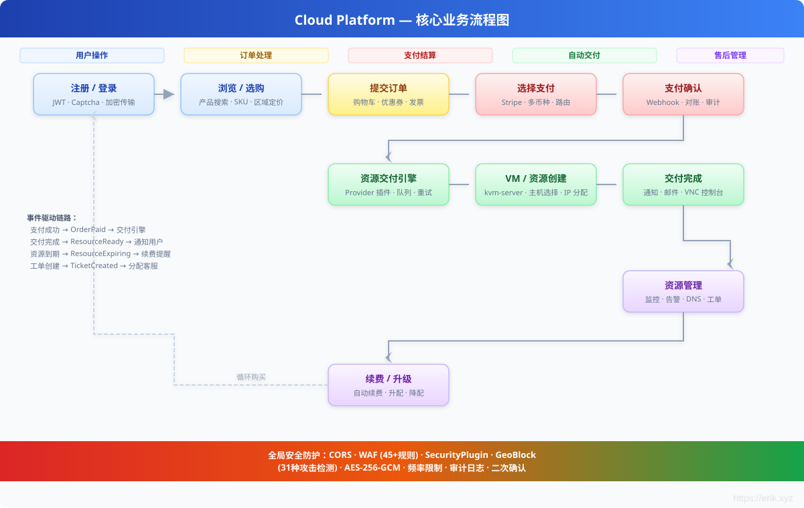
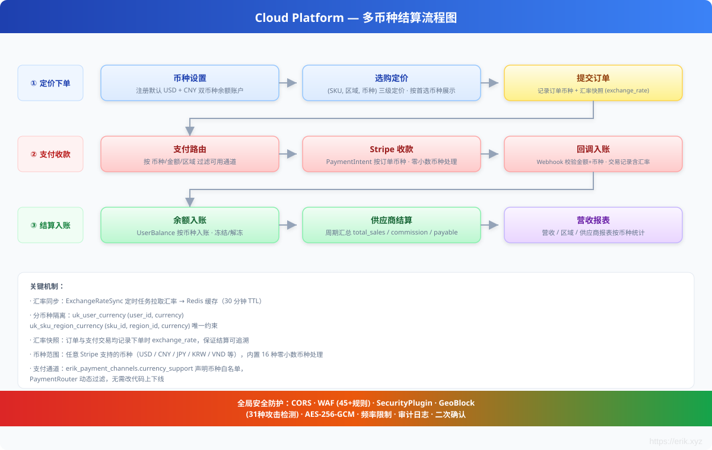

# Cloud Platform — Globale Cloud-Ressourcen-Handelsplattform

## Languages

| Language | Docs |
|----------|------|
| 简体中文 | [README.md](../../../README.md) |
| English | [README_EN.md](../../../README_EN.md) |
| English | [en docs](../../en/README.md) |
| 한국어 | [ko docs](../../ko/README.md) |
| Русский | [ru docs](../../ru/README.md) |
| Deutsch | [de docs](../../de/README.md) |
| Français | [fr docs](../../fr/README.md) |
| Español | [es docs](../../es/README.md) |
| Português | [pt docs](../../pt/README.md) |
| हिन्दी | [hi docs](../../hi/README.md) |
| العربية | [ar docs](../../ar/README.md) |
| বাংলা | [bn docs](../../bn/README.md) |
| Bahasa Indonesia | [id docs](../../id/README.md) |
| 日本語 | [ja docs](../../ja/README.md) |

<p align="center">
  
</p>

Eine Cloud-Ressourcen-Handelsplattform für globale Nutzer, die den Online-Kauf und die automatische Bereitstellung von Servern (VM), IP-Adressen, Cloud-Datenträgern, Domains, SSL-Zertifikaten, Objektspeicher (S3), CDN-Beschleunigung und weiteren Produkten unterstützt. Selbst betriebene physische Server werden über Proxmox VE virtualisiert und bereitgestellt; zusätzlich können Drittanbieter einsteigen und Produkte anbieten. Die Plattform bietet nutzungsbasierte Abrechnung, Empfehlungsprogramme, eine GraphQL-API sowie Prometheus/Grafana-Observability.

## Technologie-Stack

| Ebene | Technologie |
|------|------|
| Backend-Framework | PHP 8.2 + [webman](https://github.com/walkor/webman) (workerman) |
| Admin-Backend | [webman-admin](https://www.workerman.net/plugin/1) (Layui) |
| ORM | Illuminate/Eloquent 10.x |
| Authentifizierung | JWT HS256 ([erikwang2013/jwt-webman](https://github.com/erikwang2013/jwt-webman)) |
| Verteilte Primärschlüssel | Snowflake-ID ([erikwang2013/snowflake-php](https://github.com/erikwang2013/snowflake-php)) |
| ID-Verschleierung | Hashids ([erikwang2013/hashids](https://github.com/erikwang2013/hashids)) |
| Transportverschlüsselung | AES-256-GCM ([erikwang2013/encryption](https://github.com/erikwang2013/encryption)) |
| Feldverschlüsselung | AES-256-CBC ([erikwang2013/encryptable](https://github.com/erikwang2013/encryptable)) |
| Volltextsuche | Elasticsearch ([erikwang2013/webman-scout](https://github.com/erikwang2013/webman-scout)) |
| Länderflaggen | Unicode-Flag-Emoji ([erikwang2013/season](https://github.com/erikwang2013/season)) |
| Klick-CAPTCHA | Click CAPTCHA ([erikwang2013/poster-php](https://github.com/erikwang2013/poster-php)) |
| Sicherheit | 31 Angriffserkennungen ([erikwang2013/security-php](https://github.com/erikwang2013/security-php)) |
| Tabellenexport | PhpSpreadsheet ^2.0 |
| Zahlungs-SDK | Stripe PHP ^15.0 |
| SMS-SDK | Twilio PHP ^8.0 |
| Push-SDK | Firebase PHP ^7.0 |
| Warteschlange | webman redis-queue |
| Datenbank | MySQL 8.0 (Hauptdatenbank + Audit-Datenbank, zwei Verbindungen) |
| Suchmaschine | Elasticsearch 8.x |
| Virtualisierung | Proxmox VE (Rust kvm-server gRPC-Kanal, e-cat/etcd-Registrierung) |
| Clients | Flutter (iOS/Android/Web/Linux/macOS/Windows) + HarmonyOS ArkTS |
| GraphQL | webonyx/graphql-php ^15.0 |
| Objektspeicher | AWS S3 SDK PHP ^3.300 |
| Observability | Prometheus + Grafana (vorkonfigurierte Dashboards) |
| Mehrsprachigkeit | i18n 7 Sprachen (Chinesisch/Englisch/Japanisch/Koreanisch/Deutsch/Französisch/Spanisch) |
| Bereitstellung | Docker Compose, Ein-Klick-Start |

## Systemarchitektur


## Kern-Geschäftsprozesse

Der vollständige End-to-End-Geschäftsprozess von der Nutzerregistrierung bis zur Ressourcenbereitstellung, einschließlich Produktauswahl, Bestellung, Zahlung, automatischer Bereitstellung, After-Sales-Verwaltung und Verlängerungszyklus.



## Mehrwährungsabrechnung

Das System unterstützt nativ Preisgestaltung, Zahlung und Abrechnung in mehreren Währungen – über die gesamte Kette von der Währungseinstellung des Nutzers, regionaler Preisgestaltung, Wechselkurs-Snapshots bis hin zu Zahlungseingang, Guthabenbuchung und Anbieterabrechnung.



**1. Mehrwährungs-Guthabenkonten**

`user_balances` führt Buch pro Währung über `(user_id, currency)` (eindeutiger Index `uk_user_currency`). Bei der Registrierung werden standardmäßig zwei Währungskonten erstellt (USD + CNY); Guthaben und eingefrorenes Guthaben werden pro Währung unabhängig verwaltet und können um jede von Stripe unterstützte Währung erweitert werden.

**2. Mehrwährungs-Regionalpreise**

`product_regions` unterstützt die Preisgestaltung derselben SKU in derselben Region in mehreren Währungen (eindeutiger Index `uk_sku_region_currency`). Das Frontend zeigt Preise in der bevorzugten Währung des Nutzers an; bei der Bestellung ermittelt der `OrderService` den Preis präzise über `(sku_id, region_id, currency)`.

**3. Wechselkurssystem**

Die Scheduled Task `ExchangeRateSync` synchronisiert Wechselkurse von exchangerate-api und schreibt sie in Redis (30-Minuten-TTL-Cache). Jede Bestellung speichert den Wechselkurs-Snapshot `exchange_rate` zum Bestellzeitpunkt, sodass die spätere Abrechnung nachvollziehbar bleibt.

**4. Mehrwährungszahlung**

`payment_channels.currency_support` deklariert die von jedem Zahlungskanal unterstützten Währungs-Whitelists; `PaymentRouter` filtert verfügbare Kanäle dynamisch nach Währung / Betragsbereich / sichtbaren Regionen. Stripe PaymentIntent zieht direkt in der Bestellwährung ein; 16 Währungen ohne Dezimalstellen (JPY / KRW / VND usw.) werden hinsichtlich Nachkommastellen korrekt behandelt, und der Webhook-Callback prüft die Übereinstimmung von Betrag und Währung.

**5. Abrechnung und Berichte**

Zahlungstransaktionen (`payment_transactions`), Anbieterabrechnungen (`supplier_settlements`) und Umsatzberichte führen Währungs- und Wechselkursfelder und werden nach Währung aggregiert.

## Überblick über die Funktionsmodule

Das System ist in einer vierschichtigen Architektur organisiert: Client-Schicht (6 Plattform-Integrationen), API-Gateway-Schicht (12 Middlewares), Geschäftsserviceschicht (20+ Funktionsmodule), Infrastrukturschicht (8 Kernkomponenten).


## Ressourcen-Lebenszyklus

Eine Ressource durchläuft von der Erstellung bis zur Terminierung 6 Status, gesteuert von 8 Lebenszyklus-Ereignissen, mit Unterstützung für automatische Bereitstellung, Aussetzung/Wiederaufnahme, Ablauf-Benachrichtigung und Zerstörungs-Bereinigung.


## Dokumentations-Navigation

| Dokument | Beschreibung |
|------|------|
| [Architektur-Design](docs/architecture.md) | Systemarchitektur, Komponentenbeziehungen, Middleware-Pipeline, Sicherheitsschichten, Datenarchitektur, Bereitstellungstopologie |
| [Funktionsdesign](docs/features.md) | Detailliertes Funktionsdesign der 21 Module, mit Flussdiagrammen, Datenmodellen und Interaktionsbeschreibungen |
| [API-Referenz](docs/api-reference.md) | Vollständige Referenz mit 200+ Endpunkten, nach Modulen gruppiert, mit Anfrage-/Antwortbeispielen und Fehlercodes |
| [API-Onlinedokumentation (service)](http://localhost:8787/apidoc) | Automatisch generiert von hg/apidoc, nach Funktionen gruppiert, mit Online-Debugging |
| [API-Onlinedokumentation (admin)](http://localhost:8788/apidoc) | Automatisch generiert von hg/apidoc, 54 Controller in 13 Funktionsgruppen |
| [Admin-Backend-Design](docs/admin-design.md) | Admin-Panel-Architektur, Paketintegration, ACL-Berechtigungen, Testsuite |
| [Anbieter-API-Dokumentation](docs/supplier-api.md) | Anbieter-API-Referenz (intern + extern), SDK-Beispiele |
| [Bereitstellungs-Checkliste](docs/deployment.md) | Serverkonfiguration, Umgebungsvariablen, Nginx, HTTPS, Scheduled Tasks |
| [Review-Bericht](docs/review-report-2026-08-04.md) | Ökosystem-Erweiterungs-Review mit Statistiken, Issue-Tracking und Erweiterungsempfehlungen |
| [Versionsvergleich](docs/editions.md) | Vergleich der Funktionen, Designs und Architektur von Lite/Standard/Pro |

## Verzeichnisstruktur

```
cloud-php/
├── .claude/                    # Claude Code Konfiguration (settings / skills)
├── .github/workflows/          # CI/CD-Pipelines (Syntaxprüfung + PHPUnit beidseitig)
├── admin/                      # Admin-Backend (eigenständige webman-Instanz)
│   ├── app/                    # Plugin-Quellcode (PSR-4: app\)
│   │   ├── bootstrap/          # Prozess-Start-Bootstrap (Snowflake / Encryptable / Encryption)
│   │   ├── command/            # Konsolenbefehle (Migrate / Rollback / Status)
│   │   ├── common/             # Hilfsklassen (Auth / Tree / Layui / Util / ExcelExport / Migration)
│   │   ├── controller/         # 54 Controller-Dateien (Base / Crud-Basisklassen + CRUD der Fachbereiche)
│   │   ├── exception/          # Ausnahmebehandlung
│   │   ├── middleware/          # Zugriffskontroll-Middlewares (WafMiddleware + AccessControl)
│   │   ├── model/              # 46 Eloquent-Modelle (Base-Basisklasse mit Snowflake-PK + Encryptable)
│   │   ├── view/               # View-Templates (Layui-Admin-Panel)
│   │   └── functions.php       # Globale Hilfsfunktionen (hashids / encrypt / decrypt)
│   ├── api/                    # Öffentliche Schnittstellen (PSR-4: plugin\admin\api)
│   │   ├── Auth.php            # Authentifizierungsschnittstelle
│   │   ├── Menu.php            # Menü-Schnittstelle
│   │   ├── Install.php         # Installationsschnittstelle
│   │   └── Middleware.php      # Middleware-Schnittstelle
│   ├── config/                 # Anwendungskonfiguration
│   │   ├── plugin/erikwang2013/ # Konfiguration der 6 erikwang2013-Pakete
│   │   │   ├── snowflake-php/  # Snowflake-ID-Generierung
│   │   │   ├── hashids/        # ID-Verschleierung
│   │   │   ├── encryptable/    # Feldverschlüsselung
│   │   │   ├── encryption/     # Transportverschlüsselung
│   │   │   ├── webman-scout/   # Elasticsearch-Synchronisation
│   │   │   └── season/         # Länderflaggen
│   │   ├── route.php           # Routendefinitionen
│   │   ├── middleware.php       # Middleware-Konfiguration
│   │   ├── database.php        # Datenbankverbindungen
│   │   └── ...                 # 18 Konfigurationsdateien
│   ├── database/migrations/    # Datenbank-Migrationsdateien
│   ├── tests/                  # Unit-Tests (PHPUnit 11, 286 tests / 962 assertions)
│   │   ├── HashidsTest.php     # Hashids-Codierung/-Decodierung (21 tests)
│   │   ├── BaseJsonTest.php    # Base::json()-ID-Codierung (13 tests)
│   │   ├── CrudHashidsTest.php # Crud-Eingabe-Decodierung (14 tests)
│   │   ├── TreeTest.php        # Baumstrukturen (19 tests)
│   │   ├── AccessControlMiddlewareTest.php # RBAC-Zugriffskontrolle
│   │   ├── AdminControllersTest.php        # Controller-Regressionstests
│   │   └── support/            # Test-Hilfsklassen
│   ├── public/                 # Dokumentstamm (statische Ressourcen)
│   ├── vendor/                 # Composer-Abhängigkeiten
│   ├── .env.example            # Umgebungsvariablen-Vorlage
│   ├── composer.json           # Abhängigkeitsdeklaration
│   ├── generate.php            # Code-Generator
│   ├── phpunit.xml             # PHPUnit-Konfiguration
│   └── start.php               # Start-Einstiegspunkt
├── service/                    # Backend-Service (eigenständige webman-Instanz)
│   ├── app/                    # Geschäftsmodule (PSR-4: App\), jedes Modul mit Controller / Model / Service usw.
│   │   ├── admin/controller/   # Admin-Backend-API (15 Controller: Dashboard / User / Product / Order / Payment / Supplier / Coupon / Invoice / Domain / Webhook usw.)
│   │   ├── affiliate/          # Affiliate-Provisionen / Empfehlungsvermittlung (Controller / Listener / Model / Service)
│   │   ├── billing/            # Nutzungsabrechnung / Rechnungen (Cron / Service)
│   │   ├── captcha/controller/ # Klick-CAPTCHA
│   │   ├── cdn/                # CDN-Ressourcen-Hosting (Controller / Model / Provider / Service)
│   │   ├── command/            # Konsolenbefehle (Migrate / Rollback / Status / DbBackup)
│   │   ├── controller/         # Gemeinsame Controller (Health / Status / Help / Upload)
│   │   ├── cron/               # Scheduled Tasks (CronRunner-Scheduler + ExchangeRateSync / PaymentReconcile / SupplierSettlement / ExpirationCheck / SslCertificateCheck)
│   │   ├── domain/             # Domain-Registrierung / DNS-Verwaltung (Controller / Model / Service)
│   │   ├── graphql/            # GraphQL-API (Mutation / Query / Schema)
│   │   ├── grpc/               # kvm-server gRPC-Client + etcd-Registrierung (KvmClient / EtcdRegistry)
│   │   ├── model/              # Gemeinsame Modelle (HelpArticle / Role / Permission)
│   │   ├── monitor/            # Ressourcenüberwachung / Alarme (Controller / Cron / Model / Service)
│   │   ├── notification/       # Nachrichtenbenachrichtigungen (Controller / Model / Queue / Service)
│   │   ├── order/              # Warenkorb / Bestellungen / Gutscheine / Rechnungen (Controller / Model / Service)
│   │   ├── payment/            # Zahlungsrouting / Stripe-Kanal (Controller / Event / Model / Service)
│   │   ├── product/            # Produkte / SKUs / regionale Preise / Bewertungen (Controller / Model / Service)
│   │   ├── provisioning/       # Ressourcenbereitstellungs-Engine (Controller / Event / Listener / Model / Provider / Queue / Service)
│   │   ├── report/             # Umsatz- / Anbieter- / Regionalberichte (Controller / Service)
│   │   ├── ssl/                # SSL-Zertifikatsausstellung / -verwaltung (Controller / Model / Service)
│   │   ├── storage/            # Objektspeicher-Ressourcen (Controller / Model / Provider / Service)
│   │   ├── supplier/           # Anbieter-Onboarding / Abrechnung / Auszahlung + externe API (Controller / Model / Service)
│   │   ├── ticket/             # Ticket-System (Controller / Event / Listener / Model / Service)
│   │   ├── user/               # Nutzer / Authentifizierung / KYC / Guthaben / Adressen (Controller / Model / Service)
│   │   ├── webhook/            # Webhook-Nachrichtenwarteschlange (Queue)
│   │   └── websocket/          # WebSocket-Server + Ereignis-Listener
│   ├── common/                 # Gemeinsame Bibliothek (PSR-4: Common\)
│   │   ├── auth/middleware/     # AuthMiddleware / AdminRoleMiddleware / RbacMiddleware / RoleMiddleware / SupplierApiKeyMiddleware
│   │   ├── captcha/            # Klick-CAPTCHA-Dienst
│   │   ├── confirmation/       # Bestätigungs-Middleware (Passwort-Revalidierung)
│   │   ├── encryption/middleware/ # AES-256-GCM-Transportverschlüsselungs-Middleware
│   │   ├── hashid/middleware/   # Hashids-Middleware zur automatischen Anfrage-Decodierung + Codierungs-/Decodierungsdienst
│   │   ├── helper/             # Response-Formatierung (automatische hashid-Codierung)
│   │   ├── http/               # HTTP-Client-Tools (ApiRequest)
│   │   ├── i18n/middleware/     # Mehrsprachigkeits-Middleware (Locale)
│   │   ├── security/           # CORS / WAF / Rate-Limiting / Geo-Sperre / Wartungsmodus / Audit-Protokolle
│   │   ├── snowflake/          # Snowflake-ID-Dienst / Eloquent HasSnowflakeId Trait
│   │   ├── version/middleware/  # API-Versions-Middleware (X-Api-Version-Header-Prüfung)
│   │   ├── clientplatform/middleware/  # Client-Plattform-Middleware (X-Client-Platform-Header-Erkennung)
│   │   ├── feature/            # Feature-Flags-Dienst
│   │   └── webhook/            # Webhook-Ereignisverteiler
│   ├── config/                 # 17 Konfigurationsdateien (route / middleware / database / redis / cron / auth / security / i18n / ...)
│   │   └── plugin/             # Plugin-Konfiguration
│   │       ├── erikwang2013/   # encryptable / hashids / jwt / poster / season / webman-scout
│   │       └── webman/         # event / redis-queue
│   ├── database/migrations/    # Datenbank-Migrationsdateien (37 Migrationen)
│   ├── i18n/                   # Mehrsprachige Ressourcen (en-US / zh-CN)
│   ├── support/                # Bootstrap (Eloquent / Redis / Event / Encryption / Snowflake / Hashids / Scout / MigrationRunner)
│   ├── tests/                  # Unit-Tests (PHPUnit 10, 672 tests / 1632 assertions)
│   │   ├── admin/              # ImportExport / SupplierWithdrawApprove
│   │   ├── affiliate/          # AffiliateService
│   │   ├── auth/               # JwtAuth / RbacSeed / Rbac
│   │   ├── billing/            # MeterCollector / UsageAggregator / SuspendCheck
│   │   ├── captcha/            # CaptchaService
│   │   ├── cdn/                # ResourceCdn
│   │   ├── clientplatform/     # ClientPlatformMiddleware
│   │   ├── common/             # Response / Hashid / Snowflake / Validator / LogSanitizer / Totp / ApiRequest
│   │   ├── confirmation/       # ConfirmationMiddleware
│   │   ├── cron/               # SupplierSettlement
│   │   ├── domain/             # DomainService / DomainTransfer
│   │   ├── graphql/            # Schema
│   │   ├── grpc/               # KvmClient / EtcdRegistry
│   │   ├── monitor/            # AlertEngine
│   │   ├── notification/       # NotificationDispatcher
│   │   ├── order/              # Coupon / Invoice
│   │   ├── payment/            # StripeChannel / PaymentRouter
│   │   ├── product/            # ProductService / Search / ReviewStatus
│   │   ├── provisioning/       # ProviderFactory / RetryLogic
│   │   ├── report/             # ReportService
│   │   ├── security/           # RateLimit / Maintenance / UploadSecurity
│   │   ├── ssl/                # SslCertificate
│   │   ├── storage/            # StorageBucket
│   │   ├── supplier/           # SupplierService / Settlement / Rating / Webhook
│   │   ├── ticket/             # TicketUpdatedWiring
│   │   ├── user/               # AddressController
│   │   ├── version/            # VersionMiddleware
│   │   ├── webhook/            # WebhookDispatcher / WebhookE2E
│   │   ├── websocket/          # WebSocketAuth / EventsWiring
│   │   ├── support/            # RequestMock
│   │   ├── bootstrap.php       # Test-Bootstrap
│   │   └── TestCase.php        # Test-Basisklasse
│   ├── runtime/                # Laufzeitdateien (Logs / Cache)
│   ├── vendor/                 # Composer-Abhängigkeiten
│   ├── .env.example            # Umgebungsvariablen-Vorlage
│   ├── .env                    # Lokale Umgebungsvariablen (gitignore)
│   ├── composer.json           # Abhängigkeitsdeklaration
│   ├── phpunit.xml             # PHPUnit-Konfiguration
│   └── start.php               # Start-Einstiegspunkt
├── apps/
│   ├── flutter/                # Flutter-Client (iOS / macOS / Windows / Linux / Web)
│   │   ├── lib/                # Dart-Quellcode (core / features)
│   │   ├── ios/                # iOS-Projekt
│   │   ├── macos/              # macOS-Projekt
│   │   ├── windows/            # Windows-Projekt
│   │   ├── linux/              # Linux-Projekt
│   │   ├── web/                # Web-Projekt
│   │   ├── test/               # Flutter-Tests
│   │   ├── pubspec.yaml        # Abhängigkeitsdeklaration
│   │   └── analysis_options.yaml # Dart-Statikanalyse-Konfiguration
│   └── harmonyos/              # HarmonyOS-Client-Skelett
│       └── entry/src/          # ArkTS-Quellcode
├── docker/                     # Docker-Bereitstellung
│   ├── Dockerfile              # PHP-8.2-Image
│   ├── docker-compose.yml      # Service-Orchestrierung
│   ├── nginx.conf              # Nginx-Konfiguration
│   └── supervisor.conf         # Supervisor-Prozessüberwachung
├── infrastructure/             # Rust-Infrastruktur (e-cat workspace)
│   ├── kvm-server/             # Eigener Cloud-Dienst: VM-Bereitstellungs-gRPC-Dienst (:50051, etcd-Registrierung)
│   │   ├── src/                # main / grpc / driver (Simulationstreiber, libvirt in Phase 2)
│   │   ├── tests/              # Integrationstests
│   │   └── Cargo.toml          # e-cat workspace-Mitgliedsdeklaration
│   └── ecat-*/                 # e-cat-Infrastruktur-Crates (transport-grpc / registry-etcd / protos / config / data usw.)
├── docs/                       # Dokumentation
│   ├── admin-design.md         # Admin-Backend-Design-Dokument
│   ├── supplier-api.md         # Anbieter-API-Dokumentation
│   ├── deployment.md           # Bereitstellungs-Checkliste
│   ├── api-test.sh             # API-Smoke-Test-Skript
│   ├── database.sql            # Datenbank-DDL
│   ├── alipay.png / weixinpay.png  # Spenden-QR-Codes
│   ├── diagrams/               # 18 SVG-Architekturdiagramme (Systemarchitektur / Sicherheitspipeline / ER-Diagramm / Geschäftsprozesse / Mehrwährungsabrechnung usw.)
│   ├── test-reports/           # Testberichte (PHPUnit / Rust / API / UI + Seiten-Screenshots)
│   └── superpowers/            # Design-Spezifikationen und Umsetzungspläne
│       ├── specs/              # Systemdesign-Spezifikationsdokumente
│       └── plans/              # Phase-0-3-stufenweise Umsetzungspläne
├── scripts/                     # Betriebsskripte (push-release.sh: Release-Regeln mit Versionsinkrement + Tag)
├── tests/k6/                    # k6-Lasttest-Skripte (Smoke / Produkt / Parallelität)
├── install.php                 # Einstiegspunkt des Ein-Klick-Installationsassistenten
├── install/                    # Installationsassistent-Seite
│   └── index.php               # Assistenten-Web-App
├── install.sql                 # Einheitliche Datenbank-DDL (46 Tabellen)
├── .gitignore
├── README.md                   # Projektbeschreibung (Chinesisch)
└── README_EN.md                # Projektbeschreibung (Englisch)
```

## Schnellstart

### Systemanforderungen

- PHP 8.2+ (ext-json, ext-pdo, ext-pdo_mysql, ext-redis, ext-openssl)
- MySQL 8.0
- Redis 7

### Ein-Klick-Installation (empfohlen)

Das Projekt bietet einen Web-Installationsassistenten, über den die gesamte Konfiguration im Browser erledigt werden kann:

```bash
# 1. Abhängigkeiten installieren
cd service && composer install && cd ../admin && composer install && cd ..

# 2. Installationsassistent starten
php install.php
# Browser öffnen und http://localhost:8888 aufrufen

# 3. Den Anweisungen des Assistenten folgen:
#    - Umgebungsprüfung
#    - Datenbankkonfiguration (Host, Port, Datenbankname, Benutzername, Passwort)
#    - Admin-Kontoeinstellungen (Benutzername, Passwort, E-Mail)
#    - Ein-Klick-Installation (Tabellen erstellen + Konfiguration schreiben)
```

Nach der Installation führt der Assistent automatisch Folgendes aus:
- Erstellt alle 46 Datenbanktabellen (wa_*-Verwaltungstabellen + geschäftliche Tabellen ohne Präfix)
- Erstellt Superadministrator-Rolle und -Konto
- Generiert die Konfigurationsdateien `service/.env` und `admin/.env` (einschließlich automatisch generierter JWT-/Verschlüsselungsschlüssel)

### Manuelle Installation

```bash
cd service

# 1. Abhängigkeiten installieren
composer install

# 2. Umgebungsvariablen konfigurieren
cp .env.example .env
# .env bearbeiten und Datenbankpasswort, JWT-Schlüssel, Verschlüsselungsschlüssel usw. eintragen
# ENCRYPTION_MASTER_KEY generieren: openssl rand -base64 32
# ENCRYPTION_KEY generieren: echo -n "$(openssl rand -base64 16)" | base64 -w0
# JWT_SECRET_KEY generieren: openssl rand -base64 32

# 3. Datenbank erstellen und importieren
mysql -u root -p -e "CREATE DATABASE cloud_platform CHARACTER SET utf8mb4 COLLATE utf8mb4_unicode_ci;"
mysql -u root -p cloud_platform < ../install.sql

# 4. Dienst starten (Entwicklungsmodus)
php start.php start
# http://localhost:8787 aufrufen
```

### Docker-Bereitstellung

```bash
# Vom Projektstamm aus
cp service/.env.example .env
# .env bearbeiten und die jeweiligen Schlüssel eintragen

docker compose -f docker/docker-compose.yml up -d
# API: http://localhost
```

### Admin-Backend

```bash
cd admin

# 1. Abhängigkeiten installieren
composer install

# 2. Umgebungsvariablen konfigurieren
cp .env.example .env
# Bei Verwendung des Ein-Klick-Installationsassistenten wurde diese Datei bereits automatisch generiert

# 3. Dienst starten (Entwicklungsmodus)
php start.php start
# http://localhost:8787/app/admin aufrufen
```

### Daemon-Modus

```bash
php start.php start -d          # Starten
php start.php status            # Status anzeigen
php start.php restart           # Neustarten
php start.php stop              # Stoppen
```

## API-Überblick

Die Schnittstellen sind nach Modulen gruppiert und enthalten Anfrage-/Antwortbeispiele und Fehlercodes: [API-Überblick](docs/api-overview.md) (Auswahl) · [API-Referenz](docs/api-reference.md) (vollständige Referenz mit 200+ Endpunkten) · [Online-Debugging](http://localhost:8787/apidoc)

## Admin-Backend-Architektur

### Technische Integration

Das Admin-Backend ist eine eigenständige webman-Instanz, die 7 erikwang2013-Pakete integriert:

| Paket | Zweck | Implementierung |
|---|------|---------|
| snowflake-php | 64-Bit-verteilte Primärschlüssel | Automatische Generierung über das `Base::boot()`-creating-Ereignis |
| hashids | API-ID-Verschleierung | `Base::json()`-Response-Codierung, `Crud::selectInput/updateInput/deleteInput`-Anfrage-Decodierung |
| encryptable | Datenbank-Feldverschlüsselung | Eloquent-`Encryptable`-Cast, transparente Ver-/Entschlüsselung bei Admin (password/email/mobile) und User (6 Felder) |
| encryption | API-Transportverschlüsselung | Reservierte Hilfsfunktionen `encrypt_data()`/`decrypt_data()` |
| webman-scout | ES-Volltextsuche | `Searchable`-Trait des User-Modells, automatische Index-Synchronisation |
| season | Länderflaggen-Emoji | Globale Hilfsfunktion `country_season_flag()` |
| poster-php | Klick-CAPTCHA | `CaptchaPlugin`-Bootstrap, globale Funktionen `captcha_create()`/`captcha_verify()` |

### Sicherheitsschichten

```
Anfrage → Hashids-Decodierung (Crud::selectInput/updateInput/deleteInput)
  → ACL-Authentifizierung (api/Auth.php, Controller noNeedLogin/noNeedAuth)
  → Geschäftsverarbeitung (CRUD / Model-Ereignisse)
  → Encryptable-Feldverschlüsselung (Eloquent-Casts-set)
  → Datenbankschreiben
Response ← Hashids-Codierung (Base::json → hashids_encode_ids)

Login/Registrierung: Captcha-Prüfung → Auth → Geschäftsverarbeitung
```

### Datenfluss

- **Schreibpfad**: Anfrage-ID (hashid) → Decodierung in int → CRUD-Operation → Snowflake generiert neue ID → Encryptable verschlüsselt sensible Felder → DB
- **Lesepfad**: DB → Encryptable-Entschlüsselung → Hashids-ID-Codierung → JSON-Response

### Testabdeckung

```
phpunit.xml (PHPUnit 11, 286 tests / 962 assertions)
├── HashidsTest              (21 tests) encode/decode/encode_ids
├── BaseJsonTest             (13 tests) Base::json/success/fail-Codierung
├── CrudHashidsTest          (14 tests) Crud-Eingabe-Decodierung (select/update/delete)
├── TreeTest                 (19 tests) Baumstrukturen / Nachkommen / Vorfahren / verwaiste Knoten
├── AccessControlMiddlewareTest (7 tests) Nicht eingeloggt 401 / 403-Seite / Durchreichen
├── AdminControllersTest     (data provider) 48 Controller-Assembly / CRUD-Oberflächen / GET-View-Pfade
├── UtilTest                 (17 tests) Passwörter / Zeit / Bytes / Eingabefilter / Widget-Attribute
├── DictTest                 (5 tests) Wörterbuchname↔option-Konvertierung / save/get/delete
├── ExcelExportTest          (4 tests) Tabellenkopf / JSON-Flattening / Zeilennummern / leere Zellen
└── LayuiTest                (5 tests) input / inputNumber / label-Escaping / switch / html
```

## Design-Ansatz

### 1. Modulare Monolith

Module werden vertikal nach Fachbereichen aufgeteilt (User / Product / Order / Payment / Provisioning / Ticket / Notification usw.); innerhalb jedes Moduls gilt eine MVC-Schichtung:

- **Controller** — HTTP-Schicht, Parameterprüfung, Service-Aufruf, Response-Rückgabe
- **Service** — Geschäftslogik, keine HTTP-Abhängigkeiten, wiederverwendbar durch Controller und Queue-Worker
- **Model** — Eloquent-Datenmodell, definiert Beziehungen und Query-Scopes

Module werden über **Ereignisse** und **Schnittstellen** entkoppelt und rufen die Services anderer Module nicht direkt auf. Beispiel: Zahlung abgeschlossen → `OrderPaid`-Ereignis → `ProvisioningService` stellt Ressourcen automatisch bereit; Ticket erstellt → `TicketCreated`-Ereignis → automatische Zuweisung an Support.

### 2. Ereignisgesteuerte Bereitstellung

```
Nutzer bestellt → Zahlung erfolgreich → OrderPaid-Ereignis
  → ProvisioningService.handleOrderPaid()
    → für jedes OrderItem wird ein ProvisionTask erstellt (status=pending)
    → Redis-Queue-Consumer ProvisionWorker
      → ProviderFactory.create(task) löst Provider auf
      → ProxmoxProvider.create()
        → HostSelector wählt den freiesten physischen Server
        → ProxmoxApi erstellt VM / hängt Datenträger an / weist IP zu
          (Der Rust-kvm-server-gRPC-Bereitstellungsdienst ist integriert:
           e-cat/etcd-Registrierung und Discovery, PHP-seitig mit KvmClient verbunden;
           Simulationstreiber, echter libvirt-Treiber in Phase 2)
        → erstellt Resource / Disk-Datensätze
      → aktualisiert Bestellstatus auf completed
```

Bei fehlgeschlagener Bereitstellung wird automatisch wiederholt; Backoff-Strategie: 1min → 5min → 15min → 1h → 6h → 24h. Nach mehr als 6 Versuchen wird der Vorgang als fehlgeschlagen markiert und ein Alarm ausgelöst.

### 3. Provider-Plug-in-Architektur

Die Ressourcenbereitstellung wird über `ProviderInterface` abstrahiert; verschiedene Infrastrukturen implementieren dieselbe Schnittstelle:

```
ProviderInterface
  ├── ProxmoxProvider    (eigenes Proxmox VE)
  ├── AliyunProvider     (Zukunft: Alibaba Cloud)
  ├── AwsProvider        (Zukunft: AWS EC2)
  └── DomainProvider     (Zukunft: Domain-Registrar)
```

`ProviderFactory` registriert Factory-Funktionen unter dem Schlüssel `productType:provider` und löst zur Laufzeit dynamisch anhand des ProvisionTask auf.

### 4. Multi-Payment-Routing

`PaymentRouter` liefert dynamisch verfügbare Zahlungskanäle basierend auf Bestellbetrag / Währung / Region; das Frontend wechselt den Kanal und startet die Zahlung. Zahlungskanäle werden über die Tabelle `PaymentChannel` konfiguriert (Gebühren, Mindest-/Höchstbeträge, sichtbare Regionen) und können ohne Codeänderung aktiviert bzw. deaktiviert werden.

### 5. Sicherheitsarchitektur

Globale Middleware-Kette: `Version → CORS → SecurityHeaders → ClientPlatform → GeoBlock → WAF → SecurityPlugin → RateLimit → Locale → Metrics → HashidRequest → Maintenance → [Route: Encryption → Captcha → Auth → Confirmation]`


- **CORS** — Verarbeitung von Cross-Origin-Anfrage-Headern (Whitelist-Modus, unterstützt *.example.com-Wildcards)
- **SecurityHeaders** — Sichere Response-Header (HSTS / X-Frame-Options / X-Content-Type-Options / Referrer-Policy / Permissions-Policy)
- **GeoBlock** — Geografische Sperre (blockiert Länder gemäß GEO_BLOCKED_COUNTRIES, basierend auf GeoIP2)
- **WAF** — 8 Kategorien mit 45+ Regeln (SQL-Injection/XSS/Command-Injection/File Inclusion/Header-Injection/SSRF/NoSQL-Injection/Open Redirect) + Anfragegrößenbegrenzung + Content-Type-Prüfung (Wert-Injection scannt query/body/UA, path prüft nur Path-Traversal)
- **Security Plugin** — 31 Angriffserkennungen (XSS/SQL-Injection/Command-Injection/SSRF/Deserialisierung/JWT-Angriffe/Host-Header-Angriffe/Request-Smuggling/GraphQL-Injection/Leak sensibler Daten usw.), IP-Whitelist + automatische IP-Blacklist-Sperrung
- **Locale** — Parsen von Accept-Language, Einstellung der Sprache
- **HashidRequest** — automatische Decodierung von hashid-Strings in Anfragen in echte Integer-IDs
- **Version** — prüft den `X-Api-Version`-Header; fehlt er, gilt standardmäßig `v1`; nicht unterstützte Versionen liefern `400`
- **ClientPlatform** — prüft den `X-Client-Platform`-Header und erkennt die Client-Plattform (iPadOS/macOS/Windows/Linux/iOS/Android/HarmonyOS/Web)
- **Encryption** — AES-256-GCM-Transportverschlüsselung (Authentifizierungs-APIs und Admin-Backend), schützt vor Man-in-the-Middle-Abhören und Manipulation
- **Captcha** — Klick-CAPTCHA, Prüfung vor Login/Registrierung (GD-Zeichnung + Redis-Speicherung, Einmal-Schlüssel, 300s gültig, 3 Versuchsversuche)
- **Auth** — JWT-HS256-Authentifizierung, Access Token 15 Minuten, Refresh Token 30 Tage, Redis-Blacklist
- **Confirmation** — Bei sensiblen Operationen (Zahlung/Löschung/Rückerstattung/Genehmigung usw.) ist die erneute Eingabe des Passworts erforderlich; 5 Fehlversuche sperren für 15 Minuten
- **Rate-Limiting** — Standard 60/min, Login 5/min, Registrierung 3/min, Zahlung 10/min
- **Audit-Protokoll** — Alle sensiblen Operationen werden in die separate Audit-Datenbank geschrieben

### 6. Datensicherheit

**Mehrschichtige Verschlüsselungsstrategie:**

| Ebene | Technologie | Beschreibung |
|------|------|------|
| Transport | AES-256-GCM | Verschlüsselung von API-Anfrage-/Antworttexten; GCM-authentifizierte Verschlüsselung verhindert Manipulation |
| Feld | AES-256-CBC | Automatische Ver-/Entschlüsselung sensibler Modellfelder; CBC mit zufälligem IV verhindert Muster-Leaks |
| Primärschlüssel | Hashids | Externe IDs werden als 12-stellige Strings verschleiert und verbergen die tatsächliche Datengröße |

**Verschlüsselung sensibler Felder:** 14 Felder in 7 Modellen verwenden `Encryptable::class` zur automatischen Ver-/Entschlüsselung — `User(email, phone, password_hash)`, `UserKyc(id_number, real_name)`, `UserAddress(phone, address)`, `Supplier(contact_name, phone, email)`, `HostMachine(api_token)`, `PaymentChannel(api_key, webhook_secret)`, `RefreshToken(token_hash, device_fingerprint)`.

**Schlüsselverwaltung:** Transport- und Feldverschlüsselung verwenden separate, unabhängige Schlüssel (`ENCRYPTION_MASTER_KEY` vs. `ENCRYPTION_KEY`); über eine Liste alter Schlüssel (`ENCRYPTION_PREVIOUS_KEYS`) ist eine Schlüsselrotation ohne Ausfallzeit möglich.

### 7. Verteilte ID-Generierung

Der Twitter-Snowflake-Algorithmus erzeugt 64-Bit-global-eindeutige IDs: `timestamp(41b) | datacenter(5b) | worker(5b) | sequence(12b)`. Alle 46 Eloquent-Modelle generieren im `creating`-Ereignis automatisch Snowflake-IDs — ohne Datenbank-Autoincrement-Abhängigkeit und nativ shardingfähig.

### 8. Mehrsprachigkeit (i18n)

**Automatische Auflösung über die globale Middleware:**
- `LocaleMiddleware` liest den `Accept-Language`-Header und setzt die Sprache automatisch
- Sprach-Fallback: nicht unterstützte Sprache → `fallback_locale` (en-US)

**Statische Textübersetzungen:**
- `I18n::trans('auth.login_success')` → `登录成功` / `Login successful`
- Übersetzungsdateien: `i18n/{locale}/messages.php`, 120 Einträge, decken alle 15 Module ab
- Parameter-Substitution: `I18n::trans('validation.required', ['field' => '邮箱'])`

**JSON-Mehrsprachigkeitsfelder:**
- Produktname/-beschreibung werden als `{"zh-CN":"云服务器","en-US":"Cloud Server"}` gespeichert
- `I18n::translateField($json)` wählt den Wert automatisch anhand der aktuellen Sprache
- Benachrichtigungsvorlagen sind ebenfalls mehrsprachig und werden in der bevorzugten Sprache des Nutzers zugestellt

### 9. Volltextsuche

Die 4 Modelle Produkt, Nutzer, Bestellung und Ticket sind über das `Erikwang2013\WebmanScout\Searchable`-Trait an die Suche angebunden. Standardtreiber ist `database` (Schreiben als no-op, Suche über SQL-LIKE-Degradation, ohne ES-Abhängigkeit); nach Konfiguration des Elasticsearch-Treibers wird der Index automatisch synchronisiert. Unterstützt:

- **Mehrsprachige Tokenisierung** — IK Analyzer (ik_max_word / ik_smart)
- **Chinesische Volltextsuche** — Produktnamen, Beschreibungen, Ticket-Titel
- **Präzise Filterung** — nach Status, Kategorie, Preisbereich, Zeitraum
- **Batch-Synchronisation** — `php webman scout:import "App\Product\Model\Product"`
- **Suchbeispiel** — `Product::search('VPS服务器')->where('status', 'published')->get()`

### 10. Länderflaggen

Über `erikwang2013/season` wird länderübergreifende Flag-Emoji-Unterstützung bereitgestellt:

- `country_season_flag('CN')` → 🇨🇳, `country_season_flag('JP')` → 🇯🇵
- Automatische Erkennung der Erdhalbkugel und Rückgabe der passenden Jahreszeit (Chinesisch/Englisch)
- Lokalisierte Jahreszeitennamen in 30+ Sprachen
- Direkt nutzbar in der Regionalauswahl des Frontends, bei der Anzeige der Nutzerstaatangehörigkeit usw.

## Offene Punkte (TODO)

- [x] Datenbank-DDL (`install.sql`, 46 Tabellen, wa_*-Verwaltungstabellen + geschäftliche Tabellen ohne Präfix, BigInt-Primärschlüssel ohne Autoincrement)
- [x] Snowflake-ID-Generierung (`erikwang2013/snowflake-php`)
- [x] JWT-Authentifizierung (`erikwang2013/jwt-webman`, HS256 + Redis-Blacklist)
- [x] API-ID-Verschleierung (`erikwang2013/hashids`, automatische Anfrage-Decodierung + Response-Codierung)
- [x] Transportverschlüsselung (`erikwang2013/encryption`, AES-256-GCM-Middleware)
- [x] Feldverschlüsselung (`erikwang2013/encryptable`, automatische Ver-/Entschlüsselung sensibler Felder)
- [x] Volltextsuche (`erikwang2013/webman-scout`, Standard-database-Treiber mit SQL-LIKE-Degradation, optional Elasticsearch + IK-Tokenisierung)
- [x] Länderflaggen (`erikwang2013/season`, Unicode-Flag-Emoji)
- [x] Admin-Backend (`admin/`, webman-admin + 7-Paket-Integration, 286 Unit-Tests)
- [x] Code-Review (2 kritische + 4 wichtige Fixes angewendet)
- [x] Excel-Export (PhpSpreadsheet ^2.0, Admin-Crud/Table + serverseitige Verwaltungs-API)
- [x] Dashboard-Visualisierung (ECharts-Diagramme + animierte Statistik-Karten + Systeminformations-Panel)
- [x] PDF-Export (html2canvas + jsPDF, Dashboard-Screenshot-Export)
- [x] Datenbank-Migrationsskripte (`install.sql` als einheitliche DDL, `php webman migrate`-Befehl)
- [x] Stripe-Echtintegration (stripe-php-SDK, PaymentIntent + Webhook-Signaturprüfung)
- [x] Twilio-SMS-Echtintegration (twilio/sdk, einschließlich Fehlerbehandlung beim Senden)
- [x] FCM-Push-Echtintegration (kreait/firebase-php, einschließlich Bereinigung ungültiger Token)
- [x] Klick-CAPTCHA (erikwang2013/poster-php, Verifikation bei Login/Registrierung/sensiblen Operationen)
- [x] Sekundärbestätigung (ConfirmationMiddleware, Passwort-Revalidierung bei sensiblen Operationen, 5 Fehlversuche sperren 15 Minuten)
- [x] Serverseitige Unit-Tests (672 tests / 1632 assertions, 15 skipped)
- [x] Client-Plattform-Erkennung (ClientPlatformMiddleware, X-Client-Platform-Header unterstützt 8 Plattformen)
- [x] WAF-Sicherheitserweiterung (8 Kategorien mit 45+ Regeln: SQL-Injection/XSS/Command-Injection/File Inclusion/Header-Injection/SSRF/NoSQL-Injection/Open Redirect + Anfragegrößenbegrenzung + Content-Type-Prüfung)
- [x] Security Plugin (erikwang2013/security-php, 31 Angriffserkennungen + automatische IP-Blacklist-Sperrung + Log-Rotation)
- [x] Admin-Panel-WAF-Middleware
- [x] MySQL-Lese-/Schreibtrennung (Eloquent read/write-Verbindungen + sticky)
- [x] Redis-Mehrstufen-Cache-Schicht (CacheService: Produkt/Region/Wechselkurs/TLD/Nutzer, TTL + aktive Invalidierung + Warmup)
- [x] Nginx-Response-Komprimierung + Verbindungsoptimierung (gzip/proxy_buffering/keep-alive/limit_req+limit_conn)
- [x] Datenbank-Indexempfehlungen (13 empfohlene zusammengesetzte/abdeckende Indizes)
- [x] Sentry-Fehlerüberwachung (SentryBootstrap + before_send-Anonymisierungs-Callback)
- [x] Feature-Flags (dynamisches Redis-Override + Admin-Backend-API)
- [x] Externe Anbieter-API (API-Key-Authentifizierung + Bestell-/Ressourcen-/Abrechnungs-/Auszahlungs-Endpunkte)
- [x] WebSocket-Echtzeit-Push (nativer Workerman-WebSocket + Bestell-/Ticket-Ereignis-Listener)
- [x] k6-Lasttest-Skripte (Smoke / Produkt / Parallelitäts-Belastungstests)
- [x] CI/CD-Pipelines (GitHub Actions, Syntaxprüfung + PHPUnit beidseitig + Composer-Prüfung)
- [x] Ein-Klick-Installationsassistent (Web-UI, Umgebungsprüfung + Datenbankkonfiguration + Administratorerstellung + automatisch generierte .env)

## Open Source braucht Unterstützung

| WeChat | Alipay |
|:---:|:---:|
|  |  |

### Globaler Banktransfer (Überweisung)

**Empfängerinformationen**

- Empfängername: WANG KEXUN
- Empfängerkontonummer: 881015918251

**Empfängerbank (ZA Bank)**

- SWIFT Code: AABLHKHHXXX
- Bankname: ZA Bank Limited
- Bankleitzahl: 387
- Bankadresse: Core F, Cyberport 3, 100 Cyberport Road, Hong Kong

**Korrespondenzbank für grenzüberschreitende Überweisungen (falls erforderlich)**

> Bitte beachten Sie: Hierbei handelt es sich um die Korrespondenzbank (Zwischenbank) für grenzüberschreitende Überweisungen, nicht um die Empfängerbank. Fragen Sie bei Ihrer überweisenden Bank nach, ob Angaben zur Korrespondenzbank erforderlich sind.

- Für Überweisungen in Hongkong-Dollar, Renminbi und US-Dollar ist die Korrespondenzbank **Citibank**:
  - Bankname: Citibank N.A. Hong Kong
  - SWIFT Code: CITIHKHXXXX
  - Bankleitzahl: 006
  - Filialname: Hong Kong Branch
  - Filialnummer: 391
  - Bankadresse: Citibank Tower, Citibank Plaza, 3 Garden Road, Central, Hong Kong
- Für Überweisungen in anderen Währungen ist die Korrespondenzbank **BNY Mellon**:
  - Bankname: THE BANK OF NEW YORK MELLON
  - SWIFT Code: IRVTUS3NXXX
  - Bankadresse: THE BANK OF NEW YORK MELLON, 240 GREENWICH STREET, NEW YORK, United States

---

## License

Lite — MIT License | Standard/Pro — Proprietary
