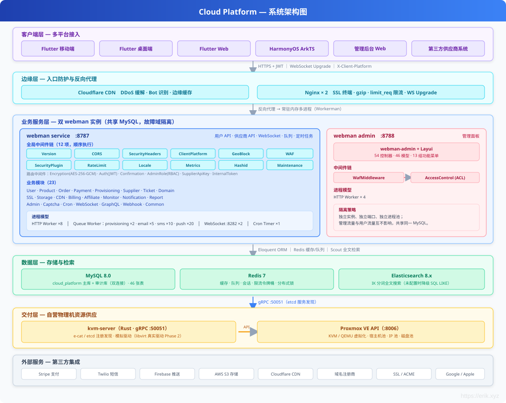

# Cloud Platform — Global Cloud Resource Trading Platform

## Languages

| Language | Docs |
|----------|------|
| 简体中文 | [README.md](../../../README.md) |
| English | [README_EN.md](../../../README_EN.md) |
| English | [en docs](../../en/README.md) |
| 한국어 | [ko docs](../../ko/README.md) |
| Русский | [ru docs](../../ru/README.md) |
| Deutsch | [de docs](../../de/README.md) |
| Français | [fr docs](../../fr/README.md) |
| Español | [es docs](../../es/README.md) |
| Português | [pt docs](../../pt/README.md) |
| हिन्दी | [hi docs](../../hi/README.md) |
| العربية | [ar docs](../../ar/README.md) |
| বাংলা | [bn docs](../../bn/README.md) |
| Bahasa Indonesia | [id docs](../../id/README.md) |
| 日本語 | [ja docs](../../ja/README.md) |

<p align="center">
  
</p>

A cloud resource trading platform for global users, supporting online purchase and automatic delivery of servers (VM), IP addresses, cloud disks, domains, SSL certificates, object storage (S3), CDN acceleration and other products. Self-operated physical machines are delivered through Proxmox VE virtualization, while third-party suppliers can also onboard and sell. It provides usage-based billing, referral distribution, a GraphQL API, and Prometheus/Grafana observability.

## Tech Stack

| Layer | Technology |
|------|------|
| Backend framework | PHP 8.2 + [webman](https://github.com/walkor/webman) (workerman) |
| Admin panel | [webman-admin](https://www.workerman.net/plugin/1) (Layui) |
| ORM | Illuminate/Eloquent 10.x |
| Authentication | JWT HS256 ([erikwang2013/jwt-webman](https://github.com/erikwang2013/jwt-webman)) |
| Distributed primary keys | Snowflake ([erikwang2013/snowflake-php](https://github.com/erikwang2013/snowflake-php)) |
| ID obfuscation | Hashids ([erikwang2013/hashids](https://github.com/erikwang2013/hashids)) |
| Transport encryption | AES-256-GCM ([erikwang2013/encryption](https://github.com/erikwang2013/encryption)) |
| Field encryption | AES-256-CBC ([erikwang2013/encryptable](https://github.com/erikwang2013/encryptable)) |
| Full-text search | Elasticsearch ([erikwang2013/webman-scout](https://github.com/erikwang2013/webman-scout)) |
| Country flags | Unicode Flag Emoji ([erikwang2013/season](https://github.com/erikwang2013/season)) |
| Click CAPTCHA | Click CAPTCHA ([erikwang2013/poster-php](https://github.com/erikwang2013/poster-php)) |
| Security protection | 31 attack detections ([erikwang2013/security-php](https://github.com/erikwang2013/security-php)) |
| Table export | PhpSpreadsheet ^2.0 |
| Payment SDK | Stripe PHP ^15.0 |
| SMS SDK | Twilio PHP ^8.0 |
| Push SDK | Firebase PHP ^7.0 |
| Queue | webman redis-queue |
| Database | MySQL 8.0 (dual connections: primary + audit DB) |
| Search engine | Elasticsearch 8.x |
| Virtualization | Proxmox VE (Rust kvm-server gRPC channel, e-cat/etcd registration) |
| Clients | Flutter (iOS/Android/Web/Linux/macOS/Windows) + HarmonyOS ArkTS |
| GraphQL | webonyx/graphql-php ^15.0 |
| Object storage | AWS S3 SDK PHP ^3.300 |
| Observability | Prometheus + Grafana (pre-built dashboards) |
| Multilingual | i18n 7 languages (Chinese/English/Japanese/Korean/German/French/Spanish) |
| Deployment | Docker Compose one-click startup |

## System Architecture



## Core Business Flow

Complete end-to-end business flow from user registration to resource delivery, covering selection, ordering, payment, automatic delivery, after-sales management and renewal cycles.


## Multi-Currency Settlement

The system natively supports multi-currency pricing, payment and settlement, covering the full chain from user currency settings, regional pricing, exchange rate snapshots to payment collection, balance crediting and supplier settlement.


**1. Multi-Currency Balance Accounts**

`user_balances` keeps per-currency ledger records by `(user_id, currency)` (unique index `uk_user_currency`). On registration, USD + CNY accounts are created by default; balance and frozen balance are managed independently per currency and can be extended to any currency supported by Stripe.

**2. Multi-Currency Regional Pricing**

`product_regions` supports pricing the same SKU in multiple currencies within the same region (unique index `uk_sku_region_currency`). The frontend displays prices in the user's preferred currency; when placing an order, `OrderService` fetches the exact price by `(sku_id, region_id, currency)`.

**3. Exchange Rate System**

The `ExchangeRateSync` cron job syncs exchange rates from exchangerate-api and writes them to Redis (30-minute TTL cache). Every order records the `exchange_rate` snapshot at order time, so later settlements remain traceable.

**4. Multi-Currency Payment**

`payment_channels.currency_support` declares the whitelist of currencies supported by each payment channel, and `PaymentRouter` dynamically filters available channels by currency / amount range / visible regions. Stripe PaymentIntent collects payment directly in the order currency, with built-in decimal handling for 16 zero-decimal currencies (JPY / KRW / VND etc.); webhook callbacks verify amount and currency consistency.

**5. Settlement and Reports**

Payment transactions (`payment_transactions`), supplier settlements (`supplier_settlements`) and revenue reports all retain currency and exchange rate fields, and are aggregated per currency.

## Feature Module Overview

The system is organized in a four-layer architecture: client layer (6 platform integrations), API gateway layer (12 middlewares), business service layer (20+ feature modules), and infrastructure layer (8 core components).


## Resource Lifecycle

Resources go through 6 states from creation to termination, driven by 8 lifecycle events, supporting automatic delivery, suspend/resume, expiry reminders and destruction cleanup.


## Documentation Navigation

| Document | Description |
|------|------|
| [Architecture Design](docs/architecture.md) | System architecture, component relationships, middleware pipeline, security layers, data architecture, deployment topology |
| [Feature Design](docs/features.md) | Detailed feature design of 21 modules, with flowcharts, data models, interaction notes |
| [API Reference](docs/api-reference.md) | Complete reference of 200+ endpoints, grouped by module, with request/response examples and error codes |
| [API Online Docs (service)](http://localhost:8787/apidoc) | Auto-generated by hg/apidoc, grouped by function, supports online debugging |
| [API Online Docs (admin)](http://localhost:8788/apidoc) | Auto-generated by hg/apidoc, 54 controllers in 13 functional groups |
| [Admin Design](docs/admin-design.md) | Admin panel architecture, package integration, ACL permissions, test suites |
| [Supplier API](docs/supplier-api.md) | Supplier API reference (internal + external), SDK examples |
| [Deployment Checklist](docs/deployment.md) | Server configuration, environment variables, Nginx, HTTPS, cron jobs |
| [Review Report](docs/review-report-2026-08-04.md) | Ecosystem extension review report, with statistics, issue tracking, extension suggestions |
| [Edition Comparison](docs/editions.md) | Feature, design and architecture comparison of Lite/Standard/Complete editions |

## Directory Structure

```
cloud-php/
├── .claude/                    # Claude Code config (settings / skills)
├── .github/workflows/          # CI/CD pipeline (lint + dual PHPUnit)
├── admin/                      # Admin panel (standalone webman instance)
│   ├── app/                    # Plugin source (PSR-4: app\)
│   │   ├── bootstrap/          # Process bootstrapping (Snowflake / Encryptable / Encryption)
│   │   ├── command/            # Console commands (Migrate / Rollback / Status)
│   │   ├── common/             # Utility classes (Auth / Tree / Layui / Util / ExcelExport / Migration)
│   │   ├── controller/         # 54 controller files (Base / Crud base classes + per-business CRUD)
│   │   ├── exception/          # Exception handling
│   │   ├── middleware/          # Access control middleware (WafMiddleware + AccessControl)
│   │   ├── model/              # 46 Eloquent models (Base base class with Snowflake PK + Encryptable)
│   │   ├── view/               # View templates (Layui admin panel)
│   │   └── functions.php       # Global helper functions (hashids / encrypt / decrypt)
│   ├── api/                    # External interfaces (PSR-4: plugin\admin\api)
│   │   ├── Auth.php            # Authentication interface
│   │   ├── Menu.php            # Menu interface
│   │   ├── Install.php         # Installation interface
│   │   └── Middleware.php      # Middleware interface
│   ├── config/                 # Application config
│   │   ├── plugin/erikwang2013/ # 6 erikwang2013 package configs
│   │   │   ├── snowflake-php/  # Snowflake ID generation
│   │   │   ├── hashids/        # ID obfuscation
│   │   │   ├── encryptable/    # Field-level encryption
│   │   │   ├── encryption/     # Transport encryption
│   │   │   ├── webman-scout/   # Elasticsearch sync
│   │   │   └── season/         # Country flags
│   │   ├── route.php           # Route definitions
│   │   ├── middleware.php       # Middleware config
│   │   ├── database.php        # Database connections
│   │   └── ...                 # 18 config files
│   ├── database/migrations/    # Database migration files
│   ├── tests/                  # Unit tests (PHPUnit 11, 286 tests / 962 assertions)
│   │   ├── HashidsTest.php     # hashids encode/decode (21 tests)
│   │   ├── BaseJsonTest.php    # Base::json() ID encoding (13 tests)
│   │   ├── CrudHashidsTest.php # Crud input decoding (14 tests)
│   │   ├── TreeTest.php        # Tree structures (19 tests)
│   │   ├── AccessControlMiddlewareTest.php # RBAC access control
│   │   ├── AdminControllersTest.php        # Controller regression
│   │   └── support/            # Test helper classes
│   ├── public/                 # Document root (static assets)
│   ├── vendor/                 # Composer dependencies
│   ├── .env.example            # Environment variable template
│   ├── composer.json           # Dependency declarations
│   ├── generate.php            # Code generator
│   ├── phpunit.xml             # PHPUnit config
│   └── start.php               # Startup entry
├── service/                    # Backend service (standalone webman instance)
│   ├── app/                    # Business modules (PSR-4: App\), each module has Controller / Model / Service layers
│   │   ├── admin/controller/   # Admin APIs (15 controllers: Dashboard / User / Product / Order / Payment / Supplier / Coupon / Invoice / Domain / Webhook etc.)
│   │   ├── affiliate/          # Affiliate commissions / referral rebates (Controller / Listener / Model / Service)
│   │   ├── billing/            # Usage billing / invoices (Cron / Service)
│   │   ├── captcha/controller/ # Click CAPTCHA
│   │   ├── cdn/                # CDN resource hosting (Controller / Model / Provider / Service)
│   │   ├── command/            # Console commands (Migrate / Rollback / Status / DbBackup)
│   │   ├── controller/         # Common controllers (Health / Status / Help / Upload)
│   │   ├── cron/               # Cron jobs (CronRunner scheduler + ExchangeRateSync / PaymentReconcile / SupplierSettlement / ExpirationCheck / SslCertificateCheck)
│   │   ├── domain/             # Domain registration / DNS management (Controller / Model / Service)
│   │   ├── graphql/            # GraphQL API (Mutation / Query / Schema)
│   │   ├── grpc/               # kvm-server gRPC client + etcd registration (KvmClient / EtcdRegistry)
│   │   ├── model/              # Common models (HelpArticle / Role / Permission)
│   │   ├── monitor/            # Resource monitoring / alerts (Controller / Cron / Model / Service)
│   │   ├── notification/       # Message notifications (Controller / Model / Queue / Service)
│   │   ├── order/              # Cart / orders / coupons / invoices (Controller / Model / Service)
│   │   ├── payment/            # Payment routing / Stripe channel (Controller / Event / Model / Service)
│   │   ├── product/            # Products / SKUs / regional pricing / reviews (Controller / Model / Service)
│   │   ├── provisioning/       # Resource delivery engine (Controller / Event / Listener / Model / Provider / Queue / Service)
│   │   ├── report/             # Revenue / supplier / regional reports (Controller / Service)
│   │   ├── ssl/                # SSL certificate issuance / management (Controller / Model / Service)
│   │   ├── storage/            # Object storage resources (Controller / Model / Provider / Service)
│   │   ├── supplier/           # Supplier onboarding / settlement / withdrawal + external API (Controller / Model / Service)
│   │   ├── ticket/             # Ticket system (Controller / Event / Listener / Model / Service)
│   │   ├── user/               # Users / authentication / KYC / balance / addresses (Controller / Model / Service)
│   │   ├── webhook/            # Webhook message queue (Queue)
│   │   └── websocket/          # WebSocket server + event listeners
│   ├── common/                 # Common library (PSR-4: Common\)
│   │   ├── auth/middleware/     # AuthMiddleware / AdminRoleMiddleware / RbacMiddleware / RoleMiddleware / SupplierApiKeyMiddleware
│   │   ├── captcha/            # Click CAPTCHA service
│   │   ├── confirmation/       # Second-confirmation middleware (password re-entry)
│   │   ├── encryption/middleware/ # AES-256-GCM transport encryption middleware
│   │   ├── hashid/middleware/   # Hashids automatic request decoding middleware + encode/decode service
│   │   ├── helper/             # Response formatting (automatic hashid encoding)
│   │   ├── http/               # HTTP client utilities (ApiRequest)
│   │   ├── i18n/middleware/     # Multilingual middleware (Locale)
│   │   ├── security/           # CORS / WAF / rate limiting / geo-blocking / maintenance mode / audit logs
│   │   ├── snowflake/          # Snowflake ID generation service / Eloquent HasSnowflakeId Trait
│   │   ├── version/middleware/  # API version middleware (X-Api-Version header validation)
│   │   ├── clientplatform/middleware/  # Client platform middleware (X-Client-Platform header detection)
│   │   ├── feature/            # Feature Flags service
│   │   └── webhook/            # Webhook event dispatcher
│   ├── config/                 # 17 config files (route / middleware / database / redis / cron / auth / security / i18n / ...)
│   │   └── plugin/             # Plugin configs
│   │       ├── erikwang2013/   # encryptable / hashids / jwt / poster / season / webman-scout
│   │       └── webman/         # event / redis-queue
│   ├── database/migrations/    # Database migration files (37 migrations)
│   ├── i18n/                   # Multilingual resources (en-US / zh-CN)
│   ├── support/                # Bootstrap (Eloquent / Redis / Event / Encryption / Snowflake / Hashids / Scout / MigrationRunner)
│   ├── tests/                  # Unit tests (PHPUnit 10, 672 tests / 1632 assertions)
│   │   ├── admin/              # ImportExport / SupplierWithdrawApprove
│   │   ├── affiliate/          # AffiliateService
│   │   ├── auth/               # JwtAuth / RbacSeed / Rbac
│   │   ├── billing/            # MeterCollector / UsageAggregator / SuspendCheck
│   │   ├── captcha/            # CaptchaService
│   │   ├── cdn/                # ResourceCdn
│   │   ├── clientplatform/     # ClientPlatformMiddleware
│   │   ├── common/             # Response / Hashid / Snowflake / Validator / LogSanitizer / Totp / ApiRequest
│   │   ├── confirmation/       # ConfirmationMiddleware
│   │   ├── cron/               # SupplierSettlement
│   │   ├── domain/             # DomainService / DomainTransfer
│   │   ├── graphql/            # Schema
│   │   ├── grpc/               # KvmClient / EtcdRegistry
│   │   ├── monitor/            # AlertEngine
│   │   ├── notification/       # NotificationDispatcher
│   │   ├── order/              # Coupon / Invoice
│   │   ├── payment/            # StripeChannel / PaymentRouter
│   │   ├── product/            # ProductService / Search / ReviewStatus
│   │   ├── provisioning/       # ProviderFactory / RetryLogic
│   │   ├── report/             # ReportService
│   │   ├── security/           # RateLimit / Maintenance / UploadSecurity
│   │   ├── ssl/                # SslCertificate
│   │   ├── storage/            # StorageBucket
│   │   ├── supplier/           # SupplierService / Settlement / Rating / Webhook
│   │   ├── ticket/             # TicketUpdatedWiring
│   │   ├── user/               # AddressController
│   │   ├── version/            # VersionMiddleware
│   │   ├── webhook/            # WebhookDispatcher / WebhookE2E
│   │   ├── websocket/          # WebSocketAuth / EventsWiring
│   │   ├── support/            # RequestMock
│   │   ├── bootstrap.php       # Test bootstrap
│   │   └── TestCase.php        # Test base class
│   ├── runtime/                # Runtime files (logs / cache)
│   ├── vendor/                 # Composer dependencies
│   ├── .env.example            # Environment variable template
│   ├── .env                    # Local environment variables (gitignored)
│   ├── composer.json           # Dependency declarations
│   ├── phpunit.xml             # PHPUnit config
│   └── start.php               # Startup entry
├── apps/
│   ├── flutter/                # Flutter client (iOS / macOS / Windows / Linux / Web)
│   │   ├── lib/                # Dart source (core / features)
│   │   ├── ios/                # iOS project
│   │   ├── macos/              # macOS project
│   │   ├── windows/            # Windows project
│   │   ├── linux/              # Linux project
│   │   ├── web/                # Web project
│   │   ├── test/               # Flutter tests
│   │   ├── pubspec.yaml        # Dependency declarations
│   │   └── analysis_options.yaml # Dart static analysis config
│   └── harmonyos/              # HarmonyOS client skeleton
│       └── entry/src/          # ArkTS source
├── docker/                     # Docker deployment
│   ├── Dockerfile              # PHP 8.2 image
│   ├── docker-compose.yml      # Service orchestration
│   ├── nginx.conf              # Nginx config
│   └── supervisor.conf         # Supervisor process supervision
├── infrastructure/             # Rust infrastructure (e-cat workspace)
│   ├── kvm-server/             # Self-operated cloud service: VM provisioning gRPC service (:50051, etcd registration)
│   │   ├── src/                # main / grpc / driver (mock driver, libvirt in Phase 2)
│   │   ├── tests/              # Integration tests
│   │   └── Cargo.toml          # e-cat workspace member declaration
│   └── ecat-*/                 # e-cat infrastructure crates (transport-grpc / registry-etcd / protos / config / data etc.)
├── docs/                       # Documentation
│   ├── admin-design.md         # Admin panel design doc
│   ├── supplier-api.md         # Supplier API doc
│   ├── deployment.md           # Deployment checklist
│   ├── api-test.sh             # API smoke test script
│   ├── database.sql            # Database DDL
│   ├── alipay.png / weixinpay.png  # Donation QR codes
│   ├── diagrams/               # 18 SVG architecture diagrams (system architecture / security pipeline / ER / business flow / multi-currency settlement etc.)
│   ├── test-reports/           # Test reports (PHPUnit / Rust / API / UI + page screenshots)
│   └── superpowers/            # Design specs and implementation plans
│       ├── specs/              # System design spec documents
│       └── plans/              # Phase 0~3 phased implementation plans
├── scripts/                     # Operations scripts (push-release.sh release rules: version bump + tag)
├── tests/k6/                    # k6 load testing scripts (smoke / product / concurrency)
├── install.php                 # One-click installation wizard entry
├── install/                    # Installation wizard pages
│   └── index.php               # Wizard web app
├── install.sql                 # Unified database DDL (46 tables)
├── .gitignore
├── README.md                   # Project README (Chinese)
└── README_EN.md                # Project README (English)
```

## Quick Start

### Requirements

- PHP 8.2+ (ext-json, ext-pdo, ext-pdo_mysql, ext-redis, ext-openssl)
- MySQL 8.0
- Redis 7

### One-Click Installation (Recommended)

The project provides a web installation wizard that completes all configuration in the browser:

```bash
# 1. Install dependencies
cd service && composer install && cd ../admin && composer install && cd ..

# 2. Start the installation wizard
php install.php
# Open browser and visit http://localhost:8888

# 3. Follow the wizard:
#    - Environment check
#    - Database config (host, port, database name, username, password)
#    - Admin account setup (username, password, email)
#    - One-click install (create tables + write config)
```

After installation, the wizard automatically:
- Creates all 46 database tables (wa_* admin tables + prefix-free business tables)
- Creates the super admin role and account
- Generates `service/.env` and `admin/.env` config files (including auto-generated JWT/encryption keys)

### Manual Installation

```bash
cd service

# 1. Install dependencies
composer install

# 2. Configure environment variables
cp .env.example .env
# Edit .env to fill in database password, JWT key, encryption keys etc.
# ENCRYPTION_MASTER_KEY generation: openssl rand -base64 32
# ENCRYPTION_KEY generation: echo -n "$(openssl rand -base64 16)" | base64 -w0
# JWT_SECRET_KEY generation: openssl rand -base64 32

# 3. Create the database and import
mysql -u root -p -e "CREATE DATABASE cloud_platform CHARACTER SET utf8mb4 COLLATE utf8mb4_unicode_ci;"
mysql -u root -p cloud_platform < ../install.sql

# 4. Start the service (development mode)
php start.php start
# Visit http://localhost:8787
```

### Docker Deployment

```bash
# From the project root
cp service/.env.example .env
# Edit .env to fill in the keys

docker compose -f docker/docker-compose.yml up -d
# API: http://localhost
```

### Admin Panel

```bash
cd admin

# 1. Install dependencies
composer install

# 2. Configure environment variables
cp .env.example .env
# If you used the one-click wizard, this file is already generated

# 3. Start the service (development mode)
php start.php start
# Visit http://localhost:8787/app/admin
```

### Daemon Mode

```bash
php start.php start -d          # Start
php start.php status            # Check status
php start.php restart           # Restart
php start.php stop              # Stop
```

## API Overview

Interfaces are grouped by module, with request/response examples and error codes: [API Overview](docs/api-overview.md) (selected) · [API Reference](docs/api-reference.md) (complete reference of 200+ endpoints) · [Online Debugging](http://localhost:8787/apidoc)

## Admin Panel Architecture

### Technical Integration

The admin panel is a standalone webman instance integrating 7 erikwang2013 packages:

| Package | Purpose | Implementation |
|---|------|---------|
| snowflake-php | 64-bit distributed primary keys | Auto-generated on `Base::boot()` creating event |
| hashids | API ID obfuscation | `Base::json()` response encoding, `Crud::selectInput/updateInput/deleteInput` request decoding |
| encryptable | Database field encryption | Eloquent `Encryptable` cast, transparent encryption/decryption for Admin (password/email/mobile) and User (6 fields) |
| encryption | API transport encryption | Reserved `encrypt_data()`/`decrypt_data()` helper functions |
| webman-scout | ES full-text search | User model `Searchable` trait, auto index sync |
| season | Country flag emoji | `country_season_flag()` global helper function |
| poster-php | Click CAPTCHA | `CaptchaPlugin` Bootstrap, `captcha_create()`/`captcha_verify()` global functions |

### Security Layers

```
Request → Hashids decoding (Crud::selectInput/updateInput/deleteInput)
  → ACL authentication (api/Auth.php, controller noNeedLogin/noNeedAuth)
  → Business processing (CRUD / model events)
  → Encryptable field encryption (Eloquent casts set)
  → Database write
Response ← Hashids encoding (Base::json → hashids_encode_ids)

Login/Register: Captcha validation → Auth → business processing
```

### Data Flow

- **Write path**: Request ID (hashid) → decode to int → CRUD operation → Snowflake generates new ID → Encryptable encrypts sensitive fields → DB
- **Read path**: DB → Encryptable decrypts → Hashids encodes ID → JSON response

### Test Coverage

```
phpunit.xml (PHPUnit 11, 286 tests / 962 assertions)
├── HashidsTest              (21 tests) encode/decode/encode_ids
├── BaseJsonTest             (13 tests) Base::json/success/fail encoding
├── CrudHashidsTest          (14 tests) Crud input decoding (select/update/delete)
├── TreeTest                 (19 tests) tree structures / descendants / ancestors / orphan nodes
├── AccessControlMiddlewareTest (7 tests) unauthenticated 401 / 403 pages / allow
├── AdminControllersTest     (data provider) 48 controller assemblies / CRUD faces / GET view paths
├── UtilTest                 (17 tests) password / time / bytes / input filtering / widget attributes
├── DictTest                 (5 tests) dict name↔option conversion / save/get/delete
├── ExcelExportTest          (4 tests) headers / JSON flattening / row numbers / empty cells
└── LayuiTest                (5 tests) input / inputNumber / label escaping / switch / html
```

## Design Philosophy

### 1. Modular Monolith

Modules are vertically split by business domain (User / Product / Order / Payment / Provisioning / Ticket / Notification etc.), each following MVC layering internally:

- **Controller** — HTTP layer, parameter validation, calls Service, returns Response
- **Service** — business logic, no HTTP dependency, reusable by Controllers and Queue Workers
- **Model** — Eloquent data models, defining relationships and query scopes

Modules are decoupled through **events** and **interfaces**, never calling each other's Services directly. For example, payment completion → `OrderPaid` event → `ProvisioningService` automatically provisions resources; Ticket creation → `TicketCreated` event → auto-assigns support staff.

### 2. Event-Driven Delivery

```
User orders → payment success → OrderPaid event
  → ProvisioningService.handleOrderPaid()
    → Create a ProvisionTask for each OrderItem (status=pending)
    → Redis Queue consumer ProvisionWorker
      → ProviderFactory.create(task) resolves the Provider
      → ProxmoxProvider.create()
        → HostSelector picks the most idle physical machine
        → ProxmoxApi creates VM / mounts disk / assigns IP
          (Rust kvm-server gRPC provisioning service is committed: e-cat/etcd registration discovery,
           PHP-side KvmClient wired; mock driver, real libvirt driver in Phase 2)
        → Creates Resource / Disk records
      → Update Order status to completed
```

Failed deliveries retry automatically with backoff: 1min → 5min → 15min → 1h → 6h → 24h; after more than 6 attempts the task is marked failed and an alert is triggered.

### 3. Provider Plugin Architecture

Resource delivery is abstracted behind `ProviderInterface`; different infrastructures implement the same interface:

```
ProviderInterface
  ├── ProxmoxProvider    (self-operated Proxmox VE)
  ├── AliyunProvider     (future: Alibaba Cloud)
  ├── AwsProvider        (future: AWS EC2)
  └── DomainProvider     (future: domain registrars)
```

`ProviderFactory` registers factory functions by the `productType:provider` key and dynamically resolves them at runtime based on the ProvisionTask.

### 4. Multi-Payment Routing

`PaymentRouter` dynamically returns available payment channels based on order amount / currency / region; the frontend simply switches channels to initiate payment. Payment channels are configured through the `PaymentChannel` table (fee rates, min/max amounts, visible regions) and can go online/offline without code changes.

### 5. Security Architecture

Global middleware chain: `Version → CORS → SecurityHeaders → ClientPlatform → GeoBlock → WAF → SecurityPlugin → RateLimit → Locale → Metrics → HashidRequest → Maintenance → [Route: Encryption → Captcha → Auth → Confirmation]`


- **CORS** — cross-origin request header handling (whitelist mode, supports *.example.com wildcards)
- **SecurityHeaders** — security response headers (HSTS / X-Frame-Options / X-Content-Type-Options / Referrer-Policy / Permissions-Policy)
- **GeoBlock** — geo-blocking (blocks access from specified countries per GEO_BLOCKED_COUNTRIES, based on GeoIP2)
- **WAF** — 8 categories 45+ rules (SQL injection/XSS/command injection/file inclusion/header injection/SSRF/NoSQL injection/open redirect) + request size limit + Content-Type validation (value injection scans query/body/UA, path only checks path traversal)
- **Security Plugin** — 31 attack detections (XSS/SQL injection/command injection/SSRF/deserialization/JWT attacks/Host header attacks/request smuggling/GraphQL injection/sensitive data leakage etc.), IP whitelist + automatic IP blacklist banning
- **Locale** — parses Accept-Language, sets the locale
- **HashidRequest** — automatically decodes hashid strings in requests to real integer IDs
- **Version** — validates the `X-Api-Version` request header, defaults to `v1` when missing, returns `400` for unsupported versions
- **ClientPlatform** — validates the `X-Client-Platform` request header, detects the client OS platform (iPadOS/macOS/Windows/Linux/iOS/Android/HarmonyOS/Web)
- **Encryption** — AES-256-GCM transport encryption (auth interfaces and admin panel), prevents man-in-the-middle eavesdropping and tampering
- **Captcha** — click CAPTCHA validated before login/registration (GD drawing + Redis storage, one-time key, 300s validity, 3 attempts limit)
- **Auth** — JWT HS256 authentication, Access Token 15 minutes, Refresh Token 30 days, Redis blacklist
- **Confirmation** — sensitive operations (payment/delete/refund/approval etc.) require password re-entry; 5 failures lock for 15 minutes
- **Rate limiting** — default 60 req/min, login 5 req/min, registration 3 req/min, payment 10 req/min
- **Audit logs** — all sensitive operations are written to a separate audit database

### 6. Data Security

**Layered encryption strategy:**

| Layer | Technology | Description |
|------|------|------|
| Transport | AES-256-GCM | API request/response body encryption, GCM authenticated encryption prevents tampering |
| Field | AES-256-CBC | Sensitive model fields auto encrypt/decrypt, CBC random IV does not leak equality patterns |
| Primary key | Hashids | External IDs obfuscated into 12-character strings, hiding real data scale |

**Sensitive field encryption:** 14 fields across 7 models use `Encryptable::class` for automatic encryption/decryption — `User(email, phone, password_hash)`, `UserKyc(id_number, real_name)`, `UserAddress(phone, address)`, `Supplier(contact_name, phone, email)`, `HostMachine(api_token)`, `PaymentChannel(api_key, webhook_secret)`, `RefreshToken(token_hash, device_fingerprint)`.

**Key management:** transport encryption and field encryption use separate independent keys (`ENCRYPTION_MASTER_KEY` vs `ENCRYPTION_KEY`), with support for a previous-keys list (`ENCRYPTION_PREVIOUS_KEYS`) enabling zero-downtime key rotation.

### 7. Distributed ID Generation

The Twitter Snowflake algorithm generates 64-bit globally unique IDs: `timestamp(41b) | datacenter(5b) | worker(5b) | sequence(12b)`. All 46 Eloquent models automatically generate Snowflake IDs in the `creating` event, with no dependency on database auto-increment, natively supporting sharding.

### 8. Multilingual (i18n)

**Global middleware auto-detection:**
- `LocaleMiddleware` reads the `Accept-Language` request header and automatically sets the current locale
- Language fallback supported: unsupported languages → `fallback_locale` (en-US)

**Static text translation:**
- `I18n::trans('auth.login_success')` → `登录成功` / `Login successful`
- Translation files: `i18n/{locale}/messages.php`, 120 entries covering all 15 modules
- Parameter substitution supported: `I18n::trans('validation.required', ['field' => '邮箱'])`

**JSON multilingual fields:**
- Product names / descriptions stored as `{"zh-CN":"云服务器","en-US":"Cloud Server"}`
- `I18n::translateField($json)` automatically picks the value by the current locale
- Notification templates also support multiple languages, pushed in the user's preferred language

### 9. Full-Text Search

Four models — products, users, orders, tickets — integrate search via the `Erikwang2013\WebmanScout\Searchable` Trait. The driver defaults to `database` (no-op writes, SQL LIKE fallback for search, no ES dependency); once the Elasticsearch driver is configured, indexes sync automatically, supporting:

- **Multilingual tokenization** — IK Analyzer (ik_max_word / ik_smart)
- **Chinese full-text search** — product names, descriptions, ticket titles
- **Precise filtering** — filter by status, category, price range, time range
- **Bulk sync** — `php webman scout:import "App\Product\Model\Product"`
- **Search example** — `Product::search('VPS服务器')->where('status', 'published')->get()`

### 10. Country Flags

Global country flag emoji support via `erikwang2013/season`:

- `country_season_flag('CN')` → 🇨🇳, `country_season_flag('JP')` → 🇯🇵
- Automatically detects northern/southern hemisphere and returns the corresponding season (in Chinese and English)
- Localized season names in 30+ languages
- Directly usable in frontend region selection, user nationality display, etc.

## Roadmap

- [x] Database DDL (`install.sql`, 46 tables, wa_* admin tables + prefix-free business tables, BigInt non-auto-increment primary keys)
- [x] Snowflake ID generation (`erikwang2013/snowflake-php`)
- [x] JWT authentication (`erikwang2013/jwt-webman`, HS256 + Redis blacklist)
- [x] API ID obfuscation (`erikwang2013/hashids`, automatic request decoding + response encoding)
- [x] Transport encryption (`erikwang2013/encryption`, AES-256-GCM middleware)
- [x] Field-level encryption (`erikwang2013/encryptable`, automatic encryption/decryption of sensitive fields)
- [x] Full-text search (`erikwang2013/webman-scout`, default database driver with SQL LIKE fallback, optional Elasticsearch + IK tokenization)
- [x] Country flags (`erikwang2013/season`, Unicode flag emoji)
- [x] Admin panel (`admin/`, webman-admin + 7 package integration, 286 unit tests)
- [x] Code review (2 critical fixes + 4 important fixes applied)
- [x] Excel export (PhpSpreadsheet ^2.0, admin Crud/Table + server-side admin API)
- [x] Dashboard visualization (ECharts charts + animated stat cards + system info panel)
- [x] PDF export (html2canvas + jsPDF, dashboard screenshot export)
- [x] Database migration scripts (`install.sql` unified DDL, `php webman migrate` command)
- [x] Stripe real integration (stripe-php SDK, PaymentIntent + Webhook signature validation)
- [x] Twilio SMS real integration (twilio/sdk, includes send-failure handling)
- [x] FCM push real integration (kreait/firebase-php, includes invalid token cleanup)
- [x] Click CAPTCHA (erikwang2013/poster-php, validation for login/registration and sensitive operations)
- [x] Second confirmation (ConfirmationMiddleware, password re-entry for sensitive operations, 5 failures lock 15 minutes)
- [x] Server-side unit tests (672 tests / 1632 assertions, 15 skipped)
- [x] Client platform detection (ClientPlatformMiddleware, X-Client-Platform header supports 8 platforms)
- [x] WAF security hardening (8 categories 45+ rules: SQL injection/XSS/command injection/file inclusion/header injection/SSRF/NoSQL injection/open redirect + request size limit + Content-Type validation)
- [x] Security Plugin (erikwang2013/security-php, 31 attack detections + automatic IP blacklist banning + log rotation)
- [x] Admin panel WAF middleware
- [x] MySQL read/write splitting (Eloquent read/write connections + sticky)
- [x] Redis multi-level cache layer (CacheService: products/regions/exchange rates/TLDs/users, TTL + proactive invalidation + warm-up)
- [x] Nginx response compression + connection optimization (gzip/proxy_buffering/keep-alive/limit_req+limit_conn)
- [x] Database index recommendations (13 recommended composite/covering indexes)
- [x] Sentry exception monitoring (SentryBootstrap + before_send redaction callback)
- [x] Feature Flags (Redis dynamic override + admin API)
- [x] Supplier external API (API Key auth + order/resource/settlement/withdrawal endpoints)
- [x] WebSocket real-time push (Workerman native WebSocket + order/ticket event listeners)
- [x] k6 load testing scripts (smoke / product / concurrency stress tests)
- [x] CI/CD pipeline (GitHub Actions, lint + dual PHPUnit + Composer validation)
- [x] One-click installation wizard (Web UI, environment check + database config + admin creation + auto-generated .env)

## Open Source Is Hard — Support Us

| WeChat | Alipay |
|:---:|:---:|
|  |  |

### Global Transfer (Bank Wire)

**Payee Information**

- Payee Name: WANG KEXUN
- Payee Account Number: 881015918251

**Receiving Bank (ZA Bank)**

- SWIFT Code: AABLHKHHXXX
- Bank Name: ZA Bank Limited
- Bank Code: 387
- Bank Address: Core F, Cyberport 3, 100 Cyberport Road, Hong Kong

**Cross-Border Correspondent Bank (if required)**

> Please note, this is the cross-border correspondent (intermediary) bank information, not the receiving bank. Ask your remitting bank whether the correspondent bank information is required.

- For HKD, CNY and USD remittances, the correspondent bank is **Citibank**:
  - Bank Name: Citibank N.A. Hong Kong
  - SWIFT Code: CITIHKHXXXX
  - Bank Code: 006
  - Branch Name: Hong Kong Branch
  - Branch Code: 391
  - Bank Address: Citibank Tower, Citibank Plaza, 3 Garden Road, Central, Hong Kong
- For remittances in other currencies, the correspondent bank is **BNY Mellon**:
  - Bank Name: THE BANK OF NEW YORK MELLON
  - SWIFT Code: IRVTUS3NXXX
  - Bank Address: THE BANK OF NEW YORK MELLON, 240 GREENWICH STREET, NEW YORK, United States

### Crypto Donation

If this project helps you, scan the QR code to donate, thank you!

| <br>**BNB Smart Chain (BEP20)**<br>`0x355d429f97511897ccb4e271ec888205f9ab6629` | <br>**Tron (TRC20)**<br>`TEdDHWLajt1XvqtPDWmQctdrJaC3pzZZzz` |
| <br>**Ethereum (ERC20)**<br>`0x355d429f97511897ccb4e271ec888205f9ab6629` | <br>**Aptos**<br>`0x836e3780edfc3f7b2372b39e2a1a3a5d7adfaccd96c726f21cfde1b50dd68030` |
| <br>**Plasma**<br>`0x355d429f97511897ccb4e271ec888205f9ab6629` | <br>**Polygon POS**<br>`0x355d429f97511897ccb4e271ec888205f9ab6629` |
| <br>**Solana**<br>`2hfhboHdmdrYsY25XfQSsEWxq5ip4EQsR7f4AzSRMUyr` | <br>**The Open Network (TON)**<br>`UQB9kFQohzmXUir9QSSZq01iwl9aQZIDdBpNmDklljRtCoGK` |
| <br>**Arbitrum One**<br>`0x355d429f97511897ccb4e271ec888205f9ab6629` | <br>**AVAX C-Chain**<br>`0x355d429f97511897ccb4e271ec888205f9ab6629` |

---

## License

Lite Edition — MIT License | Standard/Complete Edition — Proprietary
