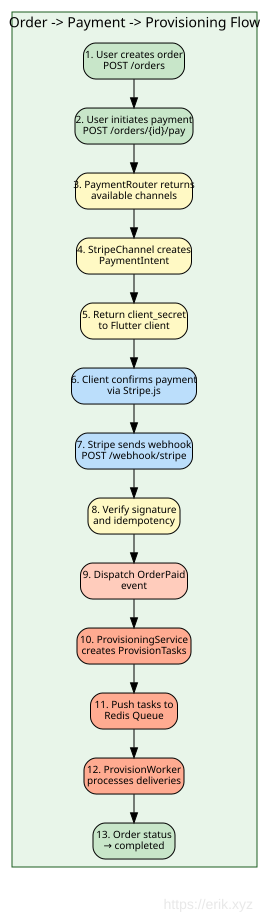
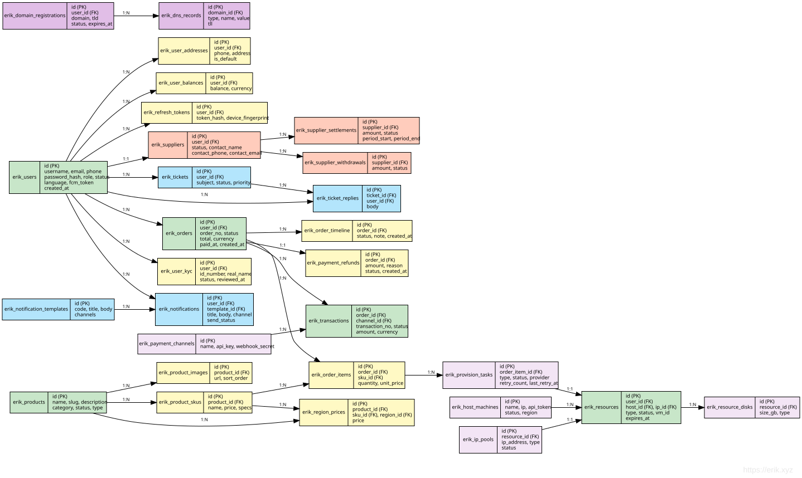

# Documento de diseño del panel de administración

## Resumen

`admin/` es una instancia webman v2.1 independiente que proporciona un panel de administración basado en Layui. Se ejecuta de forma independiente del backend `service/`, compartiendo solo la base de datos MySQL y los 7 paquetes erikwang2013.

## Arquitectura

```
┌─────────────────────────────────────────────────┐
│                  Panel Admin                     │
│  ┌──────────┐  ┌──────────┐  ┌───────────────┐ │
│  │ Controller│  │  Model   │  │   Bootstrap   │ │
│  │ (Layui)  │  │(Eloquent)│  │(worker start) │ │
│  └────┬─────┘  └────┬─────┘  └───────┬───────┘ │
│       │             │               │          │
│  ┌────┴─────────────┴───────────────┴─────────┐ │
│  │         7 paquetes erikwang2013            │ │
│  │  Snowflake │ Hashids │ Encryptable          │ │
│  │  Encryption│ Scout   │ Season │ Poster     │ │
│  └────────────────────┬───────────────────────┘ │
└───────────────────────┼─────────────────────────┘
                        │
              ┌─────────┴─────────┐
              │   MySQL 8.0       │
              │   Elasticsearch   │
              └───────────────────┘
```

### Mapa de dependencias de módulos


## Estructura de directorios

```
admin/
├── app/
│   ├── bootstrap/       # Arranque por proceso
│   │   ├── SnowflakeBootstrap.php
│   │   ├── EncryptableBootstrap.php
│   │   └── EncryptionBootstrap.php
│   ├── controller/       # 54 archivos de controladores (Base/Crud + CRUD por entidad)
│   │   ├── Base.php     # json() con hashids_encode_ids
│   │   ├── Crud.php     # Select/Insert/Update/Delete/Export con decodificación hashids
│   │   ├── DashboardController.php  # API de datos del panel (estadísticas de usuarios + tendencias)
│   │   ├── AccountController.php    # Login/logout/perfil/contraseña
│   │   ├── AdminController.php      # CRUD de administradores + roles
│   │   ├── RoleController.php       # CRUD de roles + árbol de reglas
│   │   └── ...
│   ├── model/            # 44 modelos Eloquent (36 mapean tablas de negocio sin prefijo de service + alerts (definidas en install.sql) + 7 tablas de administración wa_*)
│   │   ├── Base.php     # Clave primaria Snowflake + soporte Encryptable
│   │   ├── Admin.php    # Encryptable: password, email, mobile
│   │   ├── User.php     # Encryptable: 6 campos + trait Searchable
│   │   └── ...
│   ├── common/           # Auth, Tree, Layui, Util, ExcelExport
│   ├── middleware/        # WafMiddleware + AccessControl
│   ├── exception/        # Handler
│   └── functions.php     # hashids_encode/decode, encrypt_data/decrypt_data
├── api/                  # API pública (plugin\admin\api)
│   └── Auth.php          # canAccess() ACL
├── config/
│   ├── plugin/erikwang2013/  # Configuración de 7 plugins
│   ├── hashids.php       # Conexiones Hashids (principal + alternativa)
│   └── encryption.php    # Configuración de cifrado (clave maestra, cipher)
├── tests/                # Suite de pruebas PHPUnit 11 (286 tests, 962 assertions)
│   ├── HashidsTest.php   # 21 tests
│   ├── BaseJsonTest.php  # 13 tests
│   ├── CrudHashidsTest.php # 14 tests
│   ├── TreeTest.php      # 19 tests
│   ├── AccessControlMiddlewareTest.php # 7 tests (401/403/paso permitido)
│   ├── AdminControllersTest.php        # Regresión por reflexión de 48 controladores
│   ├── UtilTest.php      # 17 tests
│   ├── DictTest.php      # 5 tests
│   ├── ExcelExportTest.php # 4 tests
│   ├── LayuiTest.php     # 5 tests
│   └── support/          # RequestMock, TestableCrud
├── install.sql           # DDL (claves primarias bigint unsigned, sin autoincremento)
└── phpunit.xml
```

## Detalles de integración de paquetes

### 1. Snowflake (claves primarias distribuidas)

**Config**: `config/plugin/erikwang2013/snowflake-php/app.php`
**Bootstrap**: `app/bootstrap/SnowflakeBootstrap.php`

```php
// Model Base::boot() — evento creating
static::creating(function (Model $model) {
    if (empty($model->getKey())) {
        $snowflake = Container::instance()->get(Snowflake::class);
        $model->setAttribute($model->getKeyName(), $snowflake->id());
    }
});
```

- IDs de 64 bits: `timestamp(41b) | datacenter(5b) | worker(5b) | sequence(12b)`
- Época: 2024-01-01 (vida máxima ~69 años)
- `$incrementing = false`, `$keyType = 'int'` en el modelo Base
- Todas las columnas PK y FK: `bigint unsigned NOT NULL`

### 2. Hashids (ofuscación de ID)

**Config**: `config/hashids.php` + `config/plugin/erikwang2013/hashids/app.php`

**Ruta de codificación** (respuesta):
- `Base::json()` llama a `hashids_encode_ids($data)` recursivamente
- Los campos llamados `id`, `*_id`, `*_ids` con enteros positivos → cadenas hashid
- `Crud::formatNormal()` también aplica la codificación (corregido en la revisión de código)

**Ruta de decodificación** (solicitud):
- `Crud::selectInput()`: decodifica las cadenas hashid de `id`/`*_id` en la cláusula WHERE
- `Crud::updateInput()`: decodifica la clave primaria de `$request->post()`
- `Crud::deleteInput()`: decodifica el array de claves primarias de `$request->post()`
- `AdminController::update()`: usa directamente el valor devuelto por `updateInput()` (sin duplicados)
- `RoleController::select()`/`rules()`: decodifican `$request->get('id')`

**Funciones auxiliares** (en `app/functions.php`):
- `hashids_encode(int $id): string`
- `hashids_decode(string $hash): int` — devuelve 0 en caso de fallo
- `hashids_encode_ids(array $data): array` — recursivo, gestiona cadenas `is_numeric()`

### 3. Encryptable (cifrado de campos de base de datos)

**Config**: `config/plugin/erikwang2013/encryptable/app.php`
**Bootstrap**: `app/bootstrap/EncryptableBootstrap.php`

Usa la interfaz `CastsAttributes` de Eloquent:
- `get()`: descifra con AES el valor al leer de la DB
- `set()`: cifra con AES el valor al escribir en la DB

**Campos cifrados**:
| Modelo | Campos |
|-------|--------|
| Admin | password, email, mobile |
| User | password, email, mobile, token, last_ip, join_ip |

**Regla crítica**: usar siempre `save()` de la instancia del modelo, nunca `update()` del Query Builder. Usar `Admin::where(...)->update(...)` elude los casts de Eloquent y almacena valores en claro. Esto se corrigió en `AccountController` durante la revisión de código.

**Capas de contraseña**: las contraseñas se hashean primero con bcrypt (en `insertInput`/`updateInput`), y después el hash se cifra con AES mediante el cast Encryptable en `save()`. Al leer: descifrado AES → hash bcrypt → `password_verify()`.

### 4. Encryption (transporte de API)

**Config**: `config/encryption.php`
**Bootstrap**: `app/bootstrap/EncryptionBootstrap.php`

Reservado para el cifrado de solicitudes/respuestas a nivel de API (AES-256-GCM). Proporciona:
- `encrypt_data(string $plaintext): string`
- `decrypt_data(string $ciphertext): string`

Lanza `RuntimeException` con un mensaje claro si `ENCRYPTION_MASTER_KEY` no está configurada.

### 5. Webman-Scout (Elasticsearch)

**Config**: `config/plugin/erikwang2013/webman-scout/app.php` + `command.php`

El modelo User usa el trait `Searchable`:
```php
class User extends Base
{
    use Searchable;

    public function toSearchableArray(): array
    {
        return [
            'id' => $this->id,
            'username' => $this->username,
            'nickname' => $this->nickname,
            'email' => $this->email,
            'mobile' => $this->mobile,
        ];
    }
}
```

### 6. Season (banderas de países)

**Config**: `config/plugin/erikwang2013/season/app.php`

Función global: `country_season_flag(string $code): string`
- `country_season_flag('CN')` → 🇨🇳
- `country_season_flag('US')` → 🇺🇸

También proporciona nombres de estaciones localizados mediante la clase `CountrySeason`.

### 7. Poster-PHP (CAPTCHA de clic)

**Config**: `config/poster.php` + `config/plugin/erikwang2013/poster/app.php`
**Bootstrap**: `config/plugin/erikwang2013/poster/bootstrap.php` → `CaptchaPlugin`

Proporciona verificación CAPTCHA de clic para inicio de sesión y registro:

```
Client                         Server
──────                         ──────
POST /api/captcha/create
  Header: X-Api-Version: v1
  → CaptchaService::create()
    → captcha_create('click')
      → ClickCaptcha::generate()
        → GD renderiza la imagen con n palabras chinas colocadas aleatoriamente
        → Almacena los objetivos + clave en Redis/almacenamiento de archivos
      ← {key, image (base64), target_count, expires_in}

POST /api/auth/login
  Header: X-Api-Version: v1
  (con captcha_key + captcha_points)
  → AuthController::verifyCaptcha()
    → CaptchaService::verify(key, [[x1,y1], [x2,y2], ...])
      → captcha_verify(key, 'click', points)
        → CaptchaManager comprueba la distancia euclidiana ≤ tolerancia de 18px
      ← true/false
```

**Características de seguridad**:
- Claves de un solo uso: se eliminan tras una verificación exitosa
- Protección contra fuerza bruta: máximo 3 intentos fallidos por clave, después se elimina
- TTL de 300 segundos (configurable mediante `CAPTCHA_TTL`)
- Tolerancia de clic: radio de 18px (configurable)
- Niveles de dificultad: fácil (2 objetivos), medio (3), difícil (4)
- Almacenamiento: detección automática Redis → fallback a archivo, configurable mediante `CAPTCHA_STORAGE`

**Envoltorio**: `Common\Captcha\CaptchaService` carga la configuración personalizada de `config/poster.php`, y proporciona los métodos `create()` (elimina los objetivos de la respuesta por seguridad) y `verify()`. Lo usan `AuthController::register()` y `AuthController::login()`.

### 8. ConfirmationMiddleware (reverificación de contraseña)

**Config**: middleware de grupo de rutas en `config/route.php`

Protege las operaciones destructivas y sensibles exigiendo al usuario que reintroduzca su contraseña. Se aplica como middleware en 12 endpoints de rutas sensibles:

```
Client                              Server
──────                              ──────
POST /api/orders/{id}/pay
  Header: X-Api-Version: v1
  (con el campo confirm_password)
    → ConfirmationMiddleware::process()
      → Comprueba que existe userId (401 si falta)
      → Comprueba la clave de bloqueo en Redis (429 si está bloqueado)
      → Valida que la contraseña no esté vacía (422 si falta)
      → User::find() + Hash::check() verifica bcrypt
      → En caso de fallo:
        → INCR en Redis del contador confirm_failed:{userId}
        → Si count ≥ 5, SETEX confirm_lock:{userId} durante 900s
        → AuditLogger::record('confirm_failed', ...)
        → Devuelve 403
      → En caso de éxito:
        → DEL del contador confirm_failed:{userId}
        → AuditLogger::record('confirm_success', ...)
        → Llama a $next($request)
```

**Endpoints sensibles de usuario** (Auth + Confirmation):
| Método | Ruta | Operación |
|--------|------|-----------|
| POST | `/api/orders/{id}/pay` | Iniciar el pago |
| POST | `/api/supplier/withdraw` | Solicitar retiro |
| DELETE | `/api/dns/{domain}/records/{id}` | Eliminar registro DNS |

**Endpoints sensibles de administración** (Auth + AdminRole + Confirmation):
| Método | Ruta | Operación |
|--------|------|-----------|
| DELETE | `/admin/api/products/{id}` | Eliminar producto |
| POST | `/admin/api/orders/{id}/refund` | Reembolsar pedido |
| POST | `/admin/api/provisioning/resources/{id}/destroy` | Destruir recurso |
| POST | `/admin/api/kyc/{id}/approve` | Aprobar KYC |
| POST | `/admin/api/kyc/{id}/reject` | Rechazar KYC |
| POST | `/admin/api/suppliers/{id}/approve` | Aprobar proveedor |
| POST | `/admin/api/suppliers/{id}/settle` | Generar liquidación |
| POST | `/admin/api/suppliers/withdraws/{id}/approve` | Aprobar retiro |
| PUT | `/admin/api/system/config` | Actualizar configuración del sistema |

La versión de la API viaja en el encabezado `X-Api-Version` (por defecto: `v1`), no en la ruta URL.

**Características de seguridad**:
- Verificación de contraseña bcrypt mediante `Hash::check()`
- Límite de frecuencia: 5 intentos fallidos disparan un bloqueo de 15 minutos (TTL 900s)
- El bloqueo es por usuario mediante claves Redis (`confirm_lock:{userId}`, `confirm_failed:{userId}`)
- El éxito restablece el contador de fallos
- Todos los intentos se registran en la base de auditoría (éxito, fallo, bloqueo)
- `verifyPassword()` es un método protegido, lo que permite probarlo con una subclase anónima

**Testabilidad**: `ConfirmationMiddlewareTest` (11 tests) usa una subclase anónima que sobrescribe `verifyPassword()` para devolver un booleano fijo, evitando la dependencia de Eloquent/DB. Los tests cubren: 401 no autenticado, 422 contraseña ausente/vacía, 403 contraseña incorrecta, paso directo en éxito, formato de la clave de límite, formato de la clave de bloqueo y límite del umbral de fallos (4→sin bloqueo, 5→bloqueado, 6→bloqueado).

## Sistema ACL

### A nivel de controlador

```php
protected $noNeedLogin = ['login', 'logout', 'captcha'];  // Omitir login
protected $noNeedAuth = ['select'];                         // Omitir auth
```

Lo comprueba `api/Auth::canAccess()` mediante `ReflectionClass`.

**Respuesta de AccessControlMiddleware** (`middleware/AccessControl.php`):
- Sin sesión (fuera de `noNeedLogin`) → **HTTP 401**, body con script de redirección a la página de login
- Con sesión pero sin permisos suficientes → **HTTP 403** página de error (código 403, ya no 500)
- En la lista de paso permitido (página de login/CAPTCHA, etc.) → paso normal

### Basado en roles

- Los roles tienen `rules` (IDs de reglas separados por comas o `*` para superadministrador)
- Las reglas se almacenan en `wa_rules` con claves `{Controller}@{action}`
- `api/Auth::canAccess()` resuelve la clave `$controller@$action` contra las reglas del rol
- El superadministrador (`rules = '*'`) se salta todas las comprobaciones

### Límites de datos

```php
protected $dataLimit = null;     // Sin límite
protected $dataLimit = 'auth';   // El admin ve sus datos + los de sus descendientes
protected $dataLimit = 'personal'; // El admin ve solo sus propios datos
protected $dataLimitField = 'admin_id';
```

## Hallazgos de la revisión de código (corregidos)

Durante la revisión del commit inicial se encontraron y corrigieron los siguientes puntos:

### Críticos
1. **AccountController eludía Encryptable**: `password()` y `update()` usaban `Admin::where()->update()`, que elude los casts de Eloquent → almacenaba valores en claro en columnas cifradas. Corregido usando `Admin::find()->save()`.
2. **Crud::formatNormal() no codificaba los IDs**: llamaba al `json()` global en lugar de aplicar `hashids_encode_ids()`. Corregido.

### Importantes
3. **hashids_encode_ids con `is_int` estricto**: los valores bigint grandes de PDO llegan como cadenas PHP. Cambiado a `is_numeric()` con comprobación de número entero.
4. **Decodificación duplicada de ID en AdminController**: `update()` decodificaba la misma clave primaria dos veces. Eliminada la duplicación; corregido el sombreado de la variable de bucle en `insert()`.
5. **Código de contraseña muerto en AccountController::update()**: el campo de contraseña no estaba en la lista de permitidos. Eliminado.
6. **Driver MySQL hardcodeado**: cambiado a `config('database.default')`.

## Exportación a Excel

### Arquitectura

La exportación a Excel usa PhpSpreadsheet ^2.0 para generar archivos .xlsx en el servidor. El panel de administración tiene dos rutas de exportación distintas porque existen dos mecanismos CRUD:

```
Solicitud de exportación (con los filtros de tabla actuales)
  ├── Controladores basados en Crud (User, Admin, Role, etc.)
  │     → Crud::export()
  │       → selectInput() reutiliza el análisis de consulta (decodificación hashids, WHERE, ORDER)
  │       → doSelect() construye la consulta Eloquent
  │       → Límite de 10.000 filas
  │       → hashids_encode_ids() aplicado a los datos del resultado
  │       → ExcelExport::export() genera el .xlsx
  │
  └── TableController (tablas genéricas como wa_dict, wa_rules)
        → TableController::export()
          → Construye la consulta desde el esquema de la tabla + parámetros de solicitud
          → hashids_encode_ids() aplicado
          → ExcelExport::export() genera el .xlsx
```

### Utilidad ExcelExport (`app/common/ExcelExport.php`)

Envoltorio fluido sobre PhpSpreadsheet:

- `setColumns(array $columns)` — define el orden de las columnas
- `setLabels(array $labels)` — establece encabezados de columna legibles
- `addRow(array $row)` / `addRows(array $rows)` — rellena los datos
- `save(string $title): string` — escribe el .xlsx en `runtime/exports/`, devuelve la ruta del archivo
- Helper estático: `ExcelExport::export($title, $columns, $data, $labels)` — exportación de una sola pasada
- Ajusta automáticamente las columnas mediante `Worksheet::getColumnDimension()`

### Crud::export()

```php
public function export(Request $request): Response
{
    [$where, $format, $limit, $field, $order] = $this->selectInput($request);
    $query = $this->doSelect($where, $field, $order);
    $maxRows = 10000;
    $total = min($query->count(), $maxRows);
    $items = $query->limit($maxRows)->get();
    if (method_exists($this, 'afterQuery')) {
        $items = call_user_func([$this, 'afterQuery'], $items);
    }
    $data = array_map(fn($item) => ...toArray(), $items->toArray());
    $data = hashids_encode_ids($data);
    // Derivar las etiquetas de columna de los comentarios del esquema de la tabla
    $path = ExcelExport::export($table, $columns, $data, $labels);
    return response()->download($path, $table . '_' . date('YmdHis') . '.xlsx');
}
```

Todos los controladores basados en Crud (Admin, User, Role, etc.) heredan `export()` automáticamente.

### Conexión con el frontend

- El elemento de toolbar integrado `"exports"` de Layui (CSV en el cliente) se sustituye por un botón personalizado `{title: "导出", layEvent: "export"}`
- El manejador del evento `export` llama a `window.exportExcel()`, que recoge los parámetros de filtro actuales de la tabla y abre la URL de descarga
- `Layui::buildTable()` genera el toolbar con el botón de exportación personalizado en todas las páginas CRUD

### Exportación de la API de administración de Service

El backend de service (`service/`) también tiene exportación a Excel mediante su propio envoltorio `Common\ExcelExport`:

| Endpoint | Controlador | Datos exportados |
|----------|-----------|---------------|
| `GET /admin/api/orders/export` | OrderController | id, order_no, user_id, type, status, total, currency, created_at, paid_at |
| `GET /admin/api/users/export` | UserController | id, email, phone, role, status, created_at, last_login_at |
| `GET /admin/api/suppliers/export` | SupplierController | id, user_id, status, contact_name, contact_email, contact_phone, created_at |

Todos los endpoints de la API requieren el encabezado `X-Api-Version` (por defecto: `v1`).

Las rutas de exportación se colocan ANTES de las rutas con parámetro `/{id}` para evitar conflictos.

## API de administración de Service — funciones ampliadas

### Endpoints de la API de administración (capa Service)

Todos los endpoints REST de administración llevan el prefijo `/admin/api` y requieren `AdminRoleMiddleware`.

| Grupo | Endpoints | Controlador |
|-------|-----------|------------|
| Panel | `GET /dashboard`, `/kyc`, `POST /kyc/{id}/approve`, `/reject` | `Admin\DashboardController` |
| Usuarios | `GET /users`, `/users/export`, `/users/{id}`, `PUT /users/{id}/status` | `Admin\UserController` |
| Productos | `POST /products`, `PUT /products/{id}`, `DELETE /products/{id}`, `POST /products/{id}/skus`, `PUT /skus/{id}`, `POST /skus/{id}/region-price` | `Admin\ProductController` |
| Importación/Exportación de productos | `GET /products/export` (CSV), `POST /products/import` (upsert CSV) | `Admin\ImportExportController` |
| Pedidos | `GET /orders`, `/orders/export`, `/orders/{id}`, `POST /orders/{id}/refund` | `Admin\OrderController` |
| Facturas | `GET /invoices`, `POST /invoices/{orderId}/generate` | `Admin\InvoiceController` |
| Pagos | `GET /payments/channels`, `PUT /payments/channels/{id}`, `GET /payments/transactions`, `/reconcile` | `Admin\PaymentController` |
| Aprovisionamiento | `GET /provisioning/tasks`, `POST /tasks/{id}/retry`, `POST /resources/{id}/upgrade`, `/destroy`, `GET /hosts` | `Provisioning\TaskController` |
| APIs de proveedores | `GET /providers`, `POST /providers`, `PUT /providers/{id}`, `DELETE /providers/{id}` | `Admin\ProviderApiController` |
| CDN | `GET /cdn/domains`, `PUT /cdn/domains/{id}` | `Admin\CdnController` |
| Proveedores | `GET /suppliers`, `/suppliers/export`, `POST /suppliers/{id}/approve`, `/settle`, `/withdraws/{id}/approve` | `Admin\SupplierController` |
| API Keys de proveedores | `GET /suppliers/{id}/api-keys`, `POST /suppliers/{id}/api-keys`, `DELETE /suppliers/api-keys/{id}` | `Admin\SupplierController` |
| Tickets | `GET /tickets`, `POST /tickets/{id}/assign`, `/close` | `Ticket\TicketController` |
| Cupones | `GET /coupons`, `POST /coupons`, `DELETE /coupons/{id}` | `Admin\CouponController` |
| Webhooks | `GET /webhooks`, `POST /webhooks`, `DELETE /webhooks`, `POST /webhooks/test` | `Admin\WebhookController` |
| Dominios | `GET /domains/tlds`, `POST /domains/tlds`, `PUT /domains/tlds/{id}`, `DELETE /domains/tlds/{id}`, `GET /domains/zones`, `/transfers`, `POST /transfers/{id}/approve` | `Admin\DomainController` |
| Notificaciones | `GET /notifications/templates`, `PUT /notifications/templates/{id}`, `GET /notifications/log` | `Admin\NotificationController` |
| Artículos de ayuda | `GET /help`, `POST /help`, `PUT /help/{id}`, `DELETE /help/{id}` | `Admin\HelpController` |
| Reportes | `GET /reports/revenue`, `/supplier`, `/region` | `Report\ReportController` |
| Monitorización | `GET /monitor/dashboard`, `/resources/{id}` | `Monitor\MonitorController` |
| Auditoría | `GET /audit-logs` | `Admin\SystemController` |
| Configuración del sistema | `PUT /system/config` | `Admin\SystemController` |

### Gestión de recursos CDN

El producto CDN soporta cuatro proveedores (Cloudflare / CloudFront / Aliyun / Tencent Cloud); el panel de administración se divide en dos bloques:

**Configuración de cuentas de proveedor** (reutiliza el modelo ProviderApi, `Admin\ProviderApiController`):

- `GET/POST /admin/api/providers`, `PUT/DELETE /admin/api/providers/{id}`, con `RbacMiddleware('provider.config')`
- `code` convencional `cdn-cloudflare` / `cdn-cloudfront` / `cdn-aliyun` / `cdn-tencent`; los campos de credenciales se cifran con Encryptable en la base de datos, la columna JSON `config` guarda metadatos no sensibles
- Prioridad de resolución de credenciales del lado del usuario: cuenta vinculada → cuenta activa que coincide con el code → respaldo env; la eliminación/purga usa la instantánea estricta (solo la cuenta vinculada; si falta o está deshabilitada, devuelve 4003)

**Gestión de dominios CDN** (`Admin\CdnController`):

```
GET /admin/api/cdn/domains        → Todos los dominios (con el user_id al que pertenecen), con RbacMiddleware('cdn.manage')
PUT /admin/api/cdn/domains/{id}   → Actualizar plan; lista blanca de planes standard | pro | enterprise;
                                    los valores inválidos devuelven 400; el cambio se registra en el log de auditoría admin_cdn_update_plan
```

### Datos del panel (capa Service)

`Admin\DashboardController::index()` proporciona métricas operativas reales:

```php
[
    'today_stats' => [todayOrders, todayRevenue, newUsers, activeResources],
    'revenue_trend_30d' => [...],   // Ingresos diarios de los últimos 30 días
    'region_distribution' => [...],  // Recursos activos agrupados por región
    'pending_orders' => ...,         // Pedidos pendientes de pago
    'pending_kyc' => ...,            // Envíos de KYC pendientes de revisión
    'open_tickets' => ...,           // Tickets abiertos o en curso
]
```

### Vista del panel de administración (`app/view/index/dashboard.html`)

- **8 tarjetas estadísticas animadas**: usuarios hoy/semana/mes/total + pedidos de hoy + ingresos de hoy + pedidos pendientes + recursos activos — cada una con animación de conteo mediante el módulo `count` de Layui
- **3 gráficos ECharts**:
  1. Tendencia de registro de usuarios de 7 días — gráfico de líneas con área
  2. Tendencia de registro de usuarios de 30 días — gráfico de barras
  3. Resumen de usuarios — gráfico de donut/pastel (hoy / semana / mes)
- **Tabla de información del sistema**: rellenada dinámicamente con las versiones de PHP/Workerman/Webman/Admin/MySQL/OS
- **Toolbar**: botones de exportación a PDF y actualización
- Todos los datos se obtienen por AJAX desde `/app/admin/dashboard/data`

### Ruta

```
Route::any('/app/admin/dashboard/data', [DashboardController::class, 'index']);
```

Además de las rutas registradas explícitamente, `admin/config/route.php` registra automáticamente para cada método público de cada controlador de `app/controller/` una ruta `/app/admin/{snake_case_controller}/{action}` (p. ej. `/app/admin/order_item/index`); la URL coincide con el nombre del controlador en snake_case que usan los menús; `/app/admin` y `/app/admin/index` son la página principal/de login del panel (si no hay sesión, se renderiza la vista de login); las solicitudes no coincidentes devuelven 404.

## Exportación a PDF

Generación de PDF en el cliente en la página del panel:

- Usa **html2canvas 1.4.1** (CDN) para capturar el DOM del panel como canvas
- Usa **jsPDF 2.5.1** (CDN) para crear un PDF A4 descargable
- Captura las tarjetas estadísticas y los gráficos ECharts (renderizados como elementos canvas)
- Incluye título, marca de tiempo y marca de la empresa en el PDF
- Se dispara con el botón "Export PDF" del toolbar del panel

```
DOM del panel → captura html2canvas → documento jsPDF → descarga en el navegador
```

### Implementación

```javascript
// En dashboard.html
html2canvas(document.querySelector('.layui-body'), {scale: 2}).then(canvas => {
    const pdf = new jsPDF('p', 'mm', 'a4');
    const imgData = canvas.toDataURL('image/png');
    pdf.addImage(imgData, 'PNG', 10, 10, 190, 0);
    pdf.save('dashboard_' + new Date().toISOString().slice(0, 10) + '.pdf');
});
```

## Suite de pruebas

```
PHPUnit 11.5 | 67 tests | 124 assertions
```

### HashidsTest (21 tests)
- Roundtrip encode/decode (0 a PHP_INT_MAX)
- Codificación determinista
- Gestión de cadenas inválidas/vacías
- Patrones de campos de `hashids_encode_ids` (`id`, `*_id`, `*_ids`)
- Omisión de cero/negativos, soporte de cadenas numéricas
- Recursión en arrays anidados, preservación de campos que no son id

### BaseJsonTest (13 tests)
- `json()`/`success()`/`fail()` aplican la codificación hashids
- Codificación de objetos anidados
- Gestión de IDs de tamaño Snowflake
- Preservación de campos que no son id
- Gestión del cero
- Verificación de la estructura de la respuesta

### CrudHashidsTest (14 tests)
- `selectInput`: decodificación hashid en los campos WHERE `id`/`*_id`
- `selectInput`: paso directo de cadenas numéricas/ints crudos
- `updateInput`: decodificación de la clave primaria hashid
- `updateInput`: conversión a int de la clave primaria en cadena numérica
- `deleteInput`: decodificación de IDs en lote, tipos mixtos
- `deleteInput`: array vacío, gestión de un solo ID

## Sistema de migraciones de base de datos

### Arquitectura

Tanto la instancia `service/` como `admin/` tienen sistemas de migración independientes construidos sobre el Schema Builder de `illuminate/database`. Cada instancia registra comandos de Symfony Console mediante `config/command.php`, que el runner de consola de webman descubre.

```
php webman migrate          # Ejecutar migraciones pendientes
php webman migrate:rollback # Revertir el último lote
php webman migrate:status   # Mostrar el estado de las migraciones
```

### MigrationRunner (`service/support/MigrationRunner.php`, `admin/app/common/MigrationRunner.php`)

Motor principal compartido por ambas instancias:

- **`ensureTable()`** — Crea la tabla de seguimiento `migrations` (id, nombre de migración, número de lote) en la primera ejecución
- **`migrate()`** — Escanea los archivos de migración de `database/migrations/`, ejecuta los métodos `up()` pendientes y registra el lote
- **`rollback()`** — Revierte el último lote llamando a `down()` en cada migración en orden inverso
- **`status()`** — Lista todas las migraciones con su número de lote
- **`resolve()`** — Instancia las clases de migración desde los archivos

### Clase base de migración (`service/support/Migration.php`, `admin/app/common/Migration.php`)

```php
abstract class Migration
{
    abstract public function up(): void;
    abstract public function down(): void;
}
```

Cada archivo de migración devuelve una clase que extiende `Migration`, con nombres de archivo con prefijo de timestamp (p. ej., `2024_01_01_000001_create_initial_schema.php`).

### Migraciones de Service

**Directorio**: `service/database/migrations/` — 38 archivos de migración (los nombres de tabla no llevan prefijo erik_; los modelos de admin los mapean directamente)

| Migración | Tablas |
|-----------|--------|
| `0001_create_users_tables` | users, user_profiles, user_kyc, user_balance, user_balance_log, user_addresses, refresh_tokens |
| `0002_create_product_tables` | product_categories, regions, products, product_skus, product_regions, product_images, product_attributes, product_reviews |
| `0003_create_order_tables` | carts, orders, order_items, order_timeline, order_invoices, refunds |
| `0004_create_payment_tables` | payment_channels, payment_transactions, payment_reconcile |
| `0005_create_provisioning_tables` | resources, resource_servers, resource_ips, resource_disks, resource_domains, provision_tasks, provider_apis |
| `0006_create_host_tables` | host_machines, ip_pools, ip_allocations, disks, disk_resizes |
| `0007_create_supplier_tables` | suppliers, supplier_products, supplier_settlements, supplier_withdraws |
| `0008_create_domain_tables` | domain_tlds, domain_transfers, dns_zones, dns_records |
| `0009_create_ticket_notification_tables` | tickets, ticket_messages, notifications, notification_templates |
| `0010_create_audit_table` | audit_logs |
| `0011_create_kvm_service_tables` | network_services, firewall_services, switch_services |
| `2024_01_01_000001_create_initial_schema` | Ejecuta `docs/database.sql` mediante `Capsule::unprepared()`, lo elimina todo en `down()` |
| `2025_05_16_000002_add_fcm_token_to_users` | Añade `fcm_token`, `fcm_platform` + índice a users |
| `2026_08_26_000003_widen_encrypted_columns` | users.phone / user_addresses.phone / suppliers.contact_phone VARCHAR(20)→VARCHAR(255) (longitud del cifrado Encryptable) |

### Migraciones de Admin

**Directorio**: `admin/database/migrations/` — 1 archivo de migración

| Migración | Descripción |
|-----------|-------------|
| `2024_01_01_000001_create_admin_schema` | Ejecuta `admin/install.sql` mediante `Capsule::unprepared()` — crea las tablas wa_* con datos semilla |

### Registro de comandos de consola

**`service/config/command.php`**:
```php
return [
    \App\Command\MigrateCommand::class,
    \App\Command\MigrateRollbackCommand::class,
    \App\Command\MigrateStatusCommand::class,
];
```

**`admin/config/command.php`** — mismo patrón bajo el namespace `app\command`.

## Integración de producción con Stripe

### Arquitectura

Sustituyó los IDs de pago falsos de `random_bytes()` por la integración real con la API de Stripe mediante `stripe/stripe-php` ^15.0.

**Archivo**: `service/app/payment/service/channels/StripeChannel.php`

```
Lado del cliente                   Lado del servidor                    API de Stripe
───────────                    ───────────                    ──────────
Seleccionar Stripe en el checkout
  → POST /orders/{id}/pay
    → StripeChannel::createPaymentIntent()
      → StripeClient->paymentIntents->create(amount, currency)
        ← {id, client_secret}
      → Guardar pi_xxx como transaction_no
      ← Devolver client_secret
  → Stripe.js confirmCardPayment(client_secret)
    ← Pago confirmado por Stripe
      → POST /payments/webhook/stripe
        → StripeChannel::handleWebhook()
          → Webhook::constructEvent(payload, signature, secret)
          → Verificar idempotencia (omitir transacciones no pendientes)
          → Actualizar el estado del pedido, crear el registro de transacción
```

### Creación del PaymentIntent

```php
public function createPaymentIntent(Order $order): array
{
    $intent = $this->stripe()->paymentIntents->create([
        'amount'   => (int) round($order->total * 100),  // cents
        'currency' => strtolower($order->currency),
        'metadata' => ['order_id' => $order->id, 'order_no' => $order->order_no],
    ]);
    return [
        'transaction_no' => $intent->id,          // pi_xxxxxxxxxxxxx
        'client_secret'  => $intent->client_secret, // pi_xxx_secret_yyy
    ];
}
```

- `$this->stripe()` inicializa de forma perezosa `\Stripe\StripeClient` con `STRIPE_SECRET_KEY` del entorno
- Si la variable de entorno no está definida, usa `$this->channel->api_key_encrypted` (descifrada mediante Encryptable)
- El importe se convierte a céntimos: `(int) round($order->total * 100)`

### Verificación de firma del Webhook

```php
public function handleWebhook(string $payload, string $signature): void
{
    $event = \Stripe\Webhook::constructEvent(
        $payload, $signature, $this->channel->webhook_secret_encrypted
    );
    // Idempotencia: omitir si la transacción ya se procesó
    $existing = Transaction::where('transaction_no', $event->id)->first();
    if ($existing && $existing->status !== 'pending') return;
    
    match ($event->type) {
        'payment_intent.succeeded' => $this->confirmPayment($event),
        'payment_intent.payment_failed' => $this->failPayment($event),
        default => null,
    };
}
```

- Usa `Webhook::constructEvent()` para verificar el encabezado de firma de Stripe
- **Guardia de idempotencia**: comprueba entregas de webhook duplicadas por `transaction_no`
- Soporta tanto eventos de éxito como de fallo

## Integración de SMS con Twilio

### Arquitectura

Sustituyó el stub de `error_log()` por envío real de SMS mediante `twilio/sdk` ^8.0.

**Archivo**: `service/app/notification/queue/SmsSender.php`

### Envío de mensajes

```php
public function consume(): void
{
    $client = new \Twilio\Rest\Client(
        getenv('TWILIO_ACCOUNT_SID'),
        getenv('TWILIO_AUTH_TOKEN')
    );
    $message = $client->messages->create(
        $this->notification->recipient_phone,
        ['from' => getenv('TWILIO_PHONE_NUMBER'), 'body' => $this->notification->body]
    );
    $this->notification->provider_message_id = $message->sid;
}
```

### Gestión de errores

- Captura `Twilio\Exceptions\RestException` — guarda el código y el mensaje de error de Twilio
- Crea un registro de Notification fallido con `send_status = 'failed'`
- Registra `provider_message_id` (SID de Twilio) para el seguimiento de la entrega
- Cae a `error_log()` cuando las credenciales de Twilio no están definidas (modo dev)

### Configuración

Variables de entorno: `TWILIO_ACCOUNT_SID`, `TWILIO_AUTH_TOKEN`, `TWILIO_PHONE_NUMBER`

## Integración de push FCM

### Arquitectura

Sustituyó el stub de `error_log()` por envío real de push mediante `kreait/firebase-php` ^7.0.

**Archivo**: `service/app/notification/queue/PushSender.php`

### Almacenamiento de tokens de dispositivo

Añadido a la tabla `users` mediante migración:
- `fcm_token VARCHAR(512) DEFAULT NULL` — token de registro del dispositivo
- `fcm_platform VARCHAR(16) DEFAULT NULL` — `ios` / `android` / `web`
- `INDEX idx_fcm_token (fcm_token)` — búsqueda por token

Modelo User: `fcm_token` y `fcm_platform` añadidos a `$fillable`.

### Envío de push

```php
public function consume(): void
{
    $factory = new \Kreait\Firebase\Factory();
    if ($credentialsPath = getenv('FIREBASE_CREDENTIALS_PATH')) {
        $factory = $factory->withServiceAccount($credentialsPath);
    }
    $messaging = $factory->createMessaging();
    
    $message = \Kreait\Firebase\Messaging\CloudMessage::withTarget(
        'token', $this->user->fcm_token
    )->withNotification([
        'title' => $this->notification->title,
        'body'  => $this->notification->body,
    ]);
    
    $result = $messaging->send($message);
}
```

### Limpieza de tokens

- Captura `Kreait\Firebase\Exception\Messaging\InvalidToken` — pone a null el `fcm_token` del usuario
- Captura `Kreait\Firebase\Exception\Messaging\NotFound` — elimina el token no registrado
- Cae a `error_log()` cuando las credenciales de Firebase no están definidas (modo dev)

### Configuración

Variables de entorno: `FIREBASE_CREDENTIALS_PATH` (JSON de la cuenta de servicio), `FCM_SERVER_KEY` (legacy)

## Diagramas de flujo de negocio

### Pedido → Pago → Aprovisionamiento (flujo de negocio principal)



### Detalle del aprovisionamiento dirigido por eventos


### Distribución de notificaciones


### Ciclo de vida del proveedor


### Ciclo de vida del ticket


## Suite de pruebas de la capa Service

### Resumen

```
PHPUnit 10.5 | 295 tests | 455 assertions
```

**Directorio**: `service/tests/` — 12 archivos de test en 7 módulos

**Config**: `service/phpunit.xml` — un único testsuite `unit`, cubre el código fuente de `app/` y `common/`

### Bootstrap de pruebas

`service/tests/bootstrap.php` carga el autoload de Composer y define dos helpers globales que necesita el código bajo prueba:

- `request_id()` — devuelve una cadena de ID de solicitud única
- `now()` — devuelve el objeto `DateTime` actual

Aprendizaje crítico: `Webman\Config` no se puede cargar en el contexto de pruebas porque `loadFromDir()` dispara `route.php`, que llama a `Route::addRoute()` sobre null. Los tests evitan Config por completo — `HashidServiceTest` usa `new Hashids()` directamente, `ResponseTest` usa métodos helper locales.

### Archivos de test

| Archivo | Tests | Cobertura |
|------|-------|----------|
| `Captcha/CaptchaServiceTest.php` | 9 | estructura de create, niveles de dificultad, verificación pasa/falla, uso único, claves únicas |
| `Confirmation/ConfirmationMiddlewareTest.php` | 11 | auth obligatoria, contraseña ausente, contraseña incorrecta, paso directo en éxito, formato de clave de límite, formato de clave de bloqueo, umbrales máximos de fallo |
| `Common/HashidServiceTest.php` | 17 | roundtrip encode/decode, determinismo, aislamiento de salt, recorrido recursivo de IDs |
| `Common/ResponseTest.php` | 16 | estructura success/error/paginated, consistencia de request_id, códigos de error HTTP |
| `Common/SnowflakeTest.php` | 6 | ordenación por timestamp, unicidad, rango bigint, patrón de init |
| `Common/ValidatorTest.php` | 22 | reglas de validación required(), email(), minLength() |
| `Common/LogSanitizerTest.php` | 34 | redacción de PII, arrays anidados, coincidencia insensible a mayúsculas, 20 tipos de campos sensibles |
| `Payment/StripeChannelTest.php` | 19 | configuración del canal, cálculo de importes, firmas de webhook, idempotencia |
| `Payment/PaymentRouterTest.php` | 10 | filtrado de canales, restricciones de importe, soporte moneda/región, cálculo de comisiones |
| `Notification/NotificationDispatcherTest.php` | 8 | renderizado de plantillas, enrutado de canales, omisión de usuarios inactivos |
| `Provisioning/ProviderFactoryTest.php` | 12 | register, create, createFromResource, casos de error |
| `Provisioning/RetryLogicTest.php` | 12 | retroceso exponencial, reintentos máximos, transiciones de estado, selección de servidor |
| `ClientPlatform/ClientPlatformMiddlewareTest.php` | 13 | plataformas válidas, encabezado ausente/por defecto, plataforma no soportada, insensible a mayúsculas, omisión de no-API, rutas admin, acceso downstream |
| `Security/WafMiddlewareTest.php` | 37 | SQLi (4), XSS (6), CMDi (4), inclusión de archivos (3), inyección de cabeceras/CRLF (2), SSRF (5), inyección NoSQL (4), redirección abierta (2), paso directo seguro (5), escaneo de URL, escaneo de UA |
| `Version/VersionMiddlewareTest.php` | 6 | versión válida, versión ausente por defecto, versión no soportada 400, omisión de no-API, validación de API admin, encabezados de respuesta de error |

### Infraestructura de pruebas

- `tests/TestCase.php` — clase base que extiende PHPUnit TestCase
- `tests/Support/RequestMock.php` — solicitud simulada con parámetros inyectados por constructor

## Pipeline CI/CD

### Arquitectura

Workflow de GitHub Actions en `.github/workflows/ci.yml`.

**Disparadores**: push a `main`, pull requests a `main`

### Jobs

| Job | Estrategia | Descripción |
|-----|----------|-------------|
| `syntax` | PHP 8.2 | `php -l` lint de todos los archivos .php de admin/ y service/ |
| `admin-tests` | PHP 8.2, 8.3 | `composer install -d admin` → `admin/vendor/bin/phpunit` |
| `service-tests` | PHP 8.2, 8.3 | `composer install -d service` → `service/vendor/bin/phpunit` |
| `composer-validate` | PHP 8.2 | `composer validate --strict` en ambos composer.json |

### Matriz de versiones de PHP

Ambos jobs de pruebas se ejecutan en PHP 8.2 y 8.3 mediante `shivammathur/setup-php@v2`.

### Estado actual

Los 4 jobs pasan: 243 tests en total (67 admin + 176 service), 400 assertions, ambas versiones de PHP en verde.

## Relaciones entre entidades de la base de datos



## Decisiones de diseño clave

1. **Instancia independiente**: admin/ se ejecuta como su propia instancia webman, no como un plugin dentro de service/. Esto aísla el tráfico y los fallos de administración de la API orientada al cliente.

2. **Encryptable + hash de contraseñas**: las contraseñas se hashean primero con bcrypt y después se cifran con AES. El cast Encryptable opera a nivel de Eloquent (por encima del hash), así que las capas son: `input → hash bcrypt → set de atributo del modelo → Encryptable::set() cifra → DB`. Al leer: `DB → Encryptable::get() descifra → hash bcrypt → password_verify()`.

3. **Hashids en el límite del Controller**: la codificación/decodificación ocurre en el límite HTTP (controladores), no a nivel de modelo u ORM. Esto mantiene los modelos independientes de la base de datos y convierte hashids en una preocupación puramente de presentación.

4. **Resolución de servicios basada en contenedor**: los servicios (Snowflake, HashidsManager, EncryptionManager) se registran como singletons mediante clases Bootstrap al arrancar el worker. La resolución por contenedor mediante `\support\Container::instance()` usa instanciación perezosa — los servicios solo se crean en el primer acceso.

## Funciones ampliadas (2026-05-20)

### API de administración de Service — nuevos endpoints

| Grupo | Endpoints | Controlador |
|-------|-----------|------------|
| Facturas | `GET /admin/api/invoices`, `POST .../invoices/{orderId}/generate` | `Admin\InvoiceController` |
| APIs de proveedores | `GET/POST /admin/api/providers`, `PUT/DELETE .../providers/{id}` | `Admin\ProviderApiController` |
| API Keys de proveedores | `GET/POST /admin/api/suppliers/{id}/api-keys`, `DELETE .../api-keys/{id}` | `Admin\SupplierController` |
| Cupones | `GET/POST /admin/api/coupons`, `DELETE .../coupons/{id}` | `Admin\CouponController` |
| Webhooks | `GET/POST/DELETE /admin/api/webhooks`, `POST .../webhooks/test` | `Admin\WebhookController` |
| Importación/Exportación de productos | `GET /admin/api/products/export`, `POST .../products/import` | `Admin\ImportExportController` |
| Gestión de dominios | `GET/POST/PUT/DELETE /admin/api/domains/tlds`, `GET .../zones`, `GET .../transfers`, `POST .../transfers/{id}/approve` | `Admin\DomainController` |
| Plantillas de notificación | `GET /admin/api/notifications/templates`, `PUT .../templates/{id}`, `GET .../log` | `Admin\NotificationController` |
| Artículos de ayuda | `GET/POST /admin/api/help`, `PUT/DELETE .../help/{id}` | `Admin\HelpController` |

### Nuevos middlewares

| Middleware | Propósito |
|------------|---------|
| `VersionMiddleware` | Lee y valida la versión de la API desde el encabezado X-Api-Version |
| `RateLimitMiddleware` | Límite de frecuencia con cubo de tokens en Redis (por defecto 60req/min, login 5req/min) |
| `GeoBlockMiddleware` | Bloqueo geográfico con MaxMind GeoIP2 |
| `MaintenanceMiddleware` | Modo mantenimiento (interruptor por variable de entorno + lista blanca de IP) |
| `ClientPlatformMiddleware` | Identificación de plataforma de cliente (encabezado X-Client-Platform), soporta 8 plataformas |
| `SupplierApiKeyMiddleware` | Autenticación de la API externa de proveedores (verificación SHA256 de la clave sk_xxx) |
| `WafMiddleware` (admin) | Middleware WAF del panel Admin, 45+ reglas en 8 categorías + límite de tamaño de solicitud + validación de Content-Type |

### Tareas programadas

| Planificación | Tarea | Propósito |
|----------|------|---------|
| `13 */4 * * *` | ExchangeRateSync | Actualización de tipos de cambio |
| `37 2 * * *` | PaymentReconcile | Conciliación diaria de pagos |
| `17 4 * * 1` | SupplierSettlement | Liquidación semanal de proveedores |
| `23 6 * * *` | ExpirationCheck | Comprobación de vencimientos de recursos/dominios + notificación |
| `43 7 * * *` | SslCertificateCheck | Comprobación de vencimientos de certificados SSL + notificación |
| `*/5 * * * *` | CollectMetrics | Recopilación de métricas de recursos |
| `*/30 * * * *` | CheckExpirations | Comprobación de vencimientos de recursos |

### Comandos CLI

| Comando | Propósito |
|---------|---------|
| `php webman migrate` | Ejecutar las migraciones pendientes |
| `php webman migrate:rollback` | Revertir el último lote |
| `php webman migrate:status` | Ver el estado de las migraciones |
| `php webman db:backup` | Hacer copia de seguridad de la base de datos a un archivo SQL (opcional --s3 upload) |

### Migraciones de base de datos añadidas (2026-05-20)

| Migración | Tablas/Columnas |
|-----------|---------------|
| 000003 | users + totp_secret, totp_enabled |
| 000004 | coupons, user_coupons |
| 000005 | help_articles, supplier_api_keys |
| 000006 | roles, permissions, role_permission + datos semilla |
| 000007 | users + email_verified_at, email_verify_token |
| 000008 | users + last_login_ip, last_login_at |

## Índice de documentación

### Documentos principales

| Documento | Ruta | Descripción |
|----------|------|-------------|
| Documento de diseño de arquitectura | `docs/architecture.md` | Arquitectura del sistema, relaciones entre componentes, pipeline de middlewares, capas de seguridad, arquitectura de datos, topología de despliegue |
| Documento de diseño de funciones | `docs/features.md` | Diseño funcional detallado de 21 módulos, con diagramas de flujo, modelos de datos y explicaciones de interacción |
| Documentación de la API | `docs/api-reference.md` | Referencia completa de 200+ endpoints, agrupados por módulo, con ejemplos de solicitud/respuesta y códigos de error |
| Documentación de API en línea (service) | `http://localhost:8787/apidoc` | Generada automáticamente con hg/apidoc, agrupada por funcionalidad, con depuración en línea |
| Documentación de API en línea (admin) | `http://localhost:8788/apidoc` | Generada automáticamente con hg/apidoc, 54 controladores en 13 grupos funcionales |
| Especificación del diseño del sistema | `docs/superpowers/specs/2026-05-14-cloud-resource-platform-design.md` | Arquitectura completa, modelos de datos, diseño de API, estrategia de seguridad |
| Diseño del panel de administración | `docs/admin-design.md` | Arquitectura del panel Admin, integración de paquetes, permisos ACL, suite de pruebas |
| Documentación de la API de proveedores | `docs/supplier-api.md` | Referencia de la API de proveedores (API interna + API externa), ejemplos de SDK |
| Lista de verificación de despliegue | `docs/deployment.md` | Configuración del servidor, variables de entorno, migraciones de base de datos, Nginx, HTTPS, tareas programadas |

### Planes de implementación

| Documento | Ruta | Descripción |
|----------|------|-------------|
| Phase 0 — Framework base | `docs/superpowers/plans/2026-05-14-cloud-resource-platform-phase0.md` | Esqueleto del proyecto, estructura de directorios, infraestructura principal |
| Phase 1 — Usuarios y tienda | `docs/superpowers/plans/2026-05-14-cloud-resource-platform-phase1.md` | Autenticación de usuarios, gestión de productos, carrito, pedidos |
| Phase 2 — Recursos y proveedores | `docs/superpowers/plans/2026-05-14-cloud-resource-platform-phase2.md` | Aprovisionamiento de recursos, DNS, registro de proveedores |
| Phase 3 — Clientes y entrega | `docs/superpowers/plans/2026-05-14-cloud-resource-platform-phase3.md` | Cliente Flutter, adaptación multiplataforma, CI/CD |

### Herramientas y recursos

| Documento | Ruta | Descripción |
|----------|------|-------------|
| Test de humo de la API | `docs/api-test.sh` | Script de pruebas automatizadas de endpoints de la API basado en curl |
| DDL de la base de datos | `docs/database.sql` | Sentencias de creación de tablas |

## Estadísticas finales de pruebas

```
OK (362 tests, 579 assertions)
Test files: 22
```
- Admin: 67 tests, 124 assertions
- Service: 295 tests, 455 assertions
