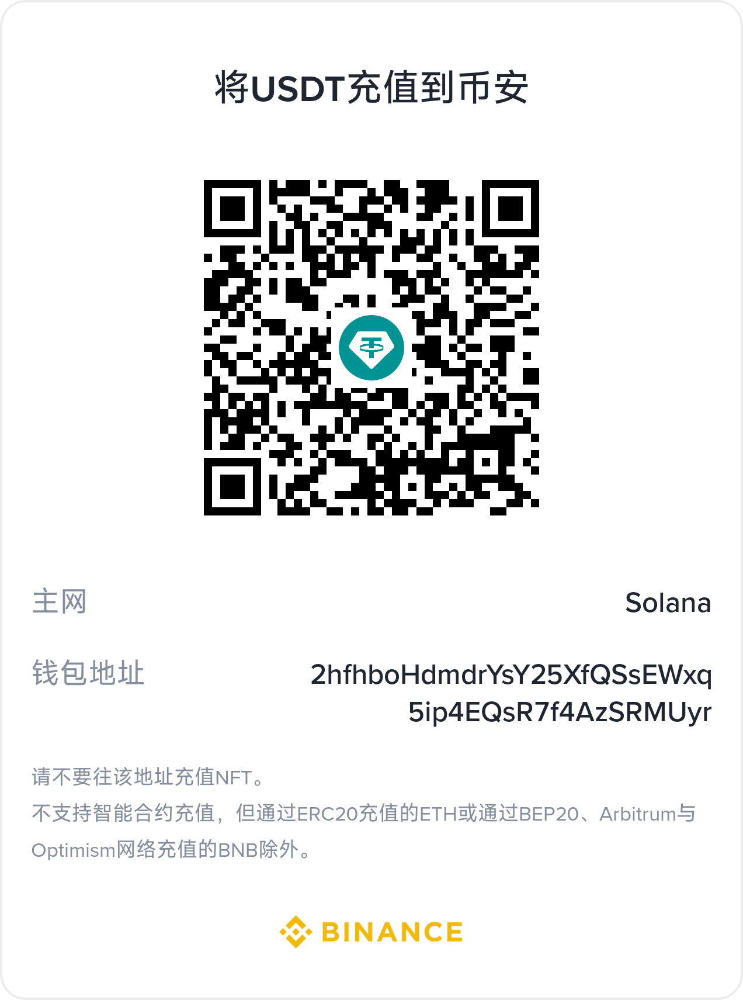

# Cloud Platform — Plateforme mondiale de commerce de ressources cloud

## Languages

| Language | Docs |
|----------|------|
| 简体中文 | [README.md](../../../README.md) |
| English | [README_EN.md](../../../README_EN.md) |
| English | [en docs](../../en/README.md) |
| 한국어 | [ko docs](../../ko/README.md) |
| Русский | [ru docs](../../ru/README.md) |
| Deutsch | [de docs](../../de/README.md) |
| Français | [fr docs](../../fr/README.md) |
| Español | [es docs](../../es/README.md) |
| Português | [pt docs](../../pt/README.md) |
| हिन्दी | [hi docs](../../hi/README.md) |
| العربية | [ar docs](../../ar/README.md) |
| বাংলা | [bn docs](../../bn/README.md) |
| Bahasa Indonesia | [id docs](../../id/README.md) |
| 日本語 | [ja docs](../../ja/README.md) |

<p align="center">
  
</p>

Plateforme de commerce de ressources cloud destinée à un public mondial : achat en ligne et livraison automatique de serveurs (VM), adresses IP, disques cloud, domaines, certificats SSL, stockage d'objets (S3), accélération CDN, etc. Les machines physiques détenues en propre sont virtualisées et livrées via Proxmox VE, tout en prenant en charge l'installation de fournisseurs tiers. La plateforme propose la facturation à l'usage, un programme de distribution par recommandation, une API GraphQL ainsi qu'une observabilité Prometheus/Grafana.

## Pile technologique

| Couche | Technologie |
|------|------|
| Framework backend | PHP 8.2 + [webman](https://github.com/walkor/webman) (workerman) |
| Panneau d'administration | [webman-admin](https://www.workerman.net/plugin/1) (Layui) |
| ORM | Illuminate/Eloquent 10.x |
| Authentification | JWT HS256 ([erikwang2013/jwt-webman](https://github.com/erikwang2013/jwt-webman)) |
| Clé primaire distribuée | ID flocon de neige Snowflake ([erikwang2013/snowflake-php](https://github.com/erikwang2013/snowflake-php)) |
| Obfuscation d'ID | Hashids ([erikwang2013/hashids](https://github.com/erikwang2013/hashids)) |
| Chiffrement de transport | AES-256-GCM ([erikwang2013/encryption](https://github.com/erikwang2013/encryption)) |
| Chiffrement de champs | AES-256-CBC ([erikwang2013/encryptable](https://github.com/erikwang2013/encryptable)) |
| Recherche plein texte | Elasticsearch ([erikwang2013/webman-scout](https://github.com/erikwang2013/webman-scout)) |
| Drapeaux de pays | Emoji Unicode de drapeaux ([erikwang2013/season](https://github.com/erikwang2013/season)) |
| Captcha à clic | Click CAPTCHA ([erikwang2013/poster-php](https://github.com/erikwang2013/poster-php)) |
| Protection de sécurité | Détection de 31 types d'attaques ([erikwang2013/security-php](https://github.com/erikwang2013/security-php)) |
| Export de tableaux | PhpSpreadsheet ^2.0 |
| SDK de paiement | Stripe PHP ^15.0 |
| SDK SMS | Twilio PHP ^8.0 |
| SDK de notification push | Firebase PHP ^7.0 |
| File d'attente | webman redis-queue |
| Base de données | MySQL 8.0 (double connexion : base principale + base d'audit) |
| Moteur de recherche | Elasticsearch 8.x |
| Virtualisation | Proxmox VE (canal gRPC Rust kvm-server, enregistrement e-cat/etcd) |
| Clients | Flutter (iOS/Android/Web/Linux/macOS/Windows) + HarmonyOS ArkTS |
| GraphQL | webonyx/graphql-php ^15.0 |
| Stockage d'objets | AWS S3 SDK PHP ^3.300 |
| Observabilité | Prometheus + Grafana (tableaux de bord préconfigurés) |
| Multilingue | i18n 7 langues (zh/en/ja/ko/de/fr/es) |
| Déploiement | Démarrage en une commande Docker Compose |

## Architecture du système


## Processus métier principal

Processus métier complet de bout en bout, de l'inscription de l'utilisateur à la livraison des ressources, incluant la sélection, la commande, le paiement, la livraison automatique, la gestion après-vente et le cycle de renouvellement.


## Règlement multidevise

Le système prend nativement en charge la tarification, le paiement et le règlement multidevise, couvrant toute la chaîne : paramétrage de la devise de l'utilisateur, tarification régionale, instantanés de taux de change, encaissement des paiements, crédit des soldes et règlement des fournisseurs.


**1. Comptes de solde multidevise**

`user_balances` tient une comptabilité par devise selon `(user_id, currency)` (index unique `uk_user_currency`). À l'inscription, deux comptes devises sont créés par défaut : USD + CNY. Le solde et le solde gelé sont gérés indépendamment par devise et peuvent être étendus à n'importe quelle devise prise en charge par Stripe.

**2. Tarification régionale multidevise**

`product_regions` prend en charge la tarification d'un même SKU dans plusieurs devises pour une même région (index unique `uk_sku_region_currency`). Le front-end affiche les prix selon la devise préférée de l'utilisateur ; à la commande, `OrderService` récupère le prix exact selon `(sku_id, region_id, currency)`.

**3. Système de taux de change**

La tâche planifiée `ExchangeRateSync` synchronise les taux de change depuis exchangerate-api et les écrit dans Redis (cache TTL 30 minutes). Chaque commande enregistre un instantané du taux de change `exchange_rate` au moment de la commande, garantissant la traçabilité des règlements ultérieurs.

**4. Paiement multidevise**

`payment_channels.currency_support` déclare la liste blanche des devises prises en charge par chaque canal de paiement ; `PaymentRouter` filtre dynamiquement les canaux disponibles selon la devise / la plage de montants / la région visible. Stripe PaymentIntent encaisse directement dans la devise de la commande, avec gestion intégrée des décimales pour 16 devises à zéro décimale (JPY / KRW / VND, etc.), et les webhooks vérifient la cohérence entre montant et devise.

**5. Règlement et rapports**

Les transactions de paiement (`payment_transactions`), les règlements fournisseurs (`supplier_settlements`) et les rapports de revenus conservent tous les champs de devise et de taux de change, avec des agrégations statistiques par devise.

## Vue d'ensemble des modules fonctionnels

Le système est organisé en quatre couches : couche client (6 plateformes), couche de passerelle API (12 middlewares), couche de services métier (20+ modules fonctionnels) et couche d'infrastructure (8 composants principaux).


## Cycle de vie des ressources

Une ressource traverse 6 états de sa création à sa résiliation, pilotés par 8 événements de cycle de vie, avec livraison automatique, suspension/reprise, rappels d'expiration et purge de destruction.


## Navigation dans la documentation

| Document | Description |
|------|------|
| [Document de conception d'architecture](docs/architecture.md) | Architecture du système, relations entre composants, pipeline de middlewares, couches de sécurité, architecture des données, topologie de déploiement |
| [Document de conception fonctionnelle](docs/features.md) | Conception détaillée des 21 modules, avec diagrammes de flux, modèles de données et explications d'interactions |
| [Documentation de l'API](docs/api-reference.md) | Référence complète de 200+ points de terminaison, groupés par module, avec exemples de requêtes/réponses et codes d'erreur |
| [Documentation en ligne de l'API (service)](http://localhost:8787/apidoc) | Générée automatiquement par hg/apidoc, groupée par fonctionnalité, prise en charge du débogage en ligne |
| [Documentation en ligne de l'API (admin)](http://localhost:8788/apidoc) | Générée automatiquement par hg/apidoc, 54 contrôleurs répartis en 13 groupes fonctionnels |
| [Conception du panneau d'administration](docs/admin-design.md) | Architecture du panneau Admin, intégration de packages, autorisations ACL, suite de tests |
| [Documentation de l'API fournisseur](docs/supplier-api.md) | Référence de l'API fournisseur (interne + externe), exemples de SDK |
| [Liste de contrôle de déploiement](docs/deployment.md) | Configuration serveur, variables d'environnement, Nginx, HTTPS, tâches planifiées |
| [Rapport d'audit](docs/review-report-2026-08-04.md) | Rapport d'audit d'extension de l'écosystème, avec statistiques, suivi des problèmes et suggestions d'extension |
| [Comparaison des éditions](docs/editions.md) | Comparaison des fonctionnalités, de la conception et de l'architecture des éditions Lite/Standard/Pro |

## Structure du répertoire

```
cloud-php/
├── .claude/                    # Configuration Claude Code (settings / skills)
├── .github/workflows/          # Pipelines CI/CD (lint + PHPUnit double)
├── admin/                      # Panneau d'administration (instance webman indépendante)
│   ├── app/                    # Code source des plugins (PSR-4: app\)
│   │   ├── bootstrap/          # Amorçage des processus (Snowflake / Encryptable / Encryption)
│   │   ├── command/            # Commandes console (Migrate / Rollback / Status)
│   │   ├── common/             # Classes utilitaires (Auth / Tree / Layui / Util / ExcelExport / Migration)
│   │   ├── controller/         # 54 fichiers de contrôleurs (classes de base Base / Crud + CRUD métier)
│   │   ├── exception/          # Gestion des exceptions
│   │   ├── middleware/          # Middlewares de contrôle d'accès (WafMiddleware + AccessControl)
│   │   ├── model/              # 46 modèles Eloquent (classe de base Base avec PK Snowflake + Encryptable)
│   │   ├── view/               # Modèles de vues (panneau Layui)
│   │   └── functions.php       # Fonctions globales d'aide (hashids / encrypt / decrypt)
│   ├── api/                    # Interfaces externes (PSR-4: plugin\admin\api)
│   │   ├── Auth.php            # Interface d'authentification
│   │   ├── Menu.php            # Interface de menu
│   │   ├── Install.php         # Interface d'installation
│   │   └── Middleware.php      # Interface de middleware
│   ├── config/                 # Configuration applicative
│   │   ├── plugin/erikwang2013/ # Configuration des 6 packages erikwang2013
│   │   │   ├── snowflake-php/  # Génération d'ID flocon de neige
│   │   │   ├── hashids/        # Obfuscation d'ID
│   │   │   ├── encryptable/    # Chiffrement au niveau des champs
│   │   │   ├── encryption/     # Chiffrement de transport
│   │   │   ├── webman-scout/   # Synchronisation Elasticsearch
│   │   │   └── season/         # Drapeaux de pays
│   │   ├── route.php           # Définitions des routes
│   │   ├── middleware.php       # Configuration des middlewares
│   │   ├── database.php        # Connexion à la base de données
│   │   └── ...                 # 18 fichiers de configuration
│   ├── database/migrations/    # Fichiers de migration de base de données
│   ├── tests/                  # Tests unitaires (PHPUnit 11, 286 tests / 962 assertions)
│   │   ├── HashidsTest.php     # Encodage/décodage hashids (21 tests)
│   │   ├── BaseJsonTest.php    # Encodage d'ID Base::json() (13 tests)
│   │   ├── CrudHashidsTest.php # Décodage d'entrée Crud (14 tests)
│   │   ├── TreeTest.php        # Structures arborescentes (19 tests)
│   │   ├── AccessControlMiddlewareTest.php # Contrôle d'accès RBAC
│   │   ├── AdminControllersTest.php        # Tests de régression des contrôleurs
│   │   └── support/            # Classes d'aide aux tests
│   ├── public/                 # Racine du document (ressources statiques)
│   ├── vendor/                 # Dépendances Composer
│   ├── .env.example            # Modèle de variables d'environnement
│   ├── composer.json           # Déclaration des dépendances
│   ├── generate.php            # Générateur de code
│   ├── phpunit.xml             # Configuration PHPUnit
│   └── start.php               # Point d'entrée de démarrage
├── service/                    # Service backend (instance webman indépendante)
│   ├── app/                    # Modules métier (PSR-4: App\), chaque module suit une structure Controller / Model / Service
│   │   ├── admin/controller/   # API du panneau d'administration (15 contrôleurs : Dashboard / User / Product / Order / Payment / Supplier / Coupon / Invoice / Domain / Webhook, etc.)
│   │   ├── affiliate/          # Commissions d'affiliation / rémunération de parrainage (Controller / Listener / Model / Service)
│   │   ├── billing/            # Facturation à l'usage / factures (Cron / Service)
│   │   ├── captcha/controller/ # Captcha à clic
│   │   ├── cdn/                # Hébergement de ressources CDN (Controller / Model / Provider / Service)
│   │   ├── command/            # Commandes console (Migrate / Rollback / Status / DbBackup)
│   │   ├── controller/         # Contrôleurs communs (Health / Status / Help / Upload)
│   │   ├── cron/               # Tâches planifiées (planificateur CronRunner + ExchangeRateSync / PaymentReconcile / SupplierSettlement / ExpirationCheck / SslCertificateCheck)
│   │   ├── domain/             # Enregistrement de domaines / gestion DNS (Controller / Model / Service)
│   │   ├── graphql/            # API GraphQL (Mutation / Query / Schema)
│   │   ├── grpc/               # Client gRPC kvm-server + enregistrement etcd (KvmClient / EtcdRegistry)
│   │   ├── model/              # Modèles communs (HelpArticle / Role / Permission)
│   │   ├── monitor/            # Surveillance des ressources / alertes (Controller / Cron / Model / Service)
│   │   ├── notification/       # Notifications de messages (Controller / Model / Queue / Service)
│   │   ├── order/              # Panier / commandes / coupons / factures (Controller / Model / Service)
│   │   ├── payment/            # Routage des paiements / canaux Stripe (Controller / Event / Model / Service)
│   │   ├── product/            # Produits / SKU / tarification régionale / avis (Controller / Model / Service)
│   │   ├── provisioning/       # Moteur de livraison des ressources (Controller / Event / Listener / Model / Provider / Queue / Service)
│   │   ├── report/             # Rapports de revenus / fournisseurs / régions (Controller / Service)
│   │   ├── ssl/                # Émission / gestion des certificats SSL (Controller / Model / Service)
│   │   ├── storage/            # Ressources de stockage d'objets (Controller / Model / Provider / Service)
│   │   ├── supplier/           # Installation des fournisseurs / règlement / retrait + API externe (Controller / Model / Service)
│   │   ├── ticket/             # Système de tickets (Controller / Event / Listener / Model / Service)
│   │   ├── user/               # Utilisateurs / authentification / KYC / soldes / adresses (Controller / Model / Service)
│   │   ├── webhook/            # File d'attente de messages webhook (Queue)
│   │   └── websocket/          # Serveur WebSocket + écouteurs d'événements
│   ├── common/                 # Bibliothèque commune (PSR-4: Common\)
│   │   ├── auth/middleware/     # AuthMiddleware / AdminRoleMiddleware / RbacMiddleware / RoleMiddleware / SupplierApiKeyMiddleware
│   │   ├── captcha/            # Service de captcha à clic
│   │   ├── confirmation/       # Middleware de double confirmation (vérification du mot de passe)
│   │   ├── encryption/middleware/ # Middleware de chiffrement de transport AES-256-GCM
│   │   ├── hashid/middleware/   # Middleware de décodage automatique Hashids + service d'encodage/décodage
│   │   ├── helper/             # Formatage des réponses (encodage hashid automatique)
│   │   ├── http/               # Outils client HTTP (ApiRequest)
│   │   ├── i18n/middleware/     # Middleware multilingue (Locale)
│   │   ├── security/           # CORS / WAF / limitation de débit / blocage géographique / mode maintenance / journaux d'audit
│   │   ├── snowflake/          # Service de génération d'ID flocon de neige / trait Eloquent HasSnowflakeId
│   │   ├── version/middleware/  # Middleware de version d'API (vérification de l'en-tête X-Api-Version)
│   │   ├── clientplatform/middleware/  # Middleware de plateforme client (identification de l'en-tête X-Client-Platform)
│   │   ├── feature/            # Service d'interrupteurs Feature Flags
│   │   └── webhook/            # Distributeur d'événements Webhook
│   ├── config/                 # 17 fichiers de configuration (route / middleware / database / redis / cron / auth / security / i18n / ...)
│   │   └── plugin/             # Configuration des plugins
│   │       ├── erikwang2013/   # encryptable / hashids / jwt / poster / season / webman-scout
│   │       └── webman/         # event / redis-queue
│   ├── database/migrations/    # Fichiers de migration de base de données (37 migrations)
│   ├── i18n/                   # Ressources multilingues (en-US / zh-CN)
│   ├── support/                # Amorçage Bootstrap (Eloquent / Redis / Event / Encryption / Snowflake / Hashids / Scout / MigrationRunner)
│   ├── tests/                  # Tests unitaires (PHPUnit 10, 672 tests / 1632 assertions)
│   │   ├── admin/              # ImportExport / SupplierWithdrawApprove
│   │   ├── affiliate/          # AffiliateService
│   │   ├── auth/               # JwtAuth / RbacSeed / Rbac
│   │   ├── billing/            # MeterCollector / UsageAggregator / SuspendCheck
│   │   ├── captcha/            # CaptchaService
│   │   ├── cdn/                # ResourceCdn
│   │   ├── clientplatform/     # ClientPlatformMiddleware
│   │   ├── common/             # Response / Hashid / Snowflake / Validator / LogSanitizer / Totp / ApiRequest
│   │   ├── confirmation/       # ConfirmationMiddleware
│   │   ├── cron/               # SupplierSettlement
│   │   ├── domain/             # DomainService / DomainTransfer
│   │   ├── graphql/            # Schema
│   │   ├── grpc/               # KvmClient / EtcdRegistry
│   │   ├── monitor/            # AlertEngine
│   │   ├── notification/       # NotificationDispatcher
│   │   ├── order/              # Coupon / Invoice
│   │   ├── payment/            # StripeChannel / PaymentRouter
│   │   ├── product/            # ProductService / Search / ReviewStatus
│   │   ├── provisioning/       # ProviderFactory / RetryLogic
│   │   ├── report/             # ReportService
│   │   ├── security/           # RateLimit / Maintenance / UploadSecurity
│   │   ├── ssl/                # SslCertificate
│   │   ├── storage/            # StorageBucket
│   │   ├── supplier/           # SupplierService / Settlement / Rating / Webhook
│   │   ├── ticket/             # TicketUpdatedWiring
│   │   ├── user/               # AddressController
│   │   ├── version/            # VersionMiddleware
│   │   ├── webhook/            # WebhookDispatcher / WebhookE2E
│   │   ├── websocket/          # WebSocketAuth / EventsWiring
│   │   ├── support/            # RequestMock
│   │   ├── bootstrap.php       # Amorçage des tests
│   │   └── TestCase.php        # Classe de base des tests
│   ├── runtime/                # Fichiers d'exécution (journaux / cache)
│   ├── vendor/                 # Dépendances Composer
│   ├── .env.example            # Modèle de variables d'environnement
│   ├── .env                    # Variables d'environnement locales (gitignore)
│   ├── composer.json           # Déclaration des dépendances
│   ├── phpunit.xml             # Configuration PHPUnit
│   └── start.php               # Point d'entrée de démarrage
├── apps/
│   ├── flutter/                # Client Flutter (iOS / macOS / Windows / Linux / Web)
│   │   ├── lib/                # Code source Dart (core / features)
│   │   ├── ios/                # Projet iOS
│   │   ├── macos/              # Projet macOS
│   │   ├── windows/            # Projet Windows
│   │   ├── linux/              # Projet Linux
│   │   ├── web/                # Projet Web
│   │   ├── test/               # Tests Flutter
│   │   ├── pubspec.yaml        # Déclaration des dépendances
│   │   └── analysis_options.yaml # Configuration d'analyse statique Dart
│   └── harmonyos/              # Squelette de client HarmonyOS
│       └── entry/src/          # Code source ArkTS
├── docker/                     # Déploiement Docker
│   ├── Dockerfile              # Image PHP 8.2
│   ├── docker-compose.yml      # Orchestration des services
│   ├── nginx.conf              # Configuration Nginx
│   └── supervisor.conf         # Gardien de processus Supervisor
├── infrastructure/             # Infrastructure Rust (workspace e-cat)
│   ├── kvm-server/             # Service cloud propriétaire : service gRPC de provisionnement de VM (:50051, enregistrement etcd)
│   │   ├── src/                # main / grpc / driver (pilote simulé, libvirt en Phase 2)
│   │   ├── tests/              # Tests d'intégration
│   │   └── Cargo.toml          # Déclaration de membre du workspace e-cat
│   └── ecat-*/                 # Crates d'infrastructure e-cat (transport-grpc / registry-etcd / protos / config / data, etc.)
├── docs/                       # Documentation
│   ├── admin-design.md         # Document de conception du panneau d'administration
│   ├── supplier-api.md         # Documentation de l'API fournisseur
│   ├── deployment.md           # Liste de contrôle de déploiement
│   ├── api-test.sh             # Script de test de fumée de l'API
│   ├── database.sql            # DDL de la base de données
│   ├── alipay.png / weixinpay.png  # Codes QR de don
│   ├── diagrams/               # 18 diagrammes SVG d'architecture (architecture système / pipeline de sécurité / diagramme ER / flux métier / règlement multidevise, etc.)
│   ├── test-reports/           # Rapports de tests (PHPUnit / Rust / API / UI + captures d'écran)
│   └── superpowers/            # Spécifications de conception et plans de mise en œuvre
│       ├── specs/              # Documents de spécification de conception système
│       └── plans/              # Plans de mise en œuvre par phases 0 à 3
├── scripts/                     # Scripts d'exploitation (push-release.sh : règles de publication — incrément de version + tag)
├── tests/k6/                    # Scripts de test de charge k6 (fumée / produits / concurrence)
├── install.php                 # Point d'entrée de l'assistant d'installation en une commande
├── install/                    # Pages de l'assistant d'installation
│   └── index.php               # Application web de l'assistant
├── install.sql                 # DDL unifié de la base de données (46 tables)
├── .gitignore
├── README.md                   # Description du projet (chinois)
└── README_EN.md                # Description du projet (anglais)
```

## Prise en main rapide

### Prérequis

- PHP 8.2+ (ext-json, ext-pdo, ext-pdo_mysql, ext-redis, ext-openssl)
- MySQL 8.0
- Redis 7

### Installation en une commande (recommandé)

Le projet fournit un assistant d'installation web qui permet de réaliser toute la configuration depuis le navigateur :

```bash
# 1. Installer les dépendances
cd service && composer install && cd ../admin && composer install && cd ..

# 2. Lancer l'assistant d'installation
php install.php
# Ouvrir le navigateur et accéder à http://localhost:8888

# 3. Suivre les instructions de l'assistant :
#    - Vérification de l'environnement
#    - Configuration de la base de données (hôte, port, nom de base, utilisateur, mot de passe)
#    - Paramétrage du compte administrateur du panneau (nom d'utilisateur, mot de passe, e-mail)
#    - Exécution de l'installation en une commande (création des tables + écriture de la configuration)
```

Une fois l'installation terminée, l'assistant effectue automatiquement :
- la création des 46 tables de base de données (tables d'administration `wa_*` + tables métier sans préfixe) ;
- la création du rôle et du compte super administrateur ;
- la génération des fichiers de configuration `service/.env` et `admin/.env` (avec clés JWT/chiffrement générées automatiquement).

### Installation manuelle

```bash
cd service

# 1. Installer les dépendances
composer install

# 2. Configurer les variables d'environnement
cp .env.example .env
# Modifier .env pour renseigner le mot de passe de la base de données, la clé JWT, la clé de chiffrement, etc.
# Génération de ENCRYPTION_MASTER_KEY : openssl rand -base64 32
# Génération de ENCRYPTION_KEY : echo -n "$(openssl rand -base64 16)" | base64 -w0
# Génération de JWT_SECRET_KEY : openssl rand -base64 32

# 3. Créer la base de données et importer
mysql -u root -p -e "CREATE DATABASE cloud_platform CHARACTER SET utf8mb4 COLLATE utf8mb4_unicode_ci;"
mysql -u root -p cloud_platform < ../install.sql

# 4. Démarrer le service (mode développement)
php start.php start
# Accéder à http://localhost:8787
```

### Déploiement Docker

```bash
# Depuis la racine du projet
cp service/.env.example .env
# Modifier .env pour renseigner les clés

docker compose -f docker/docker-compose.yml up -d
# API : http://localhost
```

### Panneau d'administration

```bash
cd admin

# 1. Installer les dépendances
composer install

# 2. Configurer les variables d'environnement
cp .env.example .env
# Si l'assistant d'installation en une commande a été utilisé, ce fichier est déjà généré

# 3. Démarrer le service (mode développement)
php start.php start
# Accéder à http://localhost:8787/app/admin
```

### Mode démon

```bash
php start.php start -d          # Démarrer
php start.php status            # Voir l'état
php start.php restart           # Redémarrer
php start.php stop              # Arrêter
```

## Aperçu de l'API

Les interfaces sont groupées par module, avec exemples de requêtes/réponses et codes d'erreur : [Aperçu de l'API](docs/api-overview.md) (sélection) · [Documentation de l'API](docs/api-reference.md) (référence complète de 200+ points de terminaison) · [Débogage en ligne](http://localhost:8787/apidoc)

## Architecture du panneau d'administration

### Intégration technique

Le panneau d'administration est une instance webman indépendante qui intègre 7 packages erikwang2013 :

| Package | Usage | Mise en œuvre |
|---|------|---------|
| snowflake-php | Clé primaire distribuée 64 bits | Génération automatique via l'événement `creating` de `Base::boot()` |
| hashids | Obfuscation des ID d'API | Encodage des réponses par `Base::json()`, décodage des requêtes par `Crud::selectInput/updateInput/deleteInput` |
| encryptable | Chiffrement des champs de base de données | Cast Eloquent `Encryptable`, chiffrement/déchiffrement transparent pour Admin (password/email/mobile) et User (6 champs) |
| encryption | Chiffrement du transport d'API | Fonctions d'aide `encrypt_data()`/`decrypt_data()` prévues |
| webman-scout | Recherche plein texte ES | Trait `Searchable` sur le modèle User, synchronisation automatique des index |
| season | Emoji de drapeaux de pays | Fonction globale d'aide `country_season_flag()` |
| poster-php | Captcha à clic | Bootstrap `CaptchaPlugin`, fonctions globales `captcha_create()`/`captcha_verify()` |

### Couches de sécurité

```
Requête → décodage Hashids (Crud::selectInput/updateInput/deleteInput)
  → authentification ACL (api/Auth.php, noNeedLogin/noNeedAuth sur les contrôleurs)
  → traitement métier (CRUD / événements de modèles)
  → chiffrement des champs Encryptable (casts Eloquent set)
  → écriture en base de données
Réponse ← encodage Hashids (Base::json → hashids_encode_ids)

Connexion/inscription : vérification Captcha → Auth → traitement métier
```

### Flux de données

- **Chemin d'écriture** : ID de requête (hashid) → décodé en int → opération CRUD → génération d'un nouvel ID Snowflake → chiffrement Encryptable des champs sensibles → DB
- **Chemin de lecture** : DB → déchiffrement Encryptable → encodage Hashids des ID → réponse JSON

### Couverture des tests

```
phpunit.xml (PHPUnit 11, 286 tests / 962 assertions)
├── HashidsTest              (21 tests) encode/decode/encode_ids
├── BaseJsonTest             (13 tests) encodage Base::json/success/fail
├── CrudHashidsTest          (14 tests) décodage d'entrée Crud (select/update/delete)
├── TreeTest                 (19 tests) structures arborescentes / descendants / ancêtres / nœuds orphelins
├── AccessControlMiddlewareTest (7 tests) 401 non connecté / page 403 / laisser passer
├── AdminControllersTest     (data provider) assemblage de 48 contrôleurs / surface CRUD / chemins de vues GET
├── UtilTest                 (17 tests) mot de passe / temps / octets / filtrage d'entrée / attributs de widgets
├── DictTest                 (5 tests) conversion dictionnaire↔option / save/get/delete
├── ExcelExportTest          (4 tests) en-têtes / aplatissement JSON / numéros de lignes / cellules vides
└── LayuiTest                (5 tests) input / inputNumber / échappement label / switch / html
```

## Conception

### 1. Monolithe modulaire

Les modules sont découpés verticalement par domaine métier (User / Product / Order / Payment / Provisioning / Ticket / Notification, etc.) et suivent chacun une architecture MVC :

- **Controller** — couche HTTP : validation des paramètres, appel des Services, retour de Response
- **Service** — logique métier, sans dépendance HTTP, réutilisable par les contrôleurs et les workers de files d'attente
- **Model** — modèles de données Eloquent, définissant relations et portées de requête

Les modules sont découplés via des **événements** et des **interfaces**, sans appel direct des Services d'autrui. Par exemple : paiement terminé → événement `OrderPaid` → `ProvisioningService` livre automatiquement la ressource ; création d'un ticket → événement `TicketCreated` → attribution automatique d'un agent de support.

### 2. Livraison pilotée par événements

```
Commande utilisateur → paiement réussi → événement OrderPaid
  → ProvisioningService.handleOrderPaid()
    → création d'un ProvisionTask pour chaque OrderItem (status=pending)
    → consommateur Redis Queue ProvisionWorker
      → ProviderFactory.create(task) résout le Provider
      → ProxmoxProvider.create()
        → HostSelector sélectionne la machine physique la plus disponible
        → ProxmoxApi crée la VM / monte le disque / attribue l'IP
          (le service de provisionnement gRPC Rust kvm-server est en base : découverte d'enregistrement
           e-cat/etcd, câblage du KvmClient côté PHP ; pilote simulé, pilote réel libvirt en Phase 2)
        → création des enregistrements Resource / Disk
      → mise à jour du statut de la commande à completed
```

En cas d'échec de livraison, nouvelle tentative automatique avec stratégie de backoff : 1min → 5min → 15min → 1h → 6h → 24h ; au-delà de 6 tentatives, échec marqué et alerte déclenchée.

### 3. Architecture de plugins Provider

La livraison des ressources est abstraite via `ProviderInterface` ; différentes infrastructures implémentent la même interface :

```
ProviderInterface
  ├── ProxmoxProvider    (Proxmox VE en propre)
  ├── AliyunProvider     (futur : Alibaba Cloud)
  ├── AwsProvider        (futur : AWS EC2)
  └── DomainProvider     (futur : bureaux d'enregistrement de domaines)
```

`ProviderFactory` enregistre des fonctions de fabrique sous la clé `productType:provider` et les résout dynamiquement au moment de l'exécution selon le ProvisionTask.

### 4. Routage de paiements multiples

`PaymentRouter` renvoie dynamiquement les canaux de paiement disponibles selon le montant / la devise / la région de la commande ; le front-end peut basculer de canal pour initier le paiement. Les canaux sont configurés via la table `PaymentChannel` (frais, montants min/max, régions visibles), sans modification de code pour les activer ou les désactiver.

### 5. Architecture de sécurité

Chaîne de middlewares globale : `Version → CORS → SecurityHeaders → ClientPlatform → GeoBlock → WAF → SecurityPlugin → RateLimit → Locale → Metrics → HashidRequest → Maintenance → [Route : Encryption → Captcha → Auth → Confirmation]`


- **CORS** — gestion des en-têtes de requêtes inter-origines (mode liste blanche, prise en charge des jokers *.example.com)
- **SecurityHeaders** — en-têtes de réponse de sécurité (HSTS / X-Frame-Options / X-Content-Type-Options / Referrer-Policy / Permissions-Policy)
- **GeoBlock** — blocage géographique (blocage de pays via GEO_BLOCKED_COUNTRIES, basé sur GeoIP2)
- **WAF** — 8 catégories, 45+ règles (injection SQL / XSS / injection de commandes / inclusion de fichiers / injection d'en-têtes / SSRF / injection NoSQL / redirection ouverte) + limitation de la taille des requêtes + validation Content-Type (les injections de valeurs sont analysées dans query/body/UA, le chemin n'est vérifié que pour les traversées de chemin)
- **Security Plugin** — détection de 31 types d'attaques (XSS / injection SQL / injection de commandes / SSRF / désérialisation / attaques JWT / attaques par en-tête Host / request smuggling / injection GraphQL / fuite de données sensibles, etc.), liste blanche IP + bannissement automatique par liste noire IP
- **Locale** — analyse de Accept-Language, définition de la langue
- **HashidRequest** — décodage automatique des chaînes hashid des requêtes en ID entiers réels
- **Version** — validation de l'en-tête `X-Api-Version`, défaut `v1` si absent, `400` si version non prise en charge
- **ClientPlatform** — validation de l'en-tête `X-Client-Platform`, identification de la plateforme du système client (iPadOS/macOS/Windows/Linux/iOS/Android/HarmonyOS/Web)
- **Encryption** — chiffrement de transport AES-256-GCM (interfaces authentifiées et panneau d'administration), protection contre l'écoute et l'altération
- **Captcha** — captcha à clic, vérifié avant connexion/inscription (dessin GD + stockage Redis, clé à usage unique, validité 300 s, limite de 3 tentatives)
- **Auth** — authentification JWT HS256, Access Token 15 minutes, Refresh Token 30 jours, liste noire Redis
- **Confirmation** — les opérations sensibles (paiement / suppression / remboursement / approbation, etc.) exigent une revérification du mot de passe, verrouillage de 15 minutes après 5 échecs
- **Limitation de débit** — 60 req/min par défaut, 5 req/min pour la connexion, 3 req/min pour l'inscription, 10 req/min pour le paiement
- **Journaux d'audit** — toutes les opérations sensibles sont écrites dans une base d'audit indépendante

### 6. Sécurité des données

**Stratégie de chiffrement en couches :**

| Couche | Technologie | Description |
|------|------|------|
| Transport | AES-256-GCM | Chiffrement des corps de requêtes/réponses API, chiffrement authentifié GCM anti-altération |
| Champs | AES-256-CBC | Chiffrement/déchiffrement automatique des champs sensibles des modèles, IV aléatoire CBC sans fuite de motifs d'égalité |
| Clé primaire | Hashids | Obfuscation des ID externes en chaînes de 12 caractères, masquage de l'échelle réelle des données |

**Chiffrement des champs sensibles :** 14 champs de 7 modèles utilisent `Encryptable::class` pour le chiffrement/déchiffrement automatique — `User(email, phone, password_hash)`, `UserKyc(id_number, real_name)`, `UserAddress(phone, address)`, `Supplier(contact_name, phone, email)`, `HostMachine(api_token)`, `PaymentChannel(api_key, webhook_secret)`, `RefreshToken(token_hash, device_fingerprint)`.

**Gestion des clés :** le chiffrement de transport et le chiffrement des champs utilisent des clés indépendantes distinctes (`ENCRYPTION_MASTER_KEY` vs `ENCRYPTION_KEY`) ; une liste de clés précédentes (`ENCRYPTION_PREVIOUS_KEYS`) prend en charge la rotation des clés sans interruption de service.

### 7. Génération d'ID distribués

L'algorithme Twitter Snowflake génère des ID uniques globaux 64 bits : `timestamp(41b) | datacenter(5b) | worker(5b) | sequence(12b)`. Les 46 modèles Eloquent génèrent automatiquement un ID flocon de neige dans l'événement `creating`, sans dépendance à l'auto-incrément de la base, prenant nativement en charge le partitionnement par base/table.

### 8. Multilingue (i18n)

**Analyse automatique par middleware global :**
- `LocaleMiddleware` lit l'en-tête `Accept-Language` et définit automatiquement la langue courante
- Repli de langue pris en charge : langue non prise en charge → `fallback_locale` (en-US)

**Traduction des textes statiques :**
- `I18n::trans('auth.login_success')` → `登录成功` / `Login successful`
- Fichiers de traduction : `i18n/{locale}/messages.php`, 120 entrées couvrant les 15 modules
- Substitution de paramètres prise en charge : `I18n::trans('validation.required', ['field' => '邮箱'])`

**Champs JSON multilingues :**
- Nom / description des produits stockés sous la forme `{"zh-CN":"云服务器","en-US":"Cloud Server"}`
- `I18n::translateField($json)` récupère automatiquement la valeur selon la langue courante
- Les modèles de notifications prennent également en charge le multilingue, envoyés selon la langue préférée de l'utilisateur

### 9. Recherche plein texte

4 modèles (produits, utilisateurs, commandes, tickets) sont intégrés à la recherche via le trait `Erikwang2013\WebmanScout\Searchable`. Le pilote par défaut est `database` (écriture no-op, recherche dégradée en SQL LIKE, sans dépendance ES) ; une fois le pilote Elasticsearch configuré, les index sont synchronisés automatiquement, avec prise en charge de :

- **segmentation multilingue** — IK Analyzer (ik_max_word / ik_smart)
- **recherche plein texte en chinois** — noms de produits, descriptions, titres de tickets
- **filtrage précis** — par statut, catégorie, plage de prix, plage de temps
- **synchronisation en masse** — `php webman scout:import "App\Product\Model\Product"`
- **exemple de recherche** — `Product::search('VPS服务器')->where('status', 'published')->get()`

### 10. Drapeaux de pays

Prise en charge des emoji de drapeaux de tous les pays via `erikwang2013/season` :

- `country_season_flag('CN')` → 🇨🇳, `country_season_flag('JP')` → 🇯🇵
- Détection automatique de l'hémisphère nord/sud, retour de la saison correspondante (zh/en)
- Noms de saisons localisés dans 30+ langues
- Utilisable directement dans la sélection régionale du front-end, l'affichage de la nationalité des utilisateurs, etc.

## Liste des tâches

- [x] DDL de la base de données (`install.sql`, 46 tables, tables d'administration wa_* + tables métier sans préfixe, clés primaires BigInt non auto-incrémentées)
- [x] Génération d'ID flocon de neige (`erikwang2013/snowflake-php`)
- [x] Authentification JWT (`erikwang2013/jwt-webman`, HS256 + liste noire Redis)
- [x] Obfuscation des ID d'API (`erikwang2013/hashids`, décodage automatique des requêtes + encodage automatique des réponses)
- [x] Chiffrement de transport (`erikwang2013/encryption`, middleware AES-256-GCM)
- [x] Chiffrement au niveau des champs (`erikwang2013/encryptable`, chiffrement/déchiffrement automatique des champs sensibles)
- [x] Recherche plein texte (`erikwang2013/webman-scout`, pilote database par défaut avec dégradation SQL LIKE, Elasticsearch + IK optionnel)
- [x] Drapeaux de pays (`erikwang2013/season`, emoji de drapeaux Unicode)
- [x] Panneau d'administration (`admin/`, webman-admin + intégration de 7 packages, 286 tests unitaires)
- [x] Revue de code (2 correctifs critiques + 4 correctifs importants appliqués)
- [x] Export Excel (PhpSpreadsheet ^2.0, Crud/Table du panneau + API de gestion côté serveur)
- [x] Visualisations du tableau de bord (graphiques ECharts + cartes statistiques animées + panneau d'informations système)
- [x] Export PDF (html2canvas + jsPDF, export de captures d'écran du tableau de bord)
- [x] Scripts de migration de base de données (`install.sql` DDL unifié, commande `php webman migrate`)
- [x] Intégration Stripe réelle (SDK stripe-php, PaymentIntent + vérification de signature Webhook)
- [x] Intégration Twilio SMS réelle (twilio/sdk, avec gestion des échecs d'envoi)
- [x] Intégration réelle des notifications push FCM (kreait/firebase-php, avec nettoyage des jetons invalides)
- [x] Captcha à clic (erikwang2013/poster-php, vérification des opérations sensibles de connexion/inscription)
- [x] Double confirmation (ConfirmationMiddleware, revérification du mot de passe pour les opérations sensibles, verrouillage de 15 min après 5 échecs)
- [x] Tests unitaires serveur (672 tests / 1632 assertions, 15 ignorés)
- [x] Identification de la plateforme client (ClientPlatformMiddleware, en-tête X-Client-Platform prenant en charge 8 plateformes)
- [x] Renforcement WAF (8 catégories, 45+ règles : injection SQL / XSS / injection de commandes / inclusion de fichiers / injection d'en-têtes / SSRF / injection NoSQL / redirection ouverte + limitation de taille des requêtes + validation Content-Type)
- [x] Security Plugin (erikwang2013/security-php, détection de 31 types d'attaques + bannissement automatique par liste noire IP + rotation des journaux)
- [x] Middleware WAF du panneau Admin
- [x] Séparation lecture/écriture MySQL (connexions Eloquent read/write + sticky)
- [x] Couche de cache Redis multi-niveaux (CacheService : produits / régions / taux de change / TLD / utilisateurs, TTL + invalidation active + préchauffage)
- [x] Compression des réponses Nginx + optimisation des connexions (gzip/proxy_buffering/keep-alive/limit_req+limit_conn)
- [x] Recommandations d'index de base de données (13 index composites/couvrants recommandés)
- [x] Surveillance des exceptions Sentry (SentryBootstrap + rappel before_send de désensibilisation)
- [x] Interrupteurs Feature Flags (surcharge dynamique Redis + API du panneau d'administration)
- [x] API externe fournisseur (authentification par clé API + points de terminaison commandes/ressources/règlements/retraits)
- [x] Push temps réel WebSocket (WebSocket natif Workerman + écouteurs d'événements commandes/tickets)
- [x] Scripts de test de charge k6 (fumée / produits / test de concurrence)
- [x] Pipeline CI/CD (GitHub Actions, lint + PHPUnit double + validation Composer)
- [x] Assistant d'installation en une commande (UI web, vérification de l'environnement + configuration de la base + création de l'administrateur + génération automatique du .env)

## Open source : votre soutien est bienvenu

| WeChat | Alipay |
|:---:|:---:|
|  |  |

### Virement international (virement bancaire)

**Informations du bénéficiaire**

- Nom du bénéficiaire : WANG KEXUN
- Numéro de compte du bénéficiaire : 881015918251

**Banque du bénéficiaire (ZA Bank)**

- Code SWIFT : AABLHKHHXXX
- Nom de la banque : ZA Bank Limited
- Code banque : 387
- Adresse de la banque : Core F, Cyberport 3, 100 Cyberport Road, Hong Kong

**Banque intermédiaire pour virements transfrontaliers (si nécessaire)**

> Veuillez noter qu'il s'agit d'informations sur la banque intermédiaire (banque relais) pour les virements transfrontaliers, et non sur la banque du bénéficiaire. Veuillez vous renseigner auprès de votre banque émettrice pour savoir si des informations sur la banque intermédiaire sont requises.

- La banque intermédiaire pour les virements en dollars de Hong Kong, en yuans et en dollars américains est **Citibank** :
  - Nom de la banque : Citibank N.A. Hong Kong
  - Code SWIFT : CITIHKHXXXX
  - Code banque : 006
  - Nom de la succursale : Hong Kong Branch
  - Code succursale : 391
  - Adresse de la banque : Citibank Tower, Citibank Plaza, 3 Garden Road, Central, Hong Kong
- La banque intermédiaire pour les autres devises est **BNY Mellon** :
  - Nom de la banque : THE BANK OF NEW YORK MELLON
  - Code SWIFT : IRVTUS3NXXX
  - Adresse de la banque : THE BANK OF NEW YORK MELLON, 240 GREENWICH STREET, NEW YORK, United States

### Don en cryptomonnaie (Crypto Donation)

Si ce projet vous est utile, scannez le code QR pour faire un don, merci !

| <br>**BNB Smart Chain (BEP20)**<br>`0x355d429f97511897ccb4e271ec888205f9ab6629` | <br>**Tron (TRC20)**<br>`TEdDHWLajt1XvqtPDWmQctdrJaC3pzZZzz` |
| <br>**Ethereum (ERC20)**<br>`0x355d429f97511897ccb4e271ec888205f9ab6629` | <br>**Aptos**<br>`0x836e3780edfc3f7b2372b39e2a1a3a5d7adfaccd96c726f21cfde1b50dd68030` |
| <br>**Plasma**<br>`0x355d429f97511897ccb4e271ec888205f9ab6629` | <br>**Polygon POS**<br>`0x355d429f97511897ccb4e271ec888205f9ab6629` |
| <br>**Solana**<br>`2hfhboHdmdrYsY25XfQSsEWxq5ip4EQsR7f4AzSRMUyr` | <br>**The Open Network (TON)**<br>`UQB9kFQohzmXUir9QSSZq01iwl9aQZIDdBpNmDklljRtCoGK` |
| <br>**Arbitrum One**<br>`0x355d429f97511897ccb4e271ec888205f9ab6629` | <br>**AVAX C-Chain**<br>`0x355d429f97511897ccb4e271ec888205f9ab6629` |

---

## License

Édition Lite — Licence MIT | Éditions Standard/Pro — Propriétaire
