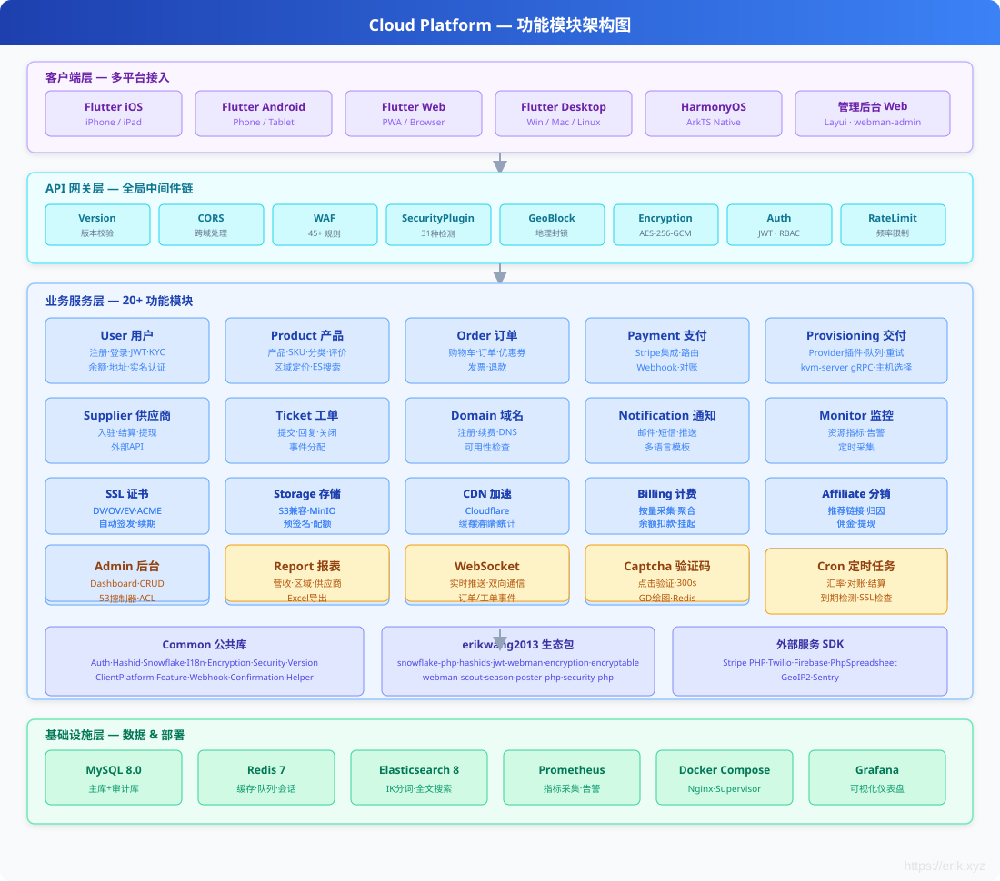
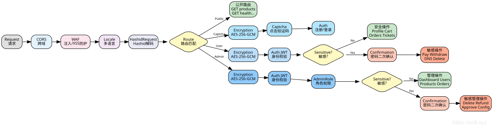

# Cloud Platform — वैश्विक क्लाउड संसाधन ट्रेडिंग प्लेटफ़ॉर्म

## Languages

| Language | Docs |
|----------|------|
| 简体中文 | [README.md](../../../README.md) |
| English | [README_EN.md](../../../README_EN.md) |
| English | [en docs](../../en/README.md) |
| 한국어 | [ko docs](../../ko/README.md) |
| Русский | [ru docs](../../ru/README.md) |
| Deutsch | [de docs](../../de/README.md) |
| Français | [fr docs](../../fr/README.md) |
| Español | [es docs](../../es/README.md) |
| Português | [pt docs](../../pt/README.md) |
| हिन्दी | [hi docs](../../hi/README.md) |
| العربية | [ar docs](../../ar/README.md) |
| বাংলা | [bn docs](../../bn/README.md) |
| Bahasa Indonesia | [id docs](../../id/README.md) |
| 日本語 | [ja docs](../../ja/README.md) |

<p align="center">
  
</p>

वैश्विक उपयोगकर्ताओं के लिए क्लाउड संसाधन ट्रेडिंग प्लेटफ़ॉर्म — सर्वर (VM), IP पता, क्लाउड डिस्क, डोमेन, SSL प्रमाणपत्र, ऑब्जेक्ट स्टोरेज (S3), CDN एक्सेलेरेशन आदि उत्पादों की ऑनलाइन खरीद और स्वचालित डिलीवरी का समर्थन करता है। स्वयं-संचालित भौतिक मशीनें Proxmox VE वर्चुअलाइज़ेशन के माध्यम से डिलीवर की जाती हैं, साथ ही तृतीय-पक्ष सप्लायर्स के लिए विक्रेता-जुड़ाव (निवेश) और बिक्री का समर्थन करता है। पे-एज़-यू-गो बिलिंग, रेफरल डिस्ट्रीब्यूशन, GraphQL API और Prometheus/Grafana ऑब्ज़र्वेबिलिटी प्रदान करता है।

## टेक्नोलॉजी स्टैक

| परत | तकनीक |
|------|------|
| बैकएंड फ्रेमवर्क | PHP 8.2 + [webman](https://github.com/walkor/webman) (workerman) |
| एडमिन पैनल | [webman-admin](https://www.workerman.net/plugin/1) (Layui) |
| ORM | Illuminate/Eloquent 10.x |
| प्रमाणीकरण | JWT HS256 ([erikwang2013/jwt-webman](https://github.com/erikwang2013/jwt-webman)) |
| वितरित प्राइमरी की | Snowflake स्नोफ्लेक ID ([erikwang2013/snowflake-php](https://github.com/erikwang2013/snowflake-php)) |
| ID ऑब्स्क्यूरेशन | Hashids ([erikwang2013/hashids](https://github.com/erikwang2013/hashids)) |
| ट्रांसमिशन एन्क्रिप्शन | AES-256-GCM ([erikwang2013/encryption](https://github.com/erikwang2013/encryption)) |
| फ़ील्ड एन्क्रिप्शन | AES-256-CBC ([erikwang2013/encryptable](https://github.com/erikwang2013/encryptable)) |
| फुल-टेक्स्ट सर्च | Elasticsearch ([erikwang2013/webman-scout](https://github.com/erikwang2013/webman-scout)) |
| देश के झंडे | Unicode Flag Emoji ([erikwang2013/season](https://github.com/erikwang2013/season)) |
| क्लिक कैप्चा | Click CAPTCHA ([erikwang2013/poster-php](https://github.com/erikwang2013/poster-php)) |
| सुरक्षा सुरक्षा | 31 प्रकार की अटैक डिटेक्शन ([erikwang2013/security-php](https://github.com/erikwang2013/security-php)) |
| टेबल एक्सपोर्ट | PhpSpreadsheet ^2.0 |
| पेमेंट SDK | Stripe PHP ^15.0 |
| SMS SDK | Twilio PHP ^8.0 |
| पुश SDK | Firebase PHP ^7.0 |
| क्यू | webman redis-queue |
| डेटाबेस | MySQL 8.0 (मास्टर + ऑडिट डेटाबेस डुअल कनेक्शन) |
| सर्च इंजन | Elasticsearch 8.x |
| वर्चुअलाइज़ेशन | Proxmox VE (Rust kvm-server gRPC चैनल, e-cat/etcd रजिस्ट्रेशन) |
| क्लाइंट | Flutter (iOS/Android/Web/Linux/macOS/Windows) + HarmonyOS ArkTS |
| GraphQL | webonyx/graphql-php ^15.0 |
| ऑब्जेक्ट स्टोरेज | AWS S3 SDK PHP ^3.300 |
| ऑब्ज़र्वेबिलिटी | Prometheus + Grafana (प्री-इंस्टॉल डैशबोर्ड) |
| बहुभाषा | i18n 7 भाषाएँ (चीनी/अंग्रेज़ी/जापानी/कोरियाई/जर्मन/फ़्रेंच/स्पेनिश) |
| डिप्लॉयमेंट | Docker Compose वन-क्लिक स्टार्ट |

## सिस्टम आर्किटेक्चर


## मुख्य व्यावसायिक प्रक्रियाएँ

उपयोगकर्ता पंजीकरण से लेकर संसाधन डिलीवरी तक की पूरी एंड-टू-एंड व्यावसायिक प्रक्रिया, जिसमें चयन, ऑर्डर, भुगतान, स्वचालित डिलीवरी, बिक्री के बाद प्रबंधन और नवीनीकरण चक्र शामिल हैं।


## मल्टी-करेंसी सेटलमेंट

सिस्टम मूल रूप से मल्टी-करेंसी प्राइसिंग, भुगतान और सेटलमेंट का समर्थन करता है, जो उपयोगकर्ता करेंसी सेटिंग, क्षेत्रीय मूल्य निर्धारण, विनिमय दर स्नैपशॉट से लेकर भुगतान संग्रह, बैलेंस जमा और सप्लायर सेटलमेंट तक की पूरी श्रृंखला को कवर करता है।


**1. मल्टी-करेंसी बैलेंस खाता**

`user_balances` तालिका `(user_id, currency)` के अनुसार प्रति-करेंसी लेखांकन करती है (यूनिक इंडेक्स `uk_user_currency`)। पंजीकरण के समय डिफ़ॉल्ट रूप से USD + CNY दो करेंसी खाते बनाए जाते हैं; बैलेंस और फ्रोजन बैलेंस प्रत्येक करेंसी के लिए स्वतंत्र रूप से प्रबंधित होते हैं, और Stripe द्वारा समर्थित किसी भी करेंसी तक विस्तार योग्य है।

**2. मल्टी-करेंसी क्षेत्रीय मूल्य निर्धारण**

`product_regions` एक ही SKU को एक ही क्षेत्र में कई करेंसियों में मूल्य निर्धारित करने का समर्थन करता है (यूनिक इंडेक्स `uk_sku_region_currency`)। फ्रंटएंड उपयोगकर्ता की पसंदीदा करेंसी के अनुसार मूल्य प्रदर्शित करता है; ऑर्डर करते समय `OrderService` `(sku_id, region_id, currency)` के अनुसार सटीक मूल्य लेता है।

**3. विनिमय दर प्रणाली**

`ExchangeRateSync` क्रोन जॉब exchangerate-api से विनिमय दरें सिंक करता है और Redis में लिखता है (30 मिनट TTL कैश)। प्रत्येक ऑर्डर में ऑर्डर के समय का `exchange_rate` विनिमय दर स्नैपशॉट दर्ज होता है, जिससे बाद के सेटलमेंट की ट्रेसेबिलिटी सुनिश्चित होती है।

**4. मल्टी-करेंसी भुगतान**

`payment_channels.currency_support` प्रत्येक पेमेंट चैनल द्वारा समर्थित करेंसी व्हाइटलिस्ट की घोषणा करता है; `PaymentRouter` करेंसी / राशि सीमा / दृश्य क्षेत्र के आधार पर उपलब्ध चैनलों को गतिशील रूप से फ़िल्टर करता है। Stripe PaymentIntent सीधे ऑर्डर करेंसी में भुगतान प्राप्त करता है, 16 शून्य-दशमलव करेंसी (JPY / KRW / VND आदि) के दशमलव-स्थान हैंडलिंग के साथ बिल्ट-इन, और Webhook कॉलबैक राशि और करेंसी स्थिरता की पुष्टि करता है।

**5. सेटलमेंट और रिपोर्ट**

पेमेंट ट्रांज़ैक्शन (`payment_transactions`), सप्लायर सेटलमेंट (`supplier_settlements`) और रेवेन्यू रिपोर्ट सभी में करेंसी और विनिमय दर फ़ील्ड रखे जाते हैं, और करेंसी के अनुसार सांख्यिकीय रूप से एकत्रित किए जाते हैं।

## फ़ंक्शन मॉड्यूल अवलोकन

सिस्टम चार-परत आर्किटेक्चर में व्यवस्थित है: क्लाइंट परत (6 प्लेटफ़ॉर्म इंटीग्रेशन), API गेटवे परत (12 मिडलवेयर), बिज़नेस सर्विस परत (20+ फ़ंक्शन मॉड्यूल), इंफ्रास्ट्रक्चर परत (8 मुख्य घटक)।



## संसाधन जीवनचक्र

संसाधन निर्माण से समाप्ति तक कुल 6 स्थितियों से गुजरता है, जो 8 जीवनचक्र इवेंट्स द्वारा संचालित होता है, और स्वचालित डिलीवरी, सस्पेंशन-रीज़्यूम, समाप्ति अनुस्मारक और डिस्ट्रक्शन-क्लीनअप का समर्थन करता है।


## दस्तावेज़ नेविगेशन

| दस्तावेज़ | विवरण |
|------|------|
| [आर्किटेक्चर डिज़ाइन दस्तावेज़](docs/architecture.md) | सिस्टम आर्किटेक्चर, घटक संबंध, मिडलवेयर पाइपलाइन, सुरक्षा परतें, डेटा आर्किटेक्चर, डिप्लॉयमेंट टोपोलॉजी |
| [फ़ीचर डिज़ाइन दस्तावेज़](docs/features.md) | 21 मॉड्यूल का विस्तृत फ़ंक्शन डिज़ाइन, फ्लोचार्ट, डेटा मॉडल, इंटरैक्शन विवरण सहित |
| [API इंटरफ़ेस दस्तावेज़](docs/api-reference.md) | 200+ एंडपॉइंट्स का पूर्ण संदर्भ, मॉड्यूल के अनुसार समूहीकृत, अनुरोध/प्रतिक्रिया उदाहरण और त्रुटि कोड सहित |
| [API ऑनलाइन दस्तावेज़ (service)](http://localhost:8787/apidoc) | hg/apidoc द्वारा स्वतः उत्पन्न, फ़ंक्शन के अनुसार समूहीकृत, ऑनलाइन डीबगिंग समर्थित |
| [API ऑनलाइन दस्तावेज़ (admin)](http://localhost:8788/apidoc) | hg/apidoc द्वारा स्वतः उत्पन्न, 54 कंट्रोलर 13 फ़ंक्शन समूह |
| [एडमिन पैनल डिज़ाइन](docs/admin-design.md) | Admin पैनल आर्किटेक्चर, पैकेज इंटीग्रेशन, ACL अनुमतियाँ, टेस्ट सूट |
| [सप्लायर API दस्तावेज़](docs/supplier-api.md) | सप्लायर API संदर्भ (आंतरिक + बाह्य), SDK उदाहरण |
| [डिप्लॉयमेंट चेकलिस्ट](docs/deployment.md) | सर्वर कॉन्फ़िगरेशन, पर्यावरण चर, Nginx, HTTPS, क्रोन जॉब्स |
| [रिव्यू रिपोर्ट](docs/review-report-2026-08-04.md) | इकोसिस्टम एक्सटेंशन रिव्यू रिपोर्ट, सांख्यिकीय डेटा, इश्यू ट्रैकिंग, एक्सटेंशन सुझाव सहित |
| [संस्करण तुलना](docs/editions.md) | सिंपल/स्टैंडर्ड/प्रो संस्करणों की फ़ंक्शन, डिज़ाइन और आर्किटेक्चर तुलना |

## निर्देशिका संरचना

```
cloud-php/
├── .claude/                    # Claude Code कॉन्फ़िगरेशन (settings / skills)
├── .github/workflows/          # CI/CD पाइपलाइन (सिंटैक्स चेक + डुअल-एंड PHPUnit)
├── admin/                      # एडमिन पैनल (स्वतंत्र webman इंस्टेंस)
│   ├── app/                    # प्लगइन सोर्स कोड (PSR-4: app\)
│   │   ├── bootstrap/          # प्रोसेस स्टार्टअप बूटस्ट्रैप (Snowflake / Encryptable / Encryption)
│   │   ├── command/            # कंसोल कमांड (Migrate / Rollback / Status)
│   │   ├── common/             # यूटिलिटी क्लासेस (Auth / Tree / Layui / Util / ExcelExport / Migration)
│   │   ├── controller/         # 54 कंट्रोलर फ़ाइलें (Base / Crud बेस क्लास + विभिन्न व्यावसायिक CRUD)
│   │   ├── exception/          # एक्सेप्शन हैंडलिंग
│   │   ├── middleware/          # एक्सेस कंट्रोल मिडलवेयर (WafMiddleware + AccessControl)
│   │   ├── model/              # 46 Eloquent मॉडल (Base बेस क्लास में Snowflake PK + Encryptable)
│   │   ├── view/               # व्यू टेम्पलेट (Layui एडमिन पैनल)
│   │   └── functions.php       # ग्लोबल हेल्पर फ़ंक्शन (hashids / encrypt / decrypt)
│   ├── api/                    # बाह्य इंटरफ़ेस (PSR-4: plugin\admin\api)
│   │   ├── Auth.php            # प्रमाणीकरण इंटरफ़ेस
│   │   ├── Menu.php            # मेनू इंटरफ़ेस
│   │   ├── Install.php         # इंस्टॉलेशन इंटरफ़ेस
│   │   └── Middleware.php      # मिडलवेयर इंटरफ़ेस
│   ├── config/                 # एप्लिकेशन कॉन्फ़िगरेशन
│   │   ├── plugin/erikwang2013/ # 6 erikwang2013 पैकेज कॉन्फ़िगरेशन
│   │   │   ├── snowflake-php/  # स्नोफ्लेक ID जनरेशन
│   │   │   ├── hashids/        # ID ऑब्स्क्यूरेशन
│   │   │   ├── encryptable/    # फ़ील्ड-स्तरीय एन्क्रिप्शन
│   │   │   ├── encryption/     # ट्रांसमिशन एन्क्रिप्शन
│   │   │   ├── webman-scout/   # Elasticsearch सिंक
│   │   │   └── season/         # देश के झंडे
│   │   ├── route.php           # रूट परिभाषाएँ
│   │   ├── middleware.php       # मिडलवेयर कॉन्फ़िगरेशन
│   │   ├── database.php        # डेटाबेस कनेक्शन
│   │   └── ...                 # 18 कॉन्फ़िगरेशन फ़ाइलें
│   ├── database/migrations/    # डेटाबेस माइग्रेशन फ़ाइलें
│   ├── tests/                  # यूनिट टेस्ट (PHPUnit 11, 286 tests / 962 assertions)
│   │   ├── HashidsTest.php     # hashids एन्कोड/डिकोड (21 tests)
│   │   ├── BaseJsonTest.php    # Base::json() ID एन्कोडिंग (13 tests)
│   │   ├── CrudHashidsTest.php # Crud इनपुट डिकोडिंग (14 tests)
│   │   ├── TreeTest.php        # ट्री संरचना (19 tests)
│   │   ├── AccessControlMiddlewareTest.php # RBAC एक्सेस कंट्रोल
│   │   ├── AdminControllersTest.php        # कंट्रोलर रिग्रेशन
│   │   └── support/            # टेस्ट हेल्पर क्लासेस
│   ├── public/                 # दस्तावेज़ रूट (स्टैटिक संसाधन)
│   ├── vendor/                 # Composer निर्भरताएँ
│   ├── .env.example            # एनवायरनमेंट वेरिएबल टेम्पलेट
│   ├── composer.json           # निर्भरता घोषणा
│   ├── generate.php            # कोड जनरेटर
│   ├── phpunit.xml             # PHPUnit कॉन्फ़िगरेशन
│   └── start.php               # स्टार्टअप एंट्री
├── service/                    # बैकएंड सेवा (स्वतंत्र webman इंस्टेंस)
│   ├── app/                    # बिज़नेस मॉड्यूल (PSR-4: App\), प्रत्येक मॉड्यूल में Controller / Model / Service आदि परतें
│   │   ├── admin/controller/   # एडमिन पैनल API (15 कंट्रोलर: Dashboard / User / Product / Order / Payment / Supplier / Coupon / Invoice / Domain / Webhook आदि)
│   │   ├── affiliate/          # अफ़िलिएट कमीशन / रेफरल कमीशन (Controller / Listener / Model / Service)
│   │   ├── billing/            # उपयोग-आधारित बिलिंग / इनवॉइस (Cron / Service)
│   │   ├── captcha/controller/ # क्लिक कैप्चा
│   │   ├── cdn/                # CDN संसाधन होस्टिंग (Controller / Model / Provider / Service)
│   │   ├── command/            # कंसोल कमांड (Migrate / Rollback / Status / DbBackup)
│   │   ├── controller/         # सामान्य कंट्रोलर (Health / Status / Help / Upload)
│   │   ├── cron/               # क्रोन जॉब्स (CronRunner शेड्यूलर + ExchangeRateSync / PaymentReconcile / SupplierSettlement / ExpirationCheck / SslCertificateCheck)
│   │   ├── domain/             # डोमेन रजिस्ट्रेशन / DNS प्रबंधन (Controller / Model / Service)
│   │   ├── graphql/            # GraphQL API (Mutation / Query / Schema)
│   │   ├── grpc/               # kvm-server gRPC क्लाइंट + etcd रजिस्ट्रेशन (KvmClient / EtcdRegistry)
│   │   ├── model/              # सामान्य मॉडल (HelpArticle / Role / Permission)
│   │   ├── monitor/            # संसाधन मॉनिटरिंग / अलर्टिंग (Controller / Cron / Model / Service)
│   │   ├── notification/       # संदेश सूचनाएँ (Controller / Model / Queue / Service)
│   │   ├── order/              # शॉपिंग कार्ट / ऑर्डर / कूपन / इनवॉइस (Controller / Model / Service)
│   │   ├── payment/            # पेमेंट रूटिंग / Stripe चैनल (Controller / Event / Model / Service)
│   │   ├── product/            # उत्पाद / SKU / क्षेत्रीय मूल्य निर्धारण / समीक्षाएँ (Controller / Model / Service)
│   │   ├── provisioning/       # संसाधन डिलीवरी इंजन (Controller / Event / Listener / Model / Provider / Queue / Service)
│   │   ├── report/             # रेवेन्यू / सप्लायर / क्षेत्रीय रिपोर्ट (Controller / Service)
│   │   ├── ssl/                # SSL प्रमाणपत्र जारी करना / प्रबंधन (Controller / Model / Service)
│   │   ├── storage/            # ऑब्जेक्ट स्टोरेज संसाधन (Controller / Model / Provider / Service)
│   │   ├── supplier/           # सप्लायर ऑनबोर्डिंग / सेटलमेंट / विदड्रॉल + बाह्य API (Controller / Model / Service)
│   │   ├── ticket/             # टिकट सिस्टम (Controller / Event / Listener / Model / Service)
│   │   ├── user/               # उपयोगकर्ता / प्रमाणीकरण / KYC / बैलेंस / पता (Controller / Model / Service)
│   │   ├── webhook/            # Webhook मैसेज क्यू (Queue)
│   │   └── websocket/          # WebSocket सर्वर + इवेंट लिसनर
│   ├── common/                 # सामान्य लाइब्रेरी (PSR-4: Common\)
│   │   ├── auth/middleware/     # AuthMiddleware / AdminRoleMiddleware / RbacMiddleware / RoleMiddleware / SupplierApiKeyMiddleware
│   │   ├── captcha/            # क्लिक कैप्चा सेवा
│   │   ├── confirmation/       # दोबारा पुष्टि मिडलवेयर (पासवर्ड पुनः सत्यापन)
│   │   ├── encryption/middleware/ # AES-256-GCM ट्रांसमिशन एन्क्रिप्शन मिडलवेयर
│   │   ├── hashid/middleware/   # Hashids अनुरोध स्वचालित डिकोडिंग मिडलवेयर + एन्कोड/डिकोड सेवा
│   │   ├── helper/             # Response फ़ॉर्मेटिंग (स्वचालित hashid एन्कोडिंग)
│   │   ├── http/               # HTTP क्लाइंट टूल (ApiRequest)
│   │   ├── i18n/middleware/     # बहुभाषा मिडलवेयर (Locale)
│   │   ├── security/           # CORS / WAF / रेट लिमिट / जियो-ब्लॉकिंग / मेंटेनेंस मोड / ऑडिट लॉग
│   │   ├── snowflake/          # स्नोफ्लेक ID जनरेशन सेवा / Eloquent HasSnowflakeId Trait
│   │   ├── version/middleware/  # API वर्जन मिडलवेयर (X-Api-Version हेडर सत्यापन)
│   │   ├── clientplatform/middleware/  # क्लाइंट प्लेटफ़ॉर्म मिडलवेयर (X-Client-Platform हेडर पहचान)
│   │   ├── feature/            # Feature Flags फ़ंक्शन स्विच सेवा
│   │   └── webhook/            # Webhook इवेंट डिस्पैचर
│   ├── config/                 # 17 कॉन्फ़िगरेशन फ़ाइलें (route / middleware / database / redis / cron / auth / security / i18n / ...)
│   │   └── plugin/             # प्लगइन कॉन्फ़िगरेशन
│   │       ├── erikwang2013/   # encryptable / hashids / jwt / poster / season / webman-scout
│   │       └── webman/         # event / redis-queue
│   ├── database/migrations/    # डेटाबेस माइग्रेशन फ़ाइलें (37 माइग्रेशन)
│   ├── i18n/                   # बहुभाषा संसाधन (en-US / zh-CN)
│   ├── support/                # Bootstrap बूटस्ट्रैप (Eloquent / Redis / Event / एन्क्रिप्शन / स्नोफ्लेक ID / Hashids / Scout / MigrationRunner)
│   ├── tests/                  # यूनिट टेस्ट (PHPUnit 10, 672 tests / 1632 assertions)
│   │   ├── admin/              # ImportExport / SupplierWithdrawApprove
│   │   ├── affiliate/          # AffiliateService
│   │   ├── auth/               # JwtAuth / RbacSeed / Rbac
│   │   ├── billing/            # MeterCollector / UsageAggregator / SuspendCheck
│   │   ├── captcha/            # CaptchaService
│   │   ├── cdn/                # ResourceCdn
│   │   ├── clientplatform/     # ClientPlatformMiddleware
│   │   ├── common/             # Response / Hashid / Snowflake / Validator / LogSanitizer / Totp / ApiRequest
│   │   ├── confirmation/       # ConfirmationMiddleware
│   │   ├── cron/               # SupplierSettlement
│   │   ├── domain/             # DomainService / DomainTransfer
│   │   ├── graphql/            # Schema
│   │   ├── grpc/               # KvmClient / EtcdRegistry
│   │   ├── monitor/            # AlertEngine
│   │   ├── notification/       # NotificationDispatcher
│   │   ├── order/              # Coupon / Invoice
│   │   ├── payment/            # StripeChannel / PaymentRouter
│   │   ├── product/            # ProductService / Search / ReviewStatus
│   │   ├── provisioning/       # ProviderFactory / RetryLogic
│   │   ├── report/             # ReportService
│   │   ├── security/           # RateLimit / Maintenance / UploadSecurity
│   │   ├── ssl/                # SslCertificate
│   │   ├── storage/            # StorageBucket
│   │   ├── supplier/           # SupplierService / Settlement / Rating / Webhook
│   │   ├── ticket/             # TicketUpdatedWiring
│   │   ├── user/               # AddressController
│   │   ├── version/            # VersionMiddleware
│   │   ├── webhook/            # WebhookDispatcher / WebhookE2E
│   │   ├── websocket/          # WebSocketAuth / EventsWiring
│   │   ├── support/            # RequestMock
│   │   ├── bootstrap.php       # टेस्ट बूटस्ट्रैप
│   │   └── TestCase.php        # टेस्ट बेस क्लास
│   ├── runtime/                # रनटाइम फ़ाइलें (लॉग / कैश)
│   ├── vendor/                 # Composer निर्भरताएँ
│   ├── .env.example            # एनवायरनमेंट वेरिएबल टेम्पलेट
│   ├── .env                    # लोकल एनवायरनमेंट वेरिएबल (gitignore)
│   ├── composer.json           # निर्भरता घोषणा
│   ├── phpunit.xml             # PHPUnit कॉन्फ़िगरेशन
│   └── start.php               # स्टार्टअप एंट्री
├── apps/
│   ├── flutter/                # Flutter क्लाइंट (iOS / macOS / Windows / Linux / Web)
│   │   ├── lib/                # Dart सोर्स कोड (core / features)
│   │   ├── ios/                # iOS प्रोजेक्ट
│   │   ├── macos/              # macOS प्रोजेक्ट
│   │   ├── windows/            # Windows प्रोजेक्ट
│   │   ├── linux/              # Linux प्रोजेक्ट
│   │   ├── web/                # Web प्रोजेक्ट
│   │   ├── test/               # Flutter टेस्ट
│   │   ├── pubspec.yaml        # निर्भरता घोषणा
│   │   └── analysis_options.yaml # Dart स्टैटिक एनालिसिस कॉन्फ़िगरेशन
│   └── harmonyos/              # HarmonyOS क्लाइंट स्केलेटन
│       └── entry/src/          # ArkTS सोर्स कोड
├── docker/                     # Docker डिप्लॉयमेंट
│   ├── Dockerfile              # PHP 8.2 इमेज
│   ├── docker-compose.yml      # सेवा ऑर्केस्ट्रेशन
│   ├── nginx.conf              # Nginx कॉन्फ़िगरेशन
│   └── supervisor.conf         # Supervisor प्रोसेस डेमन
├── infrastructure/             # Rust इंफ्रास्ट्रक्चर (e-cat workspace)
│   ├── kvm-server/             # स्वयं का क्लाउड सर्विस: VM प्रोविज़निंग gRPC सेवा (:50051, etcd रजिस्ट्रेशन)
│   │   ├── src/                # main / grpc / driver (सिमुलेशन ड्राइवर, libvirt Phase 2 में)
│   │   ├── tests/              # इंटीग्रेशन टेस्ट
│   │   └── Cargo.toml          # e-cat workspace सदस्य घोषणा
│   └── ecat-*/                 # e-cat इंफ्रास्ट्रक्चर crates (transport-grpc / registry-etcd / protos / config / data आदि)
├── docs/                       # दस्तावेज़
│   ├── admin-design.md         # एडमिन पैनल डिज़ाइन दस्तावेज़
│   ├── supplier-api.md         # सप्लायर API दस्तावेज़
│   ├── deployment.md           # डिप्लॉयमेंट चेकलिस्ट
│   ├── api-test.sh             # API स्मोक टेस्ट स्क्रिप्ट
│   ├── database.sql            # डेटाबेस DDL
│   ├── alipay.png / weixinpay.png  # डोनेशन QR कोड
│   ├── diagrams/               # 18 SVG आर्किटेक्चर डायग्राम (सिस्टम आर्किटेक्चर / सिक्योरिटी पाइपलाइन / ER डायग्राम / बिज़नेस फ्लो / मल्टी-करेंसी सेटलमेंट आदि)
│   ├── test-reports/           # टेस्ट रिपोर्ट (PHPUnit / Rust / API / UI + पेज स्क्रीनशॉट)
│   └── superpowers/            # डिज़ाइन स्पेक और इम्प्लीमेंटेशन प्लान
│       ├── specs/              # सिस्टम डिज़ाइन स्पेक दस्तावेज़
│       └── plans/              # Phase 0~3 चरणबद्ध इम्प्लीमेंटेशन प्लान
├── scripts/                     # ऑपरेशन स्क्रिप्ट (push-release.sh पुश रिलीज़ नियम: वर्जन इंक्रीमेंट + tag)
├── tests/k6/                    # k6 लोड टेस्ट स्क्रिप्ट (स्मोक / प्रोडक्ट / कंकरेंसी)
├── install.php                 # वन-क्लिक इंस्टॉलेशन विज़ार्ड एंट्री
├── install/                    # इंस्टॉलेशन विज़ार्ड पेज
│   └── index.php               # विज़ार्ड वेब एप्लिकेशन
├── install.sql                 # यूनिफाइड डेटाबेस DDL (46 टेबल)
├── .gitignore
├── README.md                   # प्रोजेक्ट विवरण (चीनी)
└── README_EN.md                # प्रोजेक्ट विवरण (अंग्रेज़ी)
```

## त्वरित शुरुआत

### पर्यावरण आवश्यकताएँ

- PHP 8.2+ (ext-json, ext-pdo, ext-pdo_mysql, ext-redis, ext-openssl)
- MySQL 8.0
- Redis 7

### वन-क्लिक इंस्टॉलेशन (अनुशंसित)

प्रोजेक्ट एक वेब इंस्टॉलेशन विज़ार्ड प्रदान करता है, जिससे पूरी कॉन्फ़िगरेशन ब्राउज़र में पूरी की जा सकती है:

```bash
# 1. निर्भरताएँ इंस्टॉल करें
cd service && composer install && cd ../admin && composer install && cd ..

# 2. इंस्टॉलेशन विज़ार्ड शुरू करें
php install.php
# ब्राउज़र खोलकर http://localhost:8888 पर जाएँ

# 3. विज़ार्ड के निर्देशों के अनुसार पूरा करें:
#    - पर्यावरण जाँच
#    - डेटाबेस कॉन्फ़िगरेशन (होस्ट, पोर्ट, डेटाबेस नाम, उपयोगकर्ता नाम, पासवर्ड)
#    - एडमिन खाता सेटिंग (उपयोगकर्ता नाम, पासवर्ड, ईमेल)
#    - वन-क्लिक इंस्टॉलेशन (टेबल बनाना + कॉन्फ़िगरेशन लिखना)
```

इंस्टॉलेशन पूरा होने के बाद, विज़ार्ड स्वचालित रूप से:
- सभी 46 डेटाबेस टेबल बनाता है (wa_* एडमिन टेबल + बिना प्रीफ़िक्स वाली बिज़नेस टेबल)
- सुपर एडमिन रोल और खाता बनाता है
- `service/.env` और `admin/.env` कॉन्फ़िगरेशन फ़ाइलें उत्पन्न करता है (स्वतः उत्पन्न JWT/एन्क्रिप्शन कुंजियाँ सहित)

### मैनुअल इंस्टॉलेशन

```bash
cd service

# 1. निर्भरताएँ इंस्टॉल करें
composer install

# 2. एनवायरनमेंट वेरिएबल कॉन्फ़िगर करें
cp .env.example .env
# .env संपादित करें — डेटाबेस पासवर्ड, JWT कुंजी, एन्क्रिप्शन कुंजी आदि भरें
# ENCRYPTION_MASTER_KEY जनरेशन: openssl rand -base64 32
# ENCRYPTION_KEY जनरेशन: echo -n "$(openssl rand -base64 16)" | base64 -w0
# JWT_SECRET_KEY जनरेशन: openssl rand -base64 32

# 3. डेटाबेस बनाएँ और आयात करें
mysql -u root -p -e "CREATE DATABASE cloud_platform CHARACTER SET utf8mb4 COLLATE utf8mb4_unicode_ci;"
mysql -u root -p cloud_platform < ../install.sql

# 4. सेवा शुरू करें (डेवलपमेंट मोड)
php start.php start
# http://localhost:8787 पर जाएँ
```

### Docker डिप्लॉयमेंट

```bash
# प्रोजेक्ट रूट से
cp service/.env.example .env
# .env संपादित करें — सभी कुंजियाँ भरें

docker compose -f docker/docker-compose.yml up -d
# API: http://localhost
```

### एडमिन पैनल

```bash
cd admin

# 1. निर्भरताएँ इंस्टॉल करें
composer install

# 2. एनवायरनमेंट वेरिएबल कॉन्फ़िगर करें
cp .env.example .env
# यदि वन-क्लिक इंस्टॉलेशन विज़ार्ड का उपयोग किया गया है, तो यह फ़ाइल पहले ही उत्पन्न हो चुकी है

# 3. सेवा शुरू करें (डेवलपमेंट मोड)
php start.php start
# http://localhost:8787/app/admin पर जाएँ
```

### डेमन प्रोसेस मोड

```bash
php start.php start -d          # शुरू करें
php start.php status            # स्थिति देखें
php start.php restart           # पुनः शुरू करें
php start.php stop              # रोकें
```

## API अवलोकन

इंटरफ़ेस मॉड्यूल के अनुसार समूहीकृत हैं, जिनमें अनुरोध/प्रतिक्रिया उदाहरण और त्रुटि कोड शामिल हैं: [API अवलोकन](docs/api-overview.md) (चुनिंदा) · [API इंटरफ़ेस दस्तावेज़](docs/api-reference.md) (200+ एंडपॉइंट्स का पूर्ण संदर्भ) · [ऑनलाइन डीबगिंग](http://localhost:8787/apidoc)

## एडमिन पैनल आर्किटेक्चर

### तकनीकी इंटीग्रेशन

एडमिन पैनल एक स्वतंत्र webman इंस्टेंस है, जिसमें 7 erikwang2013 पैकेज इंटीग्रेटेड हैं:

| पैकेज | उपयोग | कार्यान्वयन |
|---|------|---------|
| snowflake-php | 64-बिट वितरित प्राइमरी की | `Base::boot()` creating इवेंट द्वारा स्वचालित जनरेशन |
| hashids | API ID ऑब्स्क्यूरेशन | `Base::json()` प्रतिक्रिया एन्कोडिंग, `Crud::selectInput/updateInput/deleteInput` अनुरोध डिकोडिंग |
| encryptable | डेटाबेस फ़ील्ड एन्क्रिप्शन | Eloquent `Encryptable` cast, Admin (password/email/mobile), User (6 फ़ील्ड) पारदर्शी एन्क्रिप्शन/डिक्रिप्शन |
| encryption | API ट्रांसमिशन एन्क्रिप्शन | आरक्षित `encrypt_data()`/`decrypt_data()` हेल्पर फ़ंक्शन |
| webman-scout | ES फुल-टेक्स्ट सर्च | User मॉडल `Searchable` trait, स्वचालित इंडेक्स सिंक |
| season | देश के झंडे emoji | `country_season_flag()` ग्लोबल हेल्पर फ़ंक्शन |
| poster-php | क्लिक कैप्चा | `CaptchaPlugin` Bootstrap, `captcha_create()`/`captcha_verify()` ग्लोबल फ़ंक्शन |

### सुरक्षा परतें

```
अनुरोध → Hashids डिकोडिंग (Crud::selectInput/updateInput/deleteInput)
  → ACL प्रमाणीकरण (api/Auth.php, कंट्रोलर noNeedLogin/noNeedAuth)
  → बिज़नेस प्रोसेसिंग (CRUD / मॉडल इवेंट्स)
  → Encryptable फ़ील्ड एन्क्रिप्शन (Eloquent casts set)
  → डेटाबेस लेखन
प्रतिक्रिया ← Hashids एन्कोडिंग (Base::json → hashids_encode_ids)

लॉगिन/रजिस्ट्रेशन: Captcha सत्यापन → Auth → बिज़नेस प्रोसेसिंग
```

### डेटा फ्लो

- **राइट पाथ**: अनुरोध ID (hashid) → int में डिकोड → CRUD ऑपरेशन → Snowflake नई ID उत्पन्न → Encryptable संवेदनशील फ़ील्ड एन्क्रिप्ट → DB
- **रीड पाथ**: DB → Encryptable डिक्रिप्ट → Hashids ID एन्कोड → JSON प्रतिक्रिया

### टेस्ट कवरेज

```
phpunit.xml (PHPUnit 11, 286 tests / 962 assertions)
├── HashidsTest              (21 tests) encode/decode/encode_ids
├── BaseJsonTest             (13 tests) Base::json/success/fail एन्कोडिंग
├── CrudHashidsTest          (14 tests) Crud इनपुट डिकोडिंग (select/update/delete)
├── TreeTest                 (19 tests) ट्री संरचना / संतान / पूर्वज / अनाथ नोड
├── AccessControlMiddlewareTest (7 tests) बिना लॉगिन 401 / 403 पेज / पास
├── AdminControllersTest     (data provider) 48 कंट्रोलर असेम्बली / CRUD सतहें / GET व्यू पथ
├── UtilTest                 (17 tests) पासवर्ड / समय / बाइट / इनपुट फ़िल्टरिंग / कंट्रोल एट्रिब्यूट्स
├── DictTest                 (5 tests) डिक्शनरी नाम↔option रूपांतरण / save/get/delete
├── ExcelExportTest          (4 tests) हेडर / JSON फ्लैटनिंग / पंक्ति संख्या / खाली सेल
└── LayuiTest                (5 tests) input / inputNumber / label एस्केपिंग / switch / html
```

## डिज़ाइन दर्शन

### 1. मॉड्यूलर मोनोलिथ

मॉड्यूल बिज़नेस डोमेन के अनुसार लंबवत रूप से विभाजित हैं (User / Product / Order / Payment / Provisioning / Ticket / Notification आदि), और प्रत्येक मॉड्यूल के भीतर MVC लेयरिंग का पालन होता है:

- **Controller** — HTTP परत, पैरामीटर सत्यापन, Service को कॉल करना, Response लौटाना
- **Service** — बिज़नेस लॉजिक, HTTP निर्भरता के बिना, Controller और Queue Worker दोनों द्वारा पुनः उपयोग योग्य
- **Model** — Eloquent डेटा मॉडल, संबंध और क्वेरी स्कोप परिभाषित करता है

मॉड्यूल **इवेंट्स** और **इंटरफ़ेस** के माध्यम से डीकपल्ड होते हैं, एक-दूसरे की Service को सीधे कॉल नहीं करते। उदाहरण: भुगतान पूरा → `OrderPaid` इवेंट → `ProvisioningService` स्वचालित रूप से संसाधन सक्रिय करता है; टिकट बनाना → `TicketCreated` इवेंट → स्वचालित रूप से ग्राहक सेवा असाइन करता है।

### 2. इवेंट-ड्रिवन डिलीवरी

```
उपयोगकर्ता ऑर्डर → भुगतान सफल → OrderPaid इवेंट
  → ProvisioningService.handleOrderPaid()
    → प्रत्येक OrderItem के लिए ProvisionTask बनाएँ (status=pending)
    → Redis Queue उपभोक्ता ProvisionWorker
      → ProviderFactory.create(task) Provider को पार्स करता है
      → ProxmoxProvider.create()
        → HostSelector सबसे खाली भौतिक मशीन चुनता है
        → ProxmoxApi VM बनाता है / डिस्क माउंट करता है / IP आवंटित करता है
          (Rust kvm-server gRPC प्रोविज़निंग सेवा रजिस्टर हो चुकी है: e-cat/etcd रजिस्ट्री डिस्कवरी,
           PHP साइड KvmClient वायर्ड है; सिमुलेशन ड्राइवर, libvirt वास्तविक ड्राइवर Phase 2 में)
        → Resource / Disk रिकॉर्ड बनाएँ
      → Order स्थिति को completed में अपडेट करें
```

डिलीवरी विफल होने पर स्वचालित रीट्राय, बैकऑफ़ नीति: 1min → 5min → 15min → 1h → 6h → 24h, 6 बार से अधिक होने पर विफल मार्क कर अलर्ट ट्रिगर होता है।

### 3. Provider प्लगइन आर्किटेक्चर

संसाधन डिलीवरी `ProviderInterface` के माध्यम से अब्स्ट्रैक्ट होती है, विभिन्न इंफ्रास्ट्रक्चर एक ही इंटरफ़ेस लागू करते हैं:

```
ProviderInterface
  ├── ProxmoxProvider    (स्वयं-संचालित Proxmox VE)
  ├── AliyunProvider     (भविष्य: Aliyun Cloud)
  ├── AwsProvider        (भविष्य: AWS EC2)
  └── DomainProvider     (भविष्य: डोमेन रजिस्ट्रार)
```

`ProviderFactory` `productType:provider` की के अनुसार फ़ैक्टरी फ़ंक्शन रजिस्टर करता है, और रनटाइम पर ProvisionTask के अनुसार गतिशील रूप से पार्स करता है।

### 4. मल्टी-पेमेंट रूटिंग

`PaymentRouter` ऑर्डर राशि / करेंसी / क्षेत्र के अनुसार उपलब्ध पेमेंट चैनल गतिशील रूप से लौटाता है; फ्रंटएंड चैनल स्विच करके भुगतान शुरू कर सकता है। पेमेंट चैनल `PaymentChannel` टेबल के माध्यम से कॉन्फ़िगर किए जाते हैं (फीस, न्यूनतम/अधिकतम राशि, दृश्य क्षेत्र), बिना कोड बदले ऑनलाइन/ऑफ़लाइन किए जा सकते हैं।

### 5. सुरक्षा आर्किटेक्चर

ग्लोबल मिडलवेयर चेन: `Version → CORS → SecurityHeaders → ClientPlatform → GeoBlock → WAF → SecurityPlugin → RateLimit → Locale → Metrics → HashidRequest → Maintenance → [रूट: Encryption → Captcha → Auth → Confirmation]`



- **CORS** — क्रॉस-ओरिजिन अनुरोध हेडर प्रोसेसिंग (व्हाइटलिस्ट मोड, *.example.com वाइल्डकार्ड समर्थित)
- **SecurityHeaders** — सुरक्षा प्रतिक्रिया हेडर (HSTS / X-Frame-Options / X-Content-Type-Options / Referrer-Policy / Permissions-Policy)
- **GeoBlock** — भौगोलिक प्रतिबंध (GEO_BLOCKED_COUNTRIES के अनुसार निर्दिष्ट देशों के एक्सेस को रोकता है, GeoIP2 पर आधारित)
- **WAF** — 8 श्रेणियाँ 45+ नियम (SQL इंजेक्शन/XSS/कमांड इंजेक्शन/फ़ाइल इन्क्लूज़न/हेडर इंजेक्शन/SSRF/NoSQL इंजेक्शन/ओपन रीडायरेक्ट) + अनुरोध आकार सीमा + Content-Type सत्यापन (मान इंजेक्शन query/body/UA स्कैन करता है, path केवल पाथ ट्रैवर्सल)
- **Security Plugin** — 31 प्रकार की अटैक डिटेक्शन (XSS/SQL इंजेक्शन/कमांड इंजेक्शन/SSRF/डी-सीरियलाइज़ेशन/JWT अटैक/Host हेडर अटैक/अनुरोध स्मगलिंग/GraphQL इंजेक्शन/संवेदनशील डेटा लीक आदि), IP व्हाइटलिस्ट + IP ब्लैकलिस्ट स्वचालित बैन
- **Locale** — Accept-Language पार्स करता है, बहुभाषा सेट करता है
- **HashidRequest** — अनुरोध में hashid स्ट्रिंग को वास्तविक पूर्णांक ID में स्वचालित रूप से डिकोड करता है
- **Version** — `X-Api-Version` अनुरोध हेडर सत्यापित करता है, अनुपलब्ध होने पर डिफ़ॉल्ट `v1`, असमर्थित संस्करण पर `400` लौटाता है
- **ClientPlatform** — `X-Client-Platform` अनुरोध हेडर सत्यापित करता है, क्लाइंट OS प्लेटफ़ॉर्म पहचानता है (iPadOS/macOS/Windows/Linux/iOS/Android/HarmonyOS/Web)
- **Encryption** — AES-256-GCM ट्रांसमिशन एन्क्रिप्शन (प्रमाणित इंटरफ़ेस और एडमिन पैनल), मैन-इन-द-मिडल सुनने और छेड़छाड़ को रोकता है
- **Captcha** — क्लिक कैप्चा, लॉगिन/रजिस्ट्रेशन से पहले सत्यापन (GD ड्रॉइंग + Redis स्टोरेज, एक-बार कुंजी, 300s वैधता, 3 प्रयास सीमा)
- **Auth** — JWT HS256 प्रमाणीकरण, Access Token 15 मिनट, Refresh Token 30 दिन, Redis ब्लैकलिस्ट
- **Confirmation** — संवेदनशील ऑपरेशन (भुगतान/डिलीट/रिफंड/अनुमोदन आदि) के लिए पासवर्ड पुनः सत्यापन आवश्यक, 5 विफल प्रयासों पर 15 मिनट लॉक
- **रेट लिमिट** — डिफ़ॉल्ट 60 बार/मिनट, लॉगिन 5 बार/मिनट, रजिस्ट्रेशन 3 बार/मिनट, भुगतान 10 बार/मिनट
- **ऑडिट लॉग** — सभी संवेदनशील ऑपरेशन स्वतंत्र ऑडिट डेटाबेस में लिखे जाते हैं

### 6. डेटा सुरक्षा

**लेयर्ड एन्क्रिप्शन रणनीति:**

| परत | तकनीक | विवरण |
|------|------|------|
| ट्रांसमिशन परत | AES-256-GCM | API अनुरोध/प्रतिक्रिया बॉडी एन्क्रिप्शन, GCM प्रमाणित एन्क्रिप्शन छेड़छाड़-रोधी |
| फ़ील्ड परत | AES-256-CBC | मॉडल के संवेदनशील फ़ील्ड स्वचालित एन्क्रिप्ट/डिक्रिप्ट, CBC रैंडम IV इक्वैलिटी पैटर्न लीक नहीं करता |
| प्राइमरी की परत | Hashids | बाह्य ID को 12-अक्षर स्ट्रिंग में ऑब्स्क्यूर करता है, वास्तविक डेटा स्केल छुपाता है |

**संवेदनशील फ़ील्ड एन्क्रिप्शन:** 7 मॉडल के 14 फ़ील्ड `Encryptable::class` के माध्यम से स्वचालित एन्क्रिप्ट/डिक्रिप्ट होते हैं — `User(email, phone, password_hash)`, `UserKyc(id_number, real_name)`, `UserAddress(phone, address)`, `Supplier(contact_name, phone, email)`, `HostMachine(api_token)`, `PaymentChannel(api_key, webhook_secret)`, `RefreshToken(token_hash, device_fingerprint)`।

**कुंजी प्रबंधन:** ट्रांसमिशन एन्क्रिप्शन और फ़ील्ड एन्क्रिप्शन अलग-अलग स्वतंत्र कुंजियाँ उपयोग करते हैं (`ENCRYPTION_MASTER_KEY` बनाम `ENCRYPTION_KEY`), और पुरानी कुंजी सूची (`ENCRYPTION_PREVIOUS_KEYS`) के माध्यम से ज़ीरो-डाउनटाइम कुंजी रोटेशन समर्थित है।

### 7. वितरित ID जनरेशन

Twitter Snowflake एल्गोरिथम का उपयोग कर 64-बिट वैश्विक रूप से अद्वितीय ID उत्पन्न होती है: `timestamp(41b) | datacenter(5b) | worker(5b) | sequence(12b)`। सभी 46 Eloquent मॉडल `creating` इवेंट में स्वचालित रूप से स्नोफ्लेक ID उत्पन्न करते हैं, डेटाबेस ऑटो-इंक्रीमेंट पर निर्भरता नहीं, शार्डिंग/पार्टीशनिंग स्वाभाविक रूप से समर्थित।

### 8. बहुभाषा (i18n)

**ग्लोबल मिडलवेयर स्वचालित पार्सिंग:**
- `LocaleMiddleware` `Accept-Language` अनुरोध हेडर पढ़ता है, वर्तमान भाषा स्वचालित रूप से सेट करता है
- भाषा फ़ॉलबैक समर्थित: असमर्थित भाषा → `fallback_locale` (en-US)

**स्टैटिक टेक्स्ट अनुवाद:**
- `I18n::trans('auth.login_success')` → `登录成功` / `Login successful`
- अनुवाद फ़ाइलें: `i18n/{locale}/messages.php`, 120 एंट्रीज़ सभी 15 मॉड्यूल को कवर करती हैं
- पैरामीटर रिप्लेसमेंट समर्थित: `I18n::trans('validation.required', ['field' => '邮箱'])`

**JSON बहुभाषी फ़ील्ड:**
- उत्पाद नाम / विवरण `{"zh-CN":"云服务器","en-US":"Cloud Server"}` के रूप में संग्रहीत
- `I18n::translateField($json)` वर्तमान भाषा के अनुसार स्वचालित रूप से मान लेता है
- नोटिफिकेशन टेम्पलेट भी बहुभाषा समर्थित, उपयोगकर्ता की पसंदीदा भाषा के अनुसार पुश

### 9. फुल-टेक्स्ट सर्च

उत्पाद, उपयोगकर्ता, ऑर्डर, टिकट — 4 मॉडल `Erikwang2013\WebmanScout\Searchable` Trait के माध्यम से सर्च से जुड़े हैं। ड्राइवर डिफ़ॉल्ट `database` है (लेखन no-op, सर्च SQL LIKE फ़ॉलबैक, ES निर्भरता नहीं); Elasticsearch ड्राइवर कॉन्फ़िगर करने पर इंडेक्स स्वचालित रूप से सिंक होता है, समर्थित:

- **बहुभाषी टोकनाइज़ेशन** — IK Analyzer (ik_max_word / ik_smart)
- **चीनी फुल-टेक्स्ट सर्च** — उत्पाद नाम, विवरण, टिकट शीर्षक
- **सटीक फ़िल्टरिंग** — स्थिति, श्रेणी, मूल्य सीमा, समय सीमा के अनुसार फ़िल्टर
- **बैच सिंक** — `php webman scout:import "App\Product\Model\Product"`
- **सर्च उदाहरण** — `Product::search('VPS服务器')->where('status', 'published')->get()`

### 10. देश के झंडे

`erikwang2013/season` के माध्यम से वैश्विक देश-झंडा emoji समर्थन:

- `country_season_flag('CN')` → 🇨🇳, `country_season_flag('JP')` → 🇯🇵
- उत्तरी/दक्षिणी गोलार्ध स्वचालित रूप से पहचाना जाता है, संबंधित ऋतु लौटाता है (चीनी/अंग्रेज़ी)
- 30+ भाषाओं में स्थानीयकृत ऋतु नाम समर्थित
- फ्रंटएंड क्षेत्र चयन, उपयोगकर्ता राष्ट्रीयता प्रदर्शन आदि में सीधे कॉल करने योग्य

## टू-डू सूची

- [x] डेटाबेस DDL (`install.sql`, 46 टेबल, wa_* एडमिन टेबल + बिना प्रीफ़िक्स वाली बिज़नेस टेबल, BigInt नॉन-ऑटो-इंक्रीमेंट प्राइमरी की)
- [x] स्नोफ्लेक ID जनरेशन (`erikwang2013/snowflake-php`)
- [x] JWT प्रमाणीकरण (`erikwang2013/jwt-webman`, HS256 + Redis ब्लैकलिस्ट)
- [x] API ID ऑब्स्क्यूरेशन (`erikwang2013/hashids`, अनुरोध स्वचालित डिकोड + प्रतिक्रिया स्वचालित एन्कोड)
- [x] ट्रांसमिशन एन्क्रिप्शन (`erikwang2013/encryption`, AES-256-GCM मिडलवेयर)
- [x] फ़ील्ड-स्तरीय एन्क्रिप्शन (`erikwang2013/encryptable`, संवेदनशील फ़ील्ड स्वचालित एन्क्रिप्ट/डिक्रिप्ट)
- [x] फुल-टेक्स्ट सर्च (`erikwang2013/webman-scout`, डिफ़ॉल्ट database ड्राइवर SQL LIKE फ़ॉलबैक, वैकल्पिक Elasticsearch + IK टोकनाइज़ेशन)
- [x] देश के झंडे (`erikwang2013/season`, Unicode flag emoji)
- [x] एडमिन पैनल (`admin/`, webman-admin + 7 पैकेज इंटीग्रेशन, 286 यूनिट टेस्ट)
- [x] कोड रिव्यू (2 क्रिटिकल फिक्स + 4 महत्वपूर्ण फिक्स लागू)
- [x] Excel एक्सपोर्ट (PhpSpreadsheet ^2.0, एडमिन Crud/Table + सर्विस-साइड एडमिन API)
- [x] डैशबोर्ड विज़ुअलाइज़ेशन (ECharts चार्ट + एनिमेटेड स्टैटिस्टिक्स कार्ड + सिस्टम इन्फो पैनल)
- [x] PDF एक्सपोर्ट (html2canvas + jsPDF, डैशबोर्ड स्क्रीनशॉट एक्सपोर्ट)
- [x] डेटाबेस माइग्रेशन स्क्रिप्ट (`install.sql` यूनिफाइड DDL, `php webman migrate` कमांडीकृत)
- [x] Stripe वास्तविक इंटीग्रेशन (stripe-php SDK, PaymentIntent + Webhook सिग्नेचर सत्यापन)
- [x] Twilio SMS वास्तविक इंटीग्रेशन (twilio/sdk, भेजने की विफलता हैंडलिंग सहित)
- [x] FCM पुश वास्तविक इंटीग्रेशन (kreait/firebase-php, अमान्य token सफाई सहित)
- [x] क्लिक कैप्चा (erikwang2013/poster-php, लॉगिन/रजिस्ट्रेशन संवेदनशील ऑपरेशन सत्यापन)
- [x] दोबारा पुष्टि (ConfirmationMiddleware, संवेदनशील ऑपरेशन पासवर्ड पुनः सत्यापन, 5 विफल प्रयासों पर 15 मिनट लॉक)
- [x] सर्विस-साइड यूनिट टेस्ट (672 tests / 1632 assertions, 15 skipped)
- [x] क्लाइंट प्लेटफ़ॉर्म पहचान (ClientPlatformMiddleware, X-Client-Platform हेडर 8 प्लेटफ़ॉर्म समर्थित)
- [x] WAF सुरक्षा संवर्धन (8 श्रेणियाँ 45+ नियम: SQL इंजेक्शन/XSS/कमांड इंजेक्शन/फ़ाइल इन्क्लूज़न/हेडर इंजेक्शन/SSRF/NoSQL इंजेक्शन/ओपन रीडायरेक्ट + अनुरोध आकार सीमा + Content-Type सत्यापन)
- [x] Security Plugin (erikwang2013/security-php, 31 प्रकार की अटैक डिटेक्शन + IP ब्लैकलिस्ट स्वचालित बैन + लॉग रोटेशन)
- [x] Admin पैनल WAF मिडलवेयर
- [x] MySQL रीड-राइट स्प्लिटिंग (Eloquent read/write कनेक्शन + sticky)
- [x] Redis मल्टी-लेवल कैश परत (CacheService: उत्पाद/क्षेत्र/विनिमय दर/TLD/उपयोगकर्ता, TTL + सक्रिय अमान्यकरण + वार्मिंग)
- [x] Nginx प्रतिक्रिया संपीड़न + कनेक्शन ऑप्टिमाइज़ेशन (gzip/proxy_buffering/keep-alive/limit_req+limit_conn)
- [x] डेटाबेस इंडेक्स सुझाव (13 अनुशंसित कंपाउंड/कवरिंग इंडेक्स)
- [x] Sentry एक्सेप्शन मॉनिटरिंग (SentryBootstrap + before_send डी-सेंसिटाइज़ेशन कॉलबैक)
- [x] Feature Flags फ़ंक्शन स्विच (Redis डायनामिक ओवरराइड + एडमिन पैनल API)
- [x] सप्लायर बाह्य API (API Key प्रमाणीकरण + ऑर्डर/संसाधन/सेटलमेंट/विदड्रॉल एंडपॉइंट्स)
- [x] WebSocket रीयल-टाइम पुश (Workerman नेटिव WebSocket + ऑर्डर/टिकट इवेंट लिसनर)
- [x] k6 लोड टेस्ट स्क्रिप्ट (स्मोक/प्रोडक्ट/कंकरेंसी)
- [x] CI/CD पाइपलाइन (GitHub Actions, सिंटैक्स चेक + डुअल-एंड PHPUnit + Composer सत्यापन)
- [x] वन-क्लिक इंस्टॉलेशन विज़ार्ड (Web UI, पर्यावरण जाँच + डेटाबेस कॉन्फ़िगरेशन + एडमिन निर्माण + स्वचालित .env जनरेशन)

## ओपन-सोर्स आसान नहीं है, आपका समर्थन स्वागत है

| वीचैट | अलीपे |
|:---:|:---:|
|  |  |

### वैश्विक स्थानांतरण (बैंक वायर)

**प्राप्तकर्ता जानकारी**

- प्राप्तकर्ता का नाम: WANG KEXUN
- प्राप्तकर्ता खाता संख्या: 881015918251

**प्राप्त करने वाला बैंक (ZA Bank)**

- SWIFT Code: AABLHKHHXXX
- बैंक का नाम: ZA Bank Limited
- बैंक कोड: 387
- बैंक का पता: Core F, Cyberport 3, 100 Cyberport Road, Hong Kong

**क्रॉस-बॉर्डर रेमिटेंस एजेंट बैंक (यदि आवश्यक हो)**

> कृपया ध्यान दें, यह क्रॉस-बॉर्डर रेमिटेंस एजेंट बैंक (मध्यस्थ बैंक) की जानकारी है, प्राप्त करने वाले बैंक की नहीं। कृपया अपने रेमिटेंस बैंक से पूछें कि क्या क्रॉस-बॉर्डर रेमिटेंस एजेंट बैंक की जानकारी आवश्यक है।

- HKD, CNY और USD रेमिटेंस के लिए एजेंट बैंक **Citibank** है:
  - बैंक का नाम: Citibank N.A. Hong Kong
  - SWIFT Code: CITIHKHXXXX
  - बैंक कोड: 006
  - शाखा का नाम: Hong Kong Branch
  - शाखा कोड: 391
  - बैंक का पता: Citibank Tower, Citibank Plaza, 3 Garden Road, Central, Hong Kong
- अन्य करेंसियों में रेमिटेंस के लिए एजेंट बैंक **BNY Mellon** है:
  - बैंक का नाम: THE BANK OF NEW YORK MELLON
  - SWIFT Code: IRVTUS3NXXX
  - बैंक का पता: THE BANK OF NEW YORK MELLON, 240 GREENWICH STREET, NEW YORK, United States

### क्रिप्टो दान (Crypto Donation)

यदि यह प्रोजेक्ट आपके काम आए, तो दान करने के लिए QR कोड स्कैन करें, धन्यवाद!

| <br>**BNB Smart Chain (BEP20)**<br>`0x355d429f97511897ccb4e271ec888205f9ab6629` | <br>**Tron (TRC20)**<br>`TEdDHWLajt1XvqtPDWmQctdrJaC3pzZZzz` |
| <br>**Ethereum (ERC20)**<br>`0x355d429f97511897ccb4e271ec888205f9ab6629` | <br>**Aptos**<br>`0x836e3780edfc3f7b2372b39e2a1a3a5d7adfaccd96c726f21cfde1b50dd68030` |
| <br>**Plasma**<br>`0x355d429f97511897ccb4e271ec888205f9ab6629` | <br>**Polygon POS**<br>`0x355d429f97511897ccb4e271ec888205f9ab6629` |
| <br>**Solana**<br>`2hfhboHdmdrYsY25XfQSsEWxq5ip4EQsR7f4AzSRMUyr` | <br>**The Open Network (TON)**<br>`UQB9kFQohzmXUir9QSSZq01iwl9aQZIDdBpNmDklljRtCoGK` |
| <br>**Arbitrum One**<br>`0x355d429f97511897ccb4e271ec888205f9ab6629` | <br>**AVAX C-Chain**<br>`0x355d429f97511897ccb4e271ec888205f9ab6629` |

---

## License

सिंपल संस्करण — MIT License | स्टैंडर्ड/प्रो संस्करण — Proprietary
