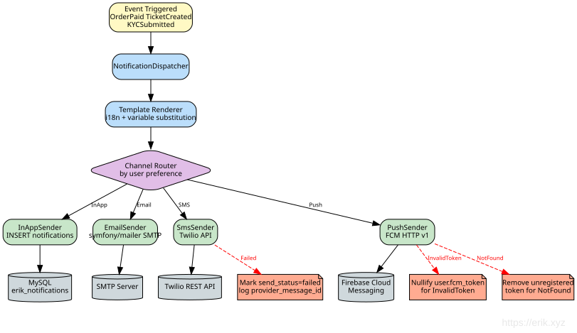

# एडमिन पैनल डिज़ाइन दस्तावेज़

## अवलोकन

`admin/` एक स्टैंडअलोन webman v2.1 इंस्टेंस है जो Layui-आधारित प्रबंधन डैशबोर्ड प्रदान करता है। यह `service/` बैकएंड से स्वतंत्र रूप से चलता है, केवल MySQL डेटाबेस और 7 erikwang2013 पैकेज साझा करता है।

## आर्किटेक्चर

```
┌─────────────────────────────────────────────────┐
│                  Admin Panel                     │
│  ┌──────────┐  ┌──────────┐  ┌───────────────┐ │
│  │ Controller│  │  Model   │  │   Bootstrap   │ │
│  │ (Layui)  │  │(Eloquent)│  │(worker start) │ │
│  └────┬─────┘  └────┬─────┘  └───────┬───────┘ │
│       │             │               │          │
│  ┌────┴─────────────┴───────────────┴─────────┐ │
│  │         7 erikwang2013 Packages             │ │
│  │  Snowflake │ Hashids │ Encryptable          │ │
│  │  Encryption│ Scout   │ Season │ Poster     │ │
│  └────────────────────┬───────────────────────┘ │
└───────────────────────┼─────────────────────────┘
                        │
              ┌─────────┴─────────┐
              │   MySQL 8.0       │
              │   Elasticsearch   │
              └───────────────────┘
```

### मॉड्यूल निर्भरता मानचित्र


## निर्देशिका संरचना

```
admin/
├── app/
│   ├── bootstrap/       # प्रति-प्रोसेस स्टार्टअप
│   │   ├── SnowflakeBootstrap.php
│   │   ├── EncryptableBootstrap.php
│   │   └── EncryptionBootstrap.php
│   ├── controller/       # 54 कंट्रोलर फ़ाइलें (Base/Crud + प्रति-एंटिटी CRUD)
│   │   ├── Base.php     # hashids_encode_ids के साथ json()
│   │   ├── Crud.php     # hashids डिकोड के साथ Select/Insert/Update/Delete/Export
│   │   ├── DashboardController.php  # डैशबोर्ड डेटा API (उपयोगकर्ता सांख्यिकी + रुझान)
│   │   ├── AccountController.php    # लॉगिन/लॉगआउट/प्रोफ़ाइल/पासवर्ड
│   │   ├── AdminController.php      # एडमिन CRUD + रोल्स
│   │   ├── RoleController.php       # रोल CRUD + नियम ट्री
│   │   └── ...
│   ├── model/            # 44 Eloquent मॉडल (36 service बिना-उपसर्ग व्यावसायिक टेबलों को मैप करते हैं + alerts (install.sql में परिभाषित) + 7 wa_* प्रबंधन टेबलें)
│   │   ├── Base.php     # Snowflake PK + Encryptable समर्थन
│   │   ├── Admin.php    # Encryptable: password, email, mobile
│   │   ├── User.php     # Encryptable: 6 फ़ील्ड + Searchable trait
│   │   └── ...
│   ├── common/           # Auth, Tree, Layui, Util, ExcelExport
│   ├── middleware/        # WafMiddleware + AccessControl
│   ├── exception/        # Handler
│   └── functions.php     # hashids_encode/decode, encrypt_data/decrypt_data
├── api/                  # पब्लिक API (plugin\admin\api)
│   └── Auth.php          # canAccess() ACL
├── config/
│   ├── plugin/erikwang2013/  # 7 प्लगइन कॉन्फ़िग
│   ├── hashids.php       # Hashids कनेक्शन (main + alternative)
│   └── encryption.php    # एन्क्रिप्शन कॉन्फ़िग (मास्टर कुंजी, cipher)
├── tests/                # PHPUnit 11 टेस्ट सूट (286 tests, 962 assertions)
│   ├── HashidsTest.php   # 21 tests
│   ├── BaseJsonTest.php  # 13 tests
│   ├── CrudHashidsTest.php # 14 tests
│   ├── TreeTest.php      # 19 tests
│   ├── AccessControlMiddlewareTest.php # 7 tests (401/403/अनुमत)
│   ├── AdminControllersTest.php        # 48 कंट्रोलर रिफ्लेक्शन रिग्रेशन
│   ├── UtilTest.php      # 17 tests
│   ├── DictTest.php      # 5 tests
│   ├── ExcelExportTest.php # 4 tests
│   ├── LayuiTest.php     # 5 tests
│   └── support/          # RequestMock, TestableCrud
├── install.sql           # DDL (bigint unsigned PKs, कोई auto-increment नहीं)
└── phpunit.xml
```

## पैकेज एकीकरण विवरण

### 1. Snowflake (डिस्ट्रिब्यूटेड प्राइमरी की)

**कॉन्फ़िग**: `config/plugin/erikwang2013/snowflake-php/app.php`
**बूटस्ट्रैप**: `app/bootstrap/SnowflakeBootstrap.php`

```php
// Model Base::boot() — creating इवेंट
static::creating(function (Model $model) {
    if (empty($model->getKey())) {
        $snowflake = Container::instance()->get(Snowflake::class);
        $model->setAttribute($model->getKeyName(), $snowflake->id());
    }
});
```

- 64-bit IDs: `timestamp(41b) | datacenter(5b) | worker(5b) | sequence(12b)`
- युग: 2024-01-01 (अधिकतम आयु ~69 वर्ष)
- Base मॉडल पर `$incrementing = false`, `$keyType = 'int'`
- सभी PK और FK कॉलम: `bigint unsigned NOT NULL`

### 2. Hashids (ID ऑब्स्क्यूरेशन)

**कॉन्फ़िग**: `config/hashids.php` + `config/plugin/erikwang2013/hashids/app.php`

**एन्कोड पथ** (प्रतिक्रिया):
- `Base::json()` रिकर्सिवली `hashids_encode_ids($data)` कॉल करता है
- सकारात्मक पूर्णांक वाले `id`, `*_id`, `*_ids` नाम के फ़ील्ड → hashid स्ट्रिंग्स
- `Crud::formatNormal()` भी एन्कोडिंग लागू करता है (कोड समीक्षा में ठीक किया गया)

**डिकोड पथ** (अनुरोध):
- `Crud::selectInput()`: WHERE क्लॉज़ में `id`/`*_id` hashid स्ट्रिंग्स डिकोड करता है
- `Crud::updateInput()`: `$request->post()` से प्राइमरी की डिकोड करता है
- `Crud::deleteInput()`: `$request->post()` से PKs की सरणी डिकोड करता है
- `AdminController::update()`: सीधे `updateInput()` का रिटर्न मान उपयोग करता है (डिडुप्लीकेटेड)
- `RoleController::select()`/`rules()`: `$request->get('id')` डिकोड करते हैं

**हेल्पर फ़ंक्शन** (`app/functions.php` में):
- `hashids_encode(int $id): string`
- `hashids_decode(string $hash): int` — विफलता पर 0 लौटाता है
- `hashids_encode_ids(array $data): array` — रिकर्सिव, `is_numeric()` स्ट्रिंग्स संभालता है

### 3. Encryptable (डेटाबेस फ़ील्ड एन्क्रिप्शन)

**कॉन्फ़िग**: `config/plugin/erikwang2013/encryptable/app.php`
**बूटस्ट्रैप**: `app/bootstrap/EncryptableBootstrap.php`

Eloquent `CastsAttributes` इंटरफ़ेस उपयोग करता है:
- `get()`: DB से पढ़ते समय मान AES डिक्रिप्ट करता है
- `set()`: DB में लिखते समय मान AES एन्क्रिप्ट करता है

**एन्क्रिप्टेड फ़ील्ड**:
| मॉडल | फ़ील्ड |
|-------|--------|
| Admin | password, email, mobile |
| User | password, email, mobile, token, last_ip, join_ip |

**महत्वपूर्ण नियम**: हमेशा मॉडल इंस्टेंस `save()` उपयोग करें, Query Builder `update()` कभी नहीं। `Admin::where(...)->update(...)` Eloquent casts को बायपास कर कच्चे मान स्टोर करता है। कोड समीक्षा के दौरान `AccountController` में इसे ठीक किया गया।

**पासवर्ड लेयरिंग**: पासवर्ड पहले bcrypt-हैश किए जाते हैं (`insertInput`/`updateInput` में), फिर हैश `save()` पर Encryptable cast द्वारा AES-एन्क्रिप्ट होता है। पढ़ने पर: AES डिक्रिप्ट → bcrypt हैश → `password_verify()`।

### 4. Encryption (API ट्रांसमिशन)

**कॉन्फ़िग**: `config/encryption.php`
**बूटस्ट्रैप**: `app/bootstrap/EncryptionBootstrap.php`

API-स्तरीय अनुरोध/प्रतिक्रिया एन्क्रिप्शन (AES-256-GCM) के लिए आरक्षित। प्रदान करता है:
- `encrypt_data(string $plaintext): string`
- `decrypt_data(string $ciphertext): string`

`ENCRYPTION_MASTER_KEY` कॉन्फ़िगर न होने पर स्पष्ट संदेश के साथ `RuntimeException` फेंकता है।

### 5. Webman-Scout (Elasticsearch)

**कॉन्फ़िग**: `config/plugin/erikwang2013/webman-scout/app.php` + `command.php`

User मॉडल `Searchable` trait उपयोग करता है:
```php
class User extends Base
{
    use Searchable;

    public function toSearchableArray(): array
    {
        return [
            'id' => $this->id,
            'username' => $this->username,
            'nickname' => $this->nickname,
            'email' => $this->email,
            'mobile' => $this->mobile,
        ];
    }
}
```

### 6. Season (देश ध्वज)

**कॉन्फ़िग**: `config/plugin/erikwang2013/season/app.php`

ग्लोबल हेल्पर: `country_season_flag(string $code): string`
- `country_season_flag('CN')` → 🇨🇳
- `country_season_flag('US')` → 🇺🇸

साथ ही `CountrySeason` क्लास के माध्यम से लोकलाइज़्ड सीज़न नाम प्रदान करता है।

### 7. Poster-PHP (क्लिक CAPTCHA)

**कॉन्फ़िग**: `config/poster.php` + `config/plugin/erikwang2013/poster/app.php`
**बूटस्ट्रैप**: `config/plugin/erikwang2013/poster/bootstrap.php` → `CaptchaPlugin`

लॉगिन और रजिस्ट्रेशन के लिए क्लिक-आधारित CAPTCHA सत्यापन प्रदान करता है:

```
Client                         Server
──────                         ──────
POST /api/v1/captcha/create

  → CaptchaService::create()
    → captcha_create('click')
      → ClickCaptcha::generate()
        → GD n यादृच्छिक रूप से रखे गए चीनी शब्दों के साथ इमेज रेंडर करता है
        → Redis/File स्टोरेज में targets + key स्टोर करता है
      ← {key, image (base64), target_count, expires_in}

POST /api/v1/auth/login

  (captcha_key + captcha_points के साथ)
  → AuthController::verifyCaptcha()
    → CaptchaService::verify(key, [[x1,y1], [x2,y2], ...])
      → captcha_verify(key, 'click', points)
        → CaptchaManager यूक्लिडियन दूरी ≤ 18px सहनशीलता जाँचता है
      ← true/false
```

**सुरक्षा विशेषताएँ**:
- वन-टाइम कुंजियाँ: सफल सत्यापन के बाद हटा दी जाती हैं
- ब्रूट-फोर्स सुरक्षा: प्रति कुंजी अधिकतम 3 असफल प्रयास, फिर हटा दी जाती है
- 300-सेकंड TTL (`CAPTCHA_TTL` से कॉन्फ़िगर करने योग्य)
- क्लिक सहनशीलता: 18px त्रिज्या (कॉन्फ़िगर करने योग्य)
- कठिनाई स्तर: आसान (2 लक्ष्य), मध्यम (3), कठिन (4)
- स्टोरेज: स्वचालित पहचान Redis → फ़ाइल फ़ॉलबैक, `CAPTCHA_STORAGE` से कॉन्फ़िगर करने योग्य

**रैपर**: `Common\Captcha\CaptchaService` `config/poster.php` से कस्टम कॉन्फ़िग लोड करता है, `create()` (सुरक्षा के लिए प्रतिक्रिया से targets हटाता है) और `verify()` विधियाँ प्रदान करता है। `AuthController::register()` और `AuthController::login()` द्वारा उपयोग किया जाता है।

### 8. ConfirmationMiddleware (पासवर्ड पुनः-सत्यापन)

**कॉन्फ़िग**: `config/route.php` में रूट ग्रुप मिडलवेयर

विनाशकारी और संवेदनशील ऑपरेशनों की सुरक्षा के लिए उपयोगकर्ता को अपना पासवर्ड पुनः दर्ज करने की आवश्यकता होती है। 12 संवेदनशील रूट एंडपॉइंट पर मिडलवेयर के रूप में लागू:

```
Client                              Server
──────                              ──────
POST /api/v1/orders/{id}/pay

  (confirm_password फ़ील्ड के साथ)
    → ConfirmationMiddleware::process()
      → userId मौजूद है जाँचें (अनुपस्थित पर 401)
      → Redis लॉक की जाँचें (लॉक होने पर 429)
      → पासवर्ड गैर-रिक्त सत्यापित (अनुपस्थित पर 422)
      → User::find() + Hash::check() bcrypt सत्यापित करता है
      → विफलता पर:
        → Redis INCR confirm_failed:{userId} काउंटर
        → यदि count ≥ 5, SETEX confirm_lock:{userId} 900s के लिए
        → AuditLogger::record('confirm_failed', ...)
        → 403 लौटाता है
      → सफलता पर:
        → DEL confirm_failed:{userId} काउंटर
        → AuditLogger::record('confirm_success', ...)
        → $next($request) कॉल करता है
```

**संवेदनशील उपयोगकर्ता एंडपॉइंट** (Auth + Confirmation):
| विधि | पथ | ऑपरेशन |
|--------|------|-----------|
| POST | `/api/v1/orders/{id}/pay` | पेमेंट आरंभ करें |
| POST | `/api/v1/supplier/withdraw` | निकासी अनुरोध |
| DELETE | `/api/v1/dns/{domain}/records/{id}` | DNS रिकॉर्ड हटाएँ |

**संवेदनशील एडमिन एंडपॉइंट** (Auth + AdminRole + Confirmation):
| विधि | पथ | ऑपरेशन |
|--------|------|-----------|
| DELETE | `/admin/api/v1/products/{id}` | उत्पाद हटाएँ |
| POST | `/admin/api/v1/orders/{id}/refund` | ऑर्डर रिफंड |
| POST | `/admin/api/v1/provisioning/resources/{id}/destroy` | संसाधन नष्ट करें |
| POST | `/admin/api/v1/kyc/{id}/approve` | KYC अनुमोदित करें |
| POST | `/admin/api/v1/kyc/{id}/reject` | KYC अस्वीकार करें |
| POST | `/admin/api/v1/suppliers/{id}/approve` | सप्लायर अनुमोदित करें |
| POST | `/admin/api/v1/suppliers/{id}/settle` | सेटलमेंट जनरेट करें |
| POST | `/admin/api/v1/suppliers/withdraws/{id}/approve` | निकासी अनुमोदित करें |
| PUT | `/admin/api/v1/system/config` | सिस्टम कॉन्फ़िग अपडेट |

API संस्करण URL पथ में होता है (जैसे `/api/v1/...`)।

**सुरक्षा विशेषताएँ**:
- `Hash::check()` के माध्यम से bcrypt पासवर्ड सत्यापन
- रेट लिमिटिंग: 5 असफल प्रयास → 15-मिनट लॉक (900s TTL)
- लॉक Redis कुंजियों के माध्यम से प्रति-उपयोगकर्ता लागू होता है (`confirm_lock:{userId}`, `confirm_failed:{userId}`)
- सफलता विफलता काउंटर रीसेट करती है
- सभी प्रयास ऑडिट डेटाबेस में लॉग होते हैं (सफल, विफल, लॉक)
- `verifyPassword()` एक protected विधि है, अनाम सबक्लास ओवरराइड के माध्यम से परीक्षण योग्य

**परीक्षण योग्यता**: `ConfirmationMiddlewareTest` (11 tests) एक अनाम सबक्लास उपयोग करता है जो निश्चित बूलियन लौटाने के लिए `verifyPassword()` ओवरराइड करता है, Eloquent/DB निर्भरता से बचता है। टेस्ट कवर करते हैं: 401 अनधिकृत, 422 अनुपस्थित/रिक्त पासवर्ड, 403 गलत पासवर्ड, सफल पास-थ्रू, रेट लिमिट कुंजी फ़ॉर्मेट, लॉक कुंजी फ़ॉर्मेट, और अधिकतम विफलता सीमा (4→कोई लॉक नहीं, 5→लॉक, 6→लॉक)।

## ACL सिस्टम

### कंट्रोलर-स्तरीय

```php
protected $noNeedLogin = ['login', 'logout', 'captcha'];  // लॉगिन छोड़ें
protected $noNeedAuth = ['select'];                         // प्रमाणीकरण छोड़ें
```

`api/Auth::canAccess()` `ReflectionClass` के माध्यम से जाँच करता है।

**AccessControlMiddleware प्रतिक्रिया** (`middleware/AccessControl.php`):
- लॉगिन नहीं किया (`noNeedLogin` के बाहर) → **HTTP 401**, body लॉगिन पेज रीडायरेक्ट स्क्रिप्ट
- लॉगिन किया लेकिन अनुमति अपर्याप्त → **HTTP 403** त्रुटि पेज (स्टेटस कोड 403, अब 500 नहीं)
- अनुमत सूची में (लॉगिन पेज/कैप्चा आदि) → सामान्य रूप से अनुमत

### रोल-आधारित

- रोल्स में `rules` होते हैं (कॉमा-पृथक नियम IDs या सुपर एडमिन के लिए `*`)
- नियम `wa_rules` में `{Controller}@{action}` कुंजियों के रूप में स्टोर होते हैं
- `api/Auth::canAccess()` रोल के नियमों के विरुद्ध `$controller@$action` कुंजी हल करता है
- सुपर एडमिन (`rules = '*'`) सभी जाँचें बायपास करता है

### डेटा सीमाएँ

```php
protected $dataLimit = null;     // कोई सीमा नहीं
protected $dataLimit = 'auth';   // एडमिन अपना + वंशजों का डेटा देखता है
protected $dataLimit = 'personal'; // एडमिन केवल अपना डेटा देखता है
protected $dataLimitField = 'admin_id';
```

## कोड समीक्षा निष्कर्ष (ठीक किए गए)

प्रारंभिक कमिट की समीक्षा के दौरान, निम्नलिखित पाए गए और ठीक किए गए:

### महत्वपूर्ण
1. **AccountController Encryptable बायपास करता है**: `password()` और `update()` ने `Admin::where()->update()` उपयोग किया जो Eloquent casts बायपास करता है → एन्क्रिप्टेड कॉलम में कच्चे मान स्टोर किए। `Admin::find()->save()` उपयोग करके ठीक किया गया।
2. **Crud::formatNormal() IDs एन्कोड नहीं करता**: ग्लोबल `json()` कॉल करता था, `hashids_encode_ids()` लागू नहीं करता था। ठीक किया गया।

### महत्वपूर्ण
3. **hashids_encode_ids सख्त `is_int`**: PDO से बड़े bigint मान PHP स्ट्रिंग्स के रूप में आते हैं। पूर्ण-संख्या जाँच के साथ `is_numeric()` में बदला गया।
4. **AdminController डुप्लीकेट ID डिकोड**: `update()` ने समान PK दो बार डिकोड किया। डिडुप्लीकेट किया, `insert()` में लूप वेरिएबल शैडोइंग ठीक की।
5. **AccountController::update() में मृत पासवर्ड कोड**: पासवर्ड फ़ील्ड अनुमत सूची में नहीं था। हटाया गया।
6. **हार्डकोडेड MySQL ड्राइवर**: `config('database.default')` में बदला गया।

## Excel एक्सपोर्ट

### आर्किटेक्चर

Excel एक्सपोर्ट सर्वर-साइड .xlsx फ़ाइलें जनरेट करने के लिए PhpSpreadsheet ^2.0 उपयोग करता है। एडमिन पैनल में दो अलग-अलग एक्सपोर्ट पथ हैं क्योंकि दो CRUD तंत्र हैं:

```
एक्सपोर्ट अनुरोध (वर्तमान टेबल फ़िल्टर के साथ)
  ├── Crud-आधारित कंट्रोलर (User, Admin, Role आदि)
  │     → Crud::export()
  │       → selectInput() क्वेरी पार्सिंग पुनः उपयोग करता है (hashids डिकोड, WHERE, ORDER)
  │       → doSelect() Eloquent क्वेरी बनाता है
  │       → 10,000 पंक्ति सीमा
  │       → hashids_encode_ids() परिणाम डेटा पर लागू
  │       → ExcelExport::export() .xlsx जनरेट करता है
  │
  └── TableController (सामान्य टेबलें जैसे wa_dict, wa_rules)
        → TableController::export()
          → टेबल स्कीमा + अनुरोध पैरामीटर से क्वेरी बनाता है
          → hashids_encode_ids() लागू
          → ExcelExport::export() .xlsx जनरेट करता है
```

### ExcelExport यूटिलिटी (`app/common/ExcelExport.php`)

PhpSpreadsheet के चारों ओर फ्लुएंट रैपर:

- `setColumns(array $columns)` — कॉलम क्रम परिभाषित करें
- `setLabels(array $labels)` — मानव-पठनीय कॉलम हेडर सेट करें
- `addRow(array $row)` / `addRows(array $rows)` — डेटा भरें
- `save(string $title): string` — `runtime/exports/` में .xlsx लिखें, फ़ाइल पथ लौटाएँ
- स्टैटिक हेल्पर: `ExcelExport::export($title, $columns, $data, $labels)` — वन-शॉट एक्सपोर्ट
- `Worksheet::getColumnDimension()` के माध्यम से कॉलम स्वचालित आकार

### Crud::export()

```php
public function export(Request $request): Response
{
    [$where, $format, $limit, $field, $order] = $this->selectInput($request);
    $query = $this->doSelect($where, $field, $order);
    $maxRows = 10000;
    $total = min($query->count(), $maxRows);
    $items = $query->limit($maxRows)->get();
    if (method_exists($this, 'afterQuery')) {
        $items = call_user_func([$this, 'afterQuery'], $items);
    }
    $data = array_map(fn($item) => ...toArray(), $items->toArray());
    $data = hashids_encode_ids($data);
    // टेबल स्कीमा टिप्पणियों से कॉलम लेबल प्राप्त करें
    $path = ExcelExport::export($table, $columns, $data, $labels);
    return response()->download($path, $table . '_' . date('YmdHis') . '.xlsx');
}
```

सभी Crud-आधारित कंट्रोलर (Admin, User, Role आदि) स्वचालित रूप से `export()` इनहेरिट करते हैं।

### फ्रंटएंड वायरिंग

- Layui का बिल्ट-इन `"exports"` टूलबार आइटम (क्लाइंट-साइड CSV) कस्टम `{title: "导出", layEvent: "export"}` बटन से बदला गया है
- `export` इवेंट हैंडलर `window.exportExcel()` कॉल करता है जो वर्तमान टेबल फ़िल्टर पैरामीटर एकत्र कर डाउनलोड URL खोलता है
- `Layui::buildTable()` सभी CRUD पेजों के लिए कस्टम एक्सपोर्ट बटन के साथ टूलबार जनरेट करता है

### Service एडमिन API एक्सपोर्ट

service बैकएंड (`service/`) में भी अपने `Common\ExcelExport` रैपर के माध्यम से Excel एक्सपोर्ट है:

| एंडपॉइंट | कंट्रोलर | एक्सपोर्टेड डेटा |
|----------|-----------|---------------|
| `GET /admin/api/v1/orders/export` | OrderController | id, order_no, user_id, type, status, total, currency, created_at, paid_at |
| `GET /admin/api/v1/users/export` | UserController | id, email, phone, role, status, created_at, last_login_at |
| `GET /admin/api/v1/suppliers/export` | SupplierController | id, user_id, status, contact_name, contact_email, contact_phone, created_at |

एक्सपोर्ट रूट्स टकराव से बचने के लिए `/{id}` पैरामीटर रूट्स से पहले रखे जाते हैं।

## Service एडमिन API — विस्तारित विशेषताएँ

### एडमिन API एंडपॉइंट (Service परत)

सभी एडमिन REST एंडपॉइंट `/admin/api` उपसर्ग के साथ हैं और `AdminRoleMiddleware` की आवश्यकता है।

| समूह | एंडपॉइंट | कंट्रोलर |
|-------|-----------|------------|
| डैशबोर्ड | `GET /dashboard`, `/kyc`, `POST /kyc/{id}/approve`, `/reject` | `Admin\DashboardController` |
| उपयोगकर्ता | `GET /users`, `/users/export`, `/users/{id}`, `PUT /users/{id}/status` | `Admin\UserController` |
| उत्पाद | `POST /products`, `PUT /products/{id}`, `DELETE /products/{id}`, `POST /products/{id}/skus`, `PUT /skus/{id}`, `POST /skus/{id}/region-price` | `Admin\ProductController` |
| उत्पाद इम्पोर्ट/एक्सपोर्ट | `GET /products/export` (CSV), `POST /products/import` (CSV upsert) | `Admin\ImportExportController` |
| ऑर्डर | `GET /orders`, `/orders/export`, `/orders/{id}`, `POST /orders/{id}/refund` | `Admin\OrderController` |
| इनवॉइस | `GET /invoices`, `POST /invoices/{orderId}/generate` | `Admin\InvoiceController` |
| पेमेंट | `GET /payments/channels`, `PUT /payments/channels/{id}`, `GET /payments/transactions`, `/reconcile` | `Admin\PaymentController` |
| प्रोविज़निंग | `GET /provisioning/tasks`, `POST /tasks/{id}/retry`, `POST /resources/{id}/upgrade`, `/destroy`, `GET /hosts` | `Provisioning\TaskController` |
| Provider APIs | `GET /providers`, `POST /providers`, `PUT /providers/{id}`, `DELETE /providers/{id}` | `Admin\ProviderApiController` |
| CDN | `GET /cdn/domains`, `PUT /cdn/domains/{id}` | `Admin\CdnController` |
| सप्लायर | `GET /suppliers`, `/suppliers/export`, `POST /suppliers/{id}/approve`, `/settle`, `/withdraws/{id}/approve` | `Admin\SupplierController` |
| सप्लायर API Keys | `GET /suppliers/{id}/api-keys`, `POST /suppliers/{id}/api-keys`, `DELETE /suppliers/api-keys/{id}` | `Admin\SupplierController` |
| टिकट | `GET /tickets`, `POST /tickets/{id}/assign`, `/close` | `Ticket\TicketController` |
| कूपन | `GET /coupons`, `POST /coupons`, `DELETE /coupons/{id}` | `Admin\CouponController` |
| Webhooks | `GET /webhooks`, `POST /webhooks`, `DELETE /webhooks`, `POST /webhooks/test` | `Admin\WebhookController` |
| डोमेन | `GET /domains/tlds`, `POST /domains/tlds`, `PUT /domains/tlds/{id}`, `DELETE /domains/tlds/{id}`, `GET /domains/zones`, `/transfers`, `POST /transfers/{id}/approve` | `Admin\DomainController` |
| नोटिफिकेशन | `GET /notifications/templates`, `PUT /notifications/templates/{id}`, `GET /notifications/log` | `Admin\NotificationController` |
| सहायता लेख | `GET /help`, `POST /help`, `PUT /help/{id}`, `DELETE /help/{id}` | `Admin\HelpController` |
| रिपोर्ट | `GET /reports/revenue`, `/supplier`, `/region` | `Report\ReportController` |
| मॉनिटरिंग | `GET /monitor/dashboard`, `/resources/{id}` | `Monitor\MonitorController` |
| ऑडिट | `GET /audit-logs` | `Admin\SystemController` |
| सिस्टम कॉन्फ़िग | `PUT /system/config` | `Admin\SystemController` |

### CDN संसाधन प्रबंधन

CDN उत्पाद चार सेवाप्रदाताओं (Cloudflare / CloudFront / Aliyun / Tencent) का समर्थन करता है, एडमिन दो भागों में विभाजित:

**सेवाप्रदाता खाता कॉन्फ़िगरेशन** (ProviderApi मॉडल का पुन: उपयोग, `Admin\ProviderApiController`):

- `GET/POST /admin/api/v1/providers`、`PUT/DELETE /admin/api/v1/providers/{id}`, `RbacMiddleware('provider.config')` से जुड़े
- `code` कन्वेंशन `cdn-cloudflare` / `cdn-cloudfront` / `cdn-aliyun` / `cdn-tencent`; क्रेडेंशियल फ़ील्ड Encryptable एन्क्रिप्शन के साथ संग्रहीत, `config` JSON कॉलम गैर-संवेदनशील मेटाडेटा रखता है
- उपयोगकर्ता-पक्ष क्रेडेंशियल रिज़ॉल्यूशन प्राथमिकता: बाउंड खाता → code मेल खाने वाला सक्रिय खाता → env फ़ॉलबैक; डिलीट/purge सख्त स्नैपशॉट से गुजरता है (केवल बाउंड खाता, अनुपस्थित/अक्षम होने पर 4003)

**CDN डोमेन प्रबंधन** (`Admin\CdnController`):

```
GET /admin/api/v1/cdn/domains        → सभी डोमेन (user_id सहित), RbacMiddleware('cdn.manage') से जुड़े
PUT /admin/api/v1/cdn/domains/{id}   → पैकेज अपडेट, plan व्हाइटलिस्ट standard | pro | enterprise,
                                    अमान्य मान पर 400; परिवर्तन ऑडिट लॉग admin_cdn_update_plan में लिखा जाता है
```

### डैशबोर्ड डेटा (Service परत)

`Admin\DashboardController::index()` वास्तविक परिचालन मीट्रिक प्रदान करता है:

```php
[
    'today_stats' => [todayOrders, todayRevenue, newUsers, activeResources],
    'revenue_trend_30d' => [...],   // पिछले 30 दिनों की दैनिक आय
    'region_distribution' => [...],  // क्षेत्र के अनुसार समूहीकृत सक्रिय संसाधन
    'pending_orders' => ...,         // पेमेंट की प्रतीक्षा कर रहे ऑर्डर
    'pending_kyc' => ...,            // समीक्षा की प्रतीक्षा कर रहे KYC आवेदन
    'open_tickets' => ...,           // खुले या चल रहे टिकट
]
```

### एडमिन पैनल डैशबोर्ड व्यू (`app/view/index/dashboard.html`)

- **8 एनिमेटेड स्टेट कार्ड**: आज/सप्ताह/माह/कुल उपयोगकर्ता + आज के ऑर्डर + आज की आय + लंबित ऑर्डर + सक्रिय संसाधन — Layui `count` मॉड्यूल के माध्यम से काउंट-अप एनिमेशन के साथ
- **3 ECharts चार्ट**:
  1. 7-दिन उपयोगकर्ता रजिस्ट्रेशन रुझान — एरिया लाइन चार्ट
  2. 30-दिन उपयोगकर्ता रजिस्ट्रेशन रुझान — बार चार्ट
  3. उपयोगकर्ता सारांश — डोनट/पाई चार्ट (आज / सप्ताह / माह)
- **सिस्टम जानकारी टेबल**: PHP/Workerman/Webman/Admin/MySQL/OS संस्करणों के साथ गतिशील रूप से भरी जाती है
- **टूलबार**: PDF एक्सपोर्ट और रिफ्रेश बटन
- सभी डेटा `/app/admin/dashboard/data` से AJAX के माध्यम से लाया जाता है

### रूट

```
Route::any('/app/admin/dashboard/data', [DashboardController::class, 'index']);
```

स्पष्ट रूप से पंजीकृत रूट्स के अलावा, `admin/config/route.php` `app/controller/` के प्रत्येक कंट्रोलर की सार्वजनिक विधियों के लिए स्वचालित रूप से `/app/admin/{snake_case_controller}/{action}` रूट पंजीकृत करता है (जैसे `/app/admin/order_item/index`), URL मेनू द्वारा उपयोग किए गए snake_case कंट्रोलर नाम से मेल खाता है; `/app/admin` और `/app/admin/index` बैकएंड होम/लॉगिन पेज प्रवेश हैं (लॉगिन न होने पर लॉगिन व्यू रेंडर करते हैं); अमैच अनुरोधों के लिए समान रूप से 404 लौटाया जाता है।

## PDF एक्सपोर्ट

डैशबोर्ड पेज पर क्लाइंट-साइड PDF जनरेशन:

- डैशबोर्ड DOM को canvas के रूप में कैप्चर करने के लिए **html2canvas 1.4.1** (CDN) उपयोग करता है
- डाउनलोड करने योग्य A4 PDF बनाने के लिए **jsPDF 2.5.1** (CDN) उपयोग करता है
- स्टेट कार्ड और ECharts चार्ट (canvas तत्वों के रूप में रेंडर किए गए) कैप्चर करता है
- PDF में शीर्षक, टाइमस्टैम्प और ब्रांडिंग शामिल करता है
- डैशबोर्ड टूलबार में "Export PDF" बटन द्वारा ट्रिगर होता है

```
Dashboard DOM → html2canvas screenshot → jsPDF document → browser download
```

### कार्यान्वयन

```javascript
// In dashboard.html
html2canvas(document.querySelector('.layui-body'), {scale: 2}).then(canvas => {
    const pdf = new jsPDF('p', 'mm', 'a4');
    const imgData = canvas.toDataURL('image/png');
    pdf.addImage(imgData, 'PNG', 10, 10, 190, 0);
    pdf.save('dashboard_' + new Date().toISOString().slice(0, 10) + '.pdf');
});
```

## टेस्ट सूट

```
PHPUnit 11.5 | 67 tests | 124 assertions
```

### HashidsTest (21 tests)
- एन्कोड/डिकोड राउंडट्रिप (0 से PHP_INT_MAX)
- डिटरमिनिस्टिक एन्कोडिंग
- अमान्य/खाली स्ट्रिंग हैंडलिंग
- `hashids_encode_ids` फ़ील्ड पैटर्न (`id`, `*_id`, `*_ids`)
- शून्य/नकारात्मक स्किप, संख्यात्मक स्ट्रिंग समर्थन
- नेस्टेड सरणी रिकर्सन, गैर-id फ़ील्ड संरक्षण

### BaseJsonTest (13 tests)
- `json()`/`success()`/`fail()` hashids एन्कोडिंग लागू करते हैं
- नेस्टेड ऑब्जेक्ट एन्कोडिंग
- Snowflake-आकार ID हैंडलिंग
- गैर-id फ़ील्ड संरक्षण
- शून्य हैंडलिंग
- प्रतिक्रिया संरचना सत्यापन

### CrudHashidsTest (14 tests)
- `selectInput`: `id`/`*_id` WHERE फ़ील्ड में hashid डिकोड
- `selectInput`: संख्यात्मक स्ट्रिंग/कच्चा int पास-थ्रू
- `updateInput`: hashid PK डिकोड
- `updateInput`: संख्यात्मक स्ट्रिंग PK int में परिवर्तित
- `deleteInput`: बैच ID डिकोड, मिश्रित प्रकार
- `deleteInput`: खाली सरणी, एकल ID हैंडलिंग

## डेटाबेस माइग्रेशन सिस्टम

### आर्किटेक्चर

`service/` और `admin/` दोनों इंस्टेंस में `illuminate/database` Schema Builder पर निर्मित स्वतंत्र माइग्रेशन सिस्टम हैं। प्रत्येक इंस्टेंस `config/command.php` के माध्यम से Symfony Console कमांड पंजीकृत करता है जो webman के कंसोल रनर द्वारा खोजे जाते हैं।

```
php webman migrate          # लंबित माइग्रेशन चलाएँ
php webman migrate:rollback # अंतिम बैच रोलबैक करें
php webman migrate:status   # माइग्रेशन स्थिति दिखाएँ
```

### MigrationRunner (`service/support/MigrationRunner.php`, `admin/app/common/MigrationRunner.php`)

दोनों इंस्टेंस द्वारा साझा किया गया कोर इंजन:

- **`ensureTable()`** — पहली बार चलने पर `migrations` ट्रैकिंग टेबल (id, migration नाम, batch संख्या) बनाता है
- **`migrate()`** — `database/migrations/` से माइग्रेशन फ़ाइलें स्कैन करता है, लंबित `up()` विधियाँ चलाता है, batch रिकॉर्ड करता है
- **`rollback()`** — प्रत्येक माइग्रेशन पर उल्टे क्रम में `down()` कॉल करके अंतिम बैच उलटता है
- **`status()`** — सभी माइग्रेशन उनके batch नंबरों के साथ सूचीबद्ध करता है
- **`resolve()`** — फ़ाइलों से माइग्रेशन क्लासेस इंस्टैंशिएट करता है

### माइग्रेशन बेस क्लास (`service/support/Migration.php`, `admin/app/common/Migration.php`)

```php
abstract class Migration
{
    abstract public function up(): void;
    abstract public function down(): void;
}
```

प्रत्येक माइग्रेशन फ़ाइल टाइमस्टैम्प-उपसर्ग फ़ाइलनामों के साथ `Migration` का विस्तार करने वाली क्लास लौटाती है (जैसे `2024_01_01_000001_create_initial_schema.php`)।

### Service माइग्रेशन

**निर्देशिका**: `service/database/migrations/` — 38 माइग्रेशन फ़ाइलें (टेबल नामों में erik_ उपसर्ग नहीं, admin मॉडल सीधे मैप करते हैं)

| माइग्रेशन | टेबलें |
|-----------|--------|
| `0001_create_users_tables` | users, user_profiles, user_kyc, user_balance, user_balance_log, user_addresses, refresh_tokens |
| `0002_create_product_tables` | product_categories, regions, products, product_skus, product_regions, product_images, product_attributes, product_reviews |
| `0003_create_order_tables` | carts, orders, order_items, order_timeline, order_invoices, refunds |
| `0004_create_payment_tables` | payment_channels, payment_transactions, payment_reconcile |
| `0005_create_provisioning_tables` | resources, resource_servers, resource_ips, resource_disks, resource_domains, provision_tasks, provider_apis |
| `0006_create_host_tables` | host_machines, ip_pools, ip_allocations, disks, disk_resizes |
| `0007_create_supplier_tables` | suppliers, supplier_products, supplier_settlements, supplier_withdraws |
| `0008_create_domain_tables` | domain_tlds, domain_transfers, dns_zones, dns_records |
| `0009_create_ticket_notification_tables` | tickets, ticket_messages, notifications, notification_templates |
| `0010_create_audit_table` | audit_logs |
| `0011_create_kvm_service_tables` | network_services, firewall_services, switch_services |
| `2024_01_01_000001_create_initial_schema` | `Capsule::unprepared()` के माध्यम से `docs/database.sql` चलाता है, `down()` में सभी drop करता है |
| `2025_05_16_000002_add_fcm_token_to_users` | users में `fcm_token`, `fcm_platform` कॉलम + इंडेक्स जोड़ता है |
| `2026_08_26_000003_widen_encrypted_columns` | users.phone / user_addresses.phone / suppliers.contact_phone VARCHAR(20)→VARCHAR(255) (Encryptable सिफरटेक्स्ट लंबाई) |

### Admin माइग्रेशन

**निर्देशिका**: `admin/database/migrations/` — 1 माइग्रेशन फ़ाइल

| माइग्रेशन | विवरण |
|-----------|-------------|
| `2024_01_01_000001_create_admin_schema` | `Capsule::unprepared()` के माध्यम से `admin/install.sql` चलाता है — सीड डेटा के साथ wa_* टेबलें बनाता है |

### कंसोल कमांड पंजीकरण

**`service/config/command.php`**:
```php
return [
    \App\Command\MigrateCommand::class,
    \App\Command\MigrateRollbackCommand::class,
    \App\Command\MigrateStatusCommand::class,
];
```

**`admin/config/command.php`** — `app\command` नेमस्पेस के तहत समान पैटर्न।

## Stripe प्रोडक्शन इंटीग्रेशन

### आर्किटेक्चर

फेक `random_bytes()` पेमेंट IDs को `stripe/stripe-php` ^15.0 के माध्यम से वास्तविक Stripe API इंटीग्रेशन से बदला गया।

**फ़ाइल**: `service/app/payment/service/channels/StripeChannel.php`

```
Client-side                    Server-side                    Stripe API
───────────                    ───────────                    ──────────
चेकआउट पर Stripe चुनें
  → POST /orders/{id}/pay
    → StripeChannel::createPaymentIntent()
      → StripeClient->paymentIntents->create(amount, currency)
        ← {id, client_secret}
      → pi_xxx को transaction_no के रूप में सहेजें
      ← client_secret लौटाएँ
  → Stripe.js confirmCardPayment(client_secret)
    ← Stripe द्वारा पेमेंट की पुष्टि
      → POST /payments/webhook/stripe
        → StripeChannel::handleWebhook()
          → Webhook::constructEvent(payload, signature, secret)
          → आइडेम्पोटेंसी सत्यापित करें (गैर-pending ट्रांज़ैक्शन छोड़ें)
          → ऑर्डर स्थिति अपडेट करें, ट्रांज़ैक्शन रिकॉर्ड बनाएँ
```

### PaymentIntent निर्माण

```php
public function createPaymentIntent(Order $order): array
{
    $intent = $this->stripe()->paymentIntents->create([
        'amount'   => (int) round($order->total * 100),  // cents
        'currency' => strtolower($order->currency),
        'metadata' => ['order_id' => $order->id, 'order_no' => $order->order_no],
    ]);
    return [
        'transaction_no' => $intent->id,          // pi_xxxxxxxxxxxxx
        'client_secret'  => $intent->client_secret, // pi_xxx_secret_yyy
    ];
}
```

- `$this->stripe()` env से `STRIPE_SECRET_KEY` के साथ `\Stripe\StripeClient` आलसी-इनिशियलाइज़ करता है
- env var सेट न होने पर `$this->channel->api_key_encrypted` (Encryptable के माध्यम से डिक्रिप्टेड) पर फ़ॉलबैक
- राशि cents में परिवर्तित: `(int) round($order->total * 100)`

### Webhook हस्ताक्षर सत्यापन

```php
public function handleWebhook(string $payload, string $signature): void
{
    $event = \Stripe\Webhook::constructEvent(
        $payload, $signature, $this->channel->webhook_secret_encrypted
    );
    // आइडेम्पोटेंसी: यदि ट्रांज़ैक्शन पहले ही प्रोसेस हो चुका है तो छोड़ें
    $existing = Transaction::where('transaction_no', $event->id)->first();
    if ($existing && $existing->status !== 'pending') return;
    
    match ($event->type) {
        'payment_intent.succeeded' => $this->confirmPayment($event),
        'payment_intent.payment_failed' => $this->failPayment($event),
        default => null,
    };
}
```

- Stripe हस्ताक्षर हेडर सत्यापित करने के लिए `Webhook::constructEvent()` उपयोग करता है
- **आइडेम्पोटेंसी गार्ड**: `transaction_no` द्वारा डुप्लीकेट webhook डिलीवरी जाँचता है
- सफलता और विफलता दोनों इवेंट प्रकारों का समर्थन

## Twilio SMS इंटीग्रेशन

### आर्किटेक्चर

`error_log()` स्टब को `twilio/sdk` ^8.0 के माध्यम से वास्तविक SMS डिलीवरी से बदला गया।

**फ़ाइल**: `service/app/notification/queue/SmsSender.php`

### संदेश भेजना

```php
public function consume(): void
{
    $client = new \Twilio\Rest\Client(
        getenv('TWILIO_ACCOUNT_SID'),
        getenv('TWILIO_AUTH_TOKEN')
    );
    $message = $client->messages->create(
        $this->notification->recipient_phone,
        ['from' => getenv('TWILIO_PHONE_NUMBER'), 'body' => $this->notification->body]
    );
    $this->notification->provider_message_id = $message->sid;
}
```

### त्रुटि हैंडलिंग

- `Twilio\Exceptions\RestException` पकड़ता है — Twilio त्रुटि कोड और संदेश कैप्चर करता है
- `send_status = 'failed'` के साथ विफल Notification रिकॉर्ड बनाता है
- डिलीवरी ट्रैकिंग के लिए `provider_message_id` (Twilio SID) रिकॉर्ड करता है
- Twilio क्रेडेंशियल अनसेट होने पर `error_log()` पर फ़ॉलबैक (dev मोड)

### कॉन्फ़िगरेशन

Env vars: `TWILIO_ACCOUNT_SID`, `TWILIO_AUTH_TOKEN`, `TWILIO_PHONE_NUMBER`

## FCM पुश इंटीग्रेशन

### आर्किटेक्चर

`error_log()` स्टब को `kreait/firebase-php` ^7.0 के माध्यम से वास्तविक पुश डिलीवरी से बदला गया।

**फ़ाइल**: `service/app/notification/queue/PushSender.php`

### डिवाइस टोकन स्टोरेज

माइग्रेशन के माध्यम से `users` टेबल में जोड़ा गया:
- `fcm_token VARCHAR(512) DEFAULT NULL` — डिवाइस रजिस्ट्रेशन टोकन
- `fcm_platform VARCHAR(16) DEFAULT NULL` — `ios` / `android` / `web`
- `INDEX idx_fcm_token (fcm_token)` — टोकन द्वारा खोज

User मॉडल: `fcm_token` और `fcm_platform` `$fillable` में जोड़े गए।

### पुश भेजना

```php
public function consume(): void
{
    $factory = new \Kreait\Firebase\Factory();
    if ($credentialsPath = getenv('FIREBASE_CREDENTIALS_PATH')) {
        $factory = $factory->withServiceAccount($credentialsPath);
    }
    $messaging = $factory->createMessaging();
    
    $message = \Kreait\Firebase\Messaging\CloudMessage::withTarget(
        'token', $this->user->fcm_token
    )->withNotification([
        'title' => $this->notification->title,
        'body'  => $this->notification->body,
    ]);
    
    $result = $messaging->send($message);
}
```

### टोकन सफाई

- `Kreait\Firebase\Exception\Messaging\InvalidToken` पकड़ता है — उपयोगकर्ता का `fcm_token` null करता है
- `Kreait\Firebase\Exception\Messaging\NotFound` पकड़ता है — अपंजीकृत टोकन हटाता है
- Firebase क्रेडेंशियल अनसेट होने पर `error_log()` पर फ़ॉलबैक (dev मोड)

### कॉन्फ़िगरेशन

Env vars: `FIREBASE_CREDENTIALS_PATH` (सेवा खाता JSON), `FCM_SERVER_KEY` (लेगेसी)

## व्यावसायिक प्रवाह आरेख

### ऑर्डर → पेमेंट → प्रोविज़निंग (मुख्य व्यावसायिक प्रवाह)


### इवेंट-ड्रिवन प्रोविज़निंग विवरण


### नोटिफिकेशन डिस्पैच



### सप्लायर जीवनचक्र


### टिकट जीवनचक्र


## Service-परत टेस्ट सूट

### अवलोकन

```
PHPUnit 10.5 | 295 tests | 455 assertions
```

**निर्देशिका**: `service/tests/` — 7 मॉड्यूलों में 12 टेस्ट फ़ाइलें

**कॉन्फ़िग**: `service/phpunit.xml` — एकल `unit` टेस्टसूट, `app/` और `common/` स्रोत कवर करता है

### टेस्ट बूटस्ट्रैप

`service/tests/bootstrap.php` Composer ऑटोलोड लोड करता है और परीक्षण के तहत कोड के लिए आवश्यक दो ग्लोबल हेल्पर परिभाषित करता है:

- `request_id()` — विशिष्ट अनुरोध ID स्ट्रिंग लौटाता है
- `now()` — वर्तमान `DateTime` ऑब्जेक्ट लौटाता है

महत्वपूर्ण सीख: `Webman\Config` टेस्ट संदर्भ में लोड नहीं किया जा सकता क्योंकि `loadFromDir()` `route.php` ट्रिगर करता है जो null पर `Route::addRoute()` कॉल करता है। टेस्ट Config को पूरी तरह बायपास करते हैं — `HashidServiceTest` सीधे `new Hashids()` उपयोग करता है, `ResponseTest` स्थानीय हेल्पर विधियाँ उपयोग करता है।

### टेस्ट फ़ाइलें

| फ़ाइल | टेस्ट | कवरेज |
|------|-------|----------|
| `Captcha/CaptchaServiceTest.php` | 9 | create संरचना, कठिनाई स्तर, verify पास/फेल, वन-टाइम उपयोग, विशिष्ट कुंजियाँ |
| `Confirmation/ConfirmationMiddlewareTest.php` | 11 | प्रमाणीकरण आवश्यक, अनुपस्थित पासवर्ड, गलत पासवर्ड, सफल पास-थ्रू, रेट लिमिट कुंजी फ़ॉर्मेट, लॉक कुंजी फ़ॉर्मेट, अधिकतम विफलता सीमाएँ |
| `Common/HashidServiceTest.php` | 17 | एन्कोड/डिकोड राउंडट्रिप, डिटरमिनिज़्म, साल्ट पृथक्करण, रिकर्सिव ID वॉक |
| `Common/ResponseTest.php` | 16 | success/error/paginated संरचना, request_id संगति, HTTP त्रुटि कोड |
| `Common/SnowflakeTest.php` | 6 | टाइमस्टैम्प क्रम, विशिष्टता, bigint रेंज, init पैटर्न |
| `Common/ValidatorTest.php` | 22 | required(), email(), minLength() सत्यापन नियम |
| `Common/LogSanitizerTest.php` | 34 | PII रिडक्शन, नेस्टेड सरणियाँ, केस-असंवेदनशील मिलान, 20 संवेदनशील फ़ील्ड प्रकार |
| `Payment/StripeChannelTest.php` | 19 | चैनल कॉन्फ़िग, राशि गणना, webhook हस्ताक्षर, आइडेम्पोटेंसी |
| `Payment/PaymentRouterTest.php` | 10 | चैनल फ़िल्टरिंग, राशि बाधाएँ, मुद्रा/क्षेत्र समर्थन, शुल्क गणना |
| `Notification/NotificationDispatcherTest.php` | 8 | टेम्पलेट रेंडरिंग, चैनल रूटिंग, निष्क्रिय उपयोगकर्ता स्किप |
| `Provisioning/ProviderFactoryTest.php` | 12 | register, create, createFromResource, त्रुटि मामले |
| `Provisioning/RetryLogicTest.php` | 12 | एक्सपोनेंशियल बैकऑफ़, अधिकतम रीट्राय, स्थिति संक्रमण, होस्ट चयन |
| `ClientPlatform/ClientPlatformMiddlewareTest.php` | 13 | मान्य प्लेटफ़ॉर्म, अनुपस्थित/डिफ़ॉल्ट हेडर, असमर्थित प्लेटफ़ॉर्म, केस-असंवेदनशील, गैर-API स्किप, एडमिन रूट्स, डाउनस्ट्रीम एक्सेस |
| `Security/WafMiddlewareTest.php` | 37 | SQLi (4), XSS (6), CMDi (4), फ़ाइल इंक्लूज़न (3), हेडर इंजेक्शन/CRLF (2), SSRF (5), NoSQL इंजेक्शन (4), ओपन रीडायरेक्ट (2), सुरक्षित पास-थ्रू (5), URL स्कैनिंग, UA स्कैनिंग |
| `Version/VersionMiddlewareTest.php` | 6 | मान्य संस्करण, अनुपस्थित संस्करण डिफ़ॉल्ट, असमर्थित संस्करण 400, गैर-API स्किप, एडमिन API सत्यापन, त्रुटि प्रतिक्रिया हेडर |

### टेस्ट इन्फ्रास्ट्रक्चर

- `tests/TestCase.php` — PHPUnit TestCase का विस्तार करने वाली बेस क्लास
- `tests/Support/RequestMock.php` — कंस्ट्रक्टर-इंजेक्टेड पैरामीटर के साथ मॉक अनुरोध

## CI/CD पाइपलाइन

### आर्किटेक्चर

`.github/workflows/ci.yml` पर GitHub Actions वर्कफ़्लो।

**ट्रिगर**: `main` पर push, `main` पर pull requests

### Jobs

| Job | रणनीति | विवरण |
|-----|----------|-------------|
| `syntax` | PHP 8.2 | admin/ और service/ में सभी `.php` फ़ाइलों पर `php -l` lint |
| `admin-tests` | PHP 8.2, 8.3 | `composer install -d admin` → `admin/vendor/bin/phpunit` |
| `service-tests` | PHP 8.2, 8.3 | `composer install -d service` → `service/vendor/bin/phpunit` |
| `composer-validate` | PHP 8.2 | दोनों composer.json फ़ाइलों पर `composer validate --strict` |

### PHP संस्करण मैट्रिक्स

दोनों टेस्ट jobs `shivammathur/setup-php@v2` के माध्यम से PHP 8.2 और 8.3 पर चलती हैं।

### वर्तमान स्थिति

सभी 4 jobs पास: 243 कुल tests (67 admin + 176 service), 400 assertions, दोनों PHP संस्करण ग्रीन।

## डेटाबेस एंटिटी रिलेशन


## मुख्य डिज़ाइन निर्णय

1. **स्टैंडअलोन इंस्टेंस**: admin/ अपने स्वयं के webman इंस्टेंस के रूप में चलता है, service/ के भीतर प्लगइन के रूप में नहीं। यह एडमिन ट्रैफ़िक और विफलताओं को ग्राहक-सामना वाले API से पृथक करता है।

2. **Encryptable + पासवर्ड हैशिंग**: पासवर्ड पहले bcrypt-हैश किए जाते हैं, फिर AES-एन्क्रिप्ट। Encryptable cast Eloquent स्तर पर (हैशिंग के ऊपर) काम करता है, इसलिए लेयरिंग है: `input → bcrypt hash → model attribute set → Encryptable::set() encrypts → DB`। पढ़ने पर: `DB → Encryptable::get() decrypts → bcrypt hash → password_verify()`।

3. **कंट्रोलर सीमा पर Hashids**: एन्कोडिंग/डिकोडिंग HTTP सीमा (कंट्रोलर) पर होती है, मॉडल या ORM स्तर पर नहीं। यह मॉडलों को डेटाबेस-एग्नोस्टिक रखता है और hashids को विशुद्ध प्रेजेंटेशन चिंता बनाता है।

4. **कंटेनर-आधारित सेवा रिज़ॉल्यूशन**: सेवाएँ (Snowflake, HashidsManager, EncryptionManager) वर्कर स्टार्ट पर Bootstrap क्लासेस के माध्यम से सिंगलटन के रूप में पंजीकृत होती हैं। `\support\Container::instance()` के माध्यम से कंटेनर रिज़ॉल्यूशन आलसी इंस्टैंशिएशन उपयोग करता है — सेवाएँ केवल पहली एक्सेस पर बनती हैं।

## विस्तारित विशेषताएँ (2026-05-20)

### Service एडमिन API — नए एंडपॉइंट

| समूह | एंडपॉइंट | कंट्रोलर |
|-------|-----------|------------|
| इनवॉइस | `GET /admin/api/v1/invoices`, `POST .../invoices/{orderId}/generate` | `Admin\InvoiceController` |
| Provider APIs | `GET/POST /admin/api/v1/providers`, `PUT/DELETE .../providers/{id}` | `Admin\ProviderApiController` |
| सप्लायर API Keys | `GET/POST /admin/api/v1/suppliers/{id}/api-keys`, `DELETE .../api-keys/{id}` | `Admin\SupplierController` |
| कूपन | `GET/POST /admin/api/v1/coupons`, `DELETE .../coupons/{id}` | `Admin\CouponController` |
| Webhooks | `GET/POST/DELETE /admin/api/v1/webhooks`, `POST .../webhooks/test` | `Admin\WebhookController` |
| उत्पाद इम्पोर्ट/एक्सपोर्ट | `GET /admin/api/v1/products/export`, `POST .../products/import` | `Admin\ImportExportController` |
| डोमेन प्रबंधन | `GET/POST/PUT/DELETE /admin/api/v1/domains/tlds`, `GET .../zones`, `GET .../transfers`, `POST .../transfers/{id}/approve` | `Admin\DomainController` |
| नोटिफिकेशन टेम्पलेट | `GET /admin/api/v1/notifications/templates`, `PUT .../templates/{id}`, `GET .../log` | `Admin\NotificationController` |
| सहायता लेख | `GET/POST /admin/api/v1/help`, `PUT/DELETE .../help/{id}` | `Admin\HelpController` |

### नए मिडलवेयर

| मिडलवेयर | उद्देश्य |
|------------|---------|
| `VersionMiddleware` | URL पथ से API संस्करण सत्यापित करता है |
| `RateLimitMiddleware` | Redis टोकन बकेट रेट लिमिट (डिफ़ॉल्ट 60req/min, लॉगिन 5req/min) |
| `GeoBlockMiddleware` | MaxMind GeoIP2 क्षेत्र ब्लॉक |
| `MaintenanceMiddleware` | मेंटेनेंस मोड (पर्यावरण वेरिएबल स्विच + IP व्हाइटलिस्ट) |
| `ClientPlatformMiddleware` | क्लाइंट प्लेटफ़ॉर्म पहचान (X-Client-Platform हेडर), 8 प्लेटफ़ॉर्म समर्थन |
| `SupplierApiKeyMiddleware` | सप्लायर बाह्य API प्रमाणीकरण (sk_xxx Key SHA256 हस्ताक्षर सत्यापन) |
| `WafMiddleware` (admin) | एडमिन पैनल WAF मिडलवेयर, 8 श्रेणियाँ 45+ नियम + अनुरोध आकार सीमा + Content-Type सत्यापन |

### शेड्यूल्ड टास्क

| शेड्यूल | टास्क | उद्देश्य |
|----------|------|---------|
| `13 */4 * * *` | ExchangeRateSync | विनिमय दर अपडेट |
| `37 2 * * *` | PaymentReconcile | दैनिक पेमेंट रिकॉन्सिलिएशन |
| `17 4 * * 1` | SupplierSettlement | साप्ताहिक सप्लायर सेटलमेंट |
| `23 6 * * *` | ExpirationCheck | संसाधन/डोमेन समाप्ति जाँच + नोटिफिकेशन |
| `43 7 * * *` | SslCertificateCheck | SSL प्रमाणपत्र समाप्ति जाँच + नोटिफिकेशन |
| `*/5 * * * *` | CollectMetrics | संसाधन मीट्रिक संग्रह |
| `*/30 * * * *` | CheckExpirations | संसाधन समाप्ति जाँच |

### CLI कमांड

| कमांड | उद्देश्य |
|---------|---------|
| `php webman migrate` | लंबित माइग्रेशन चलाएँ |
| `php webman migrate:rollback` | पिछला बैच रोलबैक करें |
| `php webman migrate:status` | माइग्रेशन स्थिति देखें |
| `php webman db:backup` | डेटाबेस को SQL फ़ाइल में बैकअप करें (वैकल्पिक --s3 अपलोड) |

### जोड़े गए डेटाबेस माइग्रेशन (2026-05-20)

| माइग्रेशन | टेबल/कॉलम |
|-----------|---------------|
| 000003 | users + totp_secret, totp_enabled |
| 000004 | coupons, user_coupons |
| 000005 | help_articles, supplier_api_keys |
| 000006 | roles, permissions, role_permission + सीड डेटा |
| 000007 | users + email_verified_at, email_verify_token |
| 000008 | users + last_login_ip, last_login_at |

## दस्तावेज़ीकरण सूचकांक

### मुख्य दस्तावेज़

| दस्तावेज़ | पथ | विवरण |
|----------|------|-------------|
| आर्किटेक्चर डिज़ाइन दस्तावेज़ | `docs/architecture.md` | सिस्टम आर्किटेक्चर, घटक संबंध, मिडलवेयर पाइपलाइन, सुरक्षा परतें, डेटा आर्किटेक्चर, डिप्लॉयमेंट टोपोलॉजी |
| फ़ंक्शन डिज़ाइन दस्तावेज़ | `docs/features.md` | 21 मॉड्यूल विस्तृत फ़ंक्शन डिज़ाइन, फ़्लोचार्ट, डेटा मॉडल, इंटरैक्शन विवरण सहित |
| API इंटरफ़ेस दस्तावेज़ | `docs/api-reference.md` | 200+ एंडपॉइंट पूर्ण संदर्भ, मॉड्यूल द्वारा समूहीकृत, अनुरोध/प्रतिक्रिया उदाहरण, त्रुटि कोड सहित |
| API ऑनलाइन दस्तावेज़ (service) | `http://localhost:8787/apidoc` | hg/apidoc स्वचालित जनरेशन, फ़ंक्शन द्वारा समूहीकृत, ऑनलाइन डिबग समर्थन |
| API ऑनलाइन दस्तावेज़ (admin) | `http://localhost:8788/apidoc` | hg/apidoc स्वचालित जनरेशन, 54 कंट्रोलर 13 फ़ंक्शन समूह |
| सिस्टम डिज़ाइन स्पेक | `docs/superpowers/specs/2026-05-14-cloud-resource-platform-design.md` | पूर्ण आर्किटेक्चर, डेटा मॉडल, API डिज़ाइन, सुरक्षा नीतियाँ |
| एडमिन पैनल डिज़ाइन | `docs/admin-design.md` | एडमिन पैनल आर्किटेक्चर, पैकेज इंटीग्रेशन, ACL अनुमतियाँ, टेस्ट सूट |
| सप्लायर API दस्तावेज़ | `docs/supplier-api.md` | सप्लायर API संदर्भ (आंतरिक API + बाह्य API), SDK उदाहरण |
| डिप्लॉयमेंट चेकलिस्ट | `docs/deployment.md` | सर्वर कॉन्फ़िगरेशन, पर्यावरण वेरिएबल, डेटाबेस माइग्रेशन, Nginx, HTTPS, शेड्यूल्ड टास्क |

### कार्यान्वयन योजनाएँ

| दस्तावेज़ | पथ | विवरण |
|----------|------|-------------|
| Phase 0 — बेसिक फ्रेमवर्क | `docs/superpowers/plans/2026-05-14-cloud-resource-platform-phase0.md` | प्रोजेक्ट स्केलेटन, निर्देशिका संरचना, मुख्य इन्फ्रास्ट्रक्चर |
| Phase 1 — उपयोगकर्ता और मार्केटप्लेस | `docs/superpowers/plans/2026-05-14-cloud-resource-platform-phase1.md` | उपयोगकर्ता प्रमाणीकरण, उत्पाद प्रबंधन, कार्ट, ऑर्डर |
| Phase 2 — संसाधन और सप्लायर | `docs/superpowers/plans/2026-05-14-cloud-resource-platform-phase2.md` | संसाधन प्रोविज़निंग, DNS, सप्लायर आवेदन |
| Phase 3 — क्लाइंट और डिलीवरी | `docs/superpowers/plans/2026-05-14-cloud-resource-platform-phase3.md` | Flutter क्लाइंट, मल्टी-प्लेटफ़ॉर्म अनुकूलन, CI/CD |

### उपकरण और संसाधन

| दस्तावेज़ | पथ | विवरण |
|----------|------|-------------|
| API स्मोक टेस्ट | `docs/api-test.sh` | curl-आधारित API एंडपॉइंट स्वचालित टेस्ट स्क्रिप्ट |
| डेटाबेस DDL | `docs/database.sql` | डेटाबेस टेबल निर्माण स्टेटमेंट |

## अंतिम टेस्ट सांख्यिकी

```
OK (362 tests, 579 assertions)
Test files: 22
```
- Admin: 67 tests, 124 assertions
- Service: 295 tests, 455 assertions
