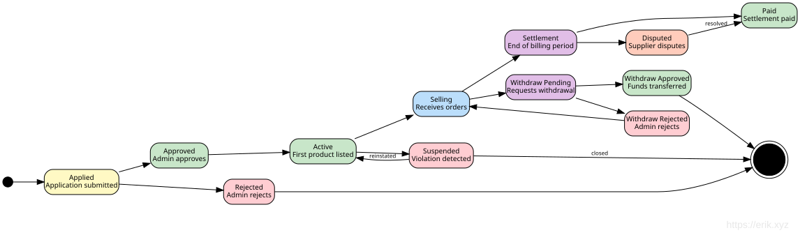

# Dokumen Desain Panel Admin

## Ikhtisar

`admin/` adalah instans webman v2.1 mandiri yang menyediakan dasbor manajemen berbasis Layui. Instans ini berjalan independen dari backend `service/`, hanya berbagi database MySQL dan 7 paket erikwang2013.

## Arsitektur

```
┌─────────────────────────────────────────────────┐
│                  Admin Panel                     │
│  ┌──────────┐  ┌──────────┐  ┌───────────────┐ │
│  │ Controller│  │  Model   │  │   Bootstrap   │ │
│  │ (Layui)  │  │(Eloquent)│  │(worker start) │ │
│  └────┬─────┘  └────┬─────┘  └───────┬───────┘ │
│       │             │               │          │
│  ┌────┴─────────────┴───────────────┴─────────┐ │
│  │         7 erikwang2013 Packages             │ │
│  │  Snowflake │ Hashids │ Encryptable          │ │
│  │  Encryption│ Scout   │ Season │ Poster     │ │
│  └────────────────────┬───────────────────────┘ │
└───────────────────────┼─────────────────────────┘
                        │
              ┌─────────┴─────────┐
              │   MySQL 8.0       │
              │   Elasticsearch   │
              └───────────────────┘
```

### Peta Dependensi Modul


## Struktur Direktori

```
admin/
├── app/
│   ├── bootstrap/       # Per-process startup
│   │   ├── SnowflakeBootstrap.php
│   │   ├── EncryptableBootstrap.php
│   │   └── EncryptionBootstrap.php
│   ├── controller/       # 54 controller files (Base/Crud + per-entity CRUD)
│   │   ├── Base.php     # json() with hashids_encode_ids
│   │   ├── Crud.php     # Select/Insert/Update/Delete/Export with hashids decode
│   │   ├── DashboardController.php  # Dashboard data API (user stats + trends)
│   │   ├── AccountController.php    # Login/logout/profile/password
│   │   ├── AdminController.php      # Admin CRUD + roles
│   │   ├── RoleController.php       # Role CRUD + rule tree
│   │   └── ...
│   ├── model/            # 44 Eloquent models（36 个映射 service 无前缀业务表 + alerts（install.sql 定义）+ 7 个 wa_* 管理表）
│   │   ├── Base.php     # Snowflake PK + Encryptable support
│   │   ├── Admin.php    # Encryptable: password, email, mobile
│   │   ├── User.php     # Encryptable: 6 fields + Searchable trait
│   │   └── ...
│   ├── common/           # Auth, Tree, Layui, Util, ExcelExport
│   ├── middleware/        # WafMiddleware + AccessControl
│   ├── exception/        # Handler
│   └── functions.php     # hashids_encode/decode, encrypt_data/decrypt_data
├── api/                  # Public API (plugin\admin\api)
│   └── Auth.php          # canAccess() ACL
├── config/
│   ├── plugin/erikwang2013/  # 7 plugin configs
│   ├── hashids.php       # Hashids connections (main + alternative)
│   └── encryption.php    # Encryption config (master key, cipher)
├── tests/                # PHPUnit 11 test suite (286 tests, 962 assertions)
│   ├── HashidsTest.php   # 21 tests
│   ├── BaseJsonTest.php  # 13 tests
│   ├── CrudHashidsTest.php # 14 tests
│   ├── TreeTest.php      # 19 tests
│   ├── AccessControlMiddlewareTest.php # 7 tests（401/403/放行）
│   ├── AdminControllersTest.php        # 48 控制器反射回归
│   ├── UtilTest.php      # 17 tests
│   ├── DictTest.php      # 5 tests
│   ├── ExcelExportTest.php # 4 tests
│   ├── LayuiTest.php     # 5 tests
│   └── support/          # RequestMock, TestableCrud
├── install.sql           # DDL (bigint unsigned PKs, no auto-increment)
└── phpunit.xml
```

## Detail Integrasi Paket

### 1. Snowflake (Kunci Utama Terdistribusi)

**Konfigurasi**: `config/plugin/erikwang2013/snowflake-php/app.php`
**Bootstrap**: `app/bootstrap/SnowflakeBootstrap.php`

```php
// Model Base::boot() — creating event
static::creating(function (Model $model) {
    if (empty($model->getKey())) {
        $snowflake = Container::instance()->get(Snowflake::class);
        $model->setAttribute($model->getKeyName(), $snowflake->id());
    }
});
```

- ID 64-bit: `timestamp(41b) | datacenter(5b) | worker(5b) | sequence(12b)`
- Epoch: 2024-01-01 (masa pakai maksimum ~69 tahun)
- `$incrementing = false`, `$keyType = 'int'` pada model Base
- Semua kolom PK dan FK: `bigint unsigned NOT NULL`

### 2. Hashids (Obfuskasi ID)

**Konfigurasi**: `config/hashids.php` + `config/plugin/erikwang2013/hashids/app.php`

**Jalur encode** (respons):
- `Base::json()` memanggil `hashids_encode_ids($data)` secara rekursif
- Kolom bernama `id`, `*_id`, `*_ids` dengan bilangan bulat positif → string hashid
- `Crud::formatNormal()` juga menerapkan encoding (diperbaiki saat code review)

**Jalur decode** (permintaan):
- `Crud::selectInput()`: mendekode string hashid `id`/`*_id` pada klausa WHERE
- `Crud::updateInput()`: mendekode kunci utama dari `$request->post()`
- `Crud::deleteInput()`: mendekode array PK dari `$request->post()`
- `AdminController::update()`: menggunakan nilai balik `updateInput()` langsung (dedup)
- `RoleController::select()`/`rules()`: mendekode `$request->get('id')`

**Fungsi pembantu** (di `app/functions.php`):
- `hashids_encode(int $id): string`
- `hashids_decode(string $hash): int` — mengembalikan 0 jika gagal
- `hashids_encode_ids(array $data): array` — rekursif, menangani string `is_numeric()`

### 3. Encryptable (Enkripsi Kolom Database)

**Konfigurasi**: `config/plugin/erikwang2013/encryptable/app.php`
**Bootstrap**: `app/bootstrap/EncryptableBootstrap.php`

Menggunakan antarmuka Eloquent `CastsAttributes`:
- `get()`: mendekripsi nilai AES saat membaca dari DB
- `set()`: mengenkripsi nilai AES saat menulis ke DB

**Kolom terenkripsi**:
| Model | Kolom |
|-------|--------|
| Admin | password, email, mobile |
| User | password, email, mobile, token, last_ip, join_ip |

**Aturan penting**: Selalu gunakan `save()` pada instans model, jangan pernah Query Builder `update()`. Menggunakan `Admin::where(...)->update(...)` melewati Eloquent casts dan menyimpan nilai mentah. Ini diperbaiki di `AccountController` saat code review.

**Layering kata sandi**: Kata sandi di-hash bcrypt terlebih dahulu (di `insertInput`/`updateInput`), lalu hash-nya dienkripsi AES oleh Encryptable cast saat `save()`. Saat membaca: dekripsi AES → hash bcrypt → `password_verify()`.

### 4. Encryption (Transmisi API)

**Konfigurasi**: `config/encryption.php`
**Bootstrap**: `app/bootstrap/EncryptionBootstrap.php`

Dicadangkan untuk enkripsi permintaan/respons tingkat API (AES-256-GCM). Menyediakan:
- `encrypt_data(string $plaintext): string`
- `decrypt_data(string $ciphertext): string`

Melempar `RuntimeException` dengan pesan jelas jika `ENCRYPTION_MASTER_KEY` tidak dikonfigurasi.

### 5. Webman-Scout (Elasticsearch)

**Konfigurasi**: `config/plugin/erikwang2013/webman-scout/app.php` + `command.php`

Model User menggunakan trait `Searchable`:
```php
class User extends Base
{
    use Searchable;

    public function toSearchableArray(): array
    {
        return [
            'id' => $this->id,
            'username' => $this->username,
            'nickname' => $this->nickname,
            'email' => $this->email,
            'mobile' => $this->mobile,
        ];
    }
}
```

### 6. Season (Bendera Negara)

**Konfigurasi**: `config/plugin/erikwang2013/season/app.php`

Helper global: `country_season_flag(string $code): string`
- `country_season_flag('CN')` → 🇨🇳
- `country_season_flag('US')` → 🇺🇸

Juga menyediakan nama musim terlokalisasi melalui kelas `CountrySeason`.

### 7. Poster-PHP (CAPTCHA Klik)

**Konfigurasi**: `config/poster.php` + `config/plugin/erikwang2013/poster/app.php`
**Bootstrap**: `config/plugin/erikwang2013/poster/bootstrap.php` → `CaptchaPlugin`

Menyediakan verifikasi CAPTCHA berbasis klik untuk login dan registrasi:

```
Client                         Server
──────                         ──────
POST /api/v1/captcha/create

  → CaptchaService::create()
    → captcha_create('click')
      → ClickCaptcha::generate()
        → GD renders image with n randomly-placed Chinese words
        → Stores targets + key in Redis/File storage
      ← {key, image (base64), target_count, expires_in}

POST /api/v1/auth/login

  (with captcha_key + captcha_points)
  → AuthController::verifyCaptcha()
    → CaptchaService::verify(key, [[x1,y1], [x2,y2], ...])
      → captcha_verify(key, 'click', points)
        → CaptchaManager checks Euclidean distance ≤ 18px tolerance
      ← true/false
```

**Fitur keamanan**:
- Kunci sekali pakai: dihapus setelah verifikasi sukses
- Proteksi brute-force: maksimal 3 kali percobaan gagal per kunci, lalu dihapus
- TTL 300 detik (dapat dikonfigurasi via `CAPTCHA_TTL`)
- Toleransi klik: radius 18px (dapat dikonfigurasi)
- Tingkat kesulitan: mudah (2 target), sedang (3), sulit (4)
- Penyimpanan: auto-detect Redis → fallback file, dapat dikonfigurasi via `CAPTCHA_STORAGE`

**Wrapper**: `Common\Captcha\CaptchaService` memuat konfigurasi kustom dari `config/poster.php`, menyediakan metode `create()` (menghapus target dari respons demi keamanan) dan `verify()`. Digunakan oleh `AuthController::register()` dan `AuthController::login()`.

### 8. ConfirmationMiddleware (Verifikasi Ulang Kata Sandi)

**Konfigurasi**: Middleware grup rute di `config/route.php`

Melindungi operasi destruktif dan sensitif dengan mengharuskan pengguna memasukkan ulang kata sandi. Diterapkan sebagai middleware pada 12 endpoint rute sensitif:

```
Client                              Server
──────                              ──────
POST /api/v1/orders/{id}/pay

  (with confirm_password field)
    → ConfirmationMiddleware::process()
      → Checks userId present (401 if missing)
      → Checks Redis lock key (429 if locked out)
      → Validates password non-empty (422 if missing)
      → User::find() + Hash::check() verifies bcrypt
      → On failure:
        → Redis INCR confirm_failed:{userId} counter
        → If count ≥ 5, SETEX confirm_lock:{userId} for 900s
        → AuditLogger::record('confirm_failed', ...)
        → Returns 403
      → On success:
        → DEL confirm_failed:{userId} counter
        → AuditLogger::record('confirm_success', ...)
        → Calls $next($request)
```

**Endpoint pengguna sensitif** (Auth + Confirmation):
| Metode | Path | Operasi |
|--------|------|-----------|
| POST | `/api/v1/orders/{id}/pay` | Memulai pembayaran |
| POST | `/api/v1/supplier/withdraw` | Mengajukan penarikan |
| DELETE | `/api/v1/dns/{domain}/records/{id}` | Menghapus catatan DNS |

**Endpoint admin sensitif** (Auth + AdminRole + Confirmation):
| Metode | Path | Operasi |
|--------|------|-----------|
| DELETE | `/admin/api/v1/products/{id}` | Menghapus produk |
| POST | `/admin/api/v1/orders/{id}/refund` | Refund pesanan |
| POST | `/admin/api/v1/provisioning/resources/{id}/destroy` | Menghancurkan sumber daya |
| POST | `/admin/api/v1/kyc/{id}/approve` | Menyetujui KYC |
| POST | `/admin/api/v1/kyc/{id}/reject` | Menolak KYC |
| POST | `/admin/api/v1/suppliers/{id}/approve` | Menyetujui pemasok |
| POST | `/admin/api/v1/suppliers/{id}/settle` | Membuat settlement |
| POST | `/admin/api/v1/suppliers/withdraws/{id}/approve` | Menyetujui penarikan |
| PUT | `/admin/api/v1/system/config` | Memperbarui konfigurasi sistem |

Versi API ada di path URL (contoh: `/api/v1/...`).

**Fitur keamanan**:
- Verifikasi kata sandi bcrypt via `Hash::check()`
- Pembatasan frekuensi: 5 kali percobaan gagal memicu kunci 15 menit (TTL 900s)
- Kunci berlaku per pengguna via kunci Redis (`confirm_lock:{userId}`, `confirm_failed:{userId}`)
- Sukses mereset penghitung kegagalan
- Semua percobaan dicatat ke database audit (sukses, gagal, terkunci)
- `verifyPassword()` adalah metode protected, memungkinkan pengujian melalui override subclass anonim

**Testabilitas**: `ConfirmationMiddlewareTest` (11 test) menggunakan subclass anonim yang meng-override `verifyPassword()` untuk mengembalikan boolean tetap, menghindari dependensi Eloquent/DB. Test mencakup: 401 tidak terautentikasi, 422 kata sandi hilang/kosong, 403 kata sandi salah, pass-through sukses, format kunci rate limit, format kunci lock, dan batas ambang kegagalan maksimum (4→tanpa lock, 5→locked, 6→locked).

## Sistem ACL

### Tingkat Controller

```php
protected $noNeedLogin = ['login', 'logout', 'captcha'];  // Skip login
protected $noNeedAuth = ['select'];                         // Skip auth
```

Diverifikasi oleh `api/Auth::canAccess()` via `ReflectionClass`.

**Respons AccessControlMiddleware** (`middleware/AccessControl.php`):
- Belum login (di luar `noNeedLogin`) → **HTTP 401**, body berupa skrip lompat ke halaman login
- Sudah login tetapi izin tidak cukup → **HTTP 403** halaman error (kode status 403, tidak lagi 500)
- Dalam daftar bypass (halaman login/kode verifikasi dll.) → diizinkan lewat normal

### Berbasis Peran

- Peran memiliki `rules` (ID aturan dipisah koma atau `*` untuk super admin)
- Aturan disimpan di `wa_rules` sebagai kunci `{Controller}@{action}`
- `api/Auth::canAccess()` menyelesaikan kunci `$controller@$action` terhadap rules peran
- Super admin (`rules = '*'`) melewati semua pemeriksaan

### Batas Data

```php
protected $dataLimit = null;     // No limit
protected $dataLimit = 'auth';   // Admin sees own + descendants' data
protected $dataLimit = 'personal'; // Admin sees only own data
protected $dataLimitField = 'admin_id';
```

## Temuan Code Review (Diperbaiki)

Saat meninjau komit awal, berikut ditemukan dan diperbaiki:

### Kritis
1. **AccountController melewati Encryptable**: `password()` dan `update()` menggunakan `Admin::where()->update()` yang melewati Eloquent casts → menyimpan nilai mentah di kolom terenkripsi. Diperbaiki dengan menggunakan `Admin::find()->save()`.
2. **Crud::formatNormal() tidak mengenkode ID**: Memanggil `json()` global alih-alih menerapkan `hashids_encode_ids()`. Diperbaiki.

### Penting
3. **hashids_encode_ids ketat `is_int`**: Nilai bigint besar dari PDO tiba sebagai string PHP. Diubah ke `is_numeric()` dengan pemeriksaan bilangan bulat.
4. **Dekode ID ganda AdminController**: `update()` mendekode PK yang sama dua kali. Di-dedup, memperbaiki shadowing variabel loop di `insert()`.
5. **Kode kata sandi mati di AccountController::update()**: Kolom kata sandi tidak ada di daftar izin. Dihapus.
6. **Driver MySQL hardcode**: Diubah ke `config('database.default')`.

## Ekspor Excel

### Arsitektur

Ekspor Excel menggunakan PhpSpreadsheet ^2.0 untuk membuat file .xlsx di sisi server. Panel admin memiliki dua jalur ekspor terpisah karena ada dua mekanisme CRUD:

```
Export request (with current table filters)
  ├── Crud-based controllers (User, Admin, Role, etc.)
  │     → Crud::export()
  │       → selectInput() reuses query parsing (hashids decode, WHERE, ORDER)
  │       → doSelect() builds Eloquent query
  │       → 10,000 row cap
  │       → hashids_encode_ids() applied to result data
  │       → ExcelExport::export() generates .xlsx
  │
  └── TableController (generic tables like wa_dict, wa_rules)
        → TableController::export()
          → Builds query from table schema + request params
          → hashids_encode_ids() applied
          → ExcelExport::export() generates .xlsx
```

### Utilitas ExcelExport (`app/common/ExcelExport.php`)

Wrapper fluent di sekitar PhpSpreadsheet:

- `setColumns(array $columns)` — mendefinisikan urutan kolom
- `setLabels(array $labels)` — mengatur judul kolom yang dapat dibaca
- `addRow(array $row)` / `addRows(array $rows)` — mengisi data
- `save(string $title): string` — menulis .xlsx ke `runtime/exports/`, mengembalikan path file
- Helper statis: `ExcelExport::export($title, $columns, $data, $labels)` — ekspor sekali jalan
- Ukuran kolom otomatis via `Worksheet::getColumnDimension()`

### Crud::export()

```php
public function export(Request $request): Response
{
    [$where, $format, $limit, $field, $order] = $this->selectInput($request);
    $query = $this->doSelect($where, $field, $order);
    $maxRows = 10000;
    $total = min($query->count(), $maxRows);
    $items = $query->limit($maxRows)->get();
    if (method_exists($this, 'afterQuery')) {
        $items = call_user_func([$this, 'afterQuery'], $items);
    }
    $data = array_map(fn($item) => ...toArray(), $items->toArray());
    $data = hashids_encode_ids($data);
    // Derive column labels from table schema comments
    $path = ExcelExport::export($table, $columns, $data, $labels);
    return response()->download($path, $table . '_' . date('YmdHis') . '.xlsx');
}
```

Semua controller berbasis Crud (Admin, User, Role, dll.) mewarisi `export()` secara otomatis.

### Wiring Frontend

- Item toolbar bawaan Layui `"exports"` (CSV sisi klien) diganti dengan tombol kustom `{title: "导出", layEvent: "export"}`
- Event handler `export` memanggil `window.exportExcel()` yang mengumpulkan parameter filter tabel saat ini dan membuka URL unduhan
- `Layui::buildTable()` membuat toolbar dengan tombol ekspor kustom untuk semua halaman CRUD

### Ekspor API Admin Service

Backend service (`service/`) juga memiliki ekspor Excel melalui wrapper `Common\ExcelExport` miliknya sendiri:

| Endpoint | Controller | Data yang diekspor |
|----------|-----------|---------------|
| `GET /admin/api/v1/orders/export` | OrderController | id, order_no, user_id, type, status, total, currency, created_at, paid_at |
| `GET /admin/api/v1/users/export` | UserController | id, email, phone, role, status, created_at, last_login_at |
| `GET /admin/api/v1/suppliers/export` | SupplierController | id, user_id, status, contact_name, contact_email, contact_phone, created_at |

Rute ekspor ditempatkan SEBELUM rute parameter `/{id}` untuk menghindari konflik.

## API Admin Service — Fitur Lanjutan

### Endpoint API Admin (Lapisan Service)

Semua endpoint REST admin diawali dengan `/admin/api` dan memerlukan `AdminRoleMiddleware`.

| Grup | Endpoint | Controller |
|-------|-----------|------------|
| Dashboard | `GET /dashboard`, `/kyc`, `POST /kyc/{id}/approve`, `/reject` | `Admin\DashboardController` |
| Users | `GET /users`, `/users/export`, `/users/{id}`, `PUT /users/{id}/status` | `Admin\UserController` |
| Products | `POST /products`, `PUT /products/{id}`, `DELETE /products/{id}`, `POST /products/{id}/skus`, `PUT /skus/{id}`, `POST /skus/{id}/region-price` | `Admin\ProductController` |
| Impor/Ekspor Produk | `GET /products/export` (CSV), `POST /products/import` (CSV upsert) | `Admin\ImportExportController` |
| Orders | `GET /orders`, `/orders/export`, `/orders/{id}`, `POST /orders/{id}/refund` | `Admin\OrderController` |
| Invoices | `GET /invoices`, `POST /invoices/{orderId}/generate` | `Admin\InvoiceController` |
| Payments | `GET /payments/channels`, `PUT /payments/channels/{id}`, `GET /payments/transactions`, `/reconcile` | `Admin\PaymentController` |
| Provisioning | `GET /provisioning/tasks`, `POST /tasks/{id}/retry`, `POST /resources/{id}/upgrade`, `/destroy`, `GET /hosts` | `Provisioning\TaskController` |
| Provider APIs | `GET /providers`, `POST /providers`, `PUT /providers/{id}`, `DELETE /providers/{id}` | `Admin\ProviderApiController` |
| CDN | `GET /cdn/domains`, `PUT /cdn/domains/{id}` | `Admin\CdnController` |
| Suppliers | `GET /suppliers`, `/suppliers/export`, `POST /suppliers/{id}/approve`, `/settle`, `/withdraws/{id}/approve` | `Admin\SupplierController` |
| Supplier API Keys | `GET /suppliers/{id}/api-keys`, `POST /suppliers/{id}/api-keys`, `DELETE /suppliers/api-keys/{id}` | `Admin\SupplierController` |
| Tickets | `GET /tickets`, `POST /tickets/{id}/assign`, `/close` | `Ticket\TicketController` |
| Coupons | `GET /coupons`, `POST /coupons`, `DELETE /coupons/{id}` | `Admin\CouponController` |
| Webhooks | `GET /webhooks`, `POST /webhooks`, `DELETE /webhooks`, `POST /webhooks/test` | `Admin\WebhookController` |
| Domains | `GET /domains/tlds`, `POST /domains/tlds`, `PUT /domains/tlds/{id}`, `DELETE /domains/tlds/{id}`, `GET /domains/zones`, `/transfers`, `POST /transfers/{id}/approve` | `Admin\DomainController` |
| Notifications | `GET /notifications/templates`, `PUT /notifications/templates/{id}`, `GET /notifications/log` | `Admin\NotificationController` |
| Artikel Bantuan | `GET /help`, `POST /help`, `PUT /help/{id}`, `DELETE /help/{id}` | `Admin\HelpController` |
| Reports | `GET /reports/revenue`, `/supplier`, `/region` | `Report\ReportController` |
| Monitoring | `GET /monitor/dashboard`, `/resources/{id}` | `Monitor\MonitorController` |
| Audit | `GET /audit-logs` | `Admin\SystemController` |
| System Config | `PUT /system/config` | `Admin\SystemController` |

### Manajemen Sumber Daya CDN

Produk CDN mendukung empat penyedia (Cloudflare / CloudFront / Aliyun / Tencent), sisi admin terbagi dua bagian:

**Konfigurasi akun penyedia** (memakai kembali model ProviderApi, `Admin\ProviderApiController`):

- `GET/POST /admin/api/v1/providers`、`PUT/DELETE /admin/api/v1/providers/{id}`, dipasang `RbacMiddleware('provider.config')`
- Konvensi `code`: `cdn-cloudflare` / `cdn-cloudfront` / `cdn-aliyun` / `cdn-tencent`; kolom kredensial dienkripsi Encryptable saat disimpan, kolom JSON `config` menyimpan metadata non-sensitif
- Prioritas resolusi kredensial sisi pengguna: akun terikat → akun aktif yang cocok dengan `code` → fallback env; hapus/purge menggunakan snapshot ketat (hanya akun terikat, hilang/nonaktif mengembalikan 4003)

**Manajemen domain CDN** (`Admin\CdnController`):

```
GET /admin/api/v1/cdn/domains        → semua domain (termasuk user_id pemilik), dipasang RbacMiddleware('cdn.manage')
PUT /admin/api/v1/cdn/domains/{id}   → perbarui paket, whitelist plan: standard | pro | enterprise,
                                    nilai tidak valid mengembalikan 400; perubahan ditulis ke
                                    log audit admin_cdn_update_plan
```

### Data Dashboard (Lapisan Service)

`Admin\DashboardController::index()` menyediakan metrik operasional nyata:

```php
[
    'today_stats' => [todayOrders, todayRevenue, newUsers, activeResources],
    'revenue_trend_30d' => [...],   // Daily revenue for last 30 days
    'region_distribution' => [...],  // Active resources grouped by region
    'pending_orders' => ...,         // Orders awaiting payment
    'pending_kyc' => ...,            // KYC submissions awaiting review
    'open_tickets' => ...,           // Open or in-progress tickets
]
```

### Tampilan Dasbor Panel Admin (`app/view/index/dashboard.html`)

- **8 kartu statistik beranimasi**: pengguna hari ini/pekan/bulan/total + pesanan hari ini + pendapatan hari ini + pesanan pending + sumber daya aktif — masing-masing dengan animasi hitung naik via modul `count` Layui
- **3 grafik ECharts**:
  1. Tren registrasi pengguna 7 hari — area line chart
  2. Tren registrasi pengguna 30 hari — bar chart
  3. Ringkasan pengguna — donut/pie chart (hari ini / pekan / bulan)
- **Tabel info sistem**: diisi secara dinamis dengan versi PHP/Workerman/Webman/Admin/MySQL/OS
- **Toolbar**: tombol ekspor PDF dan refresh
- Semua data diambil via AJAX dari `/app/admin/dashboard/data`

### Rute

```
Route::any('/app/admin/dashboard/data', [DashboardController::class, 'index']);
```

Selain rute yang terdaftar eksplisit, `admin/config/route.php` otomatis mendaftarkan rute `/app/admin/{snake_case_controller}/{action}` untuk setiap metode publik setiap controller di `app/controller/` (mis. `/app/admin/order_item/index`), nama controller snake_case konsisten dengan URL dan menu; `/app/admin` dan `/app/admin/index` adalah entri halaman utama/halaman login backend (membuat tampilan login jika belum login); permintaan yang tidak cocok dikembalikan 404.

## Ekspor PDF

Pembuatan PDF di sisi klien pada halaman dasbor:

- Menggunakan **html2canvas 1.4.1** (CDN) untuk menangkap DOM dasbor sebagai canvas
- Menggunakan **jsPDF 2.5.1** (CDN) untuk membuat PDF A4 yang dapat diunduh
- Menangkap kartu statistik dan grafik ECharts (dirender sebagai elemen canvas)
- Menyertakan judul, timestamp, dan branding di PDF
- Dipicu oleh tombol "Export PDF" di toolbar dasbor

```
Dashboard DOM → html2canvas screenshot → jsPDF document → browser download
```

### Implementasi

```javascript
// In dashboard.html
html2canvas(document.querySelector('.layui-body'), {scale: 2}).then(canvas => {
    const pdf = new jsPDF('p', 'mm', 'a4');
    const imgData = canvas.toDataURL('image/png');
    pdf.addImage(imgData, 'PNG', 10, 10, 190, 0);
    pdf.save('dashboard_' + new Date().toISOString().slice(0, 10) + '.pdf');
});
```

## Suite Pengujian

```
PHPUnit 11.5 | 67 tests | 124 assertions
```

### HashidsTest (21 test)
- Roundtrip encode/decode (0 hingga PHP_INT_MAX)
- Encoding deterministik
- Penanganan string tidak valid/kosong
- Pola kolom `hashids_encode_ids` (`id`, `*_id`, `*_ids`)
- Skip nol/negatif, dukungan string numerik
- Rekursi array bertingkat, pelestarian kolom non-id

### BaseJsonTest (13 test)
- `json()`/`success()`/`fail()` menerapkan encoding hashids
- Encoding objek bertingkat
- Penanganan ID ukuran Snowflake
- Pelestarian kolom non-id
- Penanganan nol
- Verifikasi struktur respons

### CrudHashidsTest (14 test)
- `selectInput`: decode hashid di kolom WHERE `id`/`*_id`
- `selectInput`: pass-through string numerik/int mentah
- `updateInput`: decode PK hashid
- `updateInput`: cast PK string numerik ke int
- `deleteInput`: decode ID batch, tipe campuran
- `deleteInput`: array kosong, penanganan ID tunggal

## Sistem Migrasi Database

### Arsitektur

Instans `service/` dan `admin/` memiliki sistem migrasi independen yang dibangun di atas Schema Builder `illuminate/database`. Setiap instans mendaftarkan perintah Symfony Console via `config/command.php` yang dapat ditemukan oleh console runner webman.

```
php webman migrate          # Run pending migrations
php webman migrate:rollback # Rollback last batch
php webman migrate:status   # Show migration status
```

### MigrationRunner (`service/support/MigrationRunner.php`, `admin/app/common/MigrationRunner.php`)

Mesin inti yang dibagi kedua instans:

- **`ensureTable()`** — Membuat tabel pelacakan `migrations` (id, nama migrasi, nomor batch) pada run pertama
- **`migrate()`** — Memindai file migrasi dari `database/migrations/`, menjalankan metode `up()` yang tertunda, mencatat batch
- **`rollback()`** — Membalik batch terakhir dengan memanggil `down()` pada setiap migrasi dalam urutan terbalik
- **`status()`** — Menampilkan semua migrasi beserta nomor batch-nya
- **`resolve()`** — Membuat instans kelas migrasi dari file

### Kelas Dasar Migrasi (`service/support/Migration.php`, `admin/app/common/Migration.php`)

```php
abstract class Migration
{
    abstract public function up(): void;
    abstract public function down(): void;
}
```

Setiap file migrasi mengembalikan kelas yang memperluas `Migration` dengan nama file berawalan timestamp (mis. `2024_01_01_000001_create_initial_schema.php`).

### Migrasi Service

**Direktori**: `service/database/migrations/` — 38 file migrasi（表名无 erik_ 前缀，admin 模型直接映射）

| Migrasi | Tabel |
|-----------|--------|
| `0001_create_users_tables` | users, user_profiles, user_kyc, user_balance, user_balance_log, user_addresses, refresh_tokens |
| `0002_create_product_tables` | product_categories, regions, products, product_skus, product_regions, product_images, product_attributes, product_reviews |
| `0003_create_order_tables` | carts, orders, order_items, order_timeline, order_invoices, refunds |
| `0004_create_payment_tables` | payment_channels, payment_transactions, payment_reconcile |
| `0005_create_provisioning_tables` | resources, resource_servers, resource_ips, resource_disks, resource_domains, provision_tasks, provider_apis |
| `0006_create_host_tables` | host_machines, ip_pools, ip_allocations, disks, disk_resizes |
| `0007_create_supplier_tables` | suppliers, supplier_products, supplier_settlements, supplier_withdraws |
| `0008_create_domain_tables` | domain_tlds, domain_transfers, dns_zones, dns_records |
| `0009_create_ticket_notification_tables` | tickets, ticket_messages, notifications, notification_templates |
| `0010_create_audit_table` | audit_logs |
| `0011_create_kvm_service_tables` | network_services, firewall_services, switch_services |
| `2024_01_01_000001_create_initial_schema` | Menjalankan `docs/database.sql` via `Capsule::unprepared()`, drop semua di `down()` |
| `2025_05_16_000002_add_fcm_token_to_users` | Menambahkan kolom `fcm_token`, `fcm_platform` + indeks ke users |
| `2026_08_26_000003_widen_encrypted_columns` | users.phone / user_addresses.phone / suppliers.contact_phone VARCHAR(20)→VARCHAR(255)（Encryptable 密文长度） |

### Migrasi Admin

**Direktori**: `admin/database/migrations/` — 1 file migrasi

| Migrasi | Deskripsi |
|-----------|-------------|
| `2024_01_01_000001_create_admin_schema` | Menjalankan `admin/install.sql` via `Capsule::unprepared()` — membuat tabel wa_* dengan data seed |

### Registrasi Perintah Console

**`service/config/command.php`**:
```php
return [
    \App\Command\MigrateCommand::class,
    \App\Command\MigrateRollbackCommand::class,
    \App\Command\MigrateStatusCommand::class,
];
```

**`admin/config/command.php`** — pola yang sama di namespace `app\command`.

## Integrasi Produksi Stripe

### Arsitektur

Mengganti ID pembayaran palsu `random_bytes()` dengan integrasi API Stripe nyata via `stripe/stripe-php` ^15.0.

**File**: `service/app/payment/service/channels/StripeChannel.php`

```
Client-side                    Server-side                    Stripe API
───────────                    ───────────                    ──────────
Select Stripe at checkout
  → POST /orders/{id}/pay
    → StripeChannel::createPaymentIntent()
      → StripeClient->paymentIntents->create(amount, currency)
        ← {id, client_secret}
      → Save pi_xxx as transaction_no
      ← Return client_secret
  → Stripe.js confirmCardPayment(client_secret)
    ← Payment confirmed by Stripe
      → POST /payments/webhook/stripe
        → StripeChannel::handleWebhook()
          → Webhook::constructEvent(payload, signature, secret)
          → Verify idempotency (skip non-pending transactions)
          → Update order status, create transaction record
```

### Pembuatan PaymentIntent

```php
public function createPaymentIntent(Order $order): array
{
    $intent = $this->stripe()->paymentIntents->create([
        'amount'   => (int) round($order->total * 100),  // cents
        'currency' => strtolower($order->currency),
        'metadata' => ['order_id' => $order->id, 'order_no' => $order->order_no],
    ]);
    return [
        'transaction_no' => $intent->id,          // pi_xxxxxxxxxxxxx
        'client_secret'  => $intent->client_secret, // pi_xxx_secret_yyy
    ];
}
```

- `$this->stripe()` menginisialisasi lambat `\Stripe\StripeClient` dengan `STRIPE_SECRET_KEY` dari env
- Fallback ke `$this->channel->api_key_encrypted` (didekripsi via Encryptable) jika env var tidak diatur
- Jumlah dikonversi ke sen: `(int) round($order->total * 100)`

### Verifikasi Tanda Tangan Webhook

```php
public function handleWebhook(string $payload, string $signature): void
{
    $event = \Stripe\Webhook::constructEvent(
        $payload, $signature, $this->channel->webhook_secret_encrypted
    );
    // Idempotency: skip if transaction already processed
    $existing = Transaction::where('transaction_no', $event->id)->first();
    if ($existing && $existing->status !== 'pending') return;
    
    match ($event->type) {
        'payment_intent.succeeded' => $this->confirmPayment($event),
        'payment_intent.payment_failed' => $this->failPayment($event),
        default => null,
    };
}
```

- Menggunakan `Webhook::constructEvent()` untuk memverifikasi header tanda tangan Stripe
- **Perlindungan idempotensi**: memeriksa pengiriman webhook duplikat via `transaction_no`
- Mendukung tipe event sukses dan gagal

## Integrasi SMS Twilio

### Arsitektur

Mengganti stub `error_log()` dengan pengiriman SMS nyata via `twilio/sdk` ^8.0.

**File**: `service/app/notification/queue/SmsSender.php`

### Pengiriman Pesan

```php
public function consume(): void
{
    $client = new \Twilio\Rest\Client(
        getenv('TWILIO_ACCOUNT_SID'),
        getenv('TWILIO_AUTH_TOKEN')
    );
    $message = $client->messages->create(
        $this->notification->recipient_phone,
        ['from' => getenv('TWILIO_PHONE_NUMBER'), 'body' => $this->notification->body]
    );
    $this->notification->provider_message_id = $message->sid;
}
```

### Penanganan Kesalahan

- Menangkap `Twilio\Exceptions\RestException` — menangkap kode dan pesan kesalahan Twilio
- Membuat catatan Notification gagal dengan `send_status = 'failed'`
- Mencatat `provider_message_id` (SID Twilio) untuk pelacakan pengiriman
- Fallback ke `error_log()` saat kredensial Twilio tidak diatur (mode dev)

### Konfigurasi

Env vars: `TWILIO_ACCOUNT_SID`, `TWILIO_AUTH_TOKEN`, `TWILIO_PHONE_NUMBER`

## Integrasi Push FCM

### Arsitektur

Mengganti stub `error_log()` dengan pengiriman push nyata via `kreait/firebase-php` ^7.0.

**File**: `service/app/notification/queue/PushSender.php`

### Penyimpanan Token Perangkat

Ditambahkan ke tabel `users` melalui migrasi:
- `fcm_token VARCHAR(512) DEFAULT NULL` — token registrasi perangkat
- `fcm_platform VARCHAR(16) DEFAULT NULL` — `ios` / `android` / `web`
- `INDEX idx_fcm_token (fcm_token)` — pencarian berdasarkan token

Model User: `fcm_token` dan `fcm_platform` ditambahkan ke `$fillable`.

### Pengiriman Push

```php
public function consume(): void
{
    $factory = new \Kreait\Firebase\Factory();
    if ($credentialsPath = getenv('FIREBASE_CREDENTIALS_PATH')) {
        $factory = $factory->withServiceAccount($credentialsPath);
    }
    $messaging = $factory->createMessaging();
    
    $message = \Kreait\Firebase\Messaging\CloudMessage::withTarget(
        'token', $this->user->fcm_token
    )->withNotification([
        'title' => $this->notification->title,
        'body'  => $this->notification->body,
    ]);
    
    $result = $messaging->send($message);
}
```

### Pembersihan Token

- Menangkap `Kreait\Firebase\Exception\Messaging\InvalidToken` — men-null-kan `fcm_token` pengguna
- Menangkap `Kreait\Firebase\Exception\Messaging\NotFound` — menghapus token yang tidak terdaftar
- Fallback ke `error_log()` saat kredensial Firebase tidak diatur (mode dev)

### Konfigurasi

Env vars: `FIREBASE_CREDENTIALS_PATH` (service account JSON), `FCM_SERVER_KEY` (legacy)

## Diagram Alur Bisnis

### Pesanan → Pembayaran → Provisioning (Alur Bisnis Inti)


### Detail Provisioning Event-Driven


### Distribusi Notifikasi


### Siklus Hidup Pemasok



### Siklus Hidup Tiket


## Suite Pengujian Lapisan Service

### Ikhtisar

```
PHPUnit 10.5 | 295 tests | 455 assertions
```

**Direktori**: `service/tests/` — 12 file test di 7 modul

**Konfigurasi**: `service/phpunit.xml` — testsuite `unit` tunggal, mencakup sumber `app/` dan `common/`

### Bootstrap Pengujian

`service/tests/bootstrap.php` memuat autoload Composer dan mendefinisikan dua helper global yang dibutuhkan kode yang diuji:

- `request_id()` — mengembalikan string ID permintaan unik
- `now()` — mengembalikan objek `DateTime` saat ini

Pembelajaran kritis: `Webman\Config` tidak dapat dimuat di konteks pengujian karena `loadFromDir()` memicu `route.php` yang memanggil `Route::addRoute()` pada null. Test mem-bypass Config sepenuhnya — `HashidServiceTest` menggunakan `new Hashids()` langsung, `ResponseTest` menggunakan metode helper lokal.

### File Pengujian

| File | Tests | Cakupan |
|------|-------|----------|
| `Captcha/CaptchaServiceTest.php` | 9 | struktur create, tingkat kesulitan, verify lulus/gagal, sekali pakai, kunci unik |
| `Confirmation/ConfirmationMiddlewareTest.php` | 11 | auth diperlukan, kata sandi hilang, kata sandi salah, pass-through sukses, format kunci rate limit, format kunci lock, ambang kegagalan maksimum |
| `Common/HashidServiceTest.php` | 17 | roundtrip encode/decode, determinisme, isolasi salt, walk ID rekursif |
| `Common/ResponseTest.php` | 16 | struktur success/error/paginated, konsistensi request_id, kode kesalahan HTTP |
| `Common/SnowflakeTest.php` | 6 | pengurutan timestamp, keunikan, rentang bigint, pola init |
| `Common/ValidatorTest.php` | 22 | aturan validasi required(), email(), minLength() |
| `Common/LogSanitizerTest.php` | 34 | redaksi PII, array bertingkat, pencocokan tidak peka huruf, 20 tipe kolom sensitif |
| `Payment/StripeChannelTest.php` | 19 | konfigurasi kanal, perhitungan jumlah, tanda tangan webhook, idempotensi |
| `Payment/PaymentRouterTest.php` | 10 | filter kanal, batasan jumlah, dukungan mata uang/wilayah, perhitungan biaya |
| `Notification/NotificationDispatcherTest.php` | 8 | render template, perutean kanal, skip pengguna tidak aktif |
| `Provisioning/ProviderFactoryTest.php` | 12 | register, create, createFromResource, kasus kesalahan |
| `Provisioning/RetryLogicTest.php` | 12 | backoff eksponensial, retry maksimum, transisi status, pemilihan host |
| `ClientPlatform/ClientPlatformMiddlewareTest.php` | 13 | platform valid, header hilang/default, platform tidak didukung, tidak peka huruf, skip non-API, rute admin, akses hilir |
| `Security/WafMiddlewareTest.php` | 37 | SQLi (4), XSS (6), CMDi (4), file inclusion (3), header injection/CRLF (2), SSRF (5), NoSQL injection (4), open redirect (2), pass-through aman (5), pemindaian URL, pemindaian UA |
| `Version/VersionMiddlewareTest.php` | 6 | versi valid, versi hilang default, versi tidak didukung 400, skip non-API, validasi API admin, header respons kesalahan |

### Infrastruktur Pengujian

- `tests/TestCase.php` — kelas dasar yang memperluas PHPUnit TestCase
- `tests/Support/RequestMock.php` — mock request dengan parameter diinjeksi konstruktor

## Pipeline CI/CD

### Arsitektur

Workflow GitHub Actions di `.github/workflows/ci.yml`.

**Pemicu**: push ke `main`, pull request ke `main`

### Jobs

| Job | Strategy | Deskripsi |
|-----|----------|-------------|
| `syntax` | PHP 8.2 | `php -l` lint semua file `.php` di admin/ dan service/ |
| `admin-tests` | PHP 8.2, 8.3 | `composer install -d admin` → `admin/vendor/bin/phpunit` |
| `service-tests` | PHP 8.2, 8.3 | `composer install -d service` → `service/vendor/bin/phpunit` |
| `composer-validate` | PHP 8.2 | `composer validate --strict` pada kedua file composer.json |

### Matriks Versi PHP

Kedua job pengujian berjalan di PHP 8.2 dan 8.3 via `shivammathur/setup-php@v2`.

### Status Saat Ini

Keempat job lulus: total 243 test (67 admin + 176 service), 400 assertion, kedua versi PHP hijau.

## Relasi Entitas Database


## Keputusan Desain Kunci

1. **Instans mandiri**: admin/ berjalan sebagai instans webman sendiri, bukan plugin di dalam service/. Ini mengisolasi lalu lintas admin dan kegagalan dari API yang menghadap pelanggan.

2. **Encryptable + hashing kata sandi**: Kata sandi di-hash bcrypt terlebih dahulu, lalu dienkripsi AES. Cast Encryptable beroperasi di tingkat Eloquent (di atas hashing), jadi layering-nya: `input → bcrypt hash → model attribute set → Encryptable::set() encrypts → DB`. Saat membaca: `DB → Encryptable::get() decrypts → bcrypt hash → password_verify()`.

3. **Hashids di batas Controller**: Encoding/decoding terjadi di batas HTTP (controller), bukan di tingkat model atau ORM. Ini membuat model agnostik database dan menjadikan hashids sebagai masalah presentasi murni.

4. **Resolusi layanan berbasis Container**: Layanan (Snowflake, HashidsManager, EncryptionManager) didaftarkan sebagai singleton via kelas Bootstrap saat worker start. Resolusi container via `\support\Container::instance()` menggunakan instansiasi lambat — layanan hanya dibuat saat akses pertama.

## Fitur Lanjutan (2026-05-20)

### API Admin Service — Endpoint Baru

| Grup | Endpoint | Controller |
|-------|-----------|------------|
| Invoices | `GET /admin/api/v1/invoices`, `POST .../invoices/{orderId}/generate` | `Admin\InvoiceController` |
| Provider APIs | `GET/POST /admin/api/v1/providers`, `PUT/DELETE .../providers/{id}` | `Admin\ProviderApiController` |
| Supplier API Keys | `GET/POST /admin/api/v1/suppliers/{id}/api-keys`, `DELETE .../api-keys/{id}` | `Admin\SupplierController` |
| Coupons | `GET/POST /admin/api/v1/coupons`, `DELETE .../coupons/{id}` | `Admin\CouponController` |
| Webhooks | `GET/POST/DELETE /admin/api/v1/webhooks`, `POST .../webhooks/test` | `Admin\WebhookController` |
| Impor/Ekspor Produk | `GET /admin/api/v1/products/export`, `POST .../products/import` | `Admin\ImportExportController` |
| Manajemen Domain | `GET/POST/PUT/DELETE /admin/api/v1/domains/tlds`, `GET .../zones`, `GET .../transfers`, `POST .../transfers/{id}/approve` | `Admin\DomainController` |
| Templat Notifikasi | `GET /admin/api/v1/notifications/templates`, `PUT .../templates/{id}`, `GET .../log` | `Admin\NotificationController` |
| Artikel Bantuan | `GET/POST /admin/api/v1/help`, `PUT/DELETE .../help/{id}` | `Admin\HelpController` |

### Middleware Baru

| Middleware | Tujuan |
|------------|---------|
| `VersionMiddleware` | Memvalidasi versi API dari path URL |
| `RateLimitMiddleware` | Pembatasan token bucket Redis (default 60req/menit, login 5req/menit) |
| `GeoBlockMiddleware` | Pemblokiran wilayah MaxMind GeoIP2 |
| `MaintenanceMiddleware` | Mode pemeliharaan (sakelar variabel lingkungan + whitelist IP) |
| `ClientPlatformMiddleware` | Identifikasi platform klien (header X-Client-Platform), mendukung 8 platform |
| `SupplierApiKeyMiddleware` | Autentikasi API eksternal pemasok (verifikasi tanda tangan SHA256 Key sk_xxx) |
| `WafMiddleware` (admin) | Middleware WAF panel Admin, 8 kategori 45+ aturan + batas ukuran permintaan + validasi Content-Type |

### Tugas Terjadwal

| Jadwal | Tugas | Tujuan |
|----------|------|---------|
| `13 */4 * * *` | ExchangeRateSync | Pembaruan nilai tukar |
| `37 2 * * *` | PaymentReconcile | Rekonsiliasi pembayaran harian |
| `17 4 * * 1` | SupplierSettlement | Settlement pemasok mingguan |
| `23 6 * * *` | ExpirationCheck | Pemeriksaan kedaluwarsa sumber daya/domain + notifikasi |
| `43 7 * * *` | SslCertificateCheck | Pemeriksaan kedaluwarsa sertifikat SSL + notifikasi |
| `*/5 * * * *` | CollectMetrics | Pengumpulan metrik sumber daya |
| `*/30 * * * *` | CheckExpirations | Pemeriksaan kedaluwarsa sumber daya |

### Perintah CLI

| Perintah | Tujuan |
|---------|---------|
| `php webman migrate` | Menjalankan migrasi yang tertunda |
| `php webman migrate:rollback` | Mengembalikan batch terakhir |
| `php webman migrate:status` | Melihat status migrasi |
| `php webman db:backup` | Membackup database ke file SQL (opsional unggah --s3) |

### Migrasi Database Ditambahkan (2026-05-20)

| Migrasi | Tabel/Kolom |
|-----------|---------------|
| 000003 | users + totp_secret, totp_enabled |
| 000004 | coupons, user_coupons |
| 000005 | help_articles, supplier_api_keys |
| 000006 | roles, permissions, role_permission + data seed |
| 000007 | users + email_verified_at, email_verify_token |
| 000008 | users + last_login_ip, last_login_at |

## Indeks Dokumentasi

### Dokumen Inti

| Dokumen | Path | Deskripsi |
|----------|------|-------------|
| Dokumen desain arsitektur | `docs/architecture.md` | Arsitektur sistem, relasi komponen, pipeline middleware, lapisan keamanan, arsitektur data, topologi deployment |
| Dokumen desain fungsi | `docs/features.md` | Desain fungsi detail 21 modul, termasuk diagram alur, model data, penjelasan interaksi |
| Dokumen antarmuka API | `docs/api-reference.md` | Referensi lengkap 200+ endpoint, dikelompokkan per modul, termasuk contoh permintaan/respons, kode kesalahan |
| Dokumen online API (service) | `http://localhost:8787/apidoc` | Dihasilkan otomatis hg/apidoc, dikelompokkan per fungsi, mendukung debug online |
| Dokumen online API (admin) | `http://localhost:8788/apidoc` | Dihasilkan otomatis hg/apidoc, 54 controller 13 grup fungsi |
| Spesifikasi desain sistem | `docs/superpowers/specs/2026-05-14-cloud-resource-platform-design.md` | Arsitektur lengkap, model data, desain API, strategi keamanan |
| Desain panel admin | `docs/admin-design.md` | Arsitektur panel Admin, integrasi paket, izin ACL, suite pengujian |
| Dokumen API pemasok | `docs/supplier-api.md` | Referensi API pemasok (API internal + API eksternal), contoh SDK |
| Daftar deployment | `docs/deployment.md` | Konfigurasi server, variabel lingkungan, migrasi database, Nginx, HTTPS, tugas terjadwal |

### Rencana Implementasi

| Dokumen | Path | Deskripsi |
|----------|------|-------------|
| Phase 0 — Kerangka dasar | `docs/superpowers/plans/2026-05-14-cloud-resource-platform-phase0.md` | Kerangka proyek, struktur direktori, infrastruktur inti |
| Phase 1 — Pengguna dan toko | `docs/superpowers/plans/2026-05-14-cloud-resource-platform-phase1.md` | Autentikasi pengguna, manajemen produk, keranjang belanja, pesanan |
| Phase 2 — Sumber daya dan pemasok | `docs/superpowers/plans/2026-05-14-cloud-resource-platform-phase2.md` | Pengaktifan sumber daya, DNS, pendaftaran pemasok |
| Phase 3 — Klien dan pengiriman | `docs/superpowers/plans/2026-05-14-cloud-resource-platform-phase3.md` | Klien Flutter, adaptasi multi-platform, CI/CD |

### Alat dan Sumber Daya

| Dokumen | Path | Deskripsi |
|----------|------|-------------|
| Smoke test API | `docs/api-test.sh` | Skrip pengujian otomatis endpoint API berbasis curl |
| DDL Database | `docs/database.sql` | Pernyataan pembuatan tabel database |

## Statistik Pengujian Akhir

```
OK (362 tests, 579 assertions)
Test files: 22
```
- Admin: 67 test, 124 assertion
- Service: 295 test, 455 assertion
