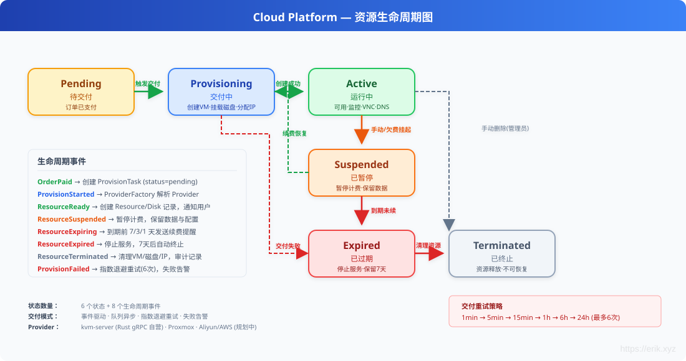

# Cloud Platform — グローバルクラウドリソース取引プラットフォーム

## Languages

| Language | Docs |
|----------|------|
| 简体中文 | [README.md](../../../README.md) |
| English | [README_EN.md](../../../README_EN.md) |
| English | [en docs](../../en/README.md) |
| 한국어 | [ko docs](../../ko/README.md) |
| Русский | [ru docs](../../ru/README.md) |
| Deutsch | [de docs](../../de/README.md) |
| Français | [fr docs](../../fr/README.md) |
| Español | [es docs](../../es/README.md) |
| Português | [pt docs](../../pt/README.md) |
| हिन्दी | [hi docs](../../hi/README.md) |
| العربية | [ar docs](../../ar/README.md) |
| বাংলা | [bn docs](../../bn/README.md) |
| Bahasa Indonesia | [id docs](../../id/README.md) |
| 日本語 | [ja docs](../../ja/README.md) |

<p align="center">
  
</p>

世界中のユーザー向けのクラウドリソース取引プラットフォームです。サーバー（VM）、IP アドレス、クラウドディスク、ドメイン、SSL 証明書、オブジェクトストレージ（S3）、CDN アクセラレーションなどの製品のオンライン購入と自動デリバリーをサポートします。自社運営の物理マシンは Proxmox VE 仮想化でデリバリーし、サードパーティのサプライヤーが入居して販売することも可能です。従量課金、リファラル販売、GraphQL API、Prometheus/Grafana による可観測性を提供します。

## 技術スタック

| レイヤー | 技術 |
|------|------|
| バックエンドフレームワーク | PHP 8.2 + [webman](https://github.com/walkor/webman) (workerman) |
| 管理バックエンド | [webman-admin](https://www.workerman.net/plugin/1) (Layui) |
| ORM | Illuminate/Eloquent 10.x |
| 認証 | JWT HS256 ([erikwang2013/jwt-webman](https://github.com/erikwang2013/jwt-webman)) |
| 分散主キー | Snowflake スノーフレーク ID ([erikwang2013/snowflake-php](https://github.com/erikwang2013/snowflake-php)) |
| ID 難読化 | Hashids ([erikwang2013/hashids](https://github.com/erikwang2013/hashids)) |
| 転送暗号化 | AES-256-GCM ([erikwang2013/encryption](https://github.com/erikwang2013/encryption)) |
| フィールド暗号化 | AES-256-CBC ([erikwang2013/encryptable](https://github.com/erikwang2013/encryptable)) |
| 全文検索 | Elasticsearch ([erikwang2013/webman-scout](https://github.com/erikwang2013/webman-scout)) |
| 国旗 | Unicode Flag Emoji ([erikwang2013/season](https://github.com/erikwang2013/season)) |
| クリック CAPTCHA | Click CAPTCHA ([erikwang2013/poster-php](https://github.com/erikwang2013/poster-php)) |
| セキュリティ | 31 種の攻撃検知 ([erikwang2013/security-php](https://github.com/erikwang2013/security-php)) |
| テーブルエクスポート | PhpSpreadsheet ^2.0 |
| 決済 SDK | Stripe PHP ^15.0 |
| SMS SDK | Twilio PHP ^8.0 |
| プッシュ SDK | Firebase PHP ^7.0 |
| キュー | webman redis-queue |
| データベース | MySQL 8.0（マスター + 監査 DB のデュアル接続） |
| 検索エンジン | Elasticsearch 8.x |
| 仮想化 | Proxmox VE（Rust kvm-server gRPC チャネル、e-cat/etcd 登録） |
| クライアント | Flutter (iOS/Android/Web/Linux/macOS/Windows) + HarmonyOS ArkTS |
| GraphQL | webonyx/graphql-php ^15.0 |
| オブジェクトストレージ | AWS S3 SDK PHP ^3.300 |
| 可観測性 | Prometheus + Grafana（プリセットダッシュボード） |
| 多言語 | i18n 7 言語（中/英/日/韓/独/仏/西） |
| デプロイ | Docker Compose ワンクリック起動 |

## システムアーキテクチャ


## コア業務フロー

ユーザー登録からリソースデリバリーまでの完全なエンドツーエンドの業務フロー。選択、注文、支払い、自動デリバリー、アフターサービス管理、更新サイクルを含みます。


## 多通貨決済

システムは多通貨の価格設定、支払い、決済をネイティブにサポートします。ユーザーの通貨設定、地域価格設定、為替レートスナップショットから、支払いの受領、残高の入金、サプライヤー決済までの完全なチェーンをカバーします。


**1. 多通貨残高アカウント**

`user_balances` は `(user_id, currency)` ごとに通貨を分けて記帳します（一意インデックス `uk_user_currency`）。登録時にデフォルトで USD + CNY の 2 つの通貨アカウントを作成し、残高と凍結残高は通貨ごとに独立して管理されます。Stripe がサポートする任意の通貨に拡張可能です。

**2. 多通貨地域価格設定**

`product_regions` は同じ SKU を同じ地域で複数通貨による価格設定をサポートします（一意インデックス `uk_sku_region_currency`）。フロントエンドはユーザーの優先通貨で価格を表示し、注文時に `OrderService` が `(sku_id, region_id, currency)` で正確に価格を取得します。

**3. 為替レート体系**

`ExchangeRateSync` スケジュールタスクが exchangerate-api から為替レートを同期し Redis に書き込みます（30 分 TTL キャッシュ）。各注文は注文時の `exchange_rate` 為替レートスナップショットを記録し、以降の決済を追跡可能にします。

**4. 多通貨支払い**

`payment_channels.currency_support` が各支払いチャネルでサポートする通貨のホワイトリストを宣言し、`PaymentRouter` が通貨 / 金額帯 / 可視地域に応じて利用可能なチャネルを動的にフィルタリングします。Stripe PaymentIntent は注文通貨で直接回収し、16 種類のゼロ小数通貨（JPY / KRW / VND など）の小数桁処理を内蔵し、Webhook コールバックで金額と通貨の一致を検証します。

**5. 決済とレポート**

支払いトランザクション（`payment_transactions`）、サプライヤー決済（`supplier_settlements`）、売上レポートはすべて通貨と為替レートのフィールドを保持し、通貨ごとに統計集計します。

## 機能モジュール概要

システムは 4 層アーキテクチャで構成されています。クライアント層（6 プラットフォーム接続）、API ゲートウェイ層（12 個のミドルウェア）、ビジネスサービス層（20+ 機能モジュール）、インフラストラクチャ層（8 つのコアコンポーネント）です。


## リソースライフサイクル

リソースは作成から終了まで合計 6 つの状態を経て、8 つのライフサイクルイベントによって駆動されます。自動デリバリー、一時停止・復旧、有効期限通知、破棄クリーンアップをサポートします。



## ドキュメントナビゲーション

| ドキュメント | 説明 |
|------|------|
| [アーキテクチャ設計ドキュメント](docs/architecture.md) | システムアーキテクチャ、コンポーネント関係、ミドルウェアパイプライン、セキュリティ階層、データアーキテクチャ、デプロイトポロジ |
| [機能設計ドキュメント](docs/features.md) | 21 モジュールの詳細な機能設計。フローチャート、データモデル、インタラクションの説明を含む |
| [API インターフェースドキュメント](docs/api-reference.md) | 200+ エンドポイントの完全なリファレンス。モジュール別にグループ化し、リクエスト/レスポンス例、エラーコードを含む |
| [API オンラインドキュメント (service)](http://localhost:8787/apidoc) | hg/apidoc 自動生成。機能別グループ化、オンラインデバッグ対応 |
| [API オンラインドキュメント (admin)](http://localhost:8788/apidoc) | hg/apidoc 自動生成。54 コントローラー、13 グループの機能分類 |
| [管理バックエンド設計](docs/admin-design.md) | Admin パネルのアーキテクチャ、パッケージ統合、ACL 権限、テストスイート |
| [サプライヤー API ドキュメント](docs/supplier-api.md) | サプライヤー API リファレンス（内部 + 外部）、SDK 例 |
| [デプロイチェックリスト](docs/deployment.md) | サーバー設定、環境変数、Nginx、HTTPS、スケジュールタスク |
| [レビューレポート](docs/review-report-2026-08-04.md) | エコシステム拡張レビューレポート。統計データ、問題追跡、拡張提案を含む |
| [エディション比較](docs/editions.md) | 簡易版/標準版/完全版の機能、設計、アーキテクチャ比較 |

## ディレクトリ構成

```
cloud-php/
├── .claude/                    # Claude Code 配置（settings / skills）
├── .github/workflows/          # CI/CD 流水线（语法检查 + 双端 PHPUnit）
├── admin/                      # 管理后台（独立 webman 实例）
│   ├── app/                    # 插件源码 (PSR-4: app\)
│   │   ├── bootstrap/          # 进程启动引导（Snowflake / Encryptable / Encryption）
│   │   ├── command/            # 控制台命令（Migrate / Rollback / Status）
│   │   ├── common/             # 工具类（Auth / Tree / Layui / Util / ExcelExport / Migration）
│   │   ├── controller/         # 54 个控制器文件（Base / Crud 基类 + 各业务 CRUD）
│   │   ├── exception/          # 异常处理
│   │   ├── middleware/          # 访问控制中间件（WafMiddleware + AccessControl）
│   │   ├── model/              # 46 个 Eloquent 模型（Base 基类含 Snowflake PK + Encryptable）
│   │   ├── view/               # 视图模板（Layui 后台面板）
│   │   └── functions.php       # 全局辅助函数（hashids / encrypt / decrypt）
│   ├── api/                    # 对外接口 (PSR-4: plugin\admin\api)
│   │   ├── Auth.php            # 鉴权接口
│   │   ├── Menu.php            # 菜单接口
│   │   ├── Install.php         # 安装接口
│   │   └── Middleware.php      # 中间件接口
│   ├── config/                 # 应用配置
│   │   ├── plugin/erikwang2013/ # 6 个 erikwang2013 包配置
│   │   │   ├── snowflake-php/  # 雪花 ID 生成
│   │   │   ├── hashids/        # ID 混淆
│   │   │   ├── encryptable/    # 字段级加密
│   │   │   ├── encryption/     # 传输加密
│   │   │   ├── webman-scout/   # Elasticsearch 同步
│   │   │   └── season/         # 国家旗帜
│   │   ├── route.php           # 路由定义
│   │   ├── middleware.php       # 中间件配置
│   │   ├── database.php        # 数据库连接
│   │   └── ...                 # 18 个配置文件
│   ├── database/migrations/    # 数据库迁移文件
│   ├── tests/                  # 单元测试（PHPUnit 11, 286 tests / 962 assertions）
│   │   ├── HashidsTest.php     # hashids 编解码（21 tests）
│   │   ├── BaseJsonTest.php    # Base::json() ID 编码（13 tests）
│   │   ├── CrudHashidsTest.php # Crud 输入解码（14 tests）
│   │   ├── TreeTest.php        # 树形结构（19 tests）
│   │   ├── AccessControlMiddlewareTest.php # RBAC 访问控制
│   │   ├── AdminControllersTest.php        # 控制器回归
│   │   └── support/            # 测试辅助类
│   ├── public/                 # 文档根目录（静态资源）
│   ├── vendor/                 # Composer 依赖
│   ├── .env.example            # 环境变量模板
│   ├── composer.json           # 依赖声明
│   ├── generate.php            # 代码生成器
│   ├── phpunit.xml             # PHPUnit 配置
│   └── start.php               # 启动入口
├── service/                    # 后端服务（独立 webman 实例）
│   ├── app/                    # 业务模块 (PSR-4: App\)，每个模块含 Controller / Model / Service 等分层
│   │   ├── admin/controller/   # 管理后台 API（15 个控制器：Dashboard / User / Product / Order / Payment / Supplier / Coupon / Invoice / Domain / Webhook 等）
│   │   ├── affiliate/          # 联盟佣金 / 推广分佣（Controller / Listener / Model / Service）
│   │   ├── billing/            # 用量计费 / 账单（Cron / Service）
│   │   ├── captcha/controller/ # 点击验证码
│   │   ├── cdn/                # CDN 资源托管（Controller / Model / Provider / Service）
│   │   ├── command/            # 控制台命令（Migrate / Rollback / Status / DbBackup）
│   │   ├── controller/         # 公共控制器（Health / Status / Help / Upload）
│   │   ├── cron/               # 定时任务（CronRunner 调度器 + ExchangeRateSync / PaymentReconcile / SupplierSettlement / ExpirationCheck / SslCertificateCheck）
│   │   ├── domain/             # 域名注册 / DNS 管理（Controller / Model / Service）
│   │   ├── graphql/            # GraphQL API（Mutation / Query / Schema）
│   │   ├── grpc/               # kvm-server gRPC 客户端 + etcd 注册（KvmClient / EtcdRegistry）
│   │   ├── model/              # 公共模型（HelpArticle / Role / Permission）
│   │   ├── monitor/            # 资源监控 / 告警（Controller / Cron / Model / Service）
│   │   ├── notification/       # 消息通知（Controller / Model / Queue / Service）
│   │   ├── order/              # 购物车 / 订单 / 优惠券 / 发票（Controller / Model / Service）
│   │   ├── payment/            # 支付路由 / Stripe 通道（Controller / Event / Model / Service）
│   │   ├── product/            # 产品 / SKU / 区域定价 / 评价（Controller / Model / Service）
│   │   ├── provisioning/       # 资源交付引擎（Controller / Event / Listener / Model / Provider / Queue / Service）
│   │   ├── report/             # 营收 / 供应商 / 区域报表（Controller / Service）
│   │   ├── ssl/                # SSL 证书签发 / 管理（Controller / Model / Service）
│   │   ├── storage/            # 对象存储资源（Controller / Model / Provider / Service）
│   │   ├── supplier/           # 供应商入驻 / 结算 / 提现 + 外部 API（Controller / Model / Service）
│   │   ├── ticket/             # 工单系统（Controller / Event / Listener / Model / Service）
│   │   ├── user/               # 用户 / 认证 / KYC / 余额 / 地址（Controller / Model / Service）
│   │   ├── webhook/            # Webhook 消息队列（Queue）
│   │   └── websocket/          # WebSocket 服务器 + 事件监听器
│   ├── common/                 # 公共库 (PSR-4: Common\)
│   │   ├── auth/middleware/     # AuthMiddleware / AdminRoleMiddleware / RbacMiddleware / RoleMiddleware / SupplierApiKeyMiddleware
│   │   ├── captcha/            # 点击验证码服务
│   │   ├── confirmation/       # 二次确认中间件（密码复核）
│   │   ├── encryption/middleware/ # AES-256-GCM 传输加密中间件
│   │   ├── hashid/middleware/   # Hashids 请求自动解码中间件 + 编解码服务
│   │   ├── helper/             # Response 格式化（自动 hashid 编码）
│   │   ├── http/               # HTTP 客户端工具（ApiRequest）
│   │   ├── i18n/middleware/     # 多语言中间件（Locale）
│   │   ├── security/           # CORS / WAF / 频率限制 / 地域封锁 / 维护模式 / 审计日志
│   │   ├── snowflake/          # 雪花 ID 生成服务 / Eloquent HasSnowflakeId Trait
│   │   ├── version/middleware/  # API 版本中间件（X-Api-Version 头校验）
│   │   ├── clientplatform/middleware/  # 客户端平台中间件（X-Client-Platform 头识别）
│   │   ├── feature/            # Feature Flags 功能开关服务
│   │   └── webhook/            # Webhook 事件分发器
│   ├── config/                 # 17 个配置文件（route / middleware / database / redis / cron / auth / security / i18n / ...）
│   │   └── plugin/             # 插件配置
│   │       ├── erikwang2013/   # encryptable / hashids / jwt / poster / season / webman-scout
│   │       └── webman/         # event / redis-queue
│   ├── database/migrations/    # 数据库迁移文件（37 个迁移）
│   ├── i18n/                   # 多语言资源（en-US / zh-CN）
│   ├── support/                # Bootstrap 引导（Eloquent / Redis / Event / 加密 / 雪花ID / Hashids / Scout / MigrationRunner）
│   ├── tests/                  # 单元测试（PHPUnit 10, 672 tests / 1632 assertions）
│   │   ├── admin/              # ImportExport / SupplierWithdrawApprove
│   │   ├── affiliate/          # AffiliateService
│   │   ├── auth/               # JwtAuth / RbacSeed / Rbac
│   │   ├── billing/            # MeterCollector / UsageAggregator / SuspendCheck
│   │   ├── captcha/            # CaptchaService
│   │   ├── cdn/                # ResourceCdn
│   │   ├── clientplatform/     # ClientPlatformMiddleware
│   │   ├── common/             # Response / Hashid / Snowflake / Validator / LogSanitizer / Totp / ApiRequest
│   │   ├── confirmation/       # ConfirmationMiddleware
│   │   ├── cron/               # SupplierSettlement
│   │   ├── domain/             # DomainService / DomainTransfer
│   │   ├── graphql/            # Schema
│   │   ├── grpc/               # KvmClient / EtcdRegistry
│   │   ├── monitor/            # AlertEngine
│   │   ├── notification/       # NotificationDispatcher
│   │   ├── order/              # Coupon / Invoice
│   │   ├── payment/            # StripeChannel / PaymentRouter
│   │   ├── product/            # ProductService / Search / ReviewStatus
│   │   ├── provisioning/       # ProviderFactory / RetryLogic
│   │   ├── report/             # ReportService
│   │   ├── security/           # RateLimit / Maintenance / UploadSecurity
│   │   ├── ssl/                # SslCertificate
│   │   ├── storage/            # StorageBucket
│   │   ├── supplier/           # SupplierService / Settlement / Rating / Webhook
│   │   ├── ticket/             # TicketUpdatedWiring
│   │   ├── user/               # AddressController
│   │   ├── version/            # VersionMiddleware
│   │   ├── webhook/            # WebhookDispatcher / WebhookE2E
│   │   ├── websocket/          # WebSocketAuth / EventsWiring
│   │   ├── support/            # RequestMock
│   │   ├── bootstrap.php       # 测试引导
│   │   └── TestCase.php        # 测试基类
│   ├── runtime/                # 运行时文件（日志 / 缓存）
│   ├── vendor/                 # Composer 依赖
│   ├── .env.example            # 环境变量模板
│   ├── .env                    # 本地环境变量（gitignore）
│   ├── composer.json           # 依赖声明
│   ├── phpunit.xml             # PHPUnit 配置
│   └── start.php               # 启动入口
├── apps/
│   ├── flutter/                # Flutter 客户端（iOS / macOS / Windows / Linux / Web）
│   │   ├── lib/                # Dart 源码（core / features）
│   │   ├── ios/                # iOS 工程
│   │   ├── macos/              # macOS 工程
│   │   ├── windows/            # Windows 工程
│   │   ├── linux/              # Linux 工程
│   │   ├── web/                # Web 工程
│   │   ├── test/               # Flutter 测试
│   │   ├── pubspec.yaml        # 依赖声明
│   │   └── analysis_options.yaml # Dart 静态分析配置
│   └── harmonyos/              # HarmonyOS 客户端骨架
│       └── entry/src/          # ArkTS 源码
├── docker/                     # Docker 部署
│   ├── Dockerfile              # PHP 8.2 镜像
│   ├── docker-compose.yml      # 服务编排
│   ├── nginx.conf              # Nginx 配置
│   └── supervisor.conf         # Supervisor 进程守护
├── infrastructure/             # Rust 基础设施（e-cat workspace）
│   ├── kvm-server/             # 自有云服务：VM 供应 gRPC 服务（:50051，etcd 注册）
│   │   ├── src/                # main / grpc / driver（模拟驱动，libvirt 为 Phase 2）
│   │   ├── tests/              # 集成测试
│   │   └── Cargo.toml          # e-cat workspace 成员声明
│   └── ecat-*/                 # e-cat 基础设施 crate（transport-grpc / registry-etcd / protos / config / data 等）
├── docs/                       # 文档
│   ├── admin-design.md         # 管理后台设计文档
│   ├── supplier-api.md         # 供应商 API 文档
│   ├── deployment.md           # 部署清单
│   ├── api-test.sh             # API 冒烟测试脚本
│   ├── database.sql            # 数据库 DDL
│   ├── alipay.png / weixinpay.png  # 打赏二维码
│   ├── diagrams/               # 18 个 SVG 架构图（系统架构 / 安全管道 / ER 图 / 业务流程 / 多币种结算等）
│   ├── test-reports/           # 测试报告（PHPUnit / Rust / API / UI + 页面截图）
│   └── superpowers/            # 设计规格与实施计划
│       ├── specs/              # 系统设计规格文档
│       └── plans/              # Phase 0~3 分阶段实施计划
├── scripts/                     # 运维脚本（push-release.sh 推送发布规则：版本增量 + tag）
├── tests/k6/                    # k6 负载测试脚本（冒烟/产品/并发）
├── install.php                 # 一键安装向导入口
├── install/                    # 安装向导页面
│   └── index.php               # 向导 Web 应用
├── install.sql                 # 统一数据库 DDL（46 张表）
├── .gitignore
├── README.md                   # 项目说明（中文）
└── README_EN.md                # 项目说明（英文）
```

## クイックスタート

### 環境要件

- PHP 8.2+ (ext-json, ext-pdo, ext-pdo_mysql, ext-redis, ext-openssl)
- MySQL 8.0
- Redis 7

### ワンクリックインストール（推奨）

プロジェクトは Web インストールウィザードを提供しており、ブラウザで全設定を完了できます：

```bash
# 1. 安装依赖
cd service && composer install && cd ../admin && composer install && cd ..

# 2. 启动安装向导
php install.php
# 打开浏览器访问 http://localhost:8888

# 3. 按向导提示完成：
#    - 环境检查
#    - 数据库配置（主机、端口、库名、用户名、密码）
#    - 后台管理员账号设置（用户名、密码、邮箱）
#    - 一键执行安装（建表 + 写入配置）
```

インストール完了後、ウィザードが自動的に：
- 全 46 のデータベーステーブルを作成（`wa_*` 管理テーブル + プレフィックスなし業務テーブル）
- スーパー管理者ロールとアカウントを作成
- `service/.env` と `admin/.env` 設定ファイルを生成（自動生成された JWT/暗号化キーを含む）

### 手動インストール

```bash
cd service

# 1. 安装依赖
composer install

# 2. 配置环境变量
cp .env.example .env
# 编辑 .env 填写数据库密码、JWT 密钥、加密密钥等
# ENCRYPTION_MASTER_KEY 生成：openssl rand -base64 32
# ENCRYPTION_KEY 生成：echo -n "$(openssl rand -base64 16)" | base64 -w0
# JWT_SECRET_KEY 生成：openssl rand -base64 32

# 3. 创建数据库并导入
mysql -u root -p -e "CREATE DATABASE cloud_platform CHARACTER SET utf8mb4 COLLATE utf8mb4_unicode_ci;"
mysql -u root -p cloud_platform < ../install.sql

# 4. 启动服务（开发模式）
php start.php start
# 访问 http://localhost:8787
```

### Docker デプロイ

```bash
# 从项目根目录
cp service/.env.example .env
# 编辑 .env 填写各项密钥

docker compose -f docker/docker-compose.yml up -d
# API: http://localhost
```

### 管理バックエンド

```bash
cd admin

# 1. 安装依赖
composer install

# 2. 配置环境变量
cp .env.example .env
# 如果使用一键安装向导，此文件已自动生成

# 3. 启动服务（开发模式）
php start.php start
# 访问 http://localhost:8787/app/admin
```

### デーモンモード

```bash
php start.php start -d          # 启动
php start.php status            # 查看状态
php start.php restart           # 重启
php start.php stop              # 停止
```

## API 概要

インターフェースはモジュール別にグループ化され、リクエスト/レスポンス例とエラーコードを含みます：[API 概要](docs/api-overview.md)（精選） · [API インターフェースドキュメント](docs/api-reference.md)（200+ エンドポイント完全リファレンス） · [オンラインデバッグ](http://localhost:8787/apidoc)

## 管理バックエンドアーキテクチャ

### 技術統合

管理バックエンドは独立した webman インスタンスで、7 つの erikwang2013 パッケージを統合しています：

| パッケージ | 用途 | 実装方式 |
|---|------|---------|
| snowflake-php | 64 ビット分散主キー | `Base::boot()` creating イベントで自動生成 |
| hashids | API ID 難読化 | `Base::json()` レスポンスエンコード、`Crud::selectInput/updateInput/deleteInput` リクエストデコード |
| encryptable | データベースフィールド暗号化 | Eloquent `Encryptable` cast、Admin（password/email/mobile）、User（6 フィールド）の透過的な暗号化/復号 |
| encryption | API 転送暗号化 | 予約済みの `encrypt_data()`/`decrypt_data()` ヘルパー関数 |
| webman-scout | ES 全文検索 | User モデルの `Searchable` trait、インデックス自動同期 |
| season | 国旗 emoji | `country_season_flag()` グローバルヘルパー関数 |
| poster-php | クリック CAPTCHA | `CaptchaPlugin` Bootstrap、`captcha_create()`/`captcha_verify()` グローバル関数 |

### セキュリティ階層

```
请求 → Hashids 解码 (Crud::selectInput/updateInput/deleteInput)
  → ACL 鉴权 (api/Auth.php, 控制器 noNeedLogin/noNeedAuth)
  → 业务处理 (CRUD / 模型事件)
  → Encryptable 字段加密 (Eloquent casts set)
  → 数据库写入
响应 ← Hashids 编码 (Base::json → hashids_encode_ids)

登录/注册：Captcha 验证 → Auth → 业务处理
```

### データフロー

- **書き込みパス**: リクエスト ID (hashid) → int にデコード → CRUD 操作 → Snowflake で新 ID 生成 → Encryptable で機密フィールドを暗号化 → DB
- **読み取りパス**: DB → Encryptable で復号 → Hashids で ID エンコード → JSON レスポンス

### テストカバレッジ

```
phpunit.xml (PHPUnit 11, 286 tests / 962 assertions)
├── HashidsTest              (21 tests) encode/decode/encode_ids
├── BaseJsonTest             (13 tests) Base::json/success/fail 编码
├── CrudHashidsTest          (14 tests) Crud 输入解码 (select/update/delete)
├── TreeTest                 (19 tests) 树形结构 / 子孙 / 祖先 / 孤儿节点
├── AccessControlMiddlewareTest (7 tests) 未登录 401 / 403 页面 / 放行
├── AdminControllersTest     (data provider) 48 控制器装配 / CRUD 面 / GET 视图路径
├── UtilTest                 (17 tests) 密码 / 时间 / 字节 / 输入过滤 / 控件属性
├── DictTest                 (5 tests) 字典名↔option 转换 / save/get/delete
├── ExcelExportTest          (4 tests) 表头 / JSON 展平 / 行号 / 空单元格
└── LayuiTest                (5 tests) input / inputNumber / label 转义 / switch / html
```

## 設計思想

### 1. モジュラーモノリス

モジュールはビジネス領域ごとに垂直に分割され（User / Product / Order / Payment / Provisioning / Ticket / Notification など）、各モジュール内は MVC 階層に従います：

- **Controller** — HTTP 層。パラメータ検証、Service 呼び出し、Response 返却
- **Service** — ビジネスロジック。HTTP 依存なし。Controller と Queue Worker の両方から再利用可能
- **Model** — Eloquent データモデル。リレーションとクエリスコープを定義

モジュール間は**イベント**と**インターフェース**で疎結合され、互いの Service を直接呼び出しません。例：支払い完了 → `OrderPaid` イベント → `ProvisioningService` がリソースを自動開通。Ticket 作成 → `TicketCreated` イベント → 自動的にサポート担当者を割り当て。

### 2. イベント駆動デリバリー

```
用户下单 → 支付成功 → OrderPaid 事件
  → ProvisioningService.handleOrderPaid()
    → 为每个 OrderItem 创建 ProvisionTask (status=pending)
    → Redis Queue 消费者 ProvisionWorker
      → ProviderFactory.create(task) 解析 Provider
      → ProxmoxProvider.create()
        → HostSelector 选最空闲物理机
        → ProxmoxApi 创建 VM / 挂载磁盘 / 分配 IP
          （Rust kvm-server gRPC 供应服务已入库：e-cat/etcd 注册发现，
           PHP 侧 KvmClient 接线；模拟驱动，libvirt 真实驱动为 Phase 2）
        → 创建 Resource / Disk 记录
      → 更新 Order 状态为 completed
```

デリバリー失敗時は自動リトライ、バックオフ戦略：1min → 5min → 15min → 1h → 6h → 24h、6 回を超えると失敗と判定されアラートが発生します。

### 3. Provider プラグインアーキテクチャ

リソースデリバリーは `ProviderInterface` で抽象化され、異なるインフラストラクチャが同じインターフェースを実装します：

```
ProviderInterface
  ├── ProxmoxProvider    (自营 Proxmox VE)
  ├── AliyunProvider     (未来：阿里云)
  ├── AwsProvider        (未来：AWS EC2)
  └── DomainProvider     (未来：域名注册商)
```

`ProviderFactory` は `productType:provider` キーでファクトリ関数を登録し、実行時に ProvisionTask に基づいて動的に解決します。

### 4. 多支払いルーティング

`PaymentRouter` は注文金額 / 通貨 / 地域に基づいて利用可能な支払いチャネルを動的に返します。フロントエンドはチャネルを切り替えるだけで支払いを開始できます。支払いチャネルは `PaymentChannel` テーブルで設定（手数料率、最小/最大金額、可視地域）され、コード変更なしでオンライン/オフラインを切り替えられます。

### 5. セキュリティアーキテクチャ

グローバルミドルウェアチェーン：`Version → CORS → SecurityHeaders → ClientPlatform → GeoBlock → WAF → SecurityPlugin → RateLimit → Locale → Metrics → HashidRequest → Maintenance → [路由: Encryption → Captcha → Auth → Confirmation]`


- **CORS** — クロスオリジンリクエストヘッダー処理（ホワイトリストモード、*.example.com ワイルドカード対応）
- **SecurityHeaders** — セキュリティレスポンスヘッダー（HSTS / X-Frame-Options / X-Content-Type-Options / Referrer-Policy / Permissions-Policy）
- **GeoBlock** — 地理的封鎖（GEO_BLOCKED_COUNTRIES に基づき指定国のアクセスをブロック、GeoIP2 ベース）
- **WAF** — 8 カテゴリ 45+ ルール（SQLインジェクション/XSS/コマンドインジェクション/ファイルインクルード/ヘッダーインジェクション/SSRF/NoSQLインジェクション/オープンリダイレクト）+ リクエストサイズ制限 + Content-Type 検証（値インジェクションは query/body/UA をスキャン、path はパストラバーサルのみ検査）
- **Security Plugin** — 31 種の攻撃検知（XSS/SQLインジェクション/コマンドインジェクション/SSRF/デシリアライゼーション/JWT攻撃/Hostヘッダー攻撃/リクエストスモグリング/GraphQLインジェクション/機密データ漏洩など）、IP ホワイトリスト + IP ブラックリストの自動封鎖
- **Locale** — Accept-Language を解析し、多言語を設定
- **HashidRequest** — リクエスト内の hashid 文字列を実整数 ID に自動デコード
- **Version** — `X-Api-Version` リクエストヘッダーを検証。欠落時はデフォルト `v1`、未サポートバージョンは `400` を返す
- **ClientPlatform** — `X-Client-Platform` リクエストヘッダーを検証し、クライアント OS プラットフォームを識別（iPadOS/macOS/Windows/Linux/iOS/Android/HarmonyOS/Web）
- **Encryption** — AES-256-GCM 転送暗号化（認証インターフェースと管理バックエンド）、中間者による盗聴と改ざんを防止
- **Captcha** — クリック CAPTCHA。ログイン/登録前に検証（GD 描画 + Redis 保存、ワンタイムキー、300s 有効期限、3 回試行制限）
- **Auth** — JWT HS256 認証。Access Token 15 分、Refresh Token 30 日、Redis ブラックリスト
- **Confirmation** — 機密操作（支払い/削除/返金/承認など）はパスワードの再入力による再確認が必要。5 回失敗で 15 分ロック
- **頻度制限** — デフォルト 60回/分、ログイン 5回/分、登録 3回/分、支払い 10回/分
- **監査ログ** — すべての機密操作は独立した監査 DB に書き込み

### 6. データセキュリティ

**階層化暗号化戦略：**

| レイヤー | 技術 | 説明 |
|------|------|------|
| 転送層 | AES-256-GCM | API リクエスト/レスポンスボディを暗号化、GCM 認証付き暗号で改ざん防止 |
| フィールド層 | AES-256-CBC | モデルの機密フィールドを自動暗号化/復号、CBC ランダム IV で等値パターンを漏らさない |
| 主キー層 | Hashids | 対外 ID を 12 桁の文字列に難読化し、実際のデータ規模を隠す |

**機密フィールド暗号化：** 7 つのモデルの 14 フィールドが `Encryptable::class` で自動暗号化/復号されます —— `User(email, phone, password_hash)`, `UserKyc(id_number, real_name)`, `UserAddress(phone, address)`, `Supplier(contact_name, phone, email)`, `HostMachine(api_token)`, `PaymentChannel(api_key, webhook_secret)`, `RefreshToken(token_hash, device_fingerprint)`。

**キー管理：** 転送暗号化とフィールド暗号化は別々の独立したキーを使用します（`ENCRYPTION_MASTER_KEY` vs `ENCRYPTION_KEY`）。旧キーリスト（`ENCRYPTION_PREVIOUS_KEYS`）をサポートし、ダウンタイムゼロのキーローテーションを実現します。

### 7. 分散 ID 生成

Twitter Snowflake アルゴリズムで 64 ビットのグローバル一意 ID を生成します：`timestamp(41b) | datacenter(5b) | worker(5b) | sequence(12b)`。全 46 の Eloquent モデルが `creating` イベントでスノーフレーク ID を自動生成し、データベースのオートインクリメントに依存しないため、シャーディングをネイティブにサポートします。

### 8. 多言語（i18n）

**グローバルミドルウェアによる自動解析：**
- `LocaleMiddleware` が `Accept-Language` リクエストヘッダーを読み取り、現在の言語を自動設定
- 言語フォールバックをサポート：未サポート言語 → `fallback_locale` (en-US)

**静的テキスト翻訳：**
- `I18n::trans('auth.login_success')` → `登录成功` / `Login successful`
- 翻訳ファイル：`i18n/{locale}/messages.php`、120 エントリで全 15 モジュールをカバー
- パラメータ置換をサポート：`I18n::trans('validation.required', ['field' => '邮箱'])`

**JSON 多言語フィールド：**
- 製品名 / 説明は `{"zh-CN":"云服务器","en-US":"Cloud Server"}` として保存
- `I18n::translateField($json)` が現在の言語に基づいて自動的に値を取得
- 通知テンプレートも多言語に対応し、ユーザーの優先言語でプッシュ

### 9. 全文検索

製品、ユーザー、注文、チケットの 4 つのモデルが `Erikwang2013\WebmanScout\Searchable` Trait で検索に接続されます。ドライバーのデフォルトは `database`（書き込みは no-op、検索は SQL LIKE にフォールバック、ES 依存なし）。Elasticsearch ドライバーを設定するとインデックスが自動同期され、以下をサポート：

- **多言語分かち書き** — IK Analyzer（ik_max_word / ik_smart）
- **中国語全文検索** — 製品名、説明、チケットタイトル
- **精密フィルタリング** — ステータス、カテゴリ、価格帯、期間でフィルタ
- **一括同期** — `php webman scout:import "App\Product\Model\Product"`
- **検索例** — `Product::search('VPS服务器')->where('status', 'published')->get()`

### 10. 国旗

`erikwang2013/season` で全地域の国旗 emoji をサポート：

- `country_season_flag('CN')` → 🇨🇳、`country_season_flag('JP')` → 🇯🇵
- 南北半球を自動識別し、対応する季節を返す（中英）
- 30+ 言語のローカライズされた季節名をサポート
- フロントエンドの地域選択、ユーザー国籍表示などのシーンで直接呼び出し可能

## 実施済み事項

- [x] データベース DDL（`install.sql`、46 テーブル、wa_* 管理テーブル + プレフィックスなし業務テーブル、BigInt 非オートインクリメント主キー）
- [x] スノーフレーク ID 生成（`erikwang2013/snowflake-php`）
- [x] JWT 認証（`erikwang2013/jwt-webman`、HS256 + Redis ブラックリスト）
- [x] API ID 難読化（`erikwang2013/hashids`、リクエスト自動デコード + レスポンス自動エンコード）
- [x] 転送暗号化（`erikwang2013/encryption`、AES-256-GCM ミドルウェア）
- [x] フィールドレベル暗号化（`erikwang2013/encryptable`、機密フィールドの自動暗号化/復号）
- [x] 全文検索（`erikwang2013/webman-scout`、デフォルト database ドライバーの SQL LIKE フォールバック、任意で Elasticsearch + IK 分かち書き）
- [x] 国旗（`erikwang2013/season`、Unicode flag emoji）
- [x] 管理バックエンド（`admin/`、webman-admin + 7 パッケージ統合、286 単体テスト）
- [x] コードレビュー（2 つの重要な修正 + 4 つの重要修正を適用済み）
- [x] Excel エクスポート（PhpSpreadsheet ^2.0、管理バックエンド Crud/Table + サーバー側管理 API）
- [x] ダッシュボード可視化（ECharts グラフ + アニメーション統計カード + システム情報パネル）
- [x] PDF エクスポート（html2canvas + jsPDF、ダッシュボードスクリーンショットエクスポート）
- [x] データベースマイグレーションスクリプト（`install.sql` 統一 DDL、`php webman migrate` コマンド化）
- [x] Stripe 本番統合（stripe-php SDK、PaymentIntent + Webhook 署名検証）
- [x] Twilio SMS 本番統合（twilio/sdk、送信失敗処理を含む）
- [x] FCM プッシュ本番統合（kreait/firebase-php、無効トークンクリーンアップを含む）
- [x] クリック CAPTCHA（erikwang2013/poster-php、ログイン/登録の機密操作検証）
- [x] 二次確認（ConfirmationMiddleware、機密操作のパスワード再確認、5 回失敗で 15 分ロック）
- [x] サーバー側単体テスト（672 tests / 1632 assertions、15 skipped）
- [x] クライアントプラットフォーム識別（ClientPlatformMiddleware、X-Client-Platform ヘッダーで 8 プラットフォーム対応）
- [x] WAF セキュリティ強化（8 カテゴリ 45+ ルール: SQLインジェクション/XSS/コマンドインジェクション/ファイルインクルード/ヘッダーインジェクション/SSRF/NoSQLインジェクション/オープンリダイレクト + リクエストサイズ制限 + Content-Type 検証）
- [x] Security Plugin（erikwang2013/security-php、31 種の攻撃検知 + IP ブラックリスト自動封鎖 + ログローテーション）
- [x] Admin パネル WAF ミドルウェア
- [x] MySQL リードライト分離（Eloquent read/write 接続 + sticky）
- [x] Redis 多層キャッシュ層（CacheService：製品/地域/為替レート/TLD/ユーザー、TTL + アクティブ失効 + プリウォーミング）
- [x] Nginx レスポンス圧縮 + 接続最適化（gzip/proxy_buffering/keep-alive/limit_req+limit_conn）
- [x] データベースインデックス提案（13 個の推奨複合/カバリングインデックス）
- [x] Sentry 例外監視（SentryBootstrap + before_send 脱敏コールバック）
- [x] Feature Flags 機能スイッチ（Redis 動的オーバーライド + 管理バックエンド API）
- [x] サプライヤー外部 API（API Key 認証 + 注文/リソース/決済/出金エンドポイント）
- [x] WebSocket リアルタイムプッシュ（Workerman ネイティブ WebSocket + 注文/チケットイベントリスナー）
- [x] k6 負荷テストスクリプト（スモーク/製品/並行負荷テスト）
- [x] CI/CD パイプライン（GitHub Actions、構文チェック + 両端 PHPUnit + Composer 検証）
- [x] ワンクリックインストールウィザード（Web UI、環境チェック + データベース設定 + 管理者作成 + .env 自動生成）

## オープンソースの継続には皆様のご支援を

| 微信 | 支付宝 |
|:---:|:---:|
|  |  |

### グローバル送金（銀行振込）

**受取人情報**

- 受取人氏名：WANG KEXUN
- 受取口座番号：881015918251

**受取銀行（ZA Bank）**

- SWIFT Code：AABLHKHHXXX
- 銀行名：ZA Bank Limited
- 銀行コード：387
- 銀行住所：Core F, Cyberport 3, 100 Cyberport Road, Hong Kong

**クロスボーダー送金の代理銀行（必要な場合）**

> ご注意ください。これはクロスボーダー送金の代理銀行（中継銀行）の情報であり、受取銀行の情報ではありません。送金銀行に、代理銀行の情報提供が必要かどうかお問い合わせください。

- 香港ドル、人民元、米ドルの入金時の代理銀行は **Citibank**：
  - 銀行名：Citibank N.A. Hong Kong
  - SWIFT Code：CITIHKHXXXX
  - 銀行コード：006
  - 支店名：Hong Kong Branch
  - 支店コード：391
  - 銀行住所：Citibank Tower, Citibank Plaza, 3 Garden Road, Central, Hong Kong
- その他の通貨の入金時の代理銀行は **BNY Mellon**：
  - 銀行名：THE BANK OF NEW YORK MELLON
  - SWIFT Code：IRVTUS3NXXX
  - 銀行住所：THE BANK OF NEW YORK MELLON, 240 GREENWICH STREET, NEW YORK, United States

---

## License

簡易版 — MIT License | 標準版/完全版 — Proprietary
