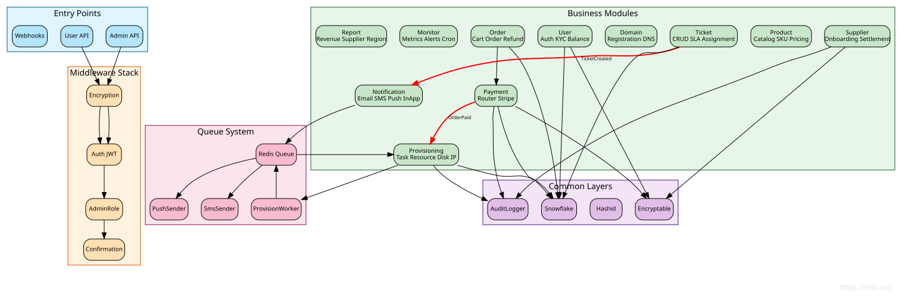

# Documento de Design do Painel Administrativo

## Visão Geral

`admin/` é uma instância webman v2.1 independente que fornece um painel de gerenciamento baseado em Layui. Ela roda separadamente do backend `service/`, compartilhando apenas o banco MySQL e os 7 pacotes erikwang2013.

## Arquitetura

```
┌─────────────────────────────────────────────────┐
│                  Admin Panel                     │
│  ┌──────────┐  ┌──────────┐  ┌───────────────┐ │
│  │ Controller│  │  Model   │  │   Bootstrap   │ │
│  │ (Layui)  │  │(Eloquent)│  │(worker start) │ │
│  └────┬─────┘  └────┬─────┘  └───────┬───────┘ │
│       │             │               │          │
│  ┌────┴─────────────┴───────────────┴─────────┐ │
│  │         7 erikwang2013 Packages             │ │
│  │  Snowflake │ Hashids │ Encryptable          │ │
│  │  Encryption│ Scout   │ Season │ Poster     │ │
│  └────────────────────┬───────────────────────┘ │
└───────────────────────┼─────────────────────────┘
                        │
              ┌─────────┴─────────┐
              │   MySQL 8.0       │
              │   Elasticsearch   │
              └───────────────────┘
```

### Mapa de Dependências dos Módulos



## Estrutura de Diretórios

```
admin/
├── app/
│   ├── bootstrap/       # Inicialização por processo
│   │   ├── SnowflakeBootstrap.php
│   │   ├── EncryptableBootstrap.php
│   │   └── EncryptionBootstrap.php
│   ├── controller/       # 54 arquivos de controladores (Base/Crud + CRUD por entidade)
│   │   ├── Base.php     # json() com hashids_encode_ids
│   │   ├── Crud.php     # Select/Insert/Update/Delete/Export com decodificação hashids
│   │   ├── DashboardController.php  # API de dados do dashboard (estatísticas de usuários + tendências)
│   │   ├── AccountController.php    # Login/logout/profile/password
│   │   ├── AdminController.php      # CRUD de admins + papéis
│   │   ├── RoleController.php       # CRUD de papéis + árvore de regras
│   │   └── ...
│   ├── model/            # 44 modelos Eloquent (36 mapeiam tabelas de negócio sem prefixo do service + alerts (definidas no install.sql) + 7 tabelas de gerenciamento wa_*)
│   │   ├── Base.php     # PK Snowflake + suporte a Encryptable
│   │   ├── Admin.php    # Encryptable: password, email, mobile
│   │   ├── User.php     # Encryptable: 6 campos + trait Searchable
│   │   └── ...
│   ├── common/           # Auth, Tree, Layui, Util, ExcelExport
│   ├── middleware/        # WafMiddleware + AccessControl
│   ├── exception/        # Handler
│   └── functions.php     # hashids_encode/decode, encrypt_data/decrypt_data
├── api/                  # API pública (plugin\admin\api)
│   └── Auth.php          # canAccess() ACL
├── config/
│   ├── plugin/erikwang2013/  # 7 configurações de plugins
│   ├── hashids.php       # Conexões Hashids (principal + alternativa)
│   └── encryption.php    # Configuração de criptografia (chave mestra, cipher)
├── tests/                # Suíte de testes PHPUnit 11 (286 testes, 962 assertions)
│   ├── HashidsTest.php   # 21 testes
│   ├── BaseJsonTest.php  # 13 testes
│   ├── CrudHashidsTest.php # 14 testes
│   ├── TreeTest.php      # 19 testes
│   ├── AccessControlMiddlewareTest.php # 7 testes (401/403/permissão)
│   ├── AdminControllersTest.php        # 48 testes de regressão por reflexão dos controladores
│   ├── UtilTest.php      # 17 testes
│   ├── DictTest.php      # 5 testes
│   ├── ExcelExportTest.php # 4 testes
│   ├── LayuiTest.php     # 5 testes
│   └── support/          # RequestMock, TestableCrud
├── install.sql           # DDL (PKs bigint unsigned, sem auto-incremento)
└── phpunit.xml
```

## Detalhes da Integração dos Pacotes

### 1. Snowflake (Chaves Primárias Distribuídas)

**Config**: `config/plugin/erikwang2013/snowflake-php/app.php`
**Bootstrap**: `app/bootstrap/SnowflakeBootstrap.php`

```php
// Model Base::boot() — evento creating
static::creating(function (Model $model) {
    if (empty($model->getKey())) {
        $snowflake = Container::instance()->get(Snowflake::class);
        $model->setAttribute($model->getKeyName(), $snowflake->id());
    }
});
```

- IDs de 64 bits: `timestamp(41b) | datacenter(5b) | worker(5b) | sequence(12b)`
- Época: 2024-01-01 (vida útil máxima de ~69 anos)
- `$incrementing = false`, `$keyType = 'int'` no modelo Base
- Todas as colunas PK e FK: `bigint unsigned NOT NULL`

### 2. Hashids (Ofuscação de IDs)

**Config**: `config/hashids.php` + `config/plugin/erikwang2013/hashids/app.php`

**Caminho de codificação** (resposta):
- `Base::json()` chama `hashids_encode_ids($data)` recursivamente
- Campos chamados `id`, `*_id`, `*_ids` com inteiros positivos → strings hashid
- `Crud::formatNormal()` também aplica a codificação (corrigido na revisão de código)

**Caminho de decodificação** (requisição):
- `Crud::selectInput()`: decodifica strings hashid `id`/`*_id` na cláusula WHERE
- `Crud::updateInput()`: decodifica a chave primária de `$request->post()`
- `Crud::deleteInput()`: decodifica o array de PKs de `$request->post()`
- `AdminController::update()`: usa o valor retornado por `updateInput()` diretamente (sem duplicação)
- `RoleController::select()`/`rules()`: decodificam `$request->get('id')`

**Funções auxiliares** (em `app/functions.php`):
- `hashids_encode(int $id): string`
- `hashids_decode(string $hash): int` — retorna 0 em falha
- `hashids_encode_ids(array $data): array` — recursiva, trata strings `is_numeric()`

### 3. Encryptable (Criptografia de Campos do Banco)

**Config**: `config/plugin/erikwang2013/encryptable/app.php`
**Bootstrap**: `app/bootstrap/EncryptableBootstrap.php`

Usa a interface `CastsAttributes` do Eloquent:
- `get()`: descriptografa o valor com AES ao ler do banco
- `set()`: criptografa o valor com AES ao gravar no banco

**Campos criptografados**:
| Model | Campos |
|-------|--------|
| Admin | password, email, mobile |
| User | password, email, mobile, token, last_ip, join_ip |

**Regra crítica**: usar sempre `save()` na instância do modelo, nunca `update()` do Query Builder. Usar `Admin::where(...)->update(...)` ignora os casts do Eloquent e armazena valores brutos. Isso foi corrigido no `AccountController` durante a revisão de código.

**Camadas da senha**: As senhas são primeiro hashadas com bcrypt (em `insertInput`/`updateInput`), depois o hash é criptografado com AES pelo cast Encryptable no `save()`. Na leitura: descriptografia AES → hash bcrypt → `password_verify()`.

### 4. Encryption (Transporte de API)

**Config**: `config/encryption.php`
**Bootstrap**: `app/bootstrap/EncryptionBootstrap.php`

Reservado para criptografia de requisição/resposta no nível da API (AES-256-GCM). Fornece:
- `encrypt_data(string $plaintext): string`
- `decrypt_data(string $ciphertext): string`

Lança `RuntimeException` com mensagem clara se `ENCRYPTION_MASTER_KEY` não estiver configurada.

### 5. Webman-Scout (Elasticsearch)

**Config**: `config/plugin/erikwang2013/webman-scout/app.php` + `command.php`

O modelo User usa o trait `Searchable`:
```php
class User extends Base
{
    use Searchable;

    public function toSearchableArray(): array
    {
        return [
            'id' => $this->id,
            'username' => $this->username,
            'nickname' => $this->nickname,
            'email' => $this->email,
            'mobile' => $this->mobile,
        ];
    }
}
```

### 6. Season (Bandeiras de Países)

**Config**: `config/plugin/erikwang2013/season/app.php`

Função auxiliar global: `country_season_flag(string $code): string`
- `country_season_flag('CN')` → 🇨🇳
- `country_season_flag('US')` → 🇺🇸

Também fornece nomes de estações localizados via classe `CountrySeason`.

### 7. Poster-PHP (CAPTCHA de Clique)

**Config**: `config/poster.php` + `config/plugin/erikwang2013/poster/app.php`
**Bootstrap**: `config/plugin/erikwang2013/poster/bootstrap.php` → `CaptchaPlugin`

Fornece verificação de CAPTCHA baseada em clique para login e registro:

```
Client                         Server
──────                         ──────
POST /api/v1/captcha/create
  → CaptchaService::create()
    → captcha_create('click')
      → ClickCaptcha::generate()
        → GD renders image with n randomly-placed Chinese words
        → Stores targets + key in Redis/File storage
      ← {key, image (base64), target_count, expires_in}

POST /api/v1/auth/login
  (with captcha_key + captcha_points)
  → AuthController::verifyCaptcha()
    → CaptchaService::verify(key, [[x1,y1], [x2,y2], ...])
      → captcha_verify(key, 'click', points)
        → CaptchaManager checks Euclidean distance ≤ 18px tolerance
      ← true/false
```

**Recursos de segurança**:
- Chaves de uso único: excluídas após verificação bem-sucedida
- Proteção contra força bruta: máximo de 3 tentativas falhas por chave, depois a chave é excluída
- TTL de 300 segundos (configurável via `CAPTCHA_TTL`)
- Tolerância de clique: raio de 18px (configurável)
- Níveis de dificuldade: fácil (2 alvos), médio (3), difícil (4)
- Armazenamento: detecção automática Redis → fallback para arquivo, configurável via `CAPTCHA_STORAGE`

**Wrapper**: `Common\Captcha\CaptchaService` carrega a configuração personalizada de `config/poster.php` e fornece os métodos `create()` (remove os alvos da resposta por segurança) e `verify()`. Usado por `AuthController::register()` e `AuthController::login()`.

### 8. ConfirmationMiddleware (Re-verificação de Senha)

**Config**: Middleware de grupo de rotas em `config/route.php`

Protege operações destrutivas e sensíveis exigindo que o usuário digite novamente a senha. Aplicado como middleware em 12 endpoints de rotas sensíveis:

```
Client                              Server
──────                              ──────
POST /api/v1/orders/{id}/pay
  (with confirm_password field)
    → ConfirmationMiddleware::process()
      → Checks userId present (401 if missing)
      → Checks Redis lock key (429 if locked out)
      → Validates password non-empty (422 if missing)
      → User::find() + Hash::check() verifies bcrypt
      → On failure:
        → Redis INCR confirm_failed:{userId} counter
        → If count ≥ 5, SETEX confirm_lock:{userId} for 900s
        → AuditLogger::record('confirm_failed', ...)
        → Returns 403
      → On success:
        → DEL confirm_failed:{userId} counter
        → AuditLogger::record('confirm_success', ...)
        → Calls $next($request)
```

**Endpoints sensíveis de usuário** (Auth + Confirmation):
| Método | Caminho | Operação |
|--------|------|-----------|
| POST | `/api/v1/orders/{id}/pay` | Iniciar pagamento |
| POST | `/api/v1/supplier/withdraw` | Solicitar saque |
| DELETE | `/api/v1/dns/{domain}/records/{id}` | Excluir registro DNS |

**Endpoints sensíveis de admin** (Auth + AdminRole + Confirmation):
| Método | Caminho | Operação |
|--------|------|-----------|
| DELETE | `/admin/api/v1/products/{id}` | Excluir produto |
| POST | `/admin/api/v1/orders/{id}/refund` | Reembolsar pedido |
| POST | `/admin/api/v1/provisioning/resources/{id}/destroy` | Destruir recurso |
| POST | `/admin/api/v1/kyc/{id}/approve` | Aprovar KYC |
| POST | `/admin/api/v1/kyc/{id}/reject` | Rejeitar KYC |
| POST | `/admin/api/v1/suppliers/{id}/approve` | Aprovar fornecedor |
| POST | `/admin/api/v1/suppliers/{id}/settle` | Gerar liquidação |
| POST | `/admin/api/v1/suppliers/withdraws/{id}/approve` | Aprovar saque |
| PUT | `/admin/api/v1/system/config` | Atualizar configuração do sistema |

A versão da API faz parte do caminho da URL (por exemplo, `/api/v1/products`).

**Recursos de segurança**:
- Verificação de senha bcrypt via `Hash::check()`
- Limite de frequência: 5 tentativas falhas acionam bloqueio de 15 minutos (TTL de 900s)
- Bloqueio por usuário via chaves Redis (`confirm_lock:{userId}`, `confirm_failed:{userId}`)
- O sucesso redefine o contador de falhas
- Todas as tentativas são registradas no banco de auditoria (sucesso, falha, bloqueio)
- `verifyPassword()` é um método protected, permitindo testabilidade via subclasse anônima com override

**Testabilidade**: `ConfirmationMiddlewareTest` (11 testes) usa uma subclasse anônima que sobrescreve `verifyPassword()` para retornar um booleano fixo, evitando dependência de Eloquent/DB. Os testes cobrem: 401 não autenticado, 422 senha ausente/vazia, 403 senha incorreta, pass-through de sucesso, formato da chave de rate limit, formato da chave de bloqueio e o limite máximo de falhas (4→sem bloqueio, 5→bloqueado, 6→bloqueado).

## Sistema ACL

### Nível de Controlador

```php
protected $noNeedLogin = ['login', 'logout', 'captcha'];  // Pula o login
protected $noNeedAuth = ['select'];                         // Pula a autenticação
```

Verificado por `api/Auth::canAccess()` via `ReflectionClass`.

**Resposta do AccessControlMiddleware** (`middleware/AccessControl.php`):
- Não autenticado (fora de `noNeedLogin`) → **HTTP 401**, body com script de redirecionamento para a página de login
- Autenticado mas sem permissão → **HTTP 403** página de erro (código de status 403, não mais 500)
- Em lista de permissão (página de login/captcha etc.) → passagem normal

### Baseado em Papéis

- Papéis têm `rules` (IDs de regras separados por vírgula ou `*` para super admin)
- Regras armazenadas em `wa_rules` como chaves `{Controller}@{action}`
- `api/Auth::canAccess()` resolve a chave `$controller@$action` contra as regras do papel
- Super admin (`rules = '*'`) ignora todas as verificações

### Limites de Dados

```php
protected $dataLimit = null;     // Sem limite
protected $dataLimit = 'auth';   // Admin vê dados próprios + de subordinados
protected $dataLimit = 'personal'; // Admin vê apenas dados próprios
protected $dataLimitField = 'admin_id';
```

## Conclusões da Revisão de Código (Corrigidas)

Durante a revisão do commit inicial, os seguintes problemas foram encontrados e corrigidos:

### Crítico
1. **AccountController ignorando Encryptable**: `password()` e `update()` usavam `Admin::where()->update()`, que ignora os casts do Eloquent → armazenava valores brutos em colunas criptografadas. Corrigido usando `Admin::find()->save()`.
2. **Crud::formatNormal() não codificando IDs**: chamava `json()` global em vez de aplicar `hashids_encode_ids()`. Corrigido.

### Importante
3. **hashids_encode_ids com `is_int` estrito**: valores bigint grandes vindos do PDO chegam como strings PHP. Alterado para `is_numeric()` com verificação de número inteiro.
4. **Decodificação duplicada de ID no AdminController**: `update()` decodificava a mesma PK duas vezes. Eliminada a duplicação; corrigido sombreamento da variável de loop em `insert()`.
5. **Código morto de senha em AccountController::update()**: campo de senha não estava na lista de permitidos. Removido.
6. **Driver MySQL hardcoded**: alterado para `config('database.default')`.

## Exportação Excel

### Arquitetura

A exportação Excel usa PhpSpreadsheet ^2.0 para gerar arquivos .xlsx no servidor. O painel admin tem dois caminhos de exportação separados porque existem dois mecanismos de CRUD:

```
Requisição de exportação (com os filtros atuais da tabela)
  ├── Controladores baseados em Crud (User, Admin, Role etc.)
  │     → Crud::export()
  │       → selectInput() reutiliza o parsing de consulta (decodificação hashids, WHERE, ORDER)
  │       → doSelect() constrói a consulta Eloquent
  │       → limite de 10.000 linhas
  │       → hashids_encode_ids() aplicado aos dados do resultado
  │       → ExcelExport::export() gera o .xlsx
  │
  └── TableController (tabelas genéricas como wa_dict, wa_rules)
        → TableController::export()
          → Constrói a consulta a partir do schema da tabela + parâmetros da requisição
          → hashids_encode_ids() aplicado
          → ExcelExport::export() gera o .xlsx
```

### Utilitário ExcelExport (`app/common/ExcelExport.php`)

Wrapper fluente sobre o PhpSpreadsheet:

- `setColumns(array $columns)` — define a ordem das colunas
- `setLabels(array $labels)` — define cabeçalhos legíveis para humanos
- `addRow(array $row)` / `addRows(array $rows)` — popula os dados
- `save(string $title): string` — grava o .xlsx em `runtime/exports/`, retorna o caminho do arquivo
- Helper estático: `ExcelExport::export($title, $columns, $data, $labels)` — exportação única
- Ajusta automaticamente o tamanho das colunas via `Worksheet::getColumnDimension()`

### Crud::export()

```php
public function export(Request $request): Response
{
    [$where, $format, $limit, $field, $order] = $this->selectInput($request);
    $query = $this->doSelect($where, $field, $order);
    $maxRows = 10000;
    $total = min($query->count(), $maxRows);
    $items = $query->limit($maxRows)->get();
    if (method_exists($this, 'afterQuery')) {
        $items = call_user_func([$this, 'afterQuery'], $items);
    }
    $data = array_map(fn($item) => ...toArray(), $items->toArray());
    $data = hashids_encode_ids($data);
    // Derive column labels from table schema comments
    $path = ExcelExport::export($table, $columns, $data, $labels);
    return response()->download($path, $table . '_' . date('YmdHis') . '.xlsx');
}
```

Todos os controladores baseados em Crud (Admin, User, Role etc.) herdam `export()` automaticamente.

### Integração no Frontend

- O item de toolbar embutido `"exports"` do Layui (CSV no lado do cliente) é substituído por um botão personalizado `{title: "导出", layEvent: "export"}`
- O handler do evento `export` chama `window.exportExcel()`, que coleta os parâmetros de filtro atuais da tabela e abre a URL de download
- `Layui::buildTable()` gera a toolbar com o botão de exportação personalizado em todas as páginas de CRUD

### Exportação na API Admin do Service

O backend do service (`service/`) também tem exportação Excel via seu próprio wrapper `Common\ExcelExport`:

| Endpoint | Controlador | Dados Exportados |
|----------|-----------|---------------|
| `GET /admin/api/v1/orders/export` | OrderController | id, order_no, user_id, type, status, total, currency, created_at, paid_at |
| `GET /admin/api/v1/users/export` | UserController | id, email, phone, role, status, created_at, last_login_at |
| `GET /admin/api/v1/suppliers/export` | SupplierController | id, user_id, status, contact_name, contact_email, contact_phone, created_at |

Todos os endpoints da API incluem a versão no caminho da URL (por exemplo, `/api/v1/products`).

As rotas de exportação são colocadas ANTES das rotas de parâmetro `/{id}` para evitar conflitos.

## API Admin do Service — Funcionalidades Estendidas

### Endpoints da API Admin (camada Service)

Todos os endpoints REST do admin têm o prefixo `/admin/api/v1` e exigem o `AdminRoleMiddleware`.

| Grupo | Endpoints | Controlador |
|-------|-----------|------------|
| Dashboard | `GET /dashboard`, `/kyc`, `POST /kyc/{id}/approve`, `/reject` | `Admin\DashboardController` |
| Usuários | `GET /users`, `/users/export`, `/users/{id}`, `PUT /users/{id}/status` | `Admin\UserController` |
| Produtos | `POST /products`, `PUT /products/{id}`, `DELETE /products/{id}`, `POST /products/{id}/skus`, `PUT /skus/{id}`, `POST /skus/{id}/region-price` | `Admin\ProductController` |
| Import/Export de Produtos | `GET /products/export` (CSV), `POST /products/import` (upsert CSV) | `Admin\ImportExportController` |
| Pedidos | `GET /orders`, `/orders/export`, `/orders/{id}`, `POST /orders/{id}/refund` | `Admin\OrderController` |
| Faturas | `GET /invoices`, `POST /invoices/{orderId}/generate` | `Admin\InvoiceController` |
| Pagamentos | `GET /payments/channels`, `PUT /payments/channels/{id}`, `GET /payments/transactions`, `/reconcile` | `Admin\PaymentController` |
| Provisionamento | `GET /provisioning/tasks`, `POST /tasks/{id}/retry`, `POST /resources/{id}/upgrade`, `/destroy`, `GET /hosts` | `Provisioning\TaskController` |
| APIs de Providers | `GET /providers`, `POST /providers`, `PUT /providers/{id}`, `DELETE /providers/{id}` | `Admin\ProviderApiController` |
| CDN | `GET /cdn/domains`, `PUT /cdn/domains/{id}` | `Admin\CdnController` |
| Fornecedores | `GET /suppliers`, `/suppliers/export`, `POST /suppliers/{id}/approve`, `/settle`, `/withdraws/{id}/approve` | `Admin\SupplierController` |
| API Keys de Fornecedores | `GET /suppliers/{id}/api-keys`, `POST /suppliers/{id}/api-keys`, `DELETE /suppliers/api-keys/{id}` | `Admin\SupplierController` |
| Tickets | `GET /tickets`, `POST /tickets/{id}/assign`, `/close` | `Ticket\TicketController` |
| Cupons | `GET /coupons`, `POST /coupons`, `DELETE /coupons/{id}` | `Admin\CouponController` |
| Webhooks | `GET /webhooks`, `POST /webhooks`, `DELETE /webhooks`, `POST /webhooks/test` | `Admin\WebhookController` |
| Domínios | `GET /domains/tlds`, `POST /domains/tlds`, `PUT /domains/tlds/{id}`, `DELETE /domains/tlds/{id}`, `GET /domains/zones`, `/transfers`, `POST /transfers/{id}/approve` | `Admin\DomainController` |
| Notificações | `GET /notifications/templates`, `PUT /notifications/templates/{id}`, `GET /notifications/log` | `Admin\NotificationController` |
| Artigos de Ajuda | `GET /help`, `POST /help`, `PUT /help/{id}`, `DELETE /help/{id}` | `Admin\HelpController` |
| Relatórios | `GET /reports/revenue`, `/supplier`, `/region` | `Report\ReportController` |
| Monitoramento | `GET /monitor/dashboard`, `/resources/{id}` | `Monitor\MonitorController` |
| Auditoria | `GET /audit-logs` | `Admin\SystemController` |
| Configuração do Sistema | `PUT /system/config` | `Admin\SystemController` |

### Gestão de Recursos CDN

O produto CDN suporta quatro provedores (Cloudflare / CloudFront / Aliyun / Tencent Cloud), com o painel admin dividido em duas partes:

**Configuração de contas de provedores** (reutiliza o modelo ProviderApi, `Admin\ProviderApiController`):

- `GET/POST /admin/api/v1/providers`, `PUT/DELETE /admin/api/v1/providers/{id}`, com `RbacMiddleware('provider.config')`
- `code` convencionado como `cdn-cloudflare` / `cdn-cloudfront` / `cdn-aliyun` / `cdn-tencent`; campos de credenciais criptografados no banco com Encryptable, coluna JSON `config` guarda metadados não sensíveis
- Prioridade de resolução de credenciais no lado do usuário: conta vinculada → conta ativa com code correspondente → fallback env; exclusão/purga usam snapshot estrito (apenas a conta vinculada, ausente/desabilitada retorna 4003)

**Gestão de domínios CDN** (`Admin\CdnController`):

```
GET /admin/api/v1/cdn/domains        → Todos os domínios (incluindo user_id), com RbacMiddleware('cdn.manage')
PUT /admin/api/v1/cdn/domains/{id}   → Atualiza o plano, whitelist de planos standard | pro | enterprise,
                                    valor inválido retorna 400; alteração grava log de auditoria admin_cdn_update_plan
```

### Dados do Dashboard (camada Service)

`Admin\DashboardController::index()` fornece métricas operacionais reais:

```php
[
    'today_stats' => [todayOrders, todayRevenue, newUsers, activeResources],
    'revenue_trend_30d' => [...],   // Daily revenue for last 30 days
    'region_distribution' => [...],  // Active resources grouped by region
    'pending_orders' => ...,         // Orders awaiting payment
    'pending_kyc' => ...,            // KYC submissions awaiting review
    'open_tickets' => ...,           // Open or in-progress tickets
]
```

### Visão do Dashboard do Painel Admin (`app/view/index/dashboard.html`)

- **8 cards de estatísticas animados**: usuários hoje/semana/mês/total + pedidos hoje + receita de hoje + pedidos pendentes + recursos ativos — cada um com animação de contagem via módulo `count` do Layui
- **3 gráficos ECharts**:
  1. Tendência de registro de usuários em 7 dias — gráfico de área
  2. Tendência de registro de usuários em 30 dias — gráfico de barras
  3. Resumo de usuários — gráfico de rosca/pizza (hoje / semana / mês)
- **Tabela de informações do sistema**: preenchida dinamicamente com as versões PHP/Workerman/Webman/Admin/MySQL/OS
- **Toolbar**: botões de exportação PDF e atualização
- Todos os dados obtidos via AJAX de `/app/admin/dashboard/data`

### Rota

```
Route::any('/app/admin/dashboard/data', [DashboardController::class, 'index']);
```

Além das rotas registradas explicitamente, `admin/config/route.php` registra automaticamente a rota `/app/admin/{snake_case_controller}/{action}` para cada método público de cada controlador em `app/controller/` (por exemplo, `/app/admin/order_item/index`); a URL é consistente com o nome do controlador em snake_case usado nos menus. `/app/admin` e `/app/admin/index` são as entradas da página principal/tela de login do painel (renderiza a visão de login quando não autenticado); requisições sem correspondência retornam 404.

## Exportação PDF

Geração de PDF no lado do cliente na página do dashboard:

- Usa **html2canvas 1.4.1** (CDN) para capturar o DOM do dashboard como canvas
- Usa **jsPDF 2.5.1** (CDN) para criar um PDF A4 para download
- Captura os cards de estatísticas e os gráficos ECharts (renderizados como elementos canvas)
- Inclui título, timestamp e branding no PDF
- Acionado pelo botão "Export PDF" na toolbar do dashboard

```
Dashboard DOM → html2canvas screenshot → jsPDF document → browser download
```

### Implementação

```javascript
// In dashboard.html
html2canvas(document.querySelector('.layui-body'), {scale: 2}).then(canvas => {
    const pdf = new jsPDF('p', 'mm', 'a4');
    const imgData = canvas.toDataURL('image/png');
    pdf.addImage(imgData, 'PNG', 10, 10, 190, 0);
    pdf.save('dashboard_' + new Date().toISOString().slice(0, 10) + '.pdf');
});
```

## Suíte de Testes

```
PHPUnit 11.5 | 67 tests | 124 assertions
```

### HashidsTest (21 testes)
- Roundtrip encode/decode (0 até PHP_INT_MAX)
- Codificação determinística
- Tratamento de strings inválidas/vazias
- Padrões de campo do `hashids_encode_ids` (`id`, `*_id`, `*_ids`)
- Pulo de zero/negativos, suporte a strings numéricas
- Recursão em arrays aninhados, preservação de campos não-id

### BaseJsonTest (13 testes)
- `json()`/`success()`/`fail()` aplicam codificação hashids
- Codificação de objetos aninhados
- Tratamento de IDs do tamanho Snowflake
- Preservação de campos não-id
- Tratamento de zero
- Verificação da estrutura de resposta

### CrudHashidsTest (14 testes)
- `selectInput`: decodificação de hashid nos campos WHERE `id`/`*_id`
- `selectInput`: pass-through de string numérica/int bruto
- `updateInput`: decodificação de PK hashid
- `updateInput`: conversão de string numérica PK para int
- `deleteInput`: decodificação em lote de IDs, tipos mistos
- `deleteInput`: array vazio, tratamento de ID único

## Sistema de Migração de Banco de Dados

### Arquitetura

Tanto as instâncias `service/` quanto `admin/` têm sistemas de migração independentes construídos sobre o Schema Builder do `illuminate/database`. Cada instância registra comandos Symfony Console via `config/command.php`, descobertos pelo runner de console do webman.

```
php webman migrate          # Executa migrações pendentes
php webman migrate:rollback # Reverte o último lote
php webman migrate:status   # Mostra o status das migrações
```

### MigrationRunner (`service/support/MigrationRunner.php`, `admin/app/common/MigrationRunner.php`)

Mecanismo central compartilhado pelas duas instâncias:

- **`ensureTable()`** — cria a tabela de controle `migrations` (id, nome da migração, número do lote) na primeira execução
- **`migrate()`** — varre os arquivos de migração de `database/migrations/`, executa os métodos `up()` pendentes e registra o lote
- **`rollback()`** — reverte o último lote chamando `down()` em cada migração em ordem inversa
- **`status()`** — lista todas as migrações com seus números de lote
- **`resolve()`** — instancia as classes de migração a partir dos arquivos

### Classe Base de Migração (`service/support/Migration.php`, `admin/app/common/Migration.php`)

```php
abstract class Migration
{
    abstract public function up(): void;
    abstract public function down(): void;
}
```

Cada arquivo de migração retorna uma classe que estende `Migration`, com nomes de arquivo prefixados por timestamp (ex.: `2024_01_01_000001_create_initial_schema.php`).

### Migrações do Service

**Diretório**: `service/database/migrations/` — 38 arquivos de migração (tabelas sem prefixo erik_, os modelos do admin mapeiam diretamente)

| Migration | Tabelas |
|-----------|--------|
| `0001_create_users_tables` | users, user_profiles, user_kyc, user_balance, user_balance_log, user_addresses, refresh_tokens |
| `0002_create_product_tables` | product_categories, regions, products, product_skus, product_regions, product_images, product_attributes, product_reviews |
| `0003_create_order_tables` | carts, orders, order_items, order_timeline, order_invoices, refunds |
| `0004_create_payment_tables` | payment_channels, payment_transactions, payment_reconcile |
| `0005_create_provisioning_tables` | resources, resource_servers, resource_ips, resource_disks, resource_domains, provision_tasks, provider_apis |
| `0006_create_host_tables` | host_machines, ip_pools, ip_allocations, disks, disk_resizes |
| `0007_create_supplier_tables` | suppliers, supplier_products, supplier_settlements, supplier_withdraws |
| `0008_create_domain_tables` | domain_tlds, domain_transfers, dns_zones, dns_records |
| `0009_create_ticket_notification_tables` | tickets, ticket_messages, notifications, notification_templates |
| `0010_create_audit_table` | audit_logs |
| `0011_create_kvm_service_tables` | network_services, firewall_services, switch_services |
| `2024_01_01_000001_create_initial_schema` | Executa `docs/database.sql` via `Capsule::unprepared()`; no `down()`, remove tudo |
| `2025_05_16_000002_add_fcm_token_to_users` | Adiciona colunas `fcm_token`, `fcm_platform` + índice em users |
| `2026_08_26_000003_widen_encrypted_columns` | users.phone / user_addresses.phone / suppliers.contact_phone VARCHAR(20)→VARCHAR(255) (tamanho da cifra Encryptable) |

### Migrações do Admin

**Diretório**: `admin/database/migrations/` — 1 arquivo de migração

| Migration | Descrição |
|-----------|-------------|
| `2024_01_01_000001_create_admin_schema` | Executa `admin/install.sql` via `Capsule::unprepared()` — cria as tabelas wa_* com dados de seed |

### Registro de Comandos Console

**`service/config/command.php`**:
```php
return [
    \App\Command\MigrateCommand::class,
    \App\Command\MigrateRollbackCommand::class,
    \App\Command\MigrateStatusCommand::class,
];
```

**`admin/config/command.php`** — mesmo padrão sob o namespace `app\command`.

## Integração de Produção com Stripe

### Arquitetura

Substituiu os IDs de pagamento falsos de `random_bytes()` pela integração real com a API do Stripe via `stripe/stripe-php` ^15.0.

**Arquivo**: `service/app/payment/service/channels/StripeChannel.php`

```
Client-side                    Server-side                    Stripe API
───────────                    ───────────                    ──────────
Select Stripe at checkout
  → POST /orders/{id}/pay
    → StripeChannel::createPaymentIntent()
      → StripeClient->paymentIntents->create(amount, currency)
        ← {id, client_secret}
      → Save pi_xxx as transaction_no
      ← Return client_secret
  → Stripe.js confirmCardPayment(client_secret)
    ← Payment confirmed by Stripe
      → POST /payments/webhook/stripe
        → StripeChannel::handleWebhook()
          → Webhook::constructEvent(payload, signature, secret)
          → Verify idempotency (skip non-pending transactions)
          → Update order status, create transaction record
```

### Criação do PaymentIntent

```php
public function createPaymentIntent(Order $order): array
{
    $intent = $this->stripe()->paymentIntents->create([
        'amount'   => (int) round($order->total * 100),  // cents
        'currency' => strtolower($order->currency),
        'metadata' => ['order_id' => $order->id, 'order_no' => $order->order_no],
    ]);
    return [
        'transaction_no' => $intent->id,          // pi_xxxxxxxxxxxxx
        'client_secret'  => $intent->client_secret, // pi_xxx_secret_yyy
    ];
}
```

- `$this->stripe()` inicializa preguiçosamente `\Stripe\StripeClient` com `STRIPE_SECRET_KEY` do env
- Cai para `$this->channel->api_key_encrypted` (descriptografada via Encryptable) se a variável de ambiente não estiver definida
- Valor convertido em centavos: `(int) round($order->total * 100)`

### Verificação de Assinatura do Webhook

```php
public function handleWebhook(string $payload, string $signature): void
{
    $event = \Stripe\Webhook::constructEvent(
        $payload, $signature, $this->channel->webhook_secret_encrypted
    );
    // Idempotency: skip if transaction already processed
    $existing = Transaction::where('transaction_no', $event->id)->first();
    if ($existing && $existing->status !== 'pending') return;
    
    match ($event->type) {
        'payment_intent.succeeded' => $this->confirmPayment($event),
        'payment_intent.payment_failed' => $this->failPayment($event),
        default => null,
    };
}
```

- Usa `Webhook::constructEvent()` para verificar o cabeçalho de assinatura do Stripe
- **Guarda de idempotência**: verifica entregas duplicadas de webhook por `transaction_no`
- Suporta ambos os tipos de evento: sucesso e falha

## Integração SMS Twilio

### Arquitetura

Substituiu o stub `error_log()` pela entrega real de SMS via `twilio/sdk` ^8.0.

**Arquivo**: `service/app/notification/queue/SmsSender.php`

### Envio de Mensagens

```php
public function consume(): void
{
    $client = new \Twilio\Rest\Client(
        getenv('TWILIO_ACCOUNT_SID'),
        getenv('TWILIO_AUTH_TOKEN')
    );
    $message = $client->messages->create(
        $this->notification->recipient_phone,
        ['from' => getenv('TWILIO_PHONE_NUMBER'), 'body' => $this->notification->body]
    );
    $this->notification->provider_message_id = $message->sid;
}
```

### Tratamento de Erros

- Captura `Twilio\Exceptions\RestException` — registra o código e a mensagem de erro do Twilio
- Cria um registro de Notification com falha com `send_status = 'failed'`
- Registra `provider_message_id` (SID do Twilio) para rastreamento da entrega
- Cai para `error_log()` quando as credenciais do Twilio não estão definidas (modo dev)

### Configuração

Variáveis de ambiente: `TWILIO_ACCOUNT_SID`, `TWILIO_AUTH_TOKEN`, `TWILIO_PHONE_NUMBER`

## Integração Push FCM

### Arquitetura

Substituiu o stub `error_log()` pela entrega real de push via `kreait/firebase-php` ^7.0.

**Arquivo**: `service/app/notification/queue/PushSender.php`

### Armazenamento do Token do Dispositivo

Adicionado à tabela `users` via migração:
- `fcm_token VARCHAR(512) DEFAULT NULL` — token de registro do dispositivo
- `fcm_platform VARCHAR(16) DEFAULT NULL` — `ios` / `android` / `web`
- `INDEX idx_fcm_token (fcm_token)` — busca por token

Modelo User: `fcm_token` e `fcm_platform` adicionados a `$fillable`.

### Envio de Push

```php
public function consume(): void
{
    $factory = new \Kreait\Firebase\Factory();
    if ($credentialsPath = getenv('FIREBASE_CREDENTIALS_PATH')) {
        $factory = $factory->withServiceAccount($credentialsPath);
    }
    $messaging = $factory->createMessaging();
    
    $message = \Kreait\Firebase\Messaging\CloudMessage::withTarget(
        'token', $this->user->fcm_token
    )->withNotification([
        'title' => $this->notification->title,
        'body'  => $this->notification->body,
    ]);
    
    $result = $messaging->send($message);
}
```

### Limpeza de Tokens

- Captura `Kreait\Firebase\Exception\Messaging\InvalidToken` — anula o `fcm_token` do usuário
- Captura `Kreait\Firebase\Exception\Messaging\NotFound` — remove o token não registrado
- Cai para `error_log()` quando as credenciais do Firebase não estão definidas (modo dev)

### Configuração

Variáveis de ambiente: `FIREBASE_CREDENTIALS_PATH` (JSON da conta de serviço), `FCM_SERVER_KEY` (legado)

## Diagramas de Fluxo de Negócio

### Pedido → Pagamento → Provisionamento (Fluxo Central de Negócio)


### Detalhe do Provisionamento Orientado a Eventos


### Distribuição de Notificações


### Ciclo de Vida do Fornecedor


### Ciclo de Vida do Ticket


## Suíte de Testes da Camada Service

### Visão Geral

```
PHPUnit 10.5 | 295 tests | 455 assertions
```

**Diretório**: `service/tests/` — 12 arquivos de teste em 7 módulos

**Config**: `service/phpunit.xml` — suíte única `unit`, cobre o código-fonte de `app/` e `common/`

### Bootstrap de Testes

`service/tests/bootstrap.php` carrega o autoload do Composer e define dois helpers globais necessários ao código sob teste:

- `request_id()` — retorna string única de ID de requisição
- `now()` — retorna o objeto `DateTime` atual

Aprendizado crítico: `Webman\Config` não pode ser carregado em contexto de teste porque `loadFromDir()` dispara o `route.php`, que chama `Route::addRoute()` sobre null. Os testes ignoram o Config completamente — `HashidServiceTest` usa `new Hashids()` diretamente, `ResponseTest` usa métodos auxiliares locais.

### Arquivos de Teste

| Arquivo | Testes | Cobertura |
|------|-------|----------|
| `Captcha/CaptchaServiceTest.php` | 9 | estrutura de create, níveis de dificuldade, verify passa/falha, uso único, chaves únicas |
| `Confirmation/ConfirmationMiddlewareTest.php` | 11 | autenticação obrigatória, senha ausente, senha errada, pass-through de sucesso, formato da chave de rate limit, formato da chave de bloqueio, limites máximos de falhas |
| `Common/HashidServiceTest.php` | 17 | roundtrip encode/decode, determinismo, isolamento de salt, percurso recursivo de IDs |
| `Common/ResponseTest.php` | 16 | estrutura success/error/paginated, consistência de request_id, códigos de erro HTTP |
| `Common/SnowflakeTest.php` | 6 | ordenação por timestamp, unicidade, faixa bigint, padrão de inicialização |
| `Common/ValidatorTest.php` | 22 | regras de validação required(), email(), minLength() |
| `Common/LogSanitizerTest.php` | 34 | redação de PII, arrays aninhados, correspondência sem diferenciar maiúsculas, 20 tipos de campos sensíveis |
| `Payment/StripeChannelTest.php` | 19 | config do canal, cálculo de valores, assinaturas de webhook, idempotência |
| `Payment/PaymentRouterTest.php` | 10 | filtragem de canais, restrições de valor, suporte a moeda/região, cálculo de taxas |
| `Notification/NotificationDispatcherTest.php` | 8 | renderização de templates, roteamento de canais, pulo de usuários inativos |
| `Provisioning/ProviderFactoryTest.php` | 12 | register, create, createFromResource, casos de erro |
| `Provisioning/RetryLogicTest.php` | 12 | backoff exponencial, máximo de tentativas, transições de status, seleção de host |
| `ClientPlatform/ClientPlatformMiddlewareTest.php` | 13 | plataformas válidas, cabeçalho ausente/padrão, plataforma não suportada, sem diferenciar maiúsculas, pulo fora de /api, rotas admin, acesso downstream |
| `Security/WafMiddlewareTest.php` | 37 | SQLi (4), XSS (6), CMDi (4), inclusão de arquivos (3), injeção de cabeçalho/CRLF (2), SSRF (5), injeção NoSQL (4), redirecionamento aberto (2), pass-through seguro (5), varredura de URL, varredura de UA |
| `Version/VersionMiddlewareTest.php` | 6 | versão válida, versão ausente com padrão, versão não suportada 400, pulo fora de /api, validação da API admin, cabeçalhos de erro na resposta |

### Infraestrutura de Testes

- `tests/TestCase.php` — classe base estendendo PHPUnit TestCase
- `tests/Support/RequestMock.php` — mock de requisição com parâmetros injetados no construtor

## Pipeline CI/CD

### Arquitetura

Workflow do GitHub Actions em `.github/workflows/ci.yml`.

**Gatilhos**: push para `main`, pull requests para `main`

### Jobs

| Job | Estratégia | Descrição |
|-----|----------|-------------|
| `syntax` | PHP 8.2 | `php -l` lint em todos os arquivos `.php` de admin/ e service/ |
| `admin-tests` | PHP 8.2, 8.3 | `composer install -d admin` → `admin/vendor/bin/phpunit` |
| `service-tests` | PHP 8.2, 8.3 | `composer install -d service` → `service/vendor/bin/phpunit` |
| `composer-validate` | PHP 8.2 | `composer validate --strict` nos dois arquivos composer.json |

### Matriz de Versões PHP

Os dois jobs de teste rodam em PHP 8.2 e 8.3 via `shivammathur/setup-php@v2`.

### Status Atual

Todos os 4 jobs passam: 243 testes no total (67 admin + 176 service), 400 assertions, ambas as versões PHP verdes.

## Relacionamento de Entidades do Banco de Dados


## Decisões-Chave de Design

1. **Instância independente**: admin/ roda como instância webman própria, não como plugin dentro do service/. Isso isola o tráfego de administração e as falhas da API voltada ao cliente.

2. **Encryptable + hash de senha**: Senhas são primeiro hashadas com bcrypt, depois criptografadas com AES. O cast Encryptable opera no nível do Eloquent (acima do hash), então a camada é: `input → hash bcrypt → atributo definido no model → Encryptable::set() criptografa → DB`. Na leitura: `DB → Encryptable::get() descriptografa → hash bcrypt → password_verify()`.

3. **Hashids na fronteira do Controller**: A codificação/decodificação acontece na fronteira HTTP (controladores), não no nível do modelo ou ORM. Isso mantém os modelos independentes do banco e torna os hashids uma preocupação puramente de apresentação.

4. **Resolução de serviços baseada em Container**: Serviços (Snowflake, HashidsManager, EncryptionManager) são registrados como singletons via classes Bootstrap na inicialização do worker. A resolução via `\support\Container::instance()` usa instanciação preguiçosa — os serviços só são criados no primeiro acesso.

## Funcionalidades Estendidas (2026-05-20)

### API Admin do Service — Novos Endpoints

| Grupo | Endpoints | Controlador |
|-------|-----------|------------|
| Faturas | `GET /admin/api/v1/invoices`, `POST .../invoices/{orderId}/generate` | `Admin\InvoiceController` |
| APIs de Providers | `GET/POST /admin/api/v1/providers`, `PUT/DELETE .../providers/{id}` | `Admin\ProviderApiController` |
| API Keys de Fornecedores | `GET/POST /admin/api/v1/suppliers/{id}/api-keys`, `DELETE .../api-keys/{id}` | `Admin\SupplierController` |
| Cupons | `GET/POST /admin/api/v1/coupons`, `DELETE .../coupons/{id}` | `Admin\CouponController` |
| Webhooks | `GET/POST/DELETE /admin/api/v1/webhooks`, `POST .../webhooks/test` | `Admin\WebhookController` |
| Import/Export de Produtos | `GET /admin/api/v1/products/export`, `POST .../products/import` | `Admin\ImportExportController` |
| Gerenciamento de Domínios | `GET/POST/PUT/DELETE /admin/api/v1/domains/tlds`, `GET .../zones`, `GET .../transfers`, `POST .../transfers/{id}/approve` | `Admin\DomainController` |
| Templates de Notificações | `GET /admin/api/v1/notifications/templates`, `PUT .../templates/{id}`, `GET .../log` | `Admin\NotificationController` |
| Artigos de Ajuda | `GET/POST /admin/api/v1/help`, `PUT/DELETE .../help/{id}` | `Admin\HelpController` |

### Novos Middlewares

| Middleware | Finalidade |
|------------|---------|
| `VersionMiddleware` | Lê e valida a versão da API a partir do caminho da URL |
| `RateLimitMiddleware` | Rate limit com token bucket no Redis (padrão 60req/min, login 5req/min) |
| `GeoBlockMiddleware` | Bloqueio geográfico MaxMind GeoIP2 |
| `MaintenanceMiddleware` | Modo de manutenção (interruptor por variável de ambiente + whitelist de IPs) |
| `ClientPlatformMiddleware` | Identificação da plataforma do cliente (cabeçalho X-Client-Platform), suporta 8 plataformas |
| `SupplierApiKeyMiddleware` | Autenticação da API externa de fornecedores (verificação SHA256 da Key sk_xxx) |
| `WafMiddleware` (admin) | Middleware WAF do painel Admin, 8 categorias com 45+ regras + limite de tamanho de requisição + validação de Content-Type |

### Tarefas Agendadas

| Agendamento | Tarefa | Finalidade |
|----------|------|---------|
| `13 */4 * * *` | ExchangeRateSync | atualização de câmbio |
| `37 2 * * *` | PaymentReconcile | conciliação diária de pagamentos |
| `17 4 * * 1` | SupplierSettlement | liquidação semanal de fornecedores |
| `23 6 * * *` | ExpirationCheck | verificação de expiração de recursos/domínios + notificação |
| `43 7 * * *` | SslCertificateCheck | verificação de expiração de certificados SSL + notificação |
| `*/5 * * * *` | CollectMetrics | coleta de métricas de recursos |
| `*/30 * * * *` | CheckExpirations | verificação de expiração de recursos |

### Comandos CLI

| Comando | Finalidade |
|---------|---------|
| `php webman migrate` | executa migrações pendentes |
| `php webman migrate:rollback` | reverte o último lote |
| `php webman migrate:status` | mostra o status das migrações |
| `php webman db:backup` | faz backup do banco em arquivo SQL (opcional --s3 para upload) |

### Migrações de Banco Adicionadas (2026-05-20)

| Migration | Tabelas/Colunas |
|-----------|---------------|
| 000003 | users + totp_secret, totp_enabled |
| 000004 | coupons, user_coupons |
| 000005 | help_articles, supplier_api_keys |
| 000006 | roles, permissions, role_permission + dados de seed |
| 000007 | users + email_verified_at, email_verify_token |
| 000008 | users + last_login_ip, last_login_at |

## Índice de Documentação

### Documentos Centrais

| Documento | Caminho | Descrição |
|----------|------|-------------|
| Documento de design da arquitetura | `docs/architecture.md` | Arquitetura do sistema, relações entre componentes, pipeline de middlewares, camadas de segurança, arquitetura de dados, topologia de implantação |
| Documento de design funcional | `docs/features.md` | Design funcional detalhado dos 21 módulos, incluindo fluxogramas, modelos de dados, descrições de interação |
| Documentação da API | `docs/api-reference.md` | Referência completa de 200+ endpoints, agrupados por módulo, com exemplos de requisição/resposta e códigos de erro |
| Documentação online da API (service) | `http://localhost:8787/apidoc` | Gerada automaticamente pelo hg/apidoc, agrupada por funcionalidade, com depuração online |
| Documentação online da API (admin) | `http://localhost:8788/apidoc` | Gerada automaticamente pelo hg/apidoc, 54 controladores em 13 grupos funcionais |
| Especificação de design do sistema | `docs/superpowers/specs/2026-05-14-cloud-resource-platform-design.md` | Arquitetura completa, modelos de dados, design da API, política de segurança |
| Design do painel administrativo | `docs/admin-design.md` | Arquitetura do painel Admin, integração de pacotes, permissões ACL, suíte de testes |
| Documentação da API de fornecedores | `docs/supplier-api.md` | Referência da API de fornecedores (API interna + API externa), exemplos de SDK |
| Checklist de implantação | `docs/deployment.md` | Configuração do servidor, variáveis de ambiente, migrações de banco, Nginx, HTTPS, tarefas agendadas |

### Planos de Implementação

| Documento | Caminho | Descrição |
|----------|------|-------------|
| Fase 0 — Framework básico | `docs/superpowers/plans/2026-05-14-cloud-resource-platform-phase0.md` | Esqueleto do projeto, estrutura de diretórios, infraestrutura central |
| Fase 1 — Usuários e loja | `docs/superpowers/plans/2026-05-14-cloud-resource-platform-phase1.md` | Autenticação de usuários, gerenciamento de produtos, carrinho, pedidos |
| Fase 2 — Recursos e fornecedores | `docs/superpowers/plans/2026-05-14-cloud-resource-platform-phase2.md` | Provisionamento de recursos, DNS, cadastro de fornecedores |
| Fase 3 — Clientes e entrega | `docs/superpowers/plans/2026-05-14-cloud-resource-platform-phase3.md` | Cliente Flutter, adaptação multiplataforma, CI/CD |

### Ferramentas e Recursos

| Documento | Caminho | Descrição |
|----------|------|-------------|
| Smoke test da API | `docs/api-test.sh` | Script de teste automatizado de endpoints via curl |
| DDL do banco | `docs/database.sql` | Comandos de criação de tabelas do banco |

## Estatísticas Finais de Testes

```
OK (362 tests, 579 assertions)
Test files: 22
```
- Admin: 67 testes, 124 assertions
- Service: 295 testes, 455 assertions
