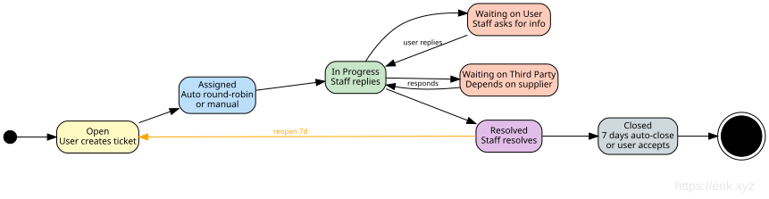

# Документ дизайна панели управления

## Обзор

`admin/` — это отдельный экземпляр webman v2.1, предоставляющий панель управления на Layui. Он работает независимо от бэкенда `service/`, разделяя только базу MySQL и 7 пакетов erikwang2013.

## Архитектура

```
┌─────────────────────────────────────────────────┐
│                  Панель управления               │
│  ┌──────────┐  ┌──────────┐  ┌───────────────┐ │
│  │ Controller│  │  Model   │  │   Bootstrap   │ │
│  │ (Layui)  │  │(Eloquent)│  │(worker start) │ │
│  └────┬─────┘  └────┬─────┘  └───────┬───────┘ │
│       │             │               │          │
│  ┌────┴─────────────┴───────────────┴─────────┐ │
│  │          7 пакетов erikwang2013            │ │
│  │  Snowflake │ Hashids │ Encryptable         │ │
│  │  Encryption│ Scout   │ Season │ Poster     │ │
│  └────────────────────┬───────────────────────┘ │
└───────────────────────┼─────────────────────────┘
                        │
              ┌─────────┴─────────┐
              │   MySQL 8.0       │
              │   Elasticsearch   │
              └───────────────────┘
```

### Карта зависимостей модулей


## Структура каталогов

```
admin/
├── app/
│   ├── bootstrap/       # Запуск на процесс
│   │   ├── SnowflakeBootstrap.php
│   │   ├── EncryptableBootstrap.php
│   │   └── EncryptionBootstrap.php
│   ├── controller/       # 54 файла контроллеров (Base/Crud + CRUD по каждой сущности)
│   │   ├── Base.php     # json() с hashids_encode_ids
│   │   ├── Crud.php     # Select/Insert/Update/Delete/Export с декодированием hashids
│   │   ├── DashboardController.php  # API данных дашборда (статистика пользователей + тренды)
│   │   ├── AccountController.php    # Вход/выход/профиль/пароль
│   │   ├── AdminController.php      # CRUD администраторов + роли
│   │   ├── RoleController.php       # CRUD ролей + дерево правил
│   │   └── ...
│   ├── model/            # 44 модели Eloquent (36 сопоставлены с безымянными бизнес-таблицами service + alerts (определена в install.sql) + 7 управляющих таблиц wa_*)
│   │   ├── Base.php     # Snowflake PK + поддержка Encryptable
│   │   ├── Admin.php    # Encryptable: password, email, mobile
│   │   ├── User.php     # Encryptable: 6 полей + Trait Searchable
│   │   └── ...
│   ├── common/           # Auth, Tree, Layui, Util, ExcelExport
│   ├── middleware/        # WafMiddleware + AccessControl
│   ├── exception/        # Handler
│   └── functions.php     # hashids_encode/decode, encrypt_data/decrypt_data
├── api/                  # Публичный API (plugin\admin\api)
│   └── Auth.php          # canAccess() ACL
├── config/
│   ├── plugin/erikwang2013/  # 7 конфигураций плагинов
│   ├── hashids.php       # подключения Hashids (основное + альтернативное)
│   └── encryption.php    # конфигурация шифрования (master key, cipher)
├── tests/                # тестовый набор PHPUnit 11 (286 tests, 962 assertions)
│   ├── HashidsTest.php   # 21 tests
│   ├── BaseJsonTest.php  # 13 tests
│   ├── CrudHashidsTest.php # 14 tests
│   ├── TreeTest.php      # 19 tests
│   ├── AccessControlMiddlewareTest.php # 7 tests（401/403/пропуск）
│   ├── AdminControllersTest.php        # 48 тестов регрессии контроллеров через рефлексию
│   ├── UtilTest.php      # 17 tests
│   ├── DictTest.php      # 5 tests
│   ├── ExcelExportTest.php # 4 tests
│   ├── LayuiTest.php     # 5 tests
│   └── support/          # RequestMock, TestableCrud
├── install.sql           # DDL (bigint unsigned PK, без автоинкремента)
└── phpunit.xml
```

## Детали интеграции пакетов

### 1. Snowflake (распределённые первичные ключи)

**Конфигурация**: `config/plugin/erikwang2013/snowflake-php/app.php`
**Bootstrap**: `app/bootstrap/SnowflakeBootstrap.php`

```php
// Model Base::boot() — событие creating
static::creating(function (Model $model) {
    if (empty($model->getKey())) {
        $snowflake = Container::instance()->get(Snowflake::class);
        $model->setAttribute($model->getKeyName(), $snowflake->id());
    }
});
```

- 64-битные ID: `timestamp(41b) | datacenter(5b) | worker(5b) | sequence(12b)`
- Эпоха: 2024-01-01 (максимальный срок жизни ~69 лет)
- `$incrementing = false`, `$keyType = 'int'` на модели Base
- Все колонки PK и FK: `bigint unsigned NOT NULL`

### 2. Hashids (обефускация ID)

**Конфигурация**: `config/hashids.php` + `config/plugin/erikwang2013/hashids/app.php`

**Путь кодирования** (ответ):
- `Base::json()` вызывает `hashids_encode_ids($data)` рекурсивно
- Поля с именами `id`, `*_id`, `*_ids` с положительными целыми → hashid-строки
- `Crud::formatNormal()` тоже применяет кодирование (исправлено в ходе ревью кода)

**Путь декодирования** (запрос):
- `Crud::selectInput()`: декодирует hashid-строки `id`/`*_id` в WHERE
- `Crud::updateInput()`: декодирует первичный ключ из `$request->post()`
- `Crud::deleteInput()`: декодирует массив PK из `$request->post()`
- `AdminController::update()`: использует напрямую возврат `updateInput()` (без дублей)
- `RoleController::select()`/`rules()`: декодируют `$request->get('id')`

**Вспомогательные функции** (в `app/functions.php`):
- `hashids_encode(int $id): string`
- `hashids_decode(string $hash): int` — возвращает 0 при неудаче
- `hashids_encode_ids(array $data): array` — рекурсивно, обрабатывает строки `is_numeric()`

### 3. Encryptable (шифрование полей базы данных)

**Конфигурация**: `config/plugin/erikwang2013/encryptable/app.php`
**Bootstrap**: `app/bootstrap/EncryptableBootstrap.php`

Использует интерфейс Eloquent `CastsAttributes`:
- `get()`: AES-дешифрование значения при чтении из БД
- `set()`: AES-шифрование значения при записи в БД

**Шифруемые поля**:
| Модель | Поля |
|-------|--------|
| Admin | password, email, mobile |
| User | password, email, mobile, token, last_ip, join_ip |

**Критическое правило**: всегда использовать `save()` экземпляра модели, никогда — `update()` построителя запросов. Использование `Admin::where(...)->update(...)` обходит касты Eloquent и сохраняет сырые значения. Это было исправлено в `AccountController` в ходе ревью кода.

**Многослойность паролей**: пароли сначала хешируются bcrypt (в `insertInput`/`updateInput`), затем хеш AES-шифруется кастом Encryptable при `save()`. При чтении: AES-дешифрование → bcrypt-хеш → `password_verify()`.

### 4. Encryption (транспорт API)

**Конфигурация**: `config/encryption.php`
**Bootstrap**: `app/bootstrap/EncryptionBootstrap.php`

Зарезервирован для шифрования запросов/ответов на уровне API (AES-256-GCM). Предоставляет:
- `encrypt_data(string $plaintext): string`
- `decrypt_data(string $ciphertext): string`

Бросает `RuntimeException` с понятным сообщением, если `ENCRYPTION_MASTER_KEY` не настроен.

### 5. Webman-Scout (Elasticsearch)

**Конфигурация**: `config/plugin/erikwang2013/webman-scout/app.php` + `command.php`

Модель User использует Trait `Searchable`:
```php
class User extends Base
{
    use Searchable;

    public function toSearchableArray(): array
    {
        return [
            'id' => $this->id,
            'username' => $this->username,
            'nickname' => $this->nickname,
            'email' => $this->email,
            'mobile' => $this->mobile,
        ];
    }
}
```

### 6. Season (флаги стран)

**Конфигурация**: `config/plugin/erikwang2013/season/app.php`

Глобальный помощник: `country_season_flag(string $code): string`
- `country_season_flag('CN')` → 🇨🇳
- `country_season_flag('US')` → 🇺🇸

Также предоставляет локализованные названия сезонов через класс `CountrySeason`.

### 7. Poster-PHP (капча по клику)

**Конфигурация**: `config/poster.php` + `config/plugin/erikwang2013/poster/app.php`
**Bootstrap**: `config/plugin/erikwang2013/poster/bootstrap.php` → `CaptchaPlugin`

Предоставляет капчу по клику для входа и регистрации:

```
Client                         Server
──────                         ──────
POST /api/captcha/create
  Header: X-Api-Version: v1
  → CaptchaService::create()
    → captcha_create('click')
      → ClickCaptcha::generate()
        → GD рендерит изображение с n случайно размещёнными китайскими словами
        → Сохраняет targets + key в Redis/File хранилище
      ← {key, image (base64), target_count, expires_in}

POST /api/auth/login
  Header: X-Api-Version: v1
  (с captcha_key + captcha_points)
  → AuthController::verifyCaptcha()
    → CaptchaService::verify(key, [[x1,y1], [x2,y2], ...])
      → captcha_verify(key, 'click', points)
        → CaptchaManager проверяет евклидово расстояние с допуском ≤ 18px
      ← true/false
```

**Функции безопасности**:
- Одноразовые ключи: удаляются после успешной проверки
- Защита от перебора: максимум 3 неудачные попытки на ключ, затем ключ удаляется
- TTL 300 секунд (настраивается через `CAPTCHA_TTL`)
- Допуск кликов: радиус 18px (настраивается)
- Уровни сложности: easy (2 цели), medium (3), hard (4)
- Хранилище: автоопределение Redis → fallback на файл, настраивается через `CAPTCHA_STORAGE`

**Обёртка**: `Common\Captcha\CaptchaService` загружает собственную конфигурацию из `config/poster.php`, предоставляет методы `create()` (убирает цели из ответа в целях безопасности) и `verify()`. Используется в `AuthController::register()` и `AuthController::login()`.

### 8. ConfirmationMiddleware (повторная проверка пароля)

**Конфигурация**: промежуточный слой группы маршрутов в `config/route.php`

Защищает деструктивные и чувствительные операции, требуя от пользователя повторного ввода пароля. Применяется как промежуточный слой на 12 чувствительных эндпоинтах:

```
Client                              Server
──────                              ──────
POST /api/orders/{id}/pay
  Header: X-Api-Version: v1
  (с полем confirm_password)
    → ConfirmationMiddleware::process()
      → Проверка наличия userId (401 при отсутствии)
      → Проверка ключа блокировки Redis (429 при блокировке)
      → Проверка непустоты пароля (422 при отсутствии)
      → User::find() + Hash::check() проверяет bcrypt
      → При неудаче:
        → Redis INCR счётчик confirm_failed:{userId}
        → Если count ≥ 5, SETEX confirm_lock:{userId} на 900s
        → AuditLogger::record('confirm_failed', ...)
        → Возврат 403
      → При успехе:
        → DEL счётчик confirm_failed:{userId}
        → AuditLogger::record('confirm_success', ...)
        → Вызов $next($request)
```

**Чувствительные пользовательские эндпоинты** (Auth + Confirmation):
| Метод | Путь | Операция |
|--------|------|-----------|
| POST | `/api/orders/{id}/pay` | Инициация оплаты |
| POST | `/api/supplier/withdraw` | Заявка на вывод средств |
| DELETE | `/api/dns/{domain}/records/{id}` | Удаление DNS-записи |

**Чувствительные эндпоинты админа** (Auth + AdminRole + Confirmation):
| Метод | Путь | Операция |
|--------|------|-----------|
| DELETE | `/admin/api/products/{id}` | Удаление товара |
| POST | `/admin/api/orders/{id}/refund` | Возврат по заказу |
| POST | `/admin/api/provisioning/resources/{id}/destroy` | Уничтожение ресурса |
| POST | `/admin/api/kyc/{id}/approve` | Одобрение KYC |
| POST | `/admin/api/kyc/{id}/reject` | Отклонение KYC |
| POST | `/admin/api/suppliers/{id}/approve` | Одобрение поставщика |
| POST | `/admin/api/suppliers/{id}/settle` | Формирование расчётного документа |
| POST | `/admin/api/suppliers/withdraws/{id}/approve` | Одобрение вывода |
| PUT | `/admin/api/system/config` | Обновление системной конфигурации |

Версия API передаётся в заголовке `X-Api-Version` (по умолчанию: `v1`), а не в пути URL.

**Функции безопасности**:
- Проверка пароля bcrypt через `Hash::check()`
- Ограничение частоты: 5 неудачных попыток запускают 15-минутную блокировку (TTL 900s)
- Блокировка применяется на пользователя через ключи Redis (`confirm_lock:{userId}`, `confirm_failed:{userId}`)
- Успех сбрасывает счётчик неудач
- Все попытки записываются в базу аудита (успех, неудача, блокировка)
- `verifyPassword()` — защищённый метод, позволяющий тестирование через анонимный подкласс с переопределением

**Тестируемость**: `ConfirmationMiddlewareTest` (11 тестов) использует анонимный подкласс с переопределением `verifyPassword()` для возврата фиксированного boolean, избегая зависимости от Eloquent/DB. Тесты покрывают: 401 без аутентификации, 422 отсутствующий/пустой пароль, 403 неверный пароль, успешный проход, формат ключа ограничения частоты, формат ключа блокировки, границу порога максимальных неудач (4→нет блокировки, 5→блокировка, 6→блокировка).

## Система ACL

### На уровне контроллеров

```php
protected $noNeedLogin = ['login', 'logout', 'captcha'];  // Пропуск входа
protected $noNeedAuth = ['select'];                         // Пропуск аутентификации
```

Проверяется `api/Auth::canAccess()` через `ReflectionClass`.

**Ответы AccessControlMiddleware** (`middleware/AccessControl.php`):
- Не выполнен вход (вне `noNeedLogin`) → **HTTP 401**, body — скрипт редиректа на страницу входа
- Выполнен вход, но недостаточно прав → **HTTP 403** страница ошибки (код 403, больше не 500)
- В списке пропуска (страница входа/капча и т.п.) → обычный пропуск

### На основе ролей

- Роли имеют `rules` (ID правил через запятую или `*` для суперадмина)
- Правила хранятся в `wa_rules` как ключи `{Controller}@{action}`
- `api/Auth::canAccess()` резолвит ключ `$controller@$action` против правил роли
- Суперадмин (`rules = '*'`) обходит все проверки

### Ограничения данных

```php
protected $dataLimit = null;     // Без ограничения
protected $dataLimit = 'auth';   // Админ видит свои + данные подчинённых
protected $dataLimit = 'personal'; // Админ видит только свои данные
protected $dataLimitField = 'admin_id';
```

## Результаты ревью кода (исправлено)

В ходе ревью первоначального коммита было обнаружено и исправлено следующее:

### Критично
1. **AccountController обходит Encryptable**: `password()` и `update()` использовали `Admin::where()->update()`, что обходит касты Eloquent → в шифруемые колонки записывались сырые значения. Исправлено переходом на `Admin::find()->save()`.
2. **Crud::formatNormal() не кодирует ID**: вызывался глобальный `json()` вместо применения `hashids_encode_ids()`. Исправлено.

### Важно
3. **Строгая проверка `is_int` в hashids_encode_ids**: большие bigint-значения из PDO приходят как PHP-строки. Заменено на `is_numeric()` с проверкой целочисленности.
4. **Двойное декодирование ID в AdminController**: `update()` декодировал один и тот же PK дважды. Убрано, исправлено затенение переменной цикла в `insert()`.
5. **Мёртвый код пароля в AccountController::update()**: поле пароля не в списке разрешённых. Удалено.
6. **Захардкоженный MySQL-драйвер**: заменён на `config('database.default')`.

## Экспорт в Excel

### Архитектура

Экспорт в Excel использует PhpSpreadsheet ^2.0 для генерации .xlsx-файлов на стороне сервера. В панели два отдельных пути экспорта, потому что есть два механизма CRUD:

```
Запрос экспорта (с текущими фильтрами таблицы)
  ├── Контроллеры на Crud (User, Admin, Role и др.)
  │     → Crud::export()
  │       → selectInput() переиспользует разбор запросов (декодирование hashids, WHERE, ORDER)
  │       → doSelect() строит Eloquent-запрос
  │       → Лимит 10 000 строк
  │       → hashids_encode_ids() применяется к данным результата
  │       → ExcelExport::export() генерирует .xlsx
  │
  └── TableController (общие таблицы, например wa_dict, wa_rules)
        → TableController::export()
          → Построение запроса из схемы таблицы + параметров запроса
          → Применяется hashids_encode_ids()
          → ExcelExport::export() генерирует .xlsx
```

### Утилита ExcelExport (`app/common/ExcelExport.php`)

Текучая обёртка вокруг PhpSpreadsheet:

- `setColumns(array $columns)` — задаёт порядок колонок
- `setLabels(array $labels)` — задаёт читаемые заголовки колонок
- `addRow(array $row)` / `addRows(array $rows)` — наполнение данными
- `save(string $title): string` — записывает .xlsx в `runtime/exports/`, возвращает путь файла
- Статический помощник: `ExcelExport::export($title, $columns, $data, $labels)` — разовый экспорт
- Автоподбор ширины колонок через `Worksheet::getColumnDimension()`

### Crud::export()

```php
public function export(Request $request): Response
{
    [$where, $format, $limit, $field, $order] = $this->selectInput($request);
    $query = $this->doSelect($where, $field, $order);
    $maxRows = 10000;
    $total = min($query->count(), $maxRows);
    $items = $query->limit($maxRows)->get();
    if (method_exists($this, 'afterQuery')) {
        $items = call_user_func([$this, 'afterQuery'], $items);
    }
    $data = array_map(fn($item) => ...toArray(), $items->toArray());
    $data = hashids_encode_ids($data);
    // Получить заголовки колонок из комментариев схемы таблицы
    $path = ExcelExport::export($table, $columns, $data, $labels);
    return response()->download($path, $table . '_' . date('YmdHis') . '.xlsx');
}
```

Все контроллеры на базе Crud (Admin, User, Role и др.) наследуют `export()` автоматически.

### Подключение фронтенда

- Встроенный пункт тулбара `"exports"` Layui (клиентский CSV) заменён кастомной кнопкой `{title: "导出", layEvent: "export"}`
- Обработчик события `export` вызывает `window.exportExcel()`, который собирает текущие параметры фильтров таблицы и открывает URL скачивания
- `Layui::buildTable()` генерирует тулбар с кастомной кнопкой экспорта для всех CRUD-страниц

### Экспорт управляющего API service

Бэкенд service (`service/`) также имеет экспорт в Excel через собственную обёртку `Common\ExcelExport`:

| Эндпоинт | Контроллер | Экспортируемые данные |
|----------|-----------|---------------|
| `GET /admin/api/orders/export` | OrderController | id, order_no, user_id, type, status, total, currency, created_at, paid_at |
| `GET /admin/api/users/export` | UserController | id, email, phone, role, status, created_at, last_login_at |
| `GET /admin/api/suppliers/export` | SupplierController | id, user_id, status, contact_name, contact_email, contact_phone, created_at |

Все API-эндпоинты требуют заголовок `X-Api-Version` (по умолчанию: `v1`).

Маршруты экспорта размещаются ПЕРЕД параметрическими маршрутами `/{id}`, чтобы избежать конфликтов.

## Управляющий API service — расширенные функции

### Эндпоинты управляющего API (слой service)

Все REST-эндпоинты админа имеют префикс `/admin/api` и требуют `AdminRoleMiddleware`.

| Группа | Эндпоинты | Контроллер |
|-------|-----------|------------|
| Dashboard | `GET /dashboard`, `/kyc`, `POST /kyc/{id}/approve`, `/reject` | `Admin\DashboardController` |
| Users | `GET /users`, `/users/export`, `/users/{id}`, `PUT /users/{id}/status` | `Admin\UserController` |
| Products | `POST /products`, `PUT /products/{id}`, `DELETE /products/{id}`, `POST /products/{id}/skus`, `PUT /skus/{id}`, `POST /skus/{id}/region-price` | `Admin\ProductController` |
| Импорт/экспорт товаров | `GET /products/export` (CSV), `POST /products/import` (CSV upsert) | `Admin\ImportExportController` |
| Orders | `GET /orders`, `/orders/export`, `/orders/{id}`, `POST /orders/{id}/refund` | `Admin\OrderController` |
| Invoices | `GET /invoices`, `POST /invoices/{orderId}/generate` | `Admin\InvoiceController` |
| Payments | `GET /payments/channels`, `PUT /payments/channels/{id}`, `GET /payments/transactions`, `/reconcile` | `Admin\PaymentController` |
| Provisioning | `GET /provisioning/tasks`, `POST /tasks/{id}/retry`, `POST /resources/{id}/upgrade`, `/destroy`, `GET /hosts` | `Provisioning\TaskController` |
| API провайдеров | `GET /providers`, `POST /providers`, `PUT /providers/{id}`, `DELETE /providers/{id}` | `Admin\ProviderApiController` |
| CDN | `GET /cdn/domains`, `PUT /cdn/domains/{id}` | `Admin\CdnController` |
| Suppliers | `GET /suppliers`, `/suppliers/export`, `POST /suppliers/{id}/approve`, `/settle`, `/withdraws/{id}/approve` | `Admin\SupplierController` |
| API-ключи поставщиков | `GET /suppliers/{id}/api-keys`, `POST /suppliers/{id}/api-keys`, `DELETE /suppliers/api-keys/{id}` | `Admin\SupplierController` |
| Tickets | `GET /tickets`, `POST /tickets/{id}/assign`, `/close` | `Ticket\TicketController` |
| Coupons | `GET /coupons`, `POST /coupons`, `DELETE /coupons/{id}` | `Admin\CouponController` |
| Webhooks | `GET /webhooks`, `POST /webhooks`, `DELETE /webhooks`, `POST /webhooks/test` | `Admin\WebhookController` |
| Domains | `GET /domains/tlds`, `POST /domains/tlds`, `PUT /domains/tlds/{id}`, `DELETE /domains/tlds/{id}`, `GET /domains/zones`, `/transfers`, `POST /transfers/{id}/approve` | `Admin\DomainController` |
| Notifications | `GET /notifications/templates`, `PUT /notifications/templates/{id}`, `GET /notifications/log` | `Admin\NotificationController` |
| Статьи справки | `GET /help`, `POST /help`, `PUT /help/{id}`, `DELETE /help/{id}` | `Admin\HelpController` |
| Reports | `GET /reports/revenue`, `/supplier`, `/region` | `Report\ReportController` |
| Monitoring | `GET /monitor/dashboard`, `/resources/{id}` | `Monitor\MonitorController` |
| Audit | `GET /audit-logs` | `Admin\SystemController` |
| Системная конфигурация | `PUT /system/config` | `Admin\SystemController` |

### Управление ресурсами CDN

Продукт CDN поддерживает четырёх провайдеров (Cloudflare / CloudFront / Aliyun / Tencent), в админ-панели два блока:

**Настройка учётных записей провайдеров** (переиспользует модель ProviderApi, `Admin\ProviderApiController`):

- `GET/POST /admin/api/providers`, `PUT/DELETE /admin/api/providers/{id}`, защищено `RbacMiddleware('provider.config')`
- `code` по соглашению `cdn-cloudflare` / `cdn-cloudfront` / `cdn-aliyun` / `cdn-tencent`; учётные данные шифруются через Encryptable, колонка `config` (JSON) хранит нечувствительные метаданные
- Приоритет разрешения учётных данных на стороне пользователя: привязанная запись → активная запись по code → env fallback; удаление/purge идут по строгой привязке (только привязанная запись, при отсутствии/отключении — 4003)

**Управление CDN-доменами** (`Admin\CdnController`):

```
GET /admin/api/cdn/domains        → все домены (с user_id владельца), защищено RbacMiddleware('cdn.manage')
PUT /admin/api/cdn/domains/{id}   → обновление тарифа, белый список plan: standard | pro | enterprise,
                                    недопустимое значение — 400; изменение пишется в журнал аудита admin_cdn_update_plan
```

### Данные дашборда (слой service)

`Admin\DashboardController::index()` предоставляет реальные эксплуатационные метрики:

```php
[
    'today_stats' => [todayOrders, todayRevenue, newUsers, activeResources],
    'revenue_trend_30d' => [...],   // Ежедневная выручка за последние 30 дней
    'region_distribution' => [...],  // Активные ресурсы, сгруппированные по регионам
    'pending_orders' => ...,         // Заказы, ожидающие оплаты
    'pending_kyc' => ...,            // Заявки KYC, ожидающие проверки
    'open_tickets' => ...,           // Открытые или в работе тикеты
]
```

### Представление дашборда панели (`app/view/index/dashboard.html`)

- **8 анимированных карточек статистики**: сегодня/неделя/месяц/всего пользователей + заказы сегодня + выручка сегодня + ожидающие заказы + активные ресурсы — каждая с анимацией счёта через модуль `count` Layui
- **3 графика ECharts**:
  1. Тренд регистраций за 7 дней — график с областью
  2. Тренд регистраций за 30 дней — столбчатая диаграмма
  3. Сводка пользователей — кольцевая/круговая диаграмма (сегодня / неделя / месяц)
- **Таблица системной информации**: динамически заполняется версиями PHP/Workerman/Webman/Admin/MySQL/OS
- **Тулбар**: кнопки экспорта PDF и обновления
- Все данные запрашиваются через AJAX с `/app/admin/dashboard/data`

### Маршрут

```
Route::any('/app/admin/dashboard/data', [DashboardController::class, 'index']);
```

Помимо явно зарегистрированных маршрутов, `admin/config/route.php` автоматически регистрирует для каждого публичного метода каждого контроллера из `app/controller/` маршрут `/app/admin/{snake_case_controller}/{action}` (например `/app/admin/order_item/index`); URL совпадает с snake_case-именами контроллеров, используемыми в меню; `/app/admin` и `/app/admin/index` — вход на главную страницу панели/страницу входа (при отсутствии входа рендерится представление входа); неподходящие запросы единообразно возвращают 404.

## Экспорт PDF

Клиентская генерация PDF на странице дашборда:

- Использует **html2canvas 1.4.1** (CDN) для захвата DOM дашборда в canvas
- Использует **jsPDF 2.5.1** (CDN) для создания скачиваемого PDF A4
- Захватывает карточки статистики и графики ECharts (отрендеренные как canvas-элементы)
- Включает в PDF заголовок, временную метку и фирменный стиль
- Запускается кнопкой «Export PDF» в тулбаре дашборда

```
DOM дашборда → снимок html2canvas → документ jsPDF → скачивание в браузере
```

### Реализация

```javascript
// In dashboard.html
html2canvas(document.querySelector('.layui-body'), {scale: 2}).then(canvas => {
    const pdf = new jsPDF('p', 'mm', 'a4');
    const imgData = canvas.toDataURL('image/png');
    pdf.addImage(imgData, 'PNG', 10, 10, 190, 0);
    pdf.save('dashboard_' + new Date().toISOString().slice(0, 10) + '.pdf');
});
```

## Тестовый набор

```
PHPUnit 11.5 | 67 tests | 124 assertions
```

### HashidsTest (21 тест)
- roundtrip encode/decode (от 0 до PHP_INT_MAX)
- Детерминированное кодирование
- Обработка недействительных/пустых строк
- Паттерны полей `hashids_encode_ids` (`id`, `*_id`, `*_ids`)
- Пропуск нулей/отрицательных, поддержка числовых строк
- Рекурсия вложенных массивов, сохранение не-ID полей

### BaseJsonTest (13 тестов)
- `json()`/`success()`/`fail()` применяют кодирование hashids
- Кодирование вложенных объектов
- Обработка ID размера Snowflake
- Сохранение не-ID полей
- Обработка нулей
- Проверка структуры ответа

### CrudHashidsTest (14 тестов)
- `selectInput`: декодирование hashid в полях WHERE `id`/`*_id`
- `selectInput`: пропуск числовых строк/сырых int
- `updateInput`: декодирование hashid PK
- `updateInput`: приведение числовой строки PK к int
- `deleteInput`: пакетное декодирование ID, смешанные типы
- `deleteInput`: пустой массив, обработка одиночного ID

## Система миграций базы данных

### Архитектура

Оба экземпляра — `service/` и `admin/` — имеют независимые системы миграций на базе Schema Builder из `illuminate/database`. Каждый экземпляр регистрирует команды Symfony Console через `config/command.php`, обнаруживаемые консольным раннером webman.

```
php webman migrate          # Выполнить ожидающие миграции
php webman migrate:rollback # Откатить последний батч
php webman migrate:status   # Показать статус миграций
```

### MigrationRunner (`service/support/MigrationRunner.php`, `admin/app/common/MigrationRunner.php`)

Общий движок обоих экземпляров:

- **`ensureTable()`** — создаёт таблицу отслеживания `migrations` (id, имя миграции, номер батча) при первом запуске
- **`migrate()`** — сканирует файлы миграций из `database/migrations/`, выполняет ожидающие методы `up()`, записывает батч
- **`rollback()`** — откатывает последний батч вызовом `down()` каждой миграции в обратном порядке
- **`status()`** — выводит все миграции с номерами батчей
- **`resolve()`** — инстанцирует классы миграций из файлов

### Базовый класс Migration (`service/support/Migration.php`, `admin/app/common/Migration.php`)

```php
abstract class Migration
{
    abstract public function up(): void;
    abstract public function down(): void;
}
```

Каждый файл миграции возвращает класс, наследующий `Migration`, с именами файлов с префиксом временной метки (например `2024_01_01_000001_create_initial_schema.php`).

### Миграции service

**Каталог**: `service/database/migrations/` — 38 файлов миграций (имена таблиц без префикса erik_, модели admin сопоставляются напрямую)

| Миграция | Таблицы |
|-----------|--------|
| `0001_create_users_tables` | users, user_profiles, user_kyc, user_balance, user_balance_log, user_addresses, refresh_tokens |
| `0002_create_product_tables` | product_categories, regions, products, product_skus, product_regions, product_images, product_attributes, product_reviews |
| `0003_create_order_tables` | carts, orders, order_items, order_timeline, order_invoices, refunds |
| `0004_create_payment_tables` | payment_channels, payment_transactions, payment_reconcile |
| `0005_create_provisioning_tables` | resources, resource_servers, resource_ips, resource_disks, resource_domains, provision_tasks, provider_apis |
| `0006_create_host_tables` | host_machines, ip_pools, ip_allocations, disks, disk_resizes |
| `0007_create_supplier_tables` | suppliers, supplier_products, supplier_settlements, supplier_withdraws |
| `0008_create_domain_tables` | domain_tlds, domain_transfers, dns_zones, dns_records |
| `0009_create_ticket_notification_tables` | tickets, ticket_messages, notifications, notification_templates |
| `0010_create_audit_table` | audit_logs |
| `0011_create_kvm_service_tables` | network_services, firewall_services, switch_services |
| `2024_01_01_000001_create_initial_schema` | Выполняет `docs/database.sql` через `Capsule::unprepared()`, в `down()` удаляет всё |
| `2025_05_16_000002_add_fcm_token_to_users` | Добавляет колонки `fcm_token`, `fcm_platform` + индекс к users |
| `2026_08_26_000003_widen_encrypted_columns` | users.phone / user_addresses.phone / suppliers.contact_phone VARCHAR(20)→VARCHAR(255)（длина шифротекста Encryptable） |

### Миграции admin

**Каталог**: `admin/database/migrations/` — 1 файл миграции

| Миграция | Описание |
|-----------|-------------|
| `2024_01_01_000001_create_admin_schema` | Выполняет `admin/install.sql` через `Capsule::unprepared()` — создаёт таблицы wa_* с сидовыми данными |

### Регистрация консольных команд

**`service/config/command.php`**:
```php
return [
    \App\Command\MigrateCommand::class,
    \App\Command\MigrateRollbackCommand::class,
    \App\Command\MigrateStatusCommand::class,
];
```

**`admin/config/command.php`** — тот же паттерн под пространством имён `app\command`.

## Интеграция Stripe в проде

### Архитектура

Фейковые ID платежей `random_bytes()` заменены на реальную интеграцию API Stripe через `stripe/stripe-php` ^15.0.

**Файл**: `service/app/payment/service/channels/StripeChannel.php`

```
Клиентская сторона               Серверная сторона                Stripe API
───────────                    ───────────                    ──────────
Выбор Stripe при оформлении
  → POST /orders/{id}/pay
    → StripeChannel::createPaymentIntent()
      → StripeClient->paymentIntents->create(amount, currency)
        ← {id, client_secret}
      → Сохранение pi_xxx как transaction_no
      ← Возврат client_secret
  → Stripe.js confirmCardPayment(client_secret)
    ← Платёж подтверждён Stripe
      → POST /payments/webhook/stripe
        → StripeChannel::handleWebhook()
          → Webhook::constructEvent(payload, signature, secret)
          → Проверка идемпотентности (пропуск не-pending транзакций)
          → Обновление статуса заказа, создание записи транзакции
```

### Создание PaymentIntent

```php
public function createPaymentIntent(Order $order): array
{
    $intent = $this->stripe()->paymentIntents->create([
        'amount'   => (int) round($order->total * 100),  // cents
        'currency' => strtolower($order->currency),
        'metadata' => ['order_id' => $order->id, 'order_no' => $order->order_no],
    ]);
    return [
        'transaction_no' => $intent->id,          // pi_xxxxxxxxxxxxx
        'client_secret'  => $intent->client_secret, // pi_xxx_secret_yyy
    ];
}
```

- `$this->stripe()` лениво инициализирует `\Stripe\StripeClient` с `STRIPE_SECRET_KEY` из env
- Fallback на `$this->channel->api_key_encrypted` (расшифровывается через Encryptable), если env-переменная не задана
- Сумма конвертируется в центы: `(int) round($order->total * 100)`

### Проверка подписи Webhook

```php
public function handleWebhook(string $payload, string $signature): void
{
    $event = \Stripe\Webhook::constructEvent(
        $payload, $signature, $this->channel->webhook_secret_encrypted
    );
    // Идемпотентность: пропуск, если транзакция уже обработана
    $existing = Transaction::where('transaction_no', $event->id)->first();
    if ($existing && $existing->status !== 'pending') return;
    
    match ($event->type) {
        'payment_intent.succeeded' => $this->confirmPayment($event),
        'payment_intent.payment_failed' => $this->failPayment($event),
        default => null,
    };
}
```

- Использует `Webhook::constructEvent()` для проверки заголовка подписи Stripe
- **Защита идемпотентности**: проверка дублирующих доставок webhook по `transaction_no`
- Поддерживает оба типа событий: успех и неудачу

## Интеграция SMS Twilio

### Архитектура

Заглушка `error_log()` заменена реальной доставкой SMS через `twilio/sdk` ^8.0.

**Файл**: `service/app/notification/queue/SmsSender.php`

### Отправка сообщений

```php
public function consume(): void
{
    $client = new \Twilio\Rest\Client(
        getenv('TWILIO_ACCOUNT_SID'),
        getenv('TWILIO_AUTH_TOKEN')
    );
    $message = $client->messages->create(
        $this->notification->recipient_phone,
        ['from' => getenv('TWILIO_PHONE_NUMBER'), 'body' => $this->notification->body]
    );
    $this->notification->provider_message_id = $message->sid;
}
```

### Обработка ошибок

- Перехватывает `Twilio\Exceptions\RestException` — фиксирует код и сообщение ошибки Twilio
- Создаёт запись Notification со статусом сбоя `send_status = 'failed'`
- Записывает `provider_message_id` (SID Twilio) для отслеживания доставки
- Fallback на `error_log()`, когда учётные данные Twilio не заданы (dev-режим)

### Конфигурация

Env-переменные: `TWILIO_ACCOUNT_SID`, `TWILIO_AUTH_TOKEN`, `TWILIO_PHONE_NUMBER`

## Интеграция push FCM

### Архитектура

Заглушка `error_log()` заменена реальной доставкой push через `kreait/firebase-php` ^7.0.

**Файл**: `service/app/notification/queue/PushSender.php`

### Хранение токенов устройств

Добавлено в таблицу `users` через миграцию:
- `fcm_token VARCHAR(512) DEFAULT NULL` — токен регистрации устройства
- `fcm_platform VARCHAR(16) DEFAULT NULL` — `ios` / `android` / `web`
- `INDEX idx_fcm_token (fcm_token)` — поиск по токену

В модель User добавлены `fcm_token` и `fcm_platform` в `$fillable`.

### Отправка push

```php
public function consume(): void
{
    $factory = new \Kreait\Firebase\Factory();
    if ($credentialsPath = getenv('FIREBASE_CREDENTIALS_PATH')) {
        $factory = $factory->withServiceAccount($credentialsPath);
    }
    $messaging = $factory->createMessaging();
    
    $message = \Kreait\Firebase\Messaging\CloudMessage::withTarget(
        'token', $this->user->fcm_token
    )->withNotification([
        'title' => $this->notification->title,
        'body'  => $this->notification->body,
    ]);
    
    $result = $messaging->send($message);
}
```

### Очистка токенов

- Перехватывает `Kreait\Firebase\Exception\Messaging\InvalidToken` — обнуляет `fcm_token` пользователя
- Перехватывает `Kreait\Firebase\Exception\Messaging\NotFound` — удаляет незарегистрированный токен
- Fallback на `error_log()`, когда учётные данные Firebase не заданы (dev-режим)

### Конфигурация

Env-переменные: `FIREBASE_CREDENTIALS_PATH` (JSON сервисного аккаунта), `FCM_SERVER_KEY` (legacy)

## Диаграммы бизнес-процессов

### Заказ → Оплата → Поставка (основной бизнес-процесс)


### Детали событийной поставки


### Распределение уведомлений


### Жизненный цикл поставщика


### Жизненный цикл тикета



## Тестовый набор слоя service

### Обзор

```
PHPUnit 10.5 | 295 tests | 455 assertions
```

**Каталог**: `service/tests/` — 12 тестовых файлов в 7 модулях

**Конфигурация**: `service/phpunit.xml` — один набор `unit`, покрывает исходники `app/` и `common/`

### Тестовый bootstrap

`service/tests/bootstrap.php` загружает autoload Composer и определяет два глобальных помощника, нужных коду под тестом:

- `request_id()` — возвращает уникальную строку ID запроса
- `now()` — возвращает текущий объект `DateTime`

Важный вывод: `Webman\Config` нельзя загрузить в тестовом контексте, потому что `loadFromDir()` запускает `route.php`, который вызывает `Route::addRoute()` на null. Тесты полностью обходят Config — `HashidServiceTest` использует `new Hashids()` напрямую, `ResponseTest` использует локальные методы-помощники.

### Тестовые файлы

| Файл | Тесты | Покрытие |
|------|-------|----------|
| `Captcha/CaptchaServiceTest.php` | 9 | структура create, уровни сложности, verify pass/fail, одноразовое использование, уникальные ключи |
| `Confirmation/ConfirmationMiddlewareTest.php` | 11 | требуется аутентификация, отсутствующий пароль, неверный пароль, успешный проход, формат ключа ограничения частоты, формат ключа блокировки, пороги максимальных неудач |
| `Common/HashidServiceTest.php` | 17 | roundtrip encode/decode, детерминизм, изоляция соли, рекурсивный обход ID |
| `Common/ResponseTest.php` | 16 | структура success/error/paginated, консистентность request_id, HTTP-коды ошибок |
| `Common/SnowflakeTest.php` | 6 | упорядочение по временной метке, уникальность, диапазон bigint, паттерн инициализации |
| `Common/ValidatorTest.php` | 22 | правила валидации required(), email(), minLength() |
| `Common/LogSanitizerTest.php` | 34 | редактирование PII, вложенные массивы, нечувствительное к регистру сопоставление, 20 типов чувствительных полей |
| `Payment/StripeChannelTest.php` | 19 | конфигурация канала, расчёт суммы, подписи webhook, идемпотентность |
| `Payment/PaymentRouterTest.php` | 10 | фильтрация каналов, ограничения суммы, поддержка валют/регионов, расчёт комиссии |
| `Notification/NotificationDispatcherTest.php` | 8 | рендеринг шаблонов, маршрутизация каналов, пропуск неактивных пользователей |
| `Provisioning/ProviderFactoryTest.php` | 12 | register, create, createFromResource, случаи ошибок |
| `Provisioning/RetryLogicTest.php` | 12 | экспоненциальный бэкофф, максимум повторов, переходы статусов, выбор хоста |
| `ClientPlatform/ClientPlatformMiddlewareTest.php` | 13 | валидные платформы, отсутствующий/дефолтный заголовок, неподдерживаемая платформа, нечувствительность к регистру, пропуск не-API, маршруты admin, доступ нижестоящих |
| `Security/WafMiddlewareTest.php` | 37 | SQLi (4), XSS (6), CMDi (4), включение файлов (3), инъекция заголовков/CRLF (2), SSRF (5), NoSQL-инъекция (4), открытый редирект (2), безопасный проход (5), сканирование URL, сканирование UA |
| `Version/VersionMiddlewareTest.php` | 6 | валидная версия, отсутствующая версия по умолчанию, неподдерживаемая версия 400, пропуск не-API, валидация admin API, заголовки ответов ошибок |

### Тестовая инфраструктура

- `tests/TestCase.php` — базовый класс, наследующий PHPUnit TestCase
- `tests/Support/RequestMock.php` — mock-запрос с параметрами через конструктор

## Конвейер CI/CD

### Архитектура

Workflow GitHub Actions в `.github/workflows/ci.yml`.

**Триггеры**: push в `main`, pull requests в `main`

### Jobs

| Job | Стратегия | Описание |
|-----|----------|-------------|
| `syntax` | PHP 8.2 | `php -l` lint всех `.php`-файлов в admin/ и service/ |
| `admin-tests` | PHP 8.2, 8.3 | `composer install -d admin` → `admin/vendor/bin/phpunit` |
| `service-tests` | PHP 8.2, 8.3 | `composer install -d service` → `service/vendor/bin/phpunit` |
| `composer-validate` | PHP 8.2 | `composer validate --strict` для обоих composer.json |

### Матрица версий PHP

Оба тестовых job'а работают на PHP 8.2 и 8.3 через `shivammathur/setup-php@v2`.

### Текущий статус

Все 4 job'а проходят: 243 теста суммарно (67 admin + 176 service), 400 assertions, обе версии PHP зелёные.

## Связи сущностей базы данных


## Ключевые дизайнерские решения

1. **Отдельный экземпляр**: admin/ работает как собственный экземпляр webman, а не плагин внутри service/. Это изолирует трафик и сбои админки от API, обращённого к клиентам.

2. **Encryptable + хеширование паролей**: пароли сначала хешируются bcrypt, затем шифруются AES. Каст Encryptable работает на уровне Eloquent (над хешированием), поэтому слои такие: `input → bcrypt hash → set атрибута модели → шифрование Encryptable::set() → DB`. При чтении: `DB → дешифрование Encryptable::get() → bcrypt hash → password_verify()`.

3. **Hashids на границе контроллеров**: кодирование/декодирование происходит на HTTP-границе (контроллеры), а не на уровне модели или ORM. Это сохраняет модели независимыми от БД и делает hashids чисто презентационной заботой.

4. **Резолвинг сервисов через контейнер**: сервисы (Snowflake, HashidsManager, EncryptionManager) регистрируются как синглтоны через Bootstrap-классы при старте worker'а. Резолвинг через `\support\Container::instance()` использует ленивую инициализацию — сервисы создаются только при первом доступе.

## Расширенные функции (2026-05-20)

### Управляющий API service — новые эндпоинты

| Группа | Эндпоинты | Контроллер |
|-------|-----------|------------|
| Invoices | `GET /admin/api/invoices`, `POST .../invoices/{orderId}/generate` | `Admin\InvoiceController` |
| API провайдеров | `GET/POST /admin/api/providers`, `PUT/DELETE .../providers/{id}` | `Admin\ProviderApiController` |
| API-ключи поставщиков | `GET/POST /admin/api/suppliers/{id}/api-keys`, `DELETE .../api-keys/{id}` | `Admin\SupplierController` |
| Coupons | `GET/POST /admin/api/coupons`, `DELETE .../coupons/{id}` | `Admin\CouponController` |
| Webhooks | `GET/POST/DELETE /admin/api/webhooks`, `POST .../webhooks/test` | `Admin\WebhookController` |
| Импорт/экспорт товаров | `GET /admin/api/products/export`, `POST .../products/import` | `Admin\ImportExportController` |
| Управление доменами | `GET/POST/PUT/DELETE /admin/api/domains/tlds`, `GET .../zones`, `GET .../transfers`, `POST .../transfers/{id}/approve` | `Admin\DomainController` |
| Шаблоны уведомлений | `GET /admin/api/notifications/templates`, `PUT .../templates/{id}`, `GET .../log` | `Admin\NotificationController` |
| Статьи справки | `GET/POST /admin/api/help`, `PUT/DELETE .../help/{id}` | `Admin\HelpController` |

### Новые промежуточные слои

| Промежуточный слой | Назначение |
|------------|---------|
| `VersionMiddleware` | версия API читается и проверяется из заголовка X-Api-Version |
| `RateLimitMiddleware` | ограничение частоты Redis-токенбакетом (по умолчанию 60req/min, вход 5req/min) |
| `GeoBlockMiddleware` | региональная блокировка MaxMind GeoIP2 |
| `MaintenanceMiddleware` | режим обслуживания (переключатель через env-переменную + IP-белый список) |
| `ClientPlatformMiddleware` | распознавание клиентской платформы (заголовок X-Client-Platform), 8 платформ |
| `SupplierApiKeyMiddleware` | аутентификация внешнего API поставщика (проверка подписи sk_xxx Key SHA256) |
| `WafMiddleware` (admin) | WAF-промежуточный слой панели admin: 8 категорий 45+ правил + ограничение размера запроса + проверка Content-Type |

### Планируемые задачи

| Расписание | Задача | Назначение |
|----------|------|---------|
| `13 */4 * * *` | ExchangeRateSync | обновление курсов валют |
| `37 2 * * *` | PaymentReconcile | ежедневная сверка платежей |
| `17 4 * * 1` | SupplierSettlement | еженедельные расчёты с поставщиками |
| `23 6 * * *` | ExpirationCheck | проверка истечения ресурсов/доменов + уведомления |
| `43 7 * * *` | SslCertificateCheck | проверка истечения SSL-сертификатов + уведомления |
| `*/5 * * * *` | CollectMetrics | сбор метрик ресурсов |
| `*/30 * * * *` | CheckExpirations | проверка истечения ресурсов |

### CLI-команды

| Команда | Назначение |
|---------|---------|
| `php webman migrate` | выполнить ожидающие миграции |
| `php webman migrate:rollback` | откатить последний батч |
| `php webman migrate:status` | посмотреть статус миграций |
| `php webman db:backup` | резервное копирование базы в SQL-файл (опциональная загрузка на --s3) |

### Добавленные миграции базы данных (2026-05-20)

| Миграция | Таблицы/колонки |
|-----------|---------------|
| 000003 | users + totp_secret, totp_enabled |
| 000004 | coupons, user_coupons |
| 000005 | help_articles, supplier_api_keys |
| 000006 | roles, permissions, role_permission + сидовые данные |
| 000007 | users + email_verified_at, email_verify_token |
| 000008 | users + last_login_ip, last_login_at |

## Указатель документации

### Ключевые документы

| Документ | Путь | Описание |
|----------|------|-------------|
| Документ архитектурного дизайна | `docs/architecture.md` | системная архитектура, связи компонентов, конвейер промежуточных слоёв, слои безопасности, архитектура данных, топология развёртывания |
| Документ функционального дизайна | `docs/features.md` | детальный функциональный дизайн 21 модуля, включая блок-схемы, модели данных, описание взаимодействий |
| Документация API | `docs/api-reference.md` | полный справочник 200+ эндпоинтов, сгруппированных по модулям, с примерами запросов/ответов, кодами ошибок |
| Онлайн-документация API (service) | `http://localhost:8787/apidoc` | автоматически генерируется hg/apidoc, сгруппировано по функциям, поддержка онлайн-отладки |
| Онлайн-документация API (admin) | `http://localhost:8788/apidoc` | автоматически генерируется hg/apidoc, 54 контроллера, 13 функциональных групп |
| Спецификация системного дизайна | `docs/superpowers/specs/2026-05-14-cloud-resource-platform-design.md` | полная архитектура, модели данных, дизайн API, стратегия безопасности |
| Дизайн панели управления | `docs/admin-design.md` | архитектура панели admin, интеграция пакетов, права ACL, тестовые наборы |
| Документация API поставщика | `docs/supplier-api.md` | справочник API поставщика (внутренний API + внешний API), примеры SDK |
| Чек-лист развёртывания | `docs/deployment.md` | конфигурация сервера, переменные окружения, миграции базы данных, Nginx, HTTPS, планировщик задач |

### Планы реализации

| Документ | Путь | Описание |
|----------|------|-------------|
| Phase 0 — базовый каркас | `docs/superpowers/plans/2026-05-14-cloud-resource-platform-phase0.md` | скелет проекта, структура каталогов, ключевая инфраструктура |
| Phase 1 — пользователи и магазин | `docs/superpowers/plans/2026-05-14-cloud-resource-platform-phase1.md` | аутентификация пользователей, управление товарами, корзина, заказы |
| Phase 2 — ресурсы и поставщики | `docs/superpowers/plans/2026-05-14-cloud-resource-platform-phase2.md` | открытие ресурсов, DNS, вступление поставщиков |
| Phase 3 — клиенты и поставка | `docs/superpowers/plans/2026-05-14-cloud-resource-platform-phase3.md` | Flutter-клиент, адаптация к нескольким платформам, CI/CD |

### Инструменты и ресурсы

| Документ | Путь | Описание |
|----------|------|-------------|
| Дымовые тесты API | `docs/api-test.sh` | скрипт автоматического тестирования API-эндпоинтов на базе curl |
| DDL базы данных | `docs/database.sql` | операторы создания таблиц базы данных |

## Итоговая статистика тестов

```
OK (362 tests, 579 assertions)
Test files: 22
```
- Admin: 67 tests, 124 assertions
- Service: 295 tests, 455 assertions
